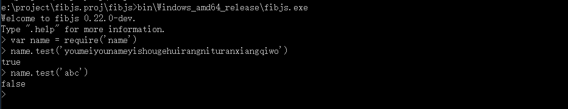

# Adding a Native Module
If you need functionality beyond what the native fibjs modules provide, or if you want to contribute code to fibjs, this article may help you.
## Writing the IDL File
IDL is the descriptive language used in fibjs to define native modules and object methods.

Before you start writing your own fibjs module, you need to write an IDL description first. Let's take a custom module named name as an example. I need to write the description file name.idl and put this file into the ${{fibjs_project_dir}}/idl/ directory, where ${{fibjs_project_dir}} represents the directory containing the fibjs project.


Our name module is very simple: it has only one test method, whose parameter is a string that contains the lyrics. The test method checks whether the lyrics are correct, and the return value is a boolean.
name.idl is written as follows

````JavaScript
/*! @brief name module

 how to use:
 ```JavaScript
 var name = require('name');
 ```
 */
module name
{
    /*! @brief Tests whether the input string is the correct lyrics
     @param lyrics the lyrics
    */
    static Boolean test(String lyrics);
};
````
## Generating Header Files
Run the `bin/<dist>/fibjs tools/idlc.js` command in the repository root. This reads and parses all the IDL files in the idl directory, and generates the corresponding header files and documentation. All generated header files are placed in the "fibjs/include/ifs/" directory. For example, name.idl automatically generates the header file ${{fibjs_project_dir}}/fibjs/include/ifs/name.h, which defines the name_base class.

```c++
/***************************************************************************
 *                                                                         *
 *   This file was automatically generated using idlc.js                   *
 *   PLEASE DO NOT EDIT!!!!                                                *
 *                                                                         *
 ***************************************************************************/

#ifndef _name_base_H_
#define _name_base_H_

/**
 @author Leo Hoo <lion@9465.net>
 */

#include "../object.h"

namespace fibjs {

class name_base : public object_base {
    DECLARE_CLASS(name_base);

public:
    // name_base
    static result_t test(exlib::string lyrics, bool& retVal);

public:
    static void s__new(const v8::FunctionCallbackInfo<v8::Value>& args)
    {
        CONSTRUCT_INIT();

        Isolate* isolate = Isolate::current();

        isolate->m_isolate->ThrowException(
            isolate->NewString("not a constructor"));
    }

public:
    static void s_test(const v8::FunctionCallbackInfo<v8::Value>& args);
};
}

namespace fibjs {
inline ClassInfo& name_base::class_info()
{
    static ClassData::ClassMethod s_method[] = {
        { "test", s_test, true }
    };

    static ClassData s_cd = {
        "name", true, s__new, NULL,
        ARRAYSIZE(s_method), s_method, 0, NULL, 0, NULL, 0, NULL, NULL, NULL,
        &object_base::class_info()
    };

    static ClassInfo s_ci(s_cd);
    return s_ci;
}

inline void name_base::s_test(const v8::FunctionCallbackInfo<v8::Value>& args)
{
    bool vr;

    METHOD_NAME("name.test");
    METHOD_ENTER();

    METHOD_OVER(1, 1);

    ARG(exlib::string, 0);

    hr = test(v0, vr);

    METHOD_RETURN();
}
}

#endif

```
## Writing the Source Code
The s_test method is a v8 accessor that wraps the test method. Here we only need to implement the test method. The test method has two parameters: v0 is the input lyrics, and vr is the return value. We put cpp files in the ${{fibjs_project_dir}}/fibjs/src/ directory and header files in the ${{fibjs_project_dir}}/fibjs/include directory. This example does not need an extra header file.
In the fibjs/src/ directory, create a new file named name.cpp with the following content:

```c++
#include "object.h"
#include "ifs/name.h"

namespace fibjs
{
    DECLARE_MODULE(name);
    result_t name_base::test(exlib::string lyrics, bool& retVal)
    {
        if (lyrics == "youmeiyounameyishougehuirangnituranxiangqiwo")
            retVal = true;
        else retVal = false;

        return 0;
    }
}
```
Note the line `DECLARE_MODULE(name);`. It declares the "name" module and registers it on the JavaScript object. You need to add this line when writing the source code.
In `v0.25.0` and later versions, we split the fibjs modules out for better reuse, so you still need to add the following line to the `importBuiltinModule` function in the `fibjs/src/base/modules.cpp` file: `IMPORT_MODULE(name);` to install your custom module.

## Building and Testing
The build and run result is as follows:


## Summary
Now you know how to add and modify native fibjs modules and objects. We can write all kinds of complex modules, and we can also port third-party libraries to fibjs as a foundation for writing our modules. You are welcome to contribute more to fibjs.
