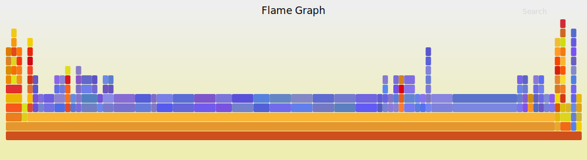

# 找出性能杀手
在线服务的性能优化，是一项近乎迷信的工作。一群程序员对着一大堆不知所云的代码，互相猜测是不是对方把 cpu 都给用掉。花费大量时间记录日志，在海量的日志里日以继夜地翻看，试图找到性能杀手。

然而使用 fibjs，这一切都将变得简单起来。因为 fibjs 有强大的 cpu 和内存 profiler 支持，而且使用十分方便。

## 记录日志
fibjs 启动 cpu profiler 极其简单，启动时增加 `--prof` 选项即可。缺省的日志间隔是 1000ms，随着优化的深入，你会需要更高精度的分析日志，此时可以使用 `--prof-interval` 设置间隔。以下的例子，每 10ms 记录一次 fibjs 工作日志。
```sh
fibjs --prof --prof-interval=10 main.js
```
## 处理日志
运行正常结束，或者使用 ctrl_c 结束进程后，当前目录下会生成一个日志文件，文件名是 `fibjs-xxxx.log`，此时，你可以使用 `--prof-process` 处理生成的日志：
```sh
fibjs --prof-process fibjs-xxxx.log prof.svg
```
运行结束，使用浏览器打开 prof.svg，即可查看此次日志的火焰图：

你可以点击查看全尺寸的图片，在全尺寸图片中，你可以通过鼠标操作，查阅更详细的信息：[prof.svg](./imgs/prof.svg)。
## 火焰图解读
生成的火焰图中，每一个色块，代表一个记录点，色块越长，表示被记录的次数越多；每一行代表一层调用堆栈，层数越多表示调用的层数越多；调用堆栈的摆放，是倒置的，越靠下的色块，越是最初的函数。

色块的颜色有两类，一类是红色，一类是蓝色。在 fibjs 的 profiler 里，红色代表  JavaScript 运算，蓝色代表 io 操作或者 Native 运算。根据你需要解决的问题不同，所需要关注的区域也会不同。比如你需要解决 cpu 占用过高的问题，此时需要关注红色的色块；而如果你的应用，cpu 占用不高，但是响应却比较慢，就就需要关注蓝色的色块。靠近顶部越大的色块，越是需要关注和优化的重点。

👉 【[服务端模块热更新](server-hot-update.md)】