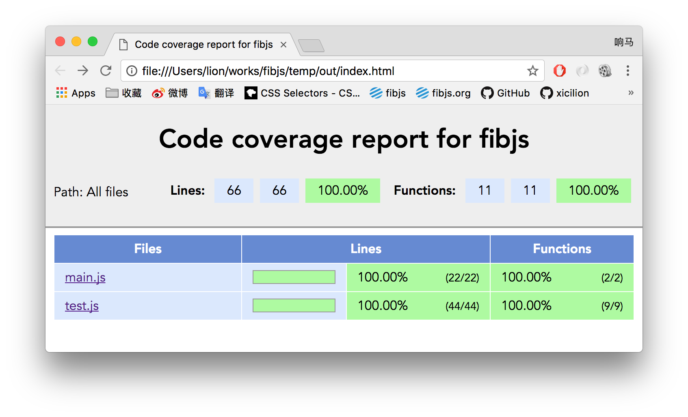

# A Good Life Starts with Testing
A programmer who doesn't write automated test cases is not a good test engineer. We encourage every project to establish a complete set of automated test cases from the very beginning. As the project grows, that early investment will pay back hundreds of times over.

Let's continue with the example from the previous section and see how to write test cases with fibjs.
```JavaScript
const http = require('http');
const path = require('path');

var hello_server = {
    '/:name(fibjs.*)': (req, name) => {
        req.response.write('hello, ' + name + '. I love you.');
    },
    '/:name': (req, name) => {
        req.response.write('hello, ' + name);
    }
};

var root_server = {
    '/hello': hello_server,
    '/bonjour': hello_server,
    '*': http.fileHandler(path.join(__dirname, 'web'))
};

var svr = new http.Server(8080, root_server);

svr.start();
```

## An Empty Test Framework
Let's start by building the most basic test framework:
```JavaScript
var test = require('test');
test.setup();

describe('hello, test', () => {
    it('a empty test', () => {

    });
});

test.run();
```
After saving this as `test.js`, run `fibjs test.js` from the command line. You will see the output below, and a basic test framework is ready.
```sh
  hello, test
    √ a empty test

  √ 1 tests completed (0ms)
```
## Testing the Server
Since we need to test the http server, we must start the server first. The test cases send requests to the server and then check the responses to determine whether the server meets our requirements:
```JavaScript
var test = require('test');
test.setup();

var http = require('http');

describe('hello, test', () => {
    it('hello, fibjs', () => {
        var r = http.get('http://127.0.0.1:8080/hello/fibjs');
        assert.equal(r.statusCode, 200);
        assert.equal(r.text(), 'hello, fibjs. I love you.');
    });
});

test.run();
```
In this code, we verify whether the result of http.get is what we expect, in order to determine whether the server logic is working correctly. Following this example, we can quickly complete a set of tests, and we also optimized the code a bit:
```JavaScript
var test = require('test');
test.setup();

var http = require('http');

function test_get(url, rep) {
    var r = http.get('http://127.0.0.1:8080' + url);
    assert.equal(r.statusCode, 200);
    assert.equal(r.text(), rep);
}

describe('hello, test', () => {
    it('hello, fibjs', () => {
        test_get('/hello/fibjs', 'hello, fibjs. I love you.');
    });

    it('hello, fibjs*', () => {
        test_get('/hello/fibjs-great', 'hello, fibjs-great. I love you.');
    });

    it('hello, JavaScript', () => {
        test_get('/hello/JavaScript', 'hello, JavaScript');
    });

    it('hello, v8', () => {
        test_get('/hello/v8', 'hello, v8');
    });
});

test.run();
```
## Grouping Test Cases
Now let's add tests for bonjour. Although bonjour and hello are the same group of services, the path has changed, so we also need to verify that the service works correctly. This time, to manage the test cases better, we grouped the test cases. At the same time, because the tests for hello and bonjour are identical, we optimized the code again to test both groups of services with the same set of code:
```JavaScript
var test = require('test');
test.setup();

var http = require('http');

function test_get(url, rep) {
    var r = http.get('http://127.0.0.1:8080' + url);
    assert.equal(r.statusCode, 200);
    assert.equal(r.text(), rep);
}

describe('hello, test', () => {
    function test_hello(hello) {
        describe(hello + ' test', () => {
            it('fibjs', () => {
                test_get('/' + hello + '/fibjs', 'hello, fibjs. I love you.');
            });

            it('fibjs*', () => {
                test_get('/' + hello + '/fibjs-great', 'hello, fibjs-great. I love you.');
            });

            it('JavaScript', () => {
                test_get('/' + hello + '/JavaScript', 'hello, JavaScript');
            });

            it('v8', () => {
                test_get('/' + hello + '/v8', 'hello, v8');
            });
        });
    }

    test_hello('hello');
    test_hello('bonjour');
});

test.run();
```
By grouping test cases, we can view the test results more clearly, and we can easily skip a group of test cases or run it alone, which speeds up development and testing. Here is the result of this round of testing:
```sh
  hello, test
    hello test
      √ fibjs
      √ fibjs*
      √ JavaScript
      √ v8
    bonjour test
      √ fibjs
      √ fibjs*
      √ JavaScript
      √ v8

  √ 8 tests completed (3ms)
```
According to our server design, we also have a group of static file services. Following the examples above, I'm sure you can quickly write the test cases for that part.
## One-Command Testing
With the above, we can already build test cases quickly. However, to use this test script, the server must be started first, which is very inconvenient. We want running `test.js` to complete the tests directly. We can achieve this with the following code:
```JavaScript
var test = require('test');
test.setup();

var http = require('http');

var coroutine = require('coroutine');
coroutine.start(() => {
    run('./main.js');
});
coroutine.sleep(100);

function test_get(url, rep) {
    var r = http.get('http://127.0.0.1:8080' + url);
    assert.equal(r.statusCode, 200);
    assert.equal(r.text(), rep);
}

describe('hello, test', () => {
    function test_hello(hello) {
        describe(hello + ' test', () => {
            it('fibjs', () => {
                test_get('/' + hello + '/fibjs', 'hello, fibjs. I love you.');
            });

            it('fibjs*', () => {
                test_get('/' + hello + '/fibjs-great', 'hello, fibjs-great. I love you.');
            });

            it('JavaScript', () => {
                test_get('/' + hello + '/JavaScript', 'hello, JavaScript');
            });

            it('v8', () => {
                test_get('/' + hello + '/v8', 'hello, v8');
            });
        });
    }

    test_hello('hello');
    test_hello('bonjour');
});

process.exit(test.run());
```
In lines 6-10 of this code, we added a block that starts `main.js`, waits a moment, and then begins testing.
## Code Coverage
Good test cases need to cover every branch of the business to make sure the business executes correctly. At this point, code coverage can be used to determine whether the tests are complete.

The process is simple: just add the --cov option when running the tests:
```sh
fibjs --cov test
```
After the tests finish, a log file named fibjs-xxxx.lcov is generated in the current directory. You then need to analyze the log and generate a report:
```sh
fibjs --cov-process fibjs-xxxx.lcov out
```
A set of analysis reports is then generated in the out directory. Browse into the directory and you will see the following page:

As you can see, the code coverage of `main.js` reaches 100%, which means the tests fully cover the business logic. Click `main.js` to see a more detailed report.

### Excluding Files from Coverage

The biggest space consumer in a report is the dependencies under `node_modules`: they are not the target of the tests, and each child process records them all over again. Use `--cov-exclude` (or the `FIBJS_COV_EXCLUDE` environment variable) to exclude these files, and the log size will drop by an order of magnitude:

```sh
fibjs --cov --cov-exclude='**/node_modules/**' test
# You can also use the environment variable; separate multiple globs with `;`, and child processes will inherit it as well
FIBJS_COV_EXCLUDE='**/node_modules/**;**/fixtures/**' fibjs --cov test
```

`--cov-exclude` can be given multiple times. Matching files are not written to the log (which saves both log space and the aggregation overhead on exit); files that do not match are unaffected. Each record in the log is written in one go, so even when multiple processes append to the same log at the same time, the records will not be interleaved.

👉 [Finding the Performance Killer](profiler.md)
