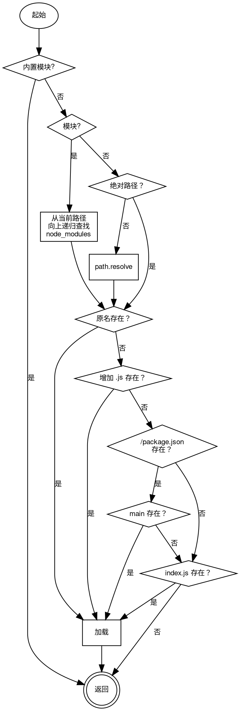

# 模块 global
全局对象，所有脚本均可以访问的基础对象

## 对象
        
### Buffer
**二进制数据缓存对象，用于 [io](io.md) 读写的数据处理，参见 [Buffer](../../object/ifs/Buffer.md) 对象。**

```JavaScript
Buffer global.Buffer;
```

--------------------------
### Int64
**64位整数对象，参见 [Int64](../../object/ifs/Int64.md) 对象。**

```JavaScript
Int64 global.Int64;
```

--------------------------
### console
**控制台访问对象**

```JavaScript
console global.console;
```

--------------------------
### process
**控制台访问对象**

```JavaScript
process global.process;
```

## 静态函数
        
### run
**运行一个脚本**

```JavaScript
static global.run(String fname,
    Array argv = []);
```

调用参数:
* fname: String, 指定要运行的脚本路径
* argv: Array, 指定要运行的参数，此参数可在脚本内使用 argv 获取

--------------------------
### require
**加载一个模块并返回模块对象，更多信息参阅 @ref module**

```JavaScript
static Value global.require(String id);
```

调用参数:
* id: String, 指定要加载的模块名称

返回结果:
* Value, 返回加载模块的引出对象

require 可用于加载基础模块，文件模块。

基础模块是沙箱创建时初始化的模块，引用时只需传递相应的 id，比如 require("[net](net.md)")。

文件模块是用户自定义模块，引用时需传递以 ./ 或 ../ 开头的相对路径。文件模块支持 .js, .jsc 和 .[json](json.md) 文件。

文件模块也支持 package.json 格式，当模块为目录结构时，require 会先查询 package.json 中的 main，未发现则尝试加载路径下的 index.js, index.jsc 或 index.json。

若引用路径不是 ./ 或 ../ 开头，并且非基础模块，require 从当前模块所在路径下的 node_modules 查找，并上级目录递归。

基础流程如下:


--------------------------
### clearInterval
**清除指定的定时器**

```JavaScript
static global.clearInterval(Timer t);
```

调用参数:
* t: [Timer](../../object/ifs/Timer.md), 指定要清除的定时器

--------------------------
### clearTimeout
**清除指定的定时器**

```JavaScript
static global.clearTimeout(Timer t);
```

调用参数:
* t: [Timer](../../object/ifs/Timer.md), 指定要清除的定时器

--------------------------
### clearImmediate
**清除指定的定时器**

```JavaScript
static global.clearImmediate(Timer t);
```

调用参数:
* t: [Timer](../../object/ifs/Timer.md), 指定要清除的定时器

--------------------------
### setInterval
**每间隔指定的时间后调用函数**

```JavaScript
static Timer global.setInterval(Function callback,
    Integer timeout);
```

调用参数:
* callback: Function, 指定回调函数
* timeout: Integer, 指定间隔的时间，以毫秒为单位

返回结果:
* [Timer](../../object/ifs/Timer.md), 返回定时器对象

--------------------------
### setTimeout
**在指定的时间后调用函数**

```JavaScript
static Timer global.setTimeout(Function callback,
    Integer timeout);
```

调用参数:
* callback: Function, 指定回调函数
* timeout: Integer, 指定延时的时间，以毫秒为单位

返回结果:
* [Timer](../../object/ifs/Timer.md), 返回定时器对象

--------------------------
### setImmediate
**下一个空闲时间立即执行回调函数**

```JavaScript
static Timer global.setImmediate(Function callback);
```

调用参数:
* callback: Function, 指定回调函数

返回结果:
* [Timer](../../object/ifs/Timer.md), 返回定时器对象

--------------------------
### GC
**强制要求进行垃圾回收**

```JavaScript
static global.GC();
```

--------------------------
### repl
**进入交互模式，可以交互执行内部命令和代码，仅在启动 js 可以引用**

```JavaScript
static global.repl(Array cmds = []);
```

调用参数:
* cmds: Array, 补充命令

参数 cmd 格式如下：

```JavaScript
[{
        cmd: ".test",
        help: "this is a test",
        exec: function(argv) {
            console.log(argv);
        }
    },
    {
        cmd: ".test1",
        help: "this is an other test",
        exec: function(argv) {
            console.log(argv);
        }
    }
]
```

--------------------------
**进入交互模式，可以交互执行内部命令和代码，仅在启动 js 可以引用**

```JavaScript
static global.repl(Stream out,
    Array cmds = []);
```

调用参数:
* out: [Stream](../../object/ifs/Stream.md), 输入输出流对象，通常为网络连接
* cmds: Array, 补充命令

同一时刻只允许一个 [Stream](../../object/ifs/Stream.md) repl，新建一个 [Stream](../../object/ifs/Stream.md) repl 时，前一个 repl 将被关闭。

参数 cmd 格式如下：

```JavaScript
[{
        cmd: ".test",
        help: "this is a test",
        exec: function(argv) {
            console.log(argv);
        }
    },
    {
        cmd: ".test1",
        help: "this is an other test",
        exec: function(argv) {
            console.log(argv);
        }
    }
]
```

## 静态属性
        
### Master
**[Worker](../../object/ifs/Worker.md), [Worker](../../object/ifs/Worker.md) 宿主对象，仅在 [Worker](../../object/ifs/Worker.md) 入口脚本有效**

```JavaScript
static readonly Worker global.Master;
```

--------------------------
### global
**Object, 全局对象**

```JavaScript
static readonly Object new global;
```

--------------------------
### argv
**Array, 获取当前脚本的运行参数，启动 js 获取进程启动参数，run 执行的脚本获取传递的参数**

```JavaScript
static readonly Array global.argv;
```

--------------------------
### __filename
**String, 当前脚本文件名**

```JavaScript
static readonly String global.__filename;
```

--------------------------
### __dirname
**String, 当前脚本所在目录**

```JavaScript
static readonly String global.__dirname;
```

