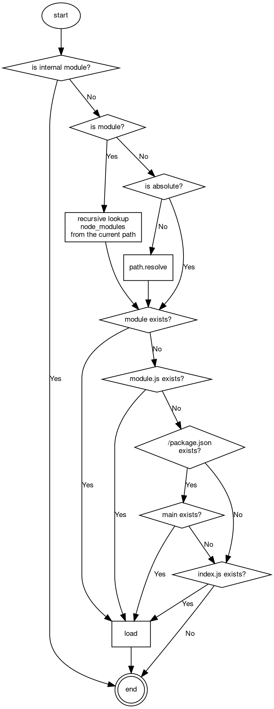

# 模块 global
全局对象，所有脚本均可以访问的基础对象

全局对象提供以下能力：

- **Web 标准对象**：`Buffer`、`URL`、`URLSearchParams`、`Blob`、`File`、`Headers`、`FormData`、`Request`、`Response`、`TextDecoder`、`TextEncoder`、`AbortController`、`AbortSignal`、`Event`、`EventTarget`、`MessagePort`、`MessageChannel`、`WebSocket`、`DOMParser`、`XMLSerializer` 等；
- **核心模块**：`console`、`process`、`performance`、`crypto`；
- **模块加载**：`require` 加载模块、`run` 运行脚本；
- **定时器**：`setTimeout`、`setInterval`、`setImmediate` 等，行为与 [timers](timers.md) 模块同名函数一致；
- **工具函数**：`btoa`/`atob` 编解码、`structuredClone` 深拷贝、`fetch` 发送请求、`queueMicrotask` 排入微任务。

## 对象
        
### Buffer
**二进制数据缓存对象，用于 [io](io.md) 读写的数据处理，参见 [Buffer](../../object/ifs/Buffer.md) 对象。**

```JavaScript
Buffer global.Buffer;
```

--------------------------
### URLSearchParams
**创建一个 [URLSearchParams](../../object/ifs/URLSearchParams.md) 请求对象，参见 [URLSearchParams](../../object/ifs/URLSearchParams.md)**

```JavaScript
URLSearchParams global.URLSearchParams;
```

--------------------------
### URL
**创建一个 [UrlObject](../../object/ifs/UrlObject.md) 请求对象，参见 [UrlObject](../../object/ifs/UrlObject.md)**

```JavaScript
UrlObject global.URL;
```

--------------------------
### Blob
**创建一个 [Blob](../../object/ifs/Blob.md) 请求对象，参见 [Blob](../../object/ifs/Blob.md)**

```JavaScript
Blob global.Blob;
```

--------------------------
### File
**创建一个 [File](../../object/ifs/File.md) 请求对象，参见 [File](../../object/ifs/File.md)**

```JavaScript
File global.File;
```

--------------------------
### Headers
**创建一个 [Headers](../../object/ifs/Headers.md) 对象，参见 [Headers](../../object/ifs/Headers.md)**

```JavaScript
Headers global.Headers;
```

--------------------------
### FormData
**创建一个 [FormData](../../object/ifs/FormData.md) 对象，参见 [FormData](../../object/ifs/FormData.md)**

```JavaScript
FormData global.FormData;
```

--------------------------
### Request
**创建一个 [http](http.md) 请求对象，参见 [HttpRequest](../../object/ifs/HttpRequest.md)**

```JavaScript
HttpRequest global.Request;
```

--------------------------
### Response
**创建一个 Fetch API 响应对象，参见 [HttpResponse](../../object/ifs/HttpResponse.md)**

```JavaScript
HttpResponse global.Response;
```

--------------------------
### TextDecoder
**[TextDecoder](../../object/ifs/TextDecoder.md) 解码对象，参见 [TextDecoder](../../object/ifs/TextDecoder.md) 对象。**

```JavaScript
TextDecoder global.TextDecoder;
```

--------------------------
### TextEncoder
**[TextEncoder](../../object/ifs/TextEncoder.md) 编码对象，参见 [TextEncoder](../../object/ifs/TextEncoder.md) 对象。**

```JavaScript
TextEncoder global.TextEncoder;
```

--------------------------
### AbortController
**控制器对象，用于在需要时中止一个或多个 Web 请求，参见 [AbortController](../../object/ifs/AbortController.md) 对象。**

```JavaScript
AbortController global.AbortController;
```

--------------------------
### AbortSignal
**信号对象，用于与异步操作通信并中止它们，参见 [AbortSignal](../../object/ifs/AbortSignal.md) 对象。**

```JavaScript
AbortSignal global.AbortSignal;
```

--------------------------
### Event
**DOM 事件对象，表示一个 W3C 标准事件**

```JavaScript
DOMEvent global.Event;
```

--------------------------
### EventTarget
**DOM 事件目标对象，提供 Web 标准事件监听和分发机制**

```JavaScript
EventEmitter global.EventTarget;
```

--------------------------
### MessageEvent
**[MessageEvent](../../object/ifs/MessageEvent.md) 对象，表示目标对象接收到的消息**

```JavaScript
MessageEvent global.MessageEvent;
```

--------------------------
### MessagePort
**[MessagePort](../../object/ifs/MessagePort.md) 对象，表示消息通道的一端**

```JavaScript
MessagePort global.MessagePort;
```

--------------------------
### MessageChannel
**[MessageChannel](../../object/ifs/MessageChannel.md) 对象，提供一对已连接的 [MessagePort](../../object/ifs/MessagePort.md) 对象**

```JavaScript
MessageChannel global.MessageChannel;
```

--------------------------
### CryptoKey
**[CryptoKey](../../object/ifs/CryptoKey.md) 类来表示对称或非对称密钥，每种密钥公开不同的功能**

```JavaScript
CryptoKey global.CryptoKey;
```

--------------------------
### DOMParser
**[DOMParser](../../object/ifs/DOMParser.md) 接口，用于将字符串解析为 DOM 文档，参见 [DOMParser](../../object/ifs/DOMParser.md) 对象**

```JavaScript
DOMParser global.DOMParser;
```

--------------------------
### XMLSerializer
**[XMLSerializer](../../object/ifs/XMLSerializer.md) 接口，用于将 DOM 节点序列化为字符串，参见 [XMLSerializer](../../object/ifs/XMLSerializer.md) 对象**

```JavaScript
XMLSerializer global.XMLSerializer;
```

--------------------------
### XMLDocument
**XMLDocument 接口，代表 XML 文档，等同于 [XmlDocument](../../object/ifs/XmlDocument.md)**

```JavaScript
XmlDocument global.XMLDocument;
```

--------------------------
### WebSocket
**[WebSocket](../../object/ifs/WebSocket.md) 类，用于创建和管理 [WebSocket](../../object/ifs/WebSocket.md) 连接，参见 [WebSocket](../../object/ifs/WebSocket.md) 对象**

```JavaScript
WebSocket global.WebSocket;
```

--------------------------
### console
**控制台访问对象**

```JavaScript
console global.console;
```

--------------------------
### process
**进程对象**

```JavaScript
process global.process;
```

--------------------------
### performance
**基础性能监控模块**

```JavaScript
performance global.performance;
```

--------------------------
### PerformanceObserver
**[PerformanceObserver](../../object/ifs/PerformanceObserver.md) 接口用于观察性能记录的接口**

```JavaScript
PerformanceObserver global.PerformanceObserver;
```

--------------------------
### crypto
**w3c [webcrypto](webcrypto.md) 标准的加密模块**

```JavaScript
webcrypto global.crypto;
```

## 静态函数
        
### run
**运行一个脚本**

```JavaScript
static global.run(String fname);
```

调用参数:
* fname: String, 指定要运行的脚本路径

--------------------------
### require
**加载一个模块并返回模块对象，更多信息参阅 @ref [module](module.md)**

```JavaScript
static Value global.require(String id);
```

调用参数:
* id: String, 指定要加载的模块名称

返回结果:
* Value, 返回加载模块的引出对象

require 可用于加载基础模块，文件模块。

基础模块是沙箱创建时初始化的模块，引用时只需传递相应的 id，比如 require("[net](net.md)")。

文件模块是用户自定义模块，引用时需传递以 ./ 或 ../ 开头的相对路径。文件模块支持 .js, .jsc 和 .[json](json.md) 文件。

文件模块也支持 package.json 格式，当模块为目录结构时，require 会先查询 package.json 中的 main，未发现则尝试加载路径下的 index.js, index.jsc 或 index.json。

若引用路径不是 ./ 或 ../ 开头，并且非基础模块，require 从当前模块所在路径下的 node_modules 查找，并上级目录递归。

基础流程如下:

```dot
   digraph{
       node [fontname = "Helvetica,sans-Serif", fontsize = 10];
       edge [fontname = "Helvetica,sans-Serif", fontsize = 10];

       start [label="start"];
       resolve [label="path.resolve" shape="rect"];
       search [label="recursive lookup\nnode_modules\nfrom the current path" shape="rect"];
       load [label="load" shape="rect"];
       end [label="end" shape="doublecircle"];

       is_native [label="is internal module?" shape="diamond"];
       is_mod [label="is module?" shape="diamond"];
       is_abs [label="is absolute?" shape="diamond"];
       has_file [label="module exists?" shape="diamond"];
       has_ext [label="module.js exists?" shape="diamond"];
       has_package [label="/package.json\nexists?" shape="diamond"];
       has_main [label="main exists?" shape="diamond"];
       has_index [label="index.js exists?" shape="diamond"];

       start -> is_native;
       is_native -> end [label="Yes"];
       is_native -> is_mod [label="No"];
       is_mod -> search [label="Yes"];
       search -> has_file;
       is_mod -> is_abs [label="No"];
       is_abs -> has_file [label="Yes"];
       is_abs -> resolve [label="No"];
       resolve -> has_file;
       has_file -> load [label="Yes"];
       has_file -> has_ext [label="No"];
       has_ext -> load [label="Yes"];
       has_ext -> has_package [label="No"];
       has_package -> has_main [label="Yes"];
       has_package -> has_index [label="No"];
       has_main -> load [label="Yes"];
       has_main -> has_index [label="No"];
       has_index -> load [label="Yes"];
       has_index -> end [label="No"];
       load -> end;
   }
```

--------------------------
### setTimeout
**在指定的时间后调用函数，行为与 [timers](timers.md) 模块同名函数一致**

```JavaScript
static Timer global.setTimeout(Function callback,
    Number timeout = 1,
    ...args);
```

调用参数:
* callback: Function, 指定回调函数
* timeout: Number, 指定延时的时间，以毫秒为单位，缺省为 1；小于 1 或大于 2^31-1 的值按 1ms 处理。
* args: ..., 额外的参数，传入到指定的 callback 内，可选。

返回结果:
* [Timer](../../object/ifs/Timer.md), 返回定时器对象

--------------------------
### clearTimeout
**清除指定的定时器**

```JavaScript
static global.clearTimeout(Value t);
```

调用参数:
* t: Value, 指定要清除的定时器

--------------------------
### setInterval
**每间隔指定的时间后调用函数，行为与 [timers](timers.md) 模块同名函数一致**

```JavaScript
static Timer global.setInterval(Function callback,
    Number timeout,
    ...args);
```

调用参数:
* callback: Function, 指定回调函数
* timeout: Number, 指定间隔的时间，以毫秒为单位；小于 1 或大于 2^31-1 的值按 1ms 处理。
* args: ..., 额外的参数，传入到指定的 callback 内，可选。

返回结果:
* [Timer](../../object/ifs/Timer.md), 返回定时器对象

--------------------------
### clearInterval
**清除指定的定时器**

```JavaScript
static global.clearInterval(Value t);
```

调用参数:
* t: Value, 指定要清除的定时器

--------------------------
### setHrInterval
**每间隔指定的时间后调用函数，这是个高精度定时器，会主动打断正在运行的 JavaScript 脚本执行定时器**

```JavaScript
static Timer global.setHrInterval(Function callback,
    Number timeout,
    ...args);
```

调用参数:
* callback: Function, 指定回调函数
* timeout: Number, 指定间隔的时间，以毫秒为单位；小于 1 或大于 2^31-1 的值按 1ms 处理。
* args: ..., 额外的参数，传入到指定的 callback 内，可选。

返回结果:
* [Timer](../../object/ifs/Timer.md), 返回定时器对象

由于 setHrInterval 的定时器会中断正在运行的代码执行回调，因此不要在回调函数内修改可能影响其它模块的数据，或者在回调中调用任何标记为 async 的 api 函数，否则将会产生不可预知的结果。例如：

```JavaScript
var timers = require('timers');

var cnt = 0;
timers.setHrInterval(() => {
    cnt++;
}, 100);

while (cnt < 10);

console.error("===============================> done");
```

这段代码中，第 8 行的循环并不会因为 cnt 的改变而结束，因为 JavaScript 在优化代码时会认定在这个循环过程中 cnt 不会被改变。

--------------------------
### clearHrInterval
**清除指定的定时器**

```JavaScript
static global.clearHrInterval(Value t);
```

调用参数:
* t: Value, 指定要清除的定时器

--------------------------
### setImmediate
**下一个空闲时间立即执行回调函数**

```JavaScript
static Timer global.setImmediate(Function callback,
    ...args);
```

调用参数:
* callback: Function, 指定回调函数
* args: ..., 额外的参数，传入到指定的 callback 内，可选。

返回结果:
* [Timer](../../object/ifs/Timer.md), 返回定时器对象

--------------------------
### clearImmediate
**清除指定的定时器**

```JavaScript
static global.clearImmediate(Value t);
```

调用参数:
* t: Value, 指定要清除的定时器

--------------------------
### btoa
**以 [base64](base64.md) 方式编码数据**

```JavaScript
static String global.btoa(String data);
```

调用参数:
* data: String, 要编码的数据

返回结果:
* String, 返回编码的字符串

--------------------------
### atob
**以 [base64](base64.md) 方式解码字符串为二进制数据**

```JavaScript
static String global.atob(String data);
```

调用参数:
* data: String, 要解码的字符串

返回结果:
* String, 返回解码的二进制数据

--------------------------
### structuredClone
**创建一个值的深拷贝**

```JavaScript
static Value global.structuredClone(Value value,
    Object options = {});
```

调用参数:
* value: Value, 要克隆的值
* options: Object, 可选参数对象，包含 transfer 数组

返回结果:
* Value, 返回克隆后的值

使用结构化克隆算法创建给定值的深拷贝。支持循环引用。

transfer 参数用于指定需要转移而非克隆的可转移对象列表（如 ArrayBuffer）。转移后，原对象将不可用。

--------------------------
### fetch
**请求指定的 [url](url.md)，并返回结果，等同于 [http.request](http.md#request)([url](url.md), ...)**

```JavaScript
static HttpResponse global.fetch(String url,
    Object opts = {}) promise;
```

调用参数:
* url: String, 指定 [url](url.md)，必须是包含主机的完整 [url](url.md)
* opts: Object, 指定附加信息

返回结果:
* [HttpResponse](../../object/ifs/HttpResponse.md), 返回服务器响应

opts 包含请求的附加选项，支持的内容如下：

```JavaScript
{
    "method": "GET", // specify the http request method: GET, POST, etc, default: GET.
    "protocol": "http",
    "slashes": true,
    "username": "",
    "password": "",
    "hostname": "",
    "port": "",
    "pathname": "",
    "keepAlive": unknown, // If not specified, the default settings of the client will be used.
    "query": {},
    "body": SeekableStream | Buffer | String | {},
    "json": {},
    "pack": {},
    "headers": {}
}
```

其中 body，[json](json.md)，pack 不得同时出现。缺省为 {}，不包含任何附加信息

--------------------------
**发送 Fetch 请求，接受 Request 对象**

```JavaScript
static HttpResponse global.fetch(HttpRequest request,
    Object opts = {}) promise;
```

调用参数:
* request: [HttpRequest](../../object/ifs/HttpRequest.md), Request 请求对象
* opts: Object, 请求选项（可覆盖 request 中的字段）

返回结果:
* [HttpResponse](../../object/ifs/HttpResponse.md), 返回服务器响应对象

--------------------------
### queueMicrotask
**将一个微任务排入队列执行**

```JavaScript
static global.queueMicrotask(Function callback);
```

调用参数:
* callback: Function, 要作为微任务排入队列的函数

回调函数将在当前任务完成后、下一个任务开始之前执行。

## 静态属性
        
### global
**Object, 全局对象**

```JavaScript
static readonly Object new global;
```

--------------------------
### globalThis
**Object, 全局对象**

```JavaScript
static readonly Object global.globalThis;
```

