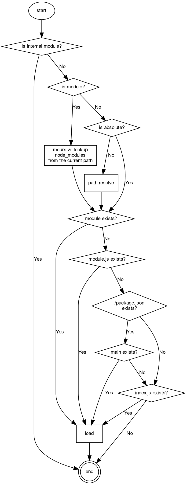

# Module global
The global [object](../../object/ifs/object.md), the base [object](../../object/ifs/object.md) that every script and [module](module.md) can access directly

The global [object](../../object/ifs/object.md) is available under two names: `globalThis`, the standard
JavaScript name, and `global`, a read-only alias kept for Node.js compatibility;
both refer to the same [object](../../object/ifs/object.md) (`global === globalThis` is true).

Main capabilities:

- **Web standard classes**: `Buffer`, `URL`, `URLSearchParams`, `Blob`, `File`,
  `Headers`, `FormData`, `Request`, `Response`, `TextDecoder`, `TextEncoder`,
  `AbortController`, `AbortSignal`, `Event`, `EventTarget`, `MessageEvent`,
  `MessagePort`, `MessageChannel`, `Worker`, `WebSocket`, `CryptoKey`,
  `DOMParser`, `CSSStyleDeclaration`, `DOMStringMap`, `XMLSerializer` and
  `XMLDocument`;
- **Core modules**: `console`, `process`, `performance`, `PerformanceObserver`
  and `crypto`;
- **Module loading**: `require` loads modules and `run` runs scripts;
- **Timers**: `setTimeout`, `clearTimeout`, `setInterval`, `clearInterval`,
  `setHrInterval`, `clearHrInterval`, `setImmediate` and `clearImmediate`;
- **Helpers**: `btoa`, `atob`, `structuredClone`, `fetch` and `queueMicrotask`.

Concepts:

- **One global scope per sandbox**: a script runs in a sandbox whose global
  [object](../../object/ifs/object.md) forwards property reads and writes to the sandbox. `globalThis.x = 1`
  makes `x` visible as an implicit global in every script of the sandbox, while
  top-level `var` and `function` declarations stay in the [module](module.md) scope (like
  Node.js CommonJS modules) and do not become globals.
- **Timers and [process](process.md) lifetime**: each pending timer keeps the [process](process.md) alive
  until it fires or is cleared, so a repeating timer that is never cleared
  prevents the [process](process.md) from exiting. Scheduling is fiber-based: the callback
  runs on its own fiber and the clear functions may be called from the callback
  itself or from any other fiber. `[Timer](../../object/ifs/Timer.md)#unref` drops the liveness hold without
  cancelling the timer. See the [coroutine](coroutine.md) [module](module.md) for the fiber model.
- **Task ordering**: after the current task, `process.nextTick` callbacks run
  first, then the V8 micro-tasks (promise jobs and `queueMicrotask`), then
  `setImmediate` callbacks, then [timers](timers.md).
- **Error values**: `structuredClone` throws a `DOMException` (`DataCloneError`);
  `fetch` aborts with an `AbortError` and times out with a `TimeoutError`, both
  plain `Error` subclasses. `btoa` and `atob` throw plain `Error` objects,
  while Node.js throws a `DOMException` named `InvalidCharacterError`.
- **Node.js compatibility**: most globals match the same-named Node.js global
  objects, with these differences: `Request` and `Response` are `HttpRequest`
  and `HttpResponse` instead of the WHATWG fetch classes; `EventTarget` is the
  `EventEmitter` class, so `addEventListener`/`removeEventListener` are aliases
  of `on`/`off` and `dispatchEvent` is not provided; `Worker` takes a script
  [path](path.md) like `worker_threads.Worker` instead of a URL; `setHrInterval` and `run`
  are fibjs extensions. Node.js globals that are not available include
  `BroadcastChannel`, `CustomEvent`, `EventSource` (as a global), `navigator`,
  `localStorage`, `sessionStorage`, `CompressionStream`, `DecompressionStream`,
  `TextEncoderStream` and `TextDecoderStream`.

Import:

```JavaScript
// no import is needed, both names are already in scope
console.log(globalThis === global); // true
```

Example 1 — [timers](timers.md) with cleanup:

```JavaScript
console.log('start');

// cancel a pending one-time timer
const timeout = setTimeout((name) => console.log('late', name), 30, 'timer');
setTimeout(() => {
    clearTimeout(timeout);
    console.log('cancelled');
}, 5);

// a repeating timer must be cleared, or the process never exits
let ticks = 0;
const interval = setInterval(() => {
    ticks++;
    console.log('tick', ticks);
    if (ticks === 3) {
        clearInterval(interval);
    }
}, 10);
```

Example 2 — [encoding](encoding.md) and structured clone helpers:

```JavaScript
// btoa/atob convert the value to its string form and use the Latin1 range
const encoded = btoa('fibjs');
console.log(encoded, atob(encoded)); // ZmlianM fibjs

// structuredClone deep-copies values, including cycles, Map, Set and Date
const original = {
    name: 'global',
    tags: new Map([
        ['kind', 'runtime']
    ]),
    when: new Date(0)
};
original.self = original;
const copy = structuredClone(original);
console.log(copy !== original, copy.self === copy, copy.tags.get('kind'), copy.when.getTime());

// the transfer list moves an ArrayBuffer instead of copying it
const buffer = new ArrayBuffer(8);
const moved = structuredClone({
    buffer
}, {
    transfer: [buffer]
});
console.log(buffer.byteLength, moved.buffer.byteLength); // 0 8
```

Example 3 — load modules and scripts:

```JavaScript
const fs = require('fs');
const os = require('os');
const path = require('path');

const dir = fs.mkdtempSync(path.join(os.tmpdir(), 'fibjs-global-'));

fs.writeFile(path.join(dir, 'math.js'), 'module.exports = { add: (a, b) => a + b };\n');
console.log(require(path.join(dir, 'math.js')).add(2, 3)); // 5

fs.writeFile(path.join(dir, 'data.json'), '{"port": 8080}');
console.log(require(path.join(dir, 'data.json')).port); // 8080

fs.writeFile(path.join(dir, 'boot.js'), 'console.log("boot", __filename !== undefined);\n');
run(path.join(dir, 'boot.js')); // boot true

fs.rmSync(dir, {
    recursive: true,
    force: true
});
```

Example 4 — fetch from a local server and abort a request:

```JavaScript
const http = require('http');

const server = new http.Server(0, (req) => {
    req.response.json({
        path: req.address
    });
});
server.start();
const base = 'http://127.0.0.1:' + server.address().port;

(async () => {
    const res = await fetch(base + '/hello');
    console.log(res.status, res.ok, (await res.json()).path); // 200 true /hello

    const controller = new AbortController();
    controller.abort();
    try {
        await fetch(base, {
            signal: controller.signal
        });
    } catch (err) {
        console.log(err.name); // AbortError
    }

    server.stop();
})();
```

Example 5 — events and micro-task scheduling:

```JavaScript
// EventTarget is the EventEmitter class, so listeners are plain callbacks
const target = new EventTarget();
target.addEventListener('ready', (value) => console.log('ready', value));
target.emit('ready', 42);

// AbortSignal delivers a standard event object to its listeners
const controller = new AbortController();
controller.signal.addEventListener('abort', (ev) => {
    console.log(ev.type, ev.target === controller.signal, controller.signal.reason);
});
controller.abort('stop');

// micro-tasks run after the current task, before immediates and timers
console.log('sync');
queueMicrotask(() => console.log('microtask'));
Promise.resolve().then(() => console.log('promise'));
console.log('end');
```

Notes:

- The sandbox bootstrap also defines the `DOMException`, `AbortError` and
  `TimeoutError` error classes, and installs `fetchAsync` as an alias of
  `fetch` plus a synchronous `fetchSync`; none of them is a member declared in
  this definition.
- `global` is read-only (assigning to it throws), while `globalThis` is an
  ordinary writable property.

## Objects
        
### Buffer
**The binary data buffer class, see [Buffer](../../object/ifs/Buffer.md)**

```JavaScript
Buffer global.Buffer;
```

The same class as `require('buffer').[Buffer](../../object/ifs/Buffer.md)` and also a global in Node.js;
it is installed when the sandbox is created, so binary data handling is
available without requiring the buffer [module](module.md). Most [io](io.md) APIs accept and
return [Buffer](../../object/ifs/Buffer.md) objects.

--------------------------
### URLSearchParams
**The URL query parameter collection class, see [URLSearchParams](../../object/ifs/URLSearchParams.md)**

```JavaScript
URLSearchParams global.URLSearchParams;
```

The same class as the [url](url.md) [module](module.md)'s [URLSearchParams](../../object/ifs/URLSearchParams.md) and aligned with the
WHATWG standard; Node.js also exposes it as a global. Values are
percent-encoded when the collection is serialized.

--------------------------
### URL
**The URL parser class, see [UrlObject](../../object/ifs/UrlObject.md)**

```JavaScript
UrlObject global.URL;
```

`new URL(input, base)` parses an absolute or relative URL according to the
WHATWG URL standard. Node.js exposes the WHATWG URL class under the same
name; fibjs maps the global to the [url](url.md) [module](module.md)'s [UrlObject](../../object/ifs/UrlObject.md), which implements
the standard URL API.

--------------------------
### Blob
**The immutable binary data block class of the Web [File](../../object/ifs/File.md) API, see [Blob](../../object/ifs/Blob.md)**

```JavaScript
Blob global.Blob;
```

`new [Blob](../../object/ifs/Blob.md)(parts, { type })` builds a blob from strings, buffers and other
blobs. Node.js also exposes [Blob](../../object/ifs/Blob.md) as a global (v18+); [Blob](../../object/ifs/Blob.md) objects are
accepted as fetch bodies and form values.

--------------------------
### File
**The in-memory file class, a [Blob](../../object/ifs/Blob.md) with a name and modification time, see [File](../../object/ifs/File.md)**

```JavaScript
File global.File;
```

`new [File](../../object/ifs/File.md)(parts, name, { type, lastModified })` builds one. Node.js also
exposes [File](../../object/ifs/File.md) as a global (v20+); unlike a file system handle it represents
data in memory and never touches the disk.

--------------------------
### Headers
**The HTTP header collection class, see [Headers](../../object/ifs/Headers.md)**

```JavaScript
Headers global.Headers;
```

In fibjs it derives from [HttpCollection](../../object/ifs/HttpCollection.md) and is shared by the fetch API and
the [http](http.md) [module](module.md). Node.js exposes the equivalent WHATWG [Headers](../../object/ifs/Headers.md) class as a
global as well.

--------------------------
### FormData
**The multipart form data container used as a fetch body, see [FormData](../../object/ifs/FormData.md)**

```JavaScript
FormData global.FormData;
```

`new [FormData](../../object/ifs/FormData.md)()` creates an empty form and `append` adds fields and files.
When a [FormData](../../object/ifs/FormData.md) [object](../../object/ifs/object.md) is used as a request body, the multipart boundary
and the content type are generated automatically.

--------------------------
### Request
**The HTTP request class used as the fetch request source, see [HttpRequest](../../object/ifs/HttpRequest.md)**

```JavaScript
HttpRequest global.Request;
```

`new Request([url](url.md), options)` creates a request that can be passed to fetch.
This is the [http](http.md) [module](module.md)'s [HttpRequest](../../object/ifs/HttpRequest.md) class, not the WHATWG Request class
of Node.js, so the [object](../../object/ifs/object.md) exposes the fibjs request API (`method`,
`headers`, `body`, `response` and so on).

--------------------------
### Response
**The HTTP response class returned by fetch, see [HttpResponse](../../object/ifs/HttpResponse.md)**

```JavaScript
HttpResponse global.Response;
```

fetch resolves with an [HttpResponse](../../object/ifs/HttpResponse.md) and `new Response(body, options)`
creates one for tests or synthetic replies. Node.js returns the WHATWG
Response class instead, so only the common members (`status`, `ok`,
`headers`, `text()`, `json()`) share the same names.

--------------------------
### TextDecoder
**The text decoder class, see [TextDecoder](../../object/ifs/TextDecoder.md)**

```JavaScript
TextDecoder global.TextDecoder;
```

`new [TextDecoder](../../object/ifs/TextDecoder.md)(codec, options)` decodes [Buffer](../../object/ifs/Buffer.md) or ArrayBuffer bytes into a
string; the codec defaults to utf8. Node.js also exposes [TextDecoder](../../object/ifs/TextDecoder.md) as a
global.

--------------------------
### TextEncoder
**The text encoder class, see [TextEncoder](../../object/ifs/TextEncoder.md)**

```JavaScript
TextEncoder global.TextEncoder;
```

`new [TextEncoder](../../object/ifs/TextEncoder.md)(codec, options)` encodes a string into UTF-8 bytes and
returns them as a [Buffer](../../object/ifs/Buffer.md); the codec defaults to utf8. Node.js also exposes
[TextEncoder](../../object/ifs/TextEncoder.md) as a global.

--------------------------
### AbortController
**The controller that aborts asynchronous Web requests, see [AbortController](../../object/ifs/AbortController.md)**

```JavaScript
AbortController global.AbortController;
```

`new [AbortController](../../object/ifs/AbortController.md)()` creates a controller with a fresh [AbortSignal](../../object/ifs/AbortSignal.md).
`abort(reason)` fires the signal's `abort` event synchronously and rejects
any fetch using that signal; when no reason is given it is the string
`"AbortError"` (Node.js uses a DOMException instead).

--------------------------
### AbortSignal
**The signal that communicates cancellation to asynchronous APIs, see [AbortSignal](../../object/ifs/AbortSignal.md)**

```JavaScript
AbortSignal global.AbortSignal;
```

Pass `signal` to fetch to cancel a request in flight. Static helpers create
derived signals: `AbortSignal.abort(reason)`, `AbortSignal.timeout(ms)` and
`AbortSignal.any(signals)`; a signal created by `timeout` makes fetch reject
with a `TimeoutError`.

--------------------------
### Event
**The W3C DOM event class, see [DOMEvent](../../object/ifs/DOMEvent.md)**

```JavaScript
DOMEvent global.Event;
```

`new [Event](../../object/ifs/Event.md)(type, { bubbles, cancelable })` creates an event and `type` is
required; [DOMEvent](../../object/ifs/DOMEvent.md) exposes the standard members such as `type`, `bubbles`,
`target`, `defaultPrevented` and the prevent/stop methods. Node.js also
exposes an [Event](../../object/ifs/Event.md) class as a global with the same constructor shape.

--------------------------
### EventTarget
**The event target class, implemented by [EventEmitter](../../object/ifs/EventEmitter.md), see [EventEmitter](../../object/ifs/EventEmitter.md)**

```JavaScript
EventEmitter global.EventTarget;
```

This global is the events [module](module.md)'s [EventEmitter](../../object/ifs/EventEmitter.md), not the WHATWG EventTarget
class of Node.js: `addEventListener`/`removeEventListener` are aliases of
`on`/`off` and take a plain listener, `dispatchEvent` is not provided, and
events are listened to and dispatched with `on`/`once`/`emit`.

--------------------------
### MessageEvent
**The event [object](../../object/ifs/object.md) carrying a message delivered through [MessagePort](../../object/ifs/MessagePort.md), see [MessageEvent](../../object/ifs/MessageEvent.md)**

```JavaScript
MessageEvent global.MessageEvent;
```

`new [MessageEvent](../../object/ifs/MessageEvent.md)(type, { data })` is accepted, but only the `data` payload
is exposed; Node.js additionally exposes `type`, `origin`, `lastEventId`,
`source` and `ports`.

--------------------------
### MessagePort
**One end of a message channel, see [MessagePort](../../object/ifs/MessagePort.md)**

```JavaScript
MessagePort global.MessagePort;
```

Obtained from `new [MessageChannel](../../object/ifs/MessageChannel.md)()` or from a worker's parent port.
Messages are delivered asynchronously; when listening with
addEventListener instead of onmessage, call `start()` to begin receiving.
Call `close()` when the port is no longer needed.

--------------------------
### MessageChannel
**A pair of connected [MessagePort](../../object/ifs/MessagePort.md) objects, see [MessageChannel](../../object/ifs/MessageChannel.md)**

```JavaScript
MessageChannel global.MessageChannel;
```

`new [MessageChannel](../../object/ifs/MessageChannel.md)()` returns `port1` and `port2`; a message posted to one
port is delivered to the other with structured-clone semantics, and an
optional transfer list moves ArrayBuffers instead of copying them.

--------------------------
### Worker
**The child thread class, see [Worker](../../object/ifs/Worker.md)**

```JavaScript
Worker global.Worker;
```

`new [Worker](../../object/ifs/Worker.md)([path](path.md), opts)` starts a worker from a script [path](path.md) with the same
semantics as the [worker_threads](worker_threads.md) [module](module.md)'s [Worker](../../object/ifs/Worker.md); the global is installed
for convenience. Node.js also has a global [Worker](../../object/ifs/Worker.md), but it follows the Web
[Worker](../../object/ifs/Worker.md) standard and takes a URL instead of a [path](path.md).

Example — run a worker script and terminate it:

```JavaScript
const fs = require('fs');
const os = require('os');
const path = require('path');

const dir = fs.mkdtempSync(path.join(os.tmpdir(), 'fibjs-global-'));
fs.writeFile(path.join(dir, 'worker.js'),
    'const { parentPort } = require("worker_threads");\n' +
    'parentPort.on("message", (msg) => parentPort.postMessage(msg + " from worker"));\n');

const worker = new Worker(path.join(dir, 'worker.js'));
worker.on('message', async (msg) => {
    console.log(msg); // hello from worker
    await worker.terminate();
    fs.rmSync(dir, {
        recursive: true,
        force: true
    });
});
worker.postMessage('hello');
```

--------------------------
### CryptoKey
**The Web Crypto key class, see [CryptoKey](../../object/ifs/CryptoKey.md)**

```JavaScript
CryptoKey global.CryptoKey;
```

Keys are created by `[crypto.subtle](crypto.md#subtle).generateKey`/`importKey`; the class
cannot be constructed directly. Node.js also exposes [CryptoKey](../../object/ifs/CryptoKey.md) as a global.

--------------------------
### DOMParser
**The DOM parser class, see [DOMParser](../../object/ifs/DOMParser.md)**

```JavaScript
DOMParser global.DOMParser;
```

`new [DOMParser](../../object/ifs/DOMParser.md)().parseFromString(source, mimeType)` parses HTML or XML into
an [XmlDocument](../../object/ifs/XmlDocument.md). Node.js has no built-in [DOMParser](../../object/ifs/DOMParser.md) global.

--------------------------
### CSSStyleDeclaration
**The inline CSS declaration block of an element, see [CSSStyleDeclaration](../../object/ifs/CSSStyleDeclaration.md)**

```JavaScript
CSSStyleDeclaration global.CSSStyleDeclaration;
```

Not a constructor in fibjs: instances are obtained from the `style`
property of an element of a parsed document. Node.js has no counterpart.

--------------------------
### DOMStringMap
**The map of the data-* attributes of an element, see [DOMStringMap](../../object/ifs/DOMStringMap.md)**

```JavaScript
DOMStringMap global.DOMStringMap;
```

Not a constructor in fibjs: instances are obtained from the `dataset`
property of an element; keys are camelCase and map to data-* attributes.

--------------------------
### XMLSerializer
**The serializer that turns DOM nodes into XML strings, see [XMLSerializer](../../object/ifs/XMLSerializer.md)**

```JavaScript
XMLSerializer global.XMLSerializer;
```

`new [XMLSerializer](../../object/ifs/XMLSerializer.md)().serializeToString(node)` serializes a document or
element. Node.js has no built-in counterpart.

--------------------------
### XMLDocument
**The XML document class, see [XmlDocument](../../object/ifs/XmlDocument.md)**

```JavaScript
XmlDocument global.XMLDocument;
```

`new XMLDocument(type)` creates an empty document that can be loaded with
`load(source)`. It is the same class as the [xml](xml.md) [module](module.md)'s [XmlDocument](../../object/ifs/XmlDocument.md).

--------------------------
### WebSocket
**The [WebSocket](../../object/ifs/WebSocket.md) client and server class, see [WebSocket](../../object/ifs/WebSocket.md)**

```JavaScript
WebSocket global.WebSocket;
```

`new [WebSocket](../../object/ifs/WebSocket.md)([url](url.md), protocols, origin)` connects as a client, while
`WebSocket.upgrade(options, handler)` accepts server connections. Node.js
exposes only the client through the global of the same name.

--------------------------
### console
**The [console](console.md) output [object](../../object/ifs/object.md), see [console](console.md)**

```JavaScript
console global.console;
```

The same [object](../../object/ifs/object.md) as `require('[console](console.md)')` and also a global in Node.js; it
provides log/info/warn/error and the other [console](console.md) methods.

--------------------------
### process
**The [process](process.md) [object](../../object/ifs/object.md), see [process](process.md)**

```JavaScript
process global.process;
```

The same [object](../../object/ifs/object.md) as `require('[process](process.md)')`, exposing argv, env, platform,
exit and the other [process](process.md) members; Node.js also exposes it as a global.

--------------------------
### performance
**The [performance](performance.md) measurement [object](../../object/ifs/object.md), see [performance](performance.md)**

```JavaScript
performance global.performance;
```

The same [object](../../object/ifs/object.md) as `require('[perf_hooks](perf_hooks.md)').[performance](performance.md)`, providing `now()`,
`mark()`, `measure()` and the other measurements; Node.js also exposes it
as a global.

--------------------------
### PerformanceObserver
**The observer that receives [performance](performance.md) entries, see [PerformanceObserver](../../object/ifs/PerformanceObserver.md)**

```JavaScript
PerformanceObserver global.PerformanceObserver;
```

`new [PerformanceObserver](../../object/ifs/PerformanceObserver.md)(callback)` plus `observe({ entryTypes })`
subscribes to [performance](performance.md) records; Node.js also exposes the class as a
global.

--------------------------
### crypto
**The Web Crypto [object](../../object/ifs/object.md), see the [crypto](crypto.md) [module](module.md)**

```JavaScript
webcrypto global.crypto;
```

This is not the hashing [module](module.md): the global is the Web Crypto API [object](../../object/ifs/object.md)
(`crypto.subtle`, `crypto.getRandomValues`, `crypto.randomUUID` and the
[CryptoKey](../../object/ifs/CryptoKey.md) class), equivalent to `require('[crypto](crypto.md)').[webcrypto](webcrypto.md)`. Node.js
exposes the same [object](../../object/ifs/object.md) globally.

## Static Methods
        
### run
**Runs a script file in the main sandbox**

```JavaScript
static global.run(String fname);
```

Parameters:
* fname: String, the [path](path.md) of the script to run

The file is executed synchronously in the same sandbox and global scope as
the caller, so a script that sets `globalThis.x` makes `x` visible after
the call. Relative paths are resolved against the current working
directory; a file that cannot be opened throws. The return value is
undefined. This is a fibjs extension; the closest Node.js equivalents are
`require` and `vm.runInThisContext`.

Example — run a script from a temporary directory:

```JavaScript
const fs = require('fs');
const os = require('os');
const path = require('path');

const dir = fs.mkdtempSync(path.join(os.tmpdir(), 'fibjs-global-'));
fs.writeFile(path.join(dir, 'boot.js'),
    'globalThis.booted = "yes";\nconsole.log("boot script", __filename !== undefined);\n');

run(path.join(dir, 'boot.js')); // boot script true
console.log(globalThis.booted); // yes

fs.rmSync(dir, {
    recursive: true,
    force: true
});
```

--------------------------
### require
**Loads a [module](module.md) and returns its exports [object](../../object/ifs/object.md), see the [module](module.md) [module](module.md)**

```JavaScript
static Value global.require(String id);
```

Parameters:
* id: String, the name or [path](path.md) of the [module](module.md) to load

Returns:
* Value, the exported [object](../../object/ifs/object.md) of the loaded [module](module.md)

`require` loads internal modules and file modules. Internal modules are
initialized when the sandbox is created and are referenced by id, for
example `require("[net](net.md)")`; the `node:` prefix is accepted for Node.js
compatibility, so `require("node:[fs](fs.md)")` is the same as `require("[fs](fs.md)")`.

[File](../../object/ifs/File.md) modules are referenced by a [path](path.md) starting with ./ or ../, or by an
absolute [path](path.md); the .js, .jsc and .[json](json.md) extensions are supported, and a .js
file written with ESM syntax is retried as an ES [module](module.md). When the [path](path.md) is a
directory, a package.json `exports` entry takes precedence over `main`, and
when neither is usable, index.js, index.jsc or index.json under the [path](path.md) is
tried. A [path](path.md) that is not internal and does not start with ./ or ../ is
searched in the node_modules directories walking up from the requiring
[module](module.md).

The function [object](../../object/ifs/object.md) also exposes `require.resolve(id)`, `require.cache` and
`require.main`; `require.extensions` is not provided (Node.js still exposes
the deprecated property). In fibjs `require` is available both as a global
and in the [module](module.md) scope, and calling it from an ES [module](module.md) throws.

The basic flow is as follows:

```dot
   digraph{
       node [fontname = "Helvetica,sans-Serif", fontsize = 10];
       edge [fontname = "Helvetica,sans-Serif", fontsize = 10];

       start [label="start"];
       resolve [label="path.resolve" shape="rect"];
       search [label="recursive lookup\nnode_modules\nfrom the current path" shape="rect"];
       load [label="load" shape="rect"];
       end [label="end" shape="doublecircle"];

       is_native [label="is internal module?" shape="diamond"];
       is_mod [label="is module?" shape="diamond"];
       is_abs [label="is absolute?" shape="diamond"];
       has_file [label="module exists?" shape="diamond"];
       has_ext [label="module.js exists?" shape="diamond"];
       has_package [label="/package.json\nexists?" shape="diamond"];
       has_main [label="main exists?" shape="diamond"];
       has_index [label="index.js exists?" shape="diamond"];

       start -> is_native;
       is_native -> end [label="Yes"];
       is_native -> is_mod [label="No"];
       is_mod -> search [label="Yes"];
       search -> has_file;
       is_mod -> is_abs [label="No"];
       is_abs -> has_file [label="Yes"];
       is_abs -> resolve [label="No"];
       resolve -> has_file;
       has_file -> load [label="Yes"];
       has_file -> has_ext [label="No"];
       has_ext -> load [label="Yes"];
       has_ext -> has_package [label="No"];
       has_package -> has_main [label="Yes"];
       has_package -> has_index [label="No"];
       has_main -> load [label="Yes"];
       has_main -> has_index [label="No"];
       has_index -> load [label="Yes"];
       has_index -> end [label="No"];
       load -> end;
   }
```

Example — load a [module](module.md) file and a JSON file:

```JavaScript
const fs = require('fs');
const os = require('os');
const path = require('path');

const dir = fs.mkdtempSync(path.join(os.tmpdir(), 'fibjs-global-'));
fs.writeFile(path.join(dir, 'config.json'), '{"name": "fibjs"}');
fs.writeFile(path.join(dir, 'greet.js'), 'module.exports = (name) => "hello " + name;\n');

console.log(require(path.join(dir, 'config.json')).name); // fibjs
console.log(require(path.join(dir, 'greet.js'))('world')); // hello world

fs.rmSync(dir, {
    recursive: true,
    force: true
});
```

--------------------------
### setTimeout
**Calls a function after the given delay, like the same-named [timers](timers.md) [module](module.md) function**

```JavaScript
static Timer global.setTimeout(Function(...args) callback,
    Number timeout = 1,
    ...args);
```

Parameters:
* callback: Function(...args), the callback function
* timeout: Number, the delay in milliseconds, 1 by default; values outside 1..2^31-1 become 1ms.
* args: ..., extra arguments passed to the callback, optional.

Returns:
* [Timer](../../object/ifs/Timer.md), the timer [object](../../object/ifs/object.md)

The delay defaults to 1 ms; values below 1 or above 2^31-1 are clamped to
1 ms, while Node.js also emits a TimeoutOverflowWarning. Extra arguments
are passed to the callback. The returned [Timer](../../object/ifs/Timer.md) keeps the [process](process.md) alive
until it fires or is cleared; call `clearTimeout(timer)`, or `timer.unref()`
to let the [process](process.md) exit without cancelling it. Timers run after
`setImmediate` callbacks and after promise jobs.

Example — pass extra arguments to the callback:

```JavaScript
setTimeout((name, count) => {
    console.log(name, count); // job 3
}, 20, 'job', 3);
```

--------------------------
### clearTimeout
**Clears the given timer**

```JavaScript
static global.clearTimeout(Value t);
```

Parameters:
* t: Value, the timer to clear

Accepts any [Timer](../../object/ifs/Timer.md) [object](../../object/ifs/object.md) returned by setTimeout, setInterval, setImmediate
or setHrInterval, so the four clear functions are interchangeable; clearing
a value that is not a timer is a no-op. A cleared timer releases its hold on
the [process](process.md) lifetime.

--------------------------
### setInterval
**Calls a function after every given delay, like the same-named [timers](timers.md) [module](module.md) function**

```JavaScript
static Timer global.setInterval(Function(...args) callback,
    Number timeout,
    ...args);
```

Parameters:
* callback: Function(...args), the callback function
* timeout: Number, the interval in milliseconds; values below 1 or above 2^31-1 are treated as 1ms.
* args: ..., extra arguments passed to the callback, optional.

Returns:
* [Timer](../../object/ifs/Timer.md), the timer [object](../../object/ifs/object.md)

The delay is in milliseconds and is clamped like setTimeout; each call
passes the extra arguments to the callback. A repeating timer is never
released automatically: clear it with `clearInterval(timer)` or the [process](process.md)
will not exit, and `timer.unref()` releases the liveness hold while the
timer keeps running.

Example — a counter that stops itself after three ticks:

```JavaScript
let ticks = 0;
const timer = setInterval(() => {
    ticks++;
    console.log('tick', ticks);
    if (ticks === 3) {
        clearInterval(timer);
    }
}, 10);
```

--------------------------
### clearInterval
**Clears the given timer**

```JavaScript
static global.clearInterval(Value t);
```

Parameters:
* t: Value, the timer to clear

The same operation as clearTimeout; it accepts any [Timer](../../object/ifs/Timer.md) [object](../../object/ifs/object.md), so a
repeating timer created by setInterval can also be cleared through
clearTimeout and vice versa.

--------------------------
### setHrInterval
**Calls a function repeatedly with a high-precision timer that interrupts JavaScript**

```JavaScript
static Timer global.setHrInterval(Function(...args) callback,
    Number timeout,
    ...args);
```

Parameters:
* callback: Function(...args), the callback function
* timeout: Number, the interval in milliseconds; values below 1 or above 2^31-1 are treated as 1ms.
* args: ..., extra arguments passed to the callback, optional.

Returns:
* [Timer](../../object/ifs/Timer.md), the timer [object](../../object/ifs/object.md)

fibjs extension with no Node.js equivalent. Unlike setInterval, the timer
fires by interrupting the isolate, so the callback can run while a busy loop
is executing; keep the callback short and do not call async APIs or modify
state that other modules may read, otherwise unpredictable results may
occur. The compiler also assumes that a loop variable such as `cnt` does not
change during a busy loop, so `while (cnt < 10);` never ends even though the
callback changes `cnt`. Clear the timer with clearHrInterval when it is no
longer needed, otherwise the [process](process.md) never exits.

Example — count three ticks and clear the timer:

```JavaScript
let count = 0;
const timer = setHrInterval(() => {
    count++;
    console.log(count);
    if (count >= 3) {
        clearHrInterval(timer);
    }
}, 100);
```

--------------------------
### clearHrInterval
**Clears the given timer**

```JavaScript
static global.clearHrInterval(Value t);
```

Parameters:
* t: Value, the timer to clear

Like the other clear functions it accepts any [Timer](../../object/ifs/Timer.md) [object](../../object/ifs/object.md); use it for
[timers](timers.md) created by setHrInterval, which otherwise keep interrupting the
script and prevent the [process](process.md) from exiting.

--------------------------
### setImmediate
**Calls the callback as soon as the current task completes, before [timers](timers.md) fire**

```JavaScript
static Timer global.setImmediate(Function(...args) callback,
    ...args);
```

Parameters:
* callback: Function(...args), the callback function
* args: ..., extra arguments passed to the callback, optional.

Returns:
* [Timer](../../object/ifs/Timer.md), the timer [object](../../object/ifs/object.md)

Extra arguments are passed to the callback and the returned [Timer](../../object/ifs/Timer.md) can be
cleared with clearImmediate. Immediates run after promise jobs and
`queueMicrotask`, but before setTimeout/setInterval callbacks (whose
smallest delay is 1 ms). Node.js names the same phase setImmediate.

--------------------------
### clearImmediate
**Clears the given timer**

```JavaScript
static global.clearImmediate(Value t);
```

Parameters:
* t: Value, the timer to clear

The same operation as the other clear functions; it accepts any [Timer](../../object/ifs/Timer.md)
[object](../../object/ifs/object.md) and clears an immediate created by setImmediate.

--------------------------
### btoa
**Encodes a value into a [base64](base64.md) string using the Latin1 range**

```JavaScript
static String global.btoa(Value data);
```

Parameters:
* data: Value, the value to encode

Returns:
* String, the encoded string

The value is converted to its string form first, as the DOM and Node.js do:
`btoa(123)` encodes "123" and `btoa(null)` encodes "null". Characters above
U+00FF throw an `Error` (Node.js throws a `DOMException` named
`InvalidCharacterError`); use `Buffer.from(text).toString('[base64](base64.md)')` for
general strings.

Example — encode a value and decode it back:

```JavaScript
const encoded = btoa('user:pass');
console.log(encoded, atob(encoded)); // dXNlcjpwYXNz user:pass
```

--------------------------
### atob
**Decodes a [base64](base64.md) string into a Latin1 string**

```JavaScript
static String global.atob(Value data);
```

Parameters:
* data: Value, the value to decode

Returns:
* String, the decoded binary data

The value is converted to its string form first, as the DOM and Node.js do:
`atob(123)` decodes "123". Whitespace is ignored and invalid characters
throw an `Error` (Node.js throws a `DOMException` named
`InvalidCharacterError`); the result contains one character per decoded
byte.

Example — decode a [base64](base64.md) string:

```JavaScript
console.log(atob('aGVsbG8=')); // hello
```

--------------------------
### structuredClone
**Creates a deep copy of a value with the structured clone algorithm**

```JavaScript
static Value global.structuredClone(Value value,
    Object options = {});
```

Parameters:
* value: Value, the value to clone
* options: Object, optional options [object](../../object/ifs/object.md) containing the transfer array

Returns:
* Value, the cloned value

Circular references, Map, Set, Date, RegExp, typed arrays, ArrayBuffer,
SharedArrayBuffer and Error objects are supported. Functions and other
values that cannot be cloned throw a `DOMException` (`DataCloneError`,
code 25), matching the Web standard and Node.js.

The `transfer` option lists ArrayBuffers to move instead of copy; a
transferred buffer is detached and its `byteLength` becomes 0. Only
ArrayBuffer entries are accepted in fibjs (Node.js also transfers
[MessagePort](../../object/ifs/MessagePort.md), ReadableStream and others), any other entry throws a
TypeError.

options supports the following fields:

```JavaScript
// fragment: options
({
    "transfer": [] // ArrayBuffers to move to the clone; default is an empty array
})
```

Example — clone a cyclic [object](../../object/ifs/object.md) and transfer a buffer:

```JavaScript
const original = {
    name: 'global'
};
original.self = original;
const copy = structuredClone(original);
console.log(copy !== original, copy.self === copy); // true true

const buffer = new ArrayBuffer(8);
const moved = structuredClone({
    buffer
}, {
    transfer: [buffer]
});
console.log(buffer.byteLength, moved.buffer.byteLength); // 0 8
```

--------------------------
### fetch
**Sends a Web Fetch request given a Request [object](../../object/ifs/object.md) or a URL string**

```JavaScript
static HttpResponse global.fetch(HttpRequest | String request,
    Object opts = {}) promise;
```

Parameters:
* request: [HttpRequest](../../object/ifs/HttpRequest.md) | String, the request source
* opts: Object, request options (may override the fields of request)

Returns:
* [HttpResponse](../../object/ifs/HttpResponse.md), the server response [object](../../object/ifs/object.md)

`request` may be an [HttpRequest](../../object/ifs/HttpRequest.md) [object](../../object/ifs/object.md) or the target URL; opts overrides the
fields of the request source (`new Request(request, init)` semantics) and
supports method, headers, body, keepAlive, timeout, redirect, signal and
streaming, documented in the [http](http.md) [module](module.md). Following the Fetch standard a
GET or HEAD request must not carry a body, a string body is sent as
text/plain;charset=UTF-8, and `headers` replaces the headers of the request
source instead of merging them.

The returned promise resolves with an [HttpResponse](../../object/ifs/HttpResponse.md) (not the WHATWG Response
class of Node.js). It rejects with an `AbortError` (code ABORT_ERR) when an
[AbortSignal](../../object/ifs/AbortSignal.md) passed in opts is aborted, including during the request, and
with a `TimeoutError` when the signal comes from `AbortSignal.timeout`.
Unlike Node.js there is no global dispatcher; use the [http](http.md) [module](module.md) for
proxies, agents and other client tuning.

opts supports the following fields:

```JavaScript
// fragment: options
({
    "method": "GET", // request method
    "headers": {}, // replaces the headers of the request source
    "body": {}, // SeekableStream | Buffer | String | FormData
    "timeout": 0, // request timeout in milliseconds, 0 uses the client default
    "redirect": "follow", // "follow" | "error" | "manual"
    "signal": null, // AbortSignal used to cancel the request
    "streaming": false // return the body in streaming mode
})
```

Example — fetch JSON from a local server and abort a request:

```JavaScript
const http = require('http');

const server = new http.Server(0, (req) => {
    req.response.json({
        path: req.address
    });
});
server.start();
const base = 'http://127.0.0.1:' + server.address().port;

(async () => {
    const res = await fetch(base + '/hello');
    console.log(res.status, (await res.json()).path); // 200 /hello

    const controller = new AbortController();
    controller.abort();
    try {
        await fetch(base, {
            signal: controller.signal
        });
    } catch (err) {
        console.log(err.name); // AbortError
    }

    server.stop();
})();
```

--------------------------
### queueMicrotask
**Queues a function as a micro-task**

```JavaScript
static global.queueMicrotask(Function() callback);
```

Parameters:
* callback: Function(), the function to queue as a micro-task

The callback runs after the current task completes and before the next task
starts, in the same V8 micro-task queue as promise jobs and in FIFO order
with them; `process.nextTick` callbacks run earlier and `setImmediate`
callbacks later. A non-function argument throws a TypeError, and an
exception thrown by the callback is reported as an uncaught exception,
matching Node.js.

Example — observe the micro-task order:

```JavaScript
console.log('sync');
queueMicrotask(() => console.log('microtask'));
Promise.resolve().then(() => console.log('promise'));
console.log('end');
// prints: sync, end, microtask, promise
```

## Static Properties
        
### global
**Object, The global [object](../../object/ifs/object.md) itself, a read-only alias of globalThis, see globalThis**

```JavaScript
static readonly Object new global;
```

`global === globalThis` is true. The property is an accessor without a
setter, so assigning to `global` throws a TypeError; use `globalThis` in
new code, as Node.js recommends.

--------------------------
### globalThis
**Object, The global [object](../../object/ifs/object.md) itself, exposed under the standard name**

```JavaScript
static readonly Object global.globalThis;
```

In fibjs it is an ordinary writable data property, so `globalThis = value`
replaces the binding, as in Node.js. Property reads and writes through it
reach the sandbox global [object](../../object/ifs/object.md), so `globalThis.x = 1` publishes `x` to
every script of the sandbox.

