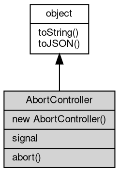

# 对象 AbortController
控制器对象，用于在需要时中止一个或多个 Web 请求

AbortController 对象为全局基础类，在任何时候都可以直接以 new AbortController() 创建：

```JavaScript
var buf = new AbortController();
```

## 继承关系


## 构造函数
        
### AbortController
**用于中止一个或多个 Web 请求的 [AbortSignal](AbortSignal.md) 对象**

```JavaScript
new AbortController();
```

## 成员属性
        
### signal
**[AbortSignal](AbortSignal.md), 用于中止一个或多个 Web 请求的 [AbortSignal](AbortSignal.md) 对象**

```JavaScript
readonly AbortSignal AbortController.signal;
```

## 成员函数
        
### abort
**用于中止一个或多个 Web 请求**

```JavaScript
AbortController.abort(String reason = "AbortError");
```

调用参数:
* reason: String, 一个可选的字符串，用于描述中止请求的原因

--------------------------
### toString
**返回对象的字符串表示，一般返回 "[Native Object]"，对象可以根据自己的特性重新实现**

```JavaScript
String AbortController.toString();
```

返回结果:
* String, 返回对象的字符串表示

--------------------------
### toJSON
**返回对象的 JSON 格式表示，一般返回对象定义的可读属性集合**

```JavaScript
Value AbortController.toJSON(String key = "");
```

调用参数:
* key: String, 未使用

返回结果:
* Value, 返回包含可 JSON 序列化的值

