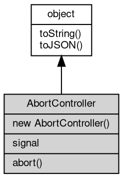

# Object AbortController
The controller [object](object.md) that owns an [AbortSignal](AbortSignal.md) and cancels the operations listening to it

 A controller is the write side of the cancellation pair defined by the WHATWG DOM
 standard, available as a [global](../../module/ifs/global.md); Node.js also exposes AbortController globally. It owns
 exactly one [AbortSignal](AbortSignal.md), returned by its `signal` property, and can abort that signal
 once. Pass the signal to a cancellable API and call `abort()` when the operation is no
 longer needed: every consumer holding the signal observes the same cancellation. The
 same signal [object](object.md) is returned on every `signal` access, so the pair keeps a single
 identity for its whole life.

Concepts:

- **Controller/signal pair**: the controller mutates the state and the signal is the
  read-only view handed to consumers. A signal owned by a controller is aborted through
  that controller (or through the static [AbortSignal](AbortSignal.md) helpers) and stays aborted forever.
- **Abort reason**: `abort(reason)` stores a reason on the signal, readable as
  `AbortSignal.reason`. When the argument is omitted, `undefined` or `null`, the reason
  is the string `"AbortError"`; a string is stored as text and any other value is stored
  as-is. Node.js stores a DOMException by default instead. The first `abort()` wins: a
  later call changes nothing and does not emit the event again.
- **[Event](Event.md) dispatch**: aborting emits the `abort` event on the signal synchronously.
  Handlers registered with `addEventListener`, `on`, `once` and the `onabort` property
  all run before `abort()` returns; a handler that throws makes `abort()` throw that
  exception after the remaining handlers ran, and listeners registered after the abort
  are never called.
- **Where signals are consumed**: fetch (`fetch([url](../../module/ifs/url.md), { signal })` rejects with an
  AbortError with code `ABORT_ERR`, or a TimeoutError with code `TIMEOUT_ERR` when the
  signal comes from `AbortSignal.timeout`), the [http](../../module/ifs/http.md) [module](../../module/ifs/module.md) request options, the `signal`
  option of `child_process.exec`/`spawn`, and
  `events.addAbortListener(signal, handler)` for plain callbacks.
- **Derived signals**: `AbortSignal.abort()`, `AbortSignal.timeout()` and
  `AbortSignal.any()` produce signals that no controller owns; they can be consumed but
  not aborted manually.

Obtained from:
- `new AbortController()` — the only way to create a controller; it takes no arguments
  (extra arguments throw a TypeError) and always creates a fresh signal.

Example 1 — abort a pending operation and read the reason:

```JavaScript
const controller = new AbortController();
const signal = controller.signal;

signal.addEventListener('abort', (ev) => {
    console.log('abort event:', ev.type, signal.reason);
});
console.log('before:', signal.aborted, signal.reason);
controller.abort('user cancelled');
console.log('after:', signal.aborted, signal.reason);
```

Example 2 — abort an in-flight fetch:

```JavaScript
const http = require('http');
const coroutine = require('coroutine');

const server = new http.Server(0, (req) => {
    coroutine.sleep(50);
    req.response.json({
        ok: true
    });
});
server.start();
const base = 'http://127.0.0.1:' + server.address().port;

(async () => {
    const controller = new AbortController();
    setTimeout(() => controller.abort(), 10);
    try {
        await fetch(base, {
            signal: controller.signal
        });
    } catch (err) {
        console.log(err.name, err.code); // AbortError ABORT_ERR
    }
    console.log('signal:', controller.signal.aborted, controller.signal.reason);
    server.stop();
})();
```

Example 3 — combine a controller with a timeout signal:

```JavaScript
const controller = new AbortController();
const combined = AbortSignal.any([controller.signal, AbortSignal.timeout(20)]);

combined.addEventListener('abort', () => {
    console.log('combined:', combined.aborted, combined.reason);
});
console.log('before:', combined.aborted);
// The 20 ms timeout wins and prints: combined: true TimeoutError
```

## Inheritance

```dot
digraph {
    node [fontname="Helvetica,sans-Serif", fontsize=10, shape="record", style="filled", fillcolor="white"];

    object [tooltip="object", URL="object.md", label="{object|toString()\ltoJSON()\l}"];
    AbortController [tooltip="AbortController", fillcolor="lightgray", id="me", label="{AbortController|new AbortController()\l|signal\l|abort()\l}"];

    object -> AbortController [dir=back];
}
```

## Constructors
        
### AbortController
**Creates a controller with a fresh, not yet aborted [AbortSignal](AbortSignal.md)**

```JavaScript
new AbortController();
```

Takes no arguments; passing any argument throws a TypeError (20001), while Node.js
ignores extra arguments. The new signal is available immediately through `signal`
and starts with `aborted` false and `reason` undefined.

## Properties
        
### signal
**[AbortSignal](AbortSignal.md), The [AbortSignal](AbortSignal.md) owned by this controller, the read-only view given to consumers**

```JavaScript
readonly AbortSignal AbortController.signal;
```

The same [object](object.md) is returned on every access and all consumers share its state. The
property is read-only: assigning to it is silently ignored (Node.js throws in strict
mode). Only aborting the controller changes the signal, and a signal never leaves the
aborted state.

Example — hand the same signal to several consumers:

```JavaScript
const controller = new AbortController();

function watch(signal, label) {
    signal.addEventListener('abort', () => console.log(label, 'saw', signal.reason));
}

watch(controller.signal, 'upload');
watch(controller.signal, 'download');
console.log(controller.signal === controller.signal); // true
controller.abort('shutdown');
console.log(controller.signal.aborted); // true
```

## Methods
        
### abort
**Aborts the signal of this controller and emits its abort event**

```JavaScript
AbortController.abort(String | Value reason = "AbortError");
```

Parameters:
* reason: String | Value, the abort reason stored on the signal, `"AbortError"` when omitted

The first call wins: it stores the reason, marks the signal aborted and dispatches
the `abort` event synchronously to every handler. Later calls are no-ops that neither
change the reason nor dispatch again. When reason is omitted, `undefined` or `null`,
the string `"AbortError"` is stored; a string is stored as text and any other value
is preserved as-is, so the reason can be an [object](object.md), a number or an Error. The event
[object](object.md) carries `reason` only when the reason is a non-empty string; see the
[AbortSignal](AbortSignal.md) abort event.

Handlers run before the call returns. An exception thrown by a handler is rethrown to
the caller after the remaining handlers ran, and the signal stays aborted (Node.js
reports handler exceptions as uncaught exceptions instead). Passing more than one
argument throws a TypeError.

Example — the first abort wins and both listeners see it:

```JavaScript
const controller = new AbortController();
const seen = [];

controller.signal.on('abort', () => seen.push('first'));
controller.signal.on('abort', () => seen.push('second'));

controller.abort('user cancelled');
controller.abort('ignored');
console.log(seen.join(','), controller.signal.reason); // first,second user cancelled
```

--------------------------
### toString
**Returns the string form of the [object](object.md)**

```JavaScript
String AbortController.toString();
```

Returns:
* String, returns the string form of the [object](object.md)

The base implementation reports an error: a native [object](object.md) has no implicit
text form, and only the classes whose value can be written as a string
override the member. [Buffer](Buffer.md) returns its content decoded with the given
[encoding](../../module/ifs/encoding.md), [HttpCookie](HttpCookie.md) returns "name=value", and so on; an override commonly
accepts optional arguments ([Buffer.toString](Buffer.md#toString) takes [encoding](../../module/ifs/encoding.md), start and
end) that are not part of this declaration.

Calling the member on a class that does not override it throws
"<Class>: the [object](object.md) can not be converted to string.", which is the
behavior to rely on when probing whether a value has a string form. See
toJSON for the serialization hook.

--------------------------
### toJSON
**Returns the JSON representation of the [object](object.md)**

```JavaScript
Value AbortController.toJSON(String key = "");
```

Parameters:
* key: String, the property name of the value being serialized

Returns:
* Value, returns the JSON-serializable value

JSON.stringify(value) calls value.toJSON(key) when the member exists and
serializes the returned value in its place; the key argument carries the
property name of the value inside its parent [object](object.md) (an empty string at
the top level) and may be used to build a keyed form. The base
implementation returns a plain [object](object.md) holding the readable properties of
the instance, so a native [object](object.md) serializes without per-class code; a
class with a portable shape such as [Buffer](Buffer.md) overrides it, and a JavaScript
class may override it in the same way.

The member is normally reached through JSON.stringify rather than called
directly; calling it returns the same value JSON.stringify would
serialize.

