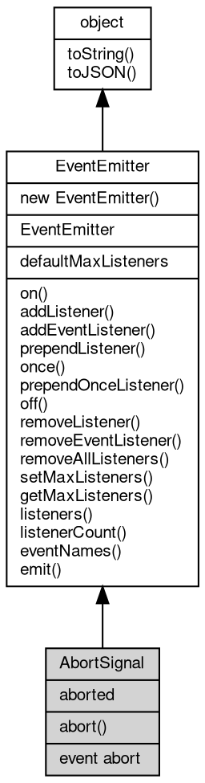

# 对象 AbortSignal
brief 该对象允许您与异步操作（例如提取请求）进行通信，并在需要时通过 [AbortController](AbortController.md) 对象中止它

## 继承关系


## 静态属性
        
### defaultMaxListeners
**Integer, 默认全局最大监听器数**

```JavaScript
static Integer AbortSignal.defaultMaxListeners;
```

## 成员属性
        
### aborted
**Boolean, 用于检查是否已请求中止**

```JavaScript
readonly Boolean AbortSignal.aborted;
```

## 成员函数
        
### abort
**用于中止一个或多个 Web 请求**

```JavaScript
AbortSignal.abort(String reason = "AbortError");
```

调用参数:
* reason: String, 一个可选的字符串，用于描述中止请求的原因

--------------------------
### on
**绑定一个事件处理函数到对象**

```JavaScript
Object AbortSignal.on(String ev,
    Function func);
```

调用参数:
* ev: String, 指定事件的名称
* func: Function, 指定事件处理函数

返回结果:
* Object, 返回事件对象本身，便于链式调用

--------------------------
**绑定一个事件处理函数到对象**

```JavaScript
Object AbortSignal.on(Object map);
```

调用参数:
* map: Object, 指定事件映射关系，对象属性名称将作为事件名称，属性的值将作为事件处理函数

返回结果:
* Object, 返回事件对象本身，便于链式调用

--------------------------
### addListener
**绑定一个事件处理函数到对象**

```JavaScript
Object AbortSignal.addListener(String ev,
    Function func);
```

调用参数:
* ev: String, 指定事件的名称
* func: Function, 指定事件处理函数

返回结果:
* Object, 返回事件对象本身，便于链式调用

--------------------------
**绑定一个事件处理函数到对象**

```JavaScript
Object AbortSignal.addListener(Object map);
```

调用参数:
* map: Object, 指定事件映射关系，对象属性名称将作为事件名称，属性的值将作为事件处理函数

返回结果:
* Object, 返回事件对象本身，便于链式调用

--------------------------
### addEventListener
**绑定一个事件处理函数到对象**

```JavaScript
Object AbortSignal.addEventListener(String ev,
    Function func,
    Object options = {});
```

调用参数:
* ev: String, 指定事件的名称
* func: Function, 指定事件处理函数
* options: Object, 指定事件处理函数的选项

返回结果:
* Object, 返回事件对象本身，便于链式调用

options 参数是一个对象，它可以包含以下属性：
- once: 如果为 true，则事件处理函数只会触发一次，触发后会被移除

--------------------------
### prependListener
**绑定一个事件处理函数到对象起始**

```JavaScript
Object AbortSignal.prependListener(String ev,
    Function func);
```

调用参数:
* ev: String, 指定事件的名称
* func: Function, 指定事件处理函数

返回结果:
* Object, 返回事件对象本身，便于链式调用

--------------------------
**绑定一个事件处理函数到对象起始**

```JavaScript
Object AbortSignal.prependListener(Object map);
```

调用参数:
* map: Object, 指定事件映射关系，对象属性名称将作为事件名称，属性的值将作为事件处理函数

返回结果:
* Object, 返回事件对象本身，便于链式调用

--------------------------
### once
**绑定一个一次性事件处理函数到对象，一次性处理函数只会触发一次**

```JavaScript
Object AbortSignal.once(String ev,
    Function func);
```

调用参数:
* ev: String, 指定事件的名称
* func: Function, 指定事件处理函数

返回结果:
* Object, 返回事件对象本身，便于链式调用

--------------------------
**绑定一个一次性事件处理函数到对象，一次性处理函数只会触发一次**

```JavaScript
Object AbortSignal.once(Object map);
```

调用参数:
* map: Object, 指定事件映射关系，对象属性名称将作为事件名称，属性的值将作为事件处理函数

返回结果:
* Object, 返回事件对象本身，便于链式调用

--------------------------
### prependOnceListener
**绑定一个事件处理函数到对象起始**

```JavaScript
Object AbortSignal.prependOnceListener(String ev,
    Function func);
```

调用参数:
* ev: String, 指定事件的名称
* func: Function, 指定事件处理函数

返回结果:
* Object, 返回事件对象本身，便于链式调用

--------------------------
**绑定一个事件处理函数到对象起始**

```JavaScript
Object AbortSignal.prependOnceListener(Object map);
```

调用参数:
* map: Object, 指定事件映射关系，对象属性名称将作为事件名称，属性的值将作为事件处理函数

返回结果:
* Object, 返回事件对象本身，便于链式调用

--------------------------
### off
**从对象处理队列中取消指定函数**

```JavaScript
Object AbortSignal.off(String ev,
    Function func);
```

调用参数:
* ev: String, 指定事件的名称
* func: Function, 指定事件处理函数

返回结果:
* Object, 返回事件对象本身，便于链式调用

--------------------------
**取消对象处理队列中的全部函数**

```JavaScript
Object AbortSignal.off(String ev);
```

调用参数:
* ev: String, 指定事件的名称

返回结果:
* Object, 返回事件对象本身，便于链式调用

--------------------------
**从对象处理队列中取消指定函数**

```JavaScript
Object AbortSignal.off(Object map);
```

调用参数:
* map: Object, 指定事件映射关系，对象属性名称作为事件名称，属性的值作为事件处理函数

返回结果:
* Object, 返回事件对象本身，便于链式调用

--------------------------
### removeListener
**从对象处理队列中取消指定函数**

```JavaScript
Object AbortSignal.removeListener(String ev,
    Function func);
```

调用参数:
* ev: String, 指定事件的名称
* func: Function, 指定事件处理函数

返回结果:
* Object, 返回事件对象本身，便于链式调用

--------------------------
**取消对象处理队列中的全部函数**

```JavaScript
Object AbortSignal.removeListener(String ev);
```

调用参数:
* ev: String, 指定事件的名称

返回结果:
* Object, 返回事件对象本身，便于链式调用

--------------------------
**从对象处理队列中取消指定函数**

```JavaScript
Object AbortSignal.removeListener(Object map);
```

调用参数:
* map: Object, 指定事件映射关系，对象属性名称作为事件名称，属性的值作为事件处理函数

返回结果:
* Object, 返回事件对象本身，便于链式调用

--------------------------
### removeEventListener
**从对象处理队列中取消指定函数**

```JavaScript
Object AbortSignal.removeEventListener(String ev,
    Function func,
    Object options = {});
```

调用参数:
* ev: String, 指定事件的名称
* func: Function, 指定事件处理函数
* options: Object, 指定事件处理函数的选项

返回结果:
* Object, 返回事件对象本身，便于链式调用

--------------------------
### removeAllListeners
**从对象处理队列中取消所有事件的所有监听器， 如果指定事件，则移除指定事件的所有监听器。**

```JavaScript
Object AbortSignal.removeAllListeners(String ev);
```

调用参数:
* ev: String, 指定事件的名称

返回结果:
* Object, 返回事件对象本身，便于链式调用

--------------------------
**从对象处理队列中取消所有事件的所有监听器， 如果指定事件，则移除指定事件的所有监听器。**

```JavaScript
Object AbortSignal.removeAllListeners(Array evs = []);
```

调用参数:
* evs: Array, 指定事件的名称

返回结果:
* Object, 返回事件对象本身，便于链式调用

--------------------------
### setMaxListeners
**监听器的默认限制的数量，仅用于兼容**

```JavaScript
AbortSignal.setMaxListeners(Integer n);
```

调用参数:
* n: Integer, 指定事件的数量

--------------------------
### getMaxListeners
**获取监听器的默认限制的数量，仅用于兼容**

```JavaScript
Integer AbortSignal.getMaxListeners();
```

返回结果:
* Integer, 返回默认限制数量

--------------------------
### listeners
**查询对象指定事件的监听器数组**

```JavaScript
Array AbortSignal.listeners(String ev);
```

调用参数:
* ev: String, 指定事件的名称

返回结果:
* Array, 返回指定事件的监听器数组

--------------------------
### listenerCount
**查询对象指定事件的监听器数量**

```JavaScript
Integer AbortSignal.listenerCount(String ev);
```

调用参数:
* ev: String, 指定事件的名称

返回结果:
* Integer, 返回指定事件的监听器数量

--------------------------
**查询对象指定事件的监听器数量**

```JavaScript
Integer AbortSignal.listenerCount(Value o,
    String ev);
```

调用参数:
* o: Value, 指定查询的对象
* ev: String, 指定事件的名称

返回结果:
* Integer, 返回指定事件的监听器数量

--------------------------
### eventNames
**查询监听器事件名称**

```JavaScript
Array AbortSignal.eventNames();
```

返回结果:
* Array, 返回事件名称数组

--------------------------
### emit
**主动触发一个事件**

```JavaScript
Boolean AbortSignal.emit(String ev,
    ...args);
```

调用参数:
* ev: String, 事件名称
* args: ..., 事件参数，将会传递给事件处理函数

返回结果:
* Boolean, 返回事件触发状态，有响应事件返回 true，否则返回 false

--------------------------
### toString
**返回对象的字符串表示，一般返回 "[Native Object]"，对象可以根据自己的特性重新实现**

```JavaScript
String AbortSignal.toString();
```

返回结果:
* String, 返回对象的字符串表示

--------------------------
### toJSON
**返回对象的 JSON 格式表示，一般返回对象定义的可读属性集合**

```JavaScript
Value AbortSignal.toJSON(String key = "");
```

调用参数:
* key: String, 未使用

返回结果:
* Value, 返回包含可 JSON 序列化的值

## 事件
        
### abort
**事件处理程序，当中止请求时触发**

```JavaScript
event AbortSignal.abort();
```

