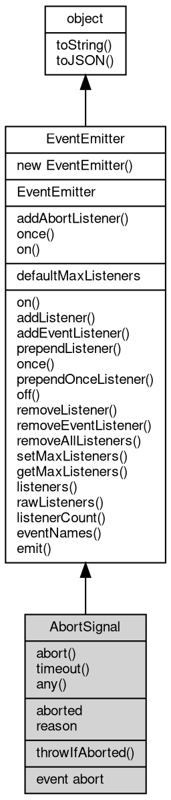

# Object AbortSignal
The signal that communicates cancellation to asynchronous operations

 An AbortSignal is the read-only half of the [AbortController](AbortController.md) pair and the [object](object.md) handed
 to APIs that support cancellation. It carries a one-shot aborted state and an abort
 reason; when the state flips the `abort` event fires and every consumer reacts. The
 class is a [global](../../module/ifs/global.md), Node.js exposes the same class globally, and it derives from
 [EventEmitter](EventEmitter.md), so listeners can be registered with `on`/`once`/`addEventListener`.

 Signals cannot be constructed directly: `new AbortSignal()` throws a TypeError. Obtain
 one from a controller, which owns the write side, or from one of the static factory
 methods below, which produce signals with no controller.

Concepts:

- **One-shot cancellation**: a signal starts active and becomes aborted at most once;
  the state never resets, later abort attempts are ignored and handlers registered after
  the abort are never called. There is no instance method that aborts a signal: only the
  owner (or a static factory) can.
- **Abort reasons**: `reason` is `undefined` while the signal is active and afterwards
  holds the value stored by the aborting side. The default is the string `"AbortError"`;
  `AbortSignal.timeout()` stores `"TimeoutError"`; other values are preserved as-is.
  Node.js stores a DOMException by default and `abort(null)` stores null. throwIfAborted
  throws an AbortError or TimeoutError for the two default reasons, but does not rethrow
  a custom value as-is.
- **Listener registration**: AbortSignal is an [EventEmitter](EventEmitter.md) (see [EventEmitter](EventEmitter.md)). The
  `abort` event also supports the DOM-style `onabort` handler and `addEventListener` with
  the `once` option; all handlers run synchronously while the signal is being aborted,
  and an exception raised by one of them is rethrown after the others finished.
- **Derived signals**: `AbortSignal.abort(reason)` is aborted at creation,
  `AbortSignal.timeout(ms)` aborts itself after a delay and `AbortSignal.any(signals)`
  follows the first of several signals to abort; none of them has a controller.
- **Integration points**: the signal is passed to fetch (`{ signal }` in its options
  [object](object.md)), to the [http](../../module/ifs/http.md) [module](../../module/ifs/module.md) request options, to `child_process.exec`/`spawn` through
  `options.signal` (the child is killed on abort) and to
  `events.addAbortListener(signal, handler)`. A fetch cancelled by a controller rejects
  with an AbortError (code `ABORT_ERR`); one cancelled through `AbortSignal.timeout`
  rejects with a TimeoutError (code `TIMEOUT_ERR`). The pending timer of a timeout
  signal keeps the [process](../../module/ifs/process.md) alive until it fires (Node.js lets the [process](../../module/ifs/process.md) exit), so a
  long timeout can delay shutdown.

Obtained from:
- `new [AbortController](AbortController.md)().signal` — a signal owned by the controller;
- `AbortSignal.abort(reason)` — an already aborted signal;
- `AbortSignal.timeout(ms)` — a signal that aborts after the delay;
- `AbortSignal.any(signals)` — a composite signal that follows the first input to abort.

Example 1 — inspect a signal before and after the abort:

```JavaScript
const controller = new AbortController();
const signal = controller.signal;

console.log(signal.aborted, signal.reason); // false undefined
signal.throwIfAborted(); // no-op while active
controller.abort();
console.log(signal.aborted, signal.reason); // true AbortError
try {
    signal.throwIfAborted();
} catch (err) {
    console.log(err.name, err.code); // AbortError ABORT_ERR
}
```

Example 2 — let a timeout abort a signal on its own:

```JavaScript
const signal = AbortSignal.timeout(20);

signal.onabort = (ev) => {
    console.log(signal.aborted, ev.type, ev.reason); // true abort TimeoutError
    try {
        signal.throwIfAborted();
    } catch (err) {
        console.log(err.name, err.code); // TimeoutError TIMEOUT_ERR
    }
};
```

Example 3 — cancel a slow fetch with a timeout signal:

```JavaScript
const http = require('http');
const coroutine = require('coroutine');

const server = new http.Server(0, (req) => {
    coroutine.sleep(100);
    req.response.json({
        ok: true
    });
});
server.start();
const base = 'http://127.0.0.1:' + server.address().port;

(async () => {
    try {
        await fetch(base, {
            signal: AbortSignal.timeout(20)
        });
    } catch (err) {
        console.log(err.name, err.code); // TimeoutError TIMEOUT_ERR
    }
    server.stop();
})();
```

## Inheritance

```dot
digraph {
    node [fontname="Helvetica,sans-Serif", fontsize=10, shape="record", style="filled", fillcolor="white"];

    object [tooltip="object", URL="object.md", label="{object|toString()\ltoJSON()\l}"];
    EventEmitter [tooltip="EventEmitter", URL="EventEmitter.md", label="{EventEmitter|new EventEmitter()\l|EventEmitter\l|addAbortListener()\lonce()\lon()\l|defaultMaxListeners\l|on()\laddListener()\laddEventListener()\lprependListener()\lonce()\lprependOnceListener()\loff()\lremoveListener()\lremoveEventListener()\lremoveAllListeners()\lsetMaxListeners()\lgetMaxListeners()\llisteners()\lrawListeners()\llistenerCount()\leventNames()\lemit()\l}"];
    AbortSignal [tooltip="AbortSignal", fillcolor="lightgray", id="me", label="{AbortSignal|abort()\ltimeout()\lany()\l|aborted\lreason\l|throwIfAborted()\l|event abort\l}"];

    object -> EventEmitter [dir=back];
    EventEmitter -> AbortSignal [dir=back];
}
```

## Static Methods
        
### abort
**Creates an AbortSignal that is already aborted**

```JavaScript
static AbortSignal AbortSignal.abort(String | Value reason = "AbortError");
```

Parameters:
* reason: String | Value, the abort reason, `"AbortError"` when omitted

Returns:
* AbortSignal, returns an already aborted AbortSignal [object](object.md)

Each call returns a distinct signal in the aborted state with `reason` set to the
given value, or to the string `"AbortError"` when the argument is omitted,
`undefined` or `null`. Because the signal is aborted at creation, `abort` handlers
registered afterwards are never called and throwIfAborted throws immediately.

Example — an already aborted signal ignores late listeners:

```JavaScript
const signal = AbortSignal.abort('pre-cancelled');
console.log(signal.aborted, signal.reason); // true pre-cancelled

let called = false;
signal.addEventListener('abort', () => {
    called = true;
});
console.log('listener called:', called); // listener called: false
```

--------------------------
### timeout
**Creates an AbortSignal that automatically aborts after a timeout**

```JavaScript
static AbortSignal AbortSignal.timeout(Number ms);
```

Parameters:
* ms: Number, timeout in milliseconds

Returns:
* AbortSignal, returns an AbortSignal [object](object.md) that will abort after ms milliseconds

The signal aborts with the string reason `"TimeoutError"` once ms milliseconds have
elapsed, so a fetch cancelled by it rejects with a TimeoutError (code `TIMEOUT_ERR`).
ms is coerced to a number, so numeric strings are accepted; values below 1 are clamped
to 1 ms and values above the internal maximum to that maximum. NaN and a missing
argument throw a TypeError (Node.js throws a RangeError for NaN and negative values).
The timer cannot be cancelled, because the signal has no abort method, and the pending
timer keeps the [process](../../module/ifs/process.md) alive until it fires (Node.js lets the [process](../../module/ifs/process.md) exit).

Example — register a disposable handler for a timeout:

```JavaScript
const events = require('events');

const signal = AbortSignal.timeout(20);
events.addAbortListener(signal, () => {
    console.log('timeout:', signal.reason); // timeout: TimeoutError
});
```

--------------------------
### any
**Creates an AbortSignal that aborts when any of the given signals aborts**

```JavaScript
static AbortSignal AbortSignal.any(Array signals);
```

Parameters:
* signals: Array, an array of AbortSignal objects

Returns:
* AbortSignal, returns a composite AbortSignal [object](object.md)

The argument must be an Array of AbortSignal objects; a non-array value or an element
of another type throws a TypeError (Node.js accepts any iterable). The returned signal
stays active while every input is active; when an input aborts, the composite aborts
with that input's reason, and inputs that abort later do not change it again. Only the
order in time matters, not the order in the array. If an input is already aborted, the
composite is returned already aborted with that signal's reason and handlers
registered afterwards are never called. An empty array produces a signal that never
aborts, and the composite has no controller, so it cannot be aborted manually.

Example — the first signal to abort decides the reason:

```JavaScript
const first = new AbortController();
const second = new AbortController();
const combined = AbortSignal.any([first.signal, second.signal]);

combined.addEventListener('abort', () => {
    console.log('combined:', combined.reason);
});
second.abort('second won');
first.abort('first too late');
console.log(combined.aborted, combined.reason); // true second won
```

--------------------------
### addAbortListener
**Registers a one-shot abort handler on an AbortSignal**

```JavaScript
static Object AbortSignal.addAbortListener(EventEmitter signal,
    Function(Object ev) func);
```

Parameters:
* signal: [EventEmitter](EventEmitter.md), the AbortSignal [object](object.md) to listen to
* func: Function(Object ev), the handler for the abort event

Returns:
* Object, returns a Disposable [object](object.md) containing a `[Symbol.dispose]` method

The handler is called at most once when the signal is aborted, and it is removed from the
signal afterwards. If the signal is already aborted the handler is invoked synchronously.
The returned [object](object.md) has a `[Symbol.dispose]()` method that removes the handler, so it can be
released before the abort happens.

Example — abort handling with automatic cleanup:

```JavaScript
const events = require('events');

const controller = new AbortController();
const disposable = events.addAbortListener(controller.signal,
    () => console.log('aborted'));

controller.abort(); // aborted
disposable[Symbol.dispose](); // safe to call after the listener fired
console.log(controller.signal.listenerCount('abort')); // 0
```

--------------------------
### once
**Creates a Promise resolved by the next occurrence of an event**

```JavaScript
static Object AbortSignal.once(EventEmitter emitter,
    Value ev,
    Object options = {});
```

Parameters:
* emitter: [EventEmitter](EventEmitter.md), the event emitter [object](object.md) to listen to
* ev: Value, the event name to listen for
* options: Object, optional parameter [object](object.md)

Returns:
* Object, returns a Promise that resolves with the array of event parameters

The Promise resolves with the array of the emit arguments when the event fires; it rejects
when `error` is emitted while waiting, unless the waited event is `error` itself, or when
the signal option aborts. The temporary listeners are removed when the Promise settles.

options supports the following option:

```JavaScript
// fragment: options
({
    "signal": null // AbortSignal; aborting rejects the Promise with an AbortError
});
```

Example — awaiting the next occurrence of an event:

```JavaScript
const EventEmitter = require('events');

(async () => {
    const emitter = new EventEmitter();
    const waiting = EventEmitter.once(emitter, 'ready');

    emitter.emit('ready', 200, 'ok');
    console.log(JSON.stringify(await waiting)); // [200,"ok"]
})();
```

--------------------------
### on
**Creates an async iterator that yields event occurrences**

```JavaScript
static Object AbortSignal.on(EventEmitter emitter,
    Value ev,
    Object options = {});
```

Parameters:
* emitter: [EventEmitter](EventEmitter.md), the event emitter [object](object.md) to listen to
* ev: Value, the event name to listen for
* options: Object, optional parameter [object](object.md)

Returns:
* Object, returns an AsyncIterator [object](object.md)

Each next() resolves with `{ value: [args...], done: false }` when the event fires and with
`{ done: true }` after an event named in the `close` option fires or the signal aborts; an
`error` event rejects the pending call. The listeners are registered when the iterator is
created and removed when the iteration ends or the signal aborts.

options supports the following options:

```JavaScript
// fragment: options
({
    "signal": null, // AbortSignal; aborting rejects pending and future next() calls
    "close": [] // event names; the first one to fire ends the iteration
});
```

Example — iterating the occurrences of an event:

```JavaScript
const EventEmitter = require('events');

(async () => {
    const emitter = new EventEmitter();
    const iterator = EventEmitter.on(emitter, 'data', {
        close: ['end']
    });

    emitter.emit('data', 1);
    emitter.emit('data', 2);
    emitter.emit('end');

    for await (const args of iterator)
    console.log(JSON.stringify(args)); // [1] then [2]
})();
```

## Static Properties
        
### defaultMaxListeners
**Integer, The [process](../../module/ifs/process.md)-wide default listener limit reported by getMaxListeners()**

```JavaScript
static Integer AbortSignal.defaultMaxListeners;
```

Defaults to 10. Assigning a value changes getMaxListeners() for every emitter that never
called setMaxListeners(); an emitter with an explicit limit keeps it. The limit is
informational: fibjs never warns when the number of listeners exceeds it.

## Properties
        
### aborted
**Boolean, Whether the signal has been aborted**

```JavaScript
readonly Boolean AbortSignal.aborted;
```

False until the owning controller or a static factory aborts the signal, then true
forever; assigning to the property is silently ignored. A signal created by
`AbortSignal.abort()` starts with true. The state only flips once, so polling this
flag is safe, but registering a listener is the usual way to react.

--------------------------
### reason
**Value, The abort reason stored when the signal was aborted**

```JavaScript
readonly Value AbortSignal.reason;
```

`undefined` while the signal is active; afterwards the value passed to the aborting
call, with the string `"AbortError"` as the default and `"TimeoutError"` for
`AbortSignal.timeout()`. Strings, numbers, objects and Errors are all preserved as-is
(only `undefined` and `null` select the default), assigning to the property is
silently ignored, and the value never changes after the first abort. Node.js stores a
DOMException by default and preserves `null` as a reason.

## Methods
        
### throwIfAborted
**Throws the abort error when the signal has been aborted, otherwise does nothing**

```JavaScript
AbortSignal.throwIfAborted();
```

A no-op while the signal is active. After the abort the thrown error depends on how the
signal was aborted: the default reason and a timeout produce an AbortError (name
`AbortError`, code `ABORT_ERR`, message "The operation was aborted.") or a TimeoutError
(name `TimeoutError`, code `TIMEOUT_ERR`, message "The operation timed out."); a custom
string reason is not preserved and also throws the generic AbortError, and any other
reason value throws a generic Error (20024) instead of the value itself. Node.js throws
the reason exactly as stored in every case, so read `AbortSignal.reason` when the
original value matters.

Example — a no-op while active, an AbortError after the abort:

```JavaScript
const controller = new AbortController();
controller.signal.throwIfAborted(); // no-op while active
console.log('active');

controller.abort();
try {
    controller.signal.throwIfAborted();
} catch (err) {
    console.log(err.name, err.code); // AbortError ABORT_ERR
}
```

--------------------------
### on
**Appends an event handler to the emitter**

```JavaScript
Object AbortSignal.on(Value ev,
    Function(...args) func);
```

Parameters:
* ev: Value, the event name to bind
* func: Function(...args), the event handler function, called with the emit arguments

Returns:
* Object, returns the event [object](object.md) itself for chaining

The listener is called with the arguments of emit() and `this` set to the emitter; the
emitter itself is returned so registrations can be chained. The same function may be
registered several times for one event and each copy is called. See the class documentation
for the dispatch order.

--------------------------
**Appends several event handlers to the emitter**

```JavaScript
Object AbortSignal.on(Object map);
```

Parameters:
* map: Object, the event mapping; [object](object.md) property names are used as event names

Returns:
* Object, returns the event [object](object.md) itself for chaining

Every enumerable property of the map whose value is a function is registered under its
property name. Properties are processed in order; a value that is not a function makes the
call fail with an invalid-type error while entries processed before it stay registered.

Example — registering several handlers at once:

```JavaScript
const EventEmitter = require('events');

const emitter = new EventEmitter();
emitter.on({
    connect: () => console.log('connect'),
    close: () => console.log('close')
});

emitter.emit('connect'); // connect
emitter.emit('close'); // close
```

--------------------------
### addListener
**Appends an event handler to the emitter**

```JavaScript
Object AbortSignal.addListener(Value ev,
    Function(...args) func);
```

Parameters:
* ev: Value, the event name to bind
* func: Function(...args), the event handler function

Returns:
* Object, returns the event [object](object.md) itself for chaining

Alias of on(ev, func), provided for Node.js compatibility.

--------------------------
**Appends several event handlers to the emitter**

```JavaScript
Object AbortSignal.addListener(Object map);
```

Parameters:
* map: Object, the event mapping; [object](object.md) property names are used as event names

Returns:
* Object, returns the event [object](object.md) itself for chaining

Alias of on(map), provided for Node.js compatibility.

--------------------------
### addEventListener
**Appends an event handler to the emitter with an options [object](object.md)**

```JavaScript
Object AbortSignal.addEventListener(Value ev,
    Function(...args) func,
    Object options = {});
```

Parameters:
* ev: Value, the event name to bind
* func: Function(...args), the event handler function, called with the emit arguments
* options: Object, the options of the event handler

Returns:
* Object, returns the event [object](object.md) itself for chaining

Web-style alias of on(); the only supported option is `once`, which registers a one-shot
handler exactly like once(). The listener receives the plain emit arguments and not an [Event](Event.md)
[object](object.md); see the [DOMEvent](DOMEvent.md) class for the DOM-style event [object](object.md) used by AbortSignal and
fetch-style APIs.

options supports the following option:

```JavaScript
// fragment: options
({
    "once": false // when true, the handler is removed before its single invocation
});
```

Example — a one-shot DOM-style registration:

```JavaScript
const EventEmitter = require('events');

const emitter = new EventEmitter();
emitter.addEventListener('ping', () => console.log('ping'), {
    once: true
});

emitter.emit('ping'); // ping
console.log(emitter.emit('ping')); // false
console.log(emitter.listenerCount('ping')); // 0
```

--------------------------
### prependListener
**Inserts an event handler at the front of the queue**

```JavaScript
Object AbortSignal.prependListener(Value ev,
    Function(...args) func);
```

Parameters:
* ev: Value, the event name to bind
* func: Function(...args), the event handler function

Returns:
* Object, returns the event [object](object.md) itself for chaining

The listener is called before the listeners registered with on()/addListener() the next time
the event is emitted. When several prependListener() calls are made, the last one registered
is called first, because every call inserts at the same position.

Example — insertion at the front of the queue:

```JavaScript
const EventEmitter = require('events');

const emitter = new EventEmitter();
emitter.on('order', () => console.log('on'));
emitter.prependListener('order', () => console.log('prepend'));

emitter.emit('order'); // prepend, then on
```

--------------------------
**Inserts several event handlers at the front of the queue**

```JavaScript
Object AbortSignal.prependListener(Object map);
```

Parameters:
* map: Object, the event mapping; [object](object.md) property names are used as event names

Returns:
* Object, returns the event [object](object.md) itself for chaining

Map form of prependListener(); every function property is inserted at the front, so the
properties of the map are called in reverse order.

--------------------------
### once
**Appends a one-shot event handler to the emitter**

```JavaScript
Object AbortSignal.once(Value ev,
    Function(...args) func);
```

Parameters:
* ev: Value, the event name to bind
* func: Function(...args), the event handler function

Returns:
* Object, returns the event [object](object.md) itself for chaining

The handler is wrapped and removes itself from the queue before it is called, so it runs at
most once. off() removes it when passed the original function, listeners() returns the
original function, and rawListeners() returns the internal wrapper whose `_func` property
holds the original. See Example 2 in the class documentation.

--------------------------
**Appends several one-shot event handlers to the emitter**

```JavaScript
Object AbortSignal.once(Object map);
```

Parameters:
* map: Object, the event mapping; [object](object.md) property names are used as event names

Returns:
* Object, returns the event [object](object.md) itself for chaining

Map form of once(); every function property is registered as a one-shot listener under its
property name.

--------------------------
### prependOnceListener
**Inserts a one-shot event handler at the front of the queue**

```JavaScript
Object AbortSignal.prependOnceListener(Value ev,
    Function(...args) func);
```

Parameters:
* ev: Value, the event name to bind
* func: Function(...args), the event handler function

Returns:
* Object, returns the event [object](object.md) itself for chaining

Combines prependListener() and once(): the handler is called first and only once, and it is
removed before its invocation.

--------------------------
**Inserts several one-shot event handlers at the front of the queue**

```JavaScript
Object AbortSignal.prependOnceListener(Object map);
```

Parameters:
* map: Object, the event mapping; [object](object.md) property names are used as event names

Returns:
* Object, returns the event [object](object.md) itself for chaining

Map form of prependOnceListener(); every function property is inserted as a one-shot
listener, and the properties of the map are called in reverse order.

--------------------------
### off
**Removes an event handler from the emitter**

```JavaScript
Object AbortSignal.off(Value ev,
    Function(...args) func);
```

Parameters:
* ev: Value, the event name to unbind
* func: Function(...args), the event handler function

Returns:
* Object, returns the event [object](object.md) itself for chaining

The first matching listener is removed; when the same function was registered several times
only one copy is removed per call, so repeat the call to remove the others. A once() wrapper
is matched by its original function as well. Removing a listener emits the `removeListener`
meta event after the removal.

--------------------------
**Removes all event handlers of one event**

```JavaScript
Object AbortSignal.off(Value ev);
```

Parameters:
* ev: Value, the event name to unbind

Returns:
* Object, returns the event [object](object.md) itself for chaining

Every listener of the event is removed and `removeListener` is emitted once per removed
listener. The call succeeds when the event has no listener.

Example — removing every listener of one event:

```JavaScript
const EventEmitter = require('events');

const emitter = new EventEmitter();
emitter.on('data', () => console.log('first'));
emitter.on('data', () => console.log('second'));

emitter.off('data');
console.log(emitter.emit('data')); // false
```

--------------------------
**Removes several event handlers from the emitter**

```JavaScript
Object AbortSignal.off(Object map);
```

Parameters:
* map: Object, the event mapping; [object](object.md) property names are used as event names

Returns:
* Object, returns the event [object](object.md) itself for chaining

Every enumerable property of the map whose value is a function names an event from which
that function is removed (one copy per event). A value that is not a function makes the call
fail with an invalid-type error.

--------------------------
### removeListener
**Removes an event handler from the emitter**

```JavaScript
Object AbortSignal.removeListener(Value ev,
    Function(...args) func);
```

Parameters:
* ev: Value, the event name to unbind
* func: Function(...args), the event handler function

Returns:
* Object, returns the event [object](object.md) itself for chaining

Alias of off(ev, func), provided for Node.js compatibility.

--------------------------
**Removes all event handlers of one event**

```JavaScript
Object AbortSignal.removeListener(Value ev);
```

Parameters:
* ev: Value, the event name to unbind

Returns:
* Object, returns the event [object](object.md) itself for chaining

Alias of off(ev), provided for Node.js compatibility.

--------------------------
**Removes several event handlers from the emitter**

```JavaScript
Object AbortSignal.removeListener(Object map);
```

Parameters:
* map: Object, the event mapping; [object](object.md) property names are used as event names

Returns:
* Object, returns the event [object](object.md) itself for chaining

Alias of off(map), provided for Node.js compatibility.

--------------------------
### removeEventListener
**Removes an event handler with an options [object](object.md)**

```JavaScript
Object AbortSignal.removeEventListener(Value ev,
    Function(...args) func,
    Object options = {});
```

Parameters:
* ev: Value, the event name to unbind
* func: Function(...args), the event handler function
* options: Object, the options of the event handler, ignored

Returns:
* Object, returns the event [object](object.md) itself for chaining

Web-style alias of off(ev, func); the options [object](object.md) is accepted and ignored, and a once()
wrapper is matched by its original function like off().

--------------------------
### removeAllListeners
**Removes all listeners of one event**

```JavaScript
Object AbortSignal.removeAllListeners(Value ev);
```

Parameters:
* ev: Value, the event name to remove

Returns:
* Object, returns the event [object](object.md) itself for chaining

Equivalent to off(ev): every listener of the event is removed, including once() wrappers
matched by their original function, and `removeListener` is emitted once per removal.

--------------------------
**Removes all listeners of the given events, or of the whole emitter**

```JavaScript
Object AbortSignal.removeAllListeners(Array evs = []);
```

Parameters:
* evs: Array, the event names to remove

Returns:
* Object, returns the event [object](object.md) itself for chaining

An empty array — including the no-argument call, because the parameter defaults to [] —
clears every string-keyed event; symbol-keyed listeners are left in place, unlike Node.js
which removes them too. A non-empty array clears each named event as
removeAllListeners(ev) does.

Example — clearing selected events and the whole emitter:

```JavaScript
const EventEmitter = require('events');

const emitter = new EventEmitter();
emitter.on('a', () => {});
emitter.on('b', () => {});
emitter.on('c', () => {});

emitter.removeAllListeners(['a', 'b']);
console.log(emitter.listenerCount('a'), emitter.listenerCount('c')); // 0 1

emitter.removeAllListeners();
console.log(emitter.eventNames().length); // 0
```

--------------------------
### setMaxListeners
**Stores a per-emitter listener limit**

```JavaScript
AbortSignal.setMaxListeners(Integer n);
```

Parameters:
* n: Integer, the number of events

The value is reported by getMaxListeners() and is otherwise informational: fibjs never warns
when the number of listeners exceeds it. This member exists for Node.js compatibility. A
negative value throws; 0 is accepted and stored as-is, while Node.js treats 0 as unlimited.

--------------------------
### getMaxListeners
**Returns the listener limit of the emitter**

```JavaScript
Integer AbortSignal.getMaxListeners();
```

Returns:
* Integer, returns the default limit

Returns the value set by setMaxListeners(), or the [process](../../module/ifs/process.md)-wide defaultMaxListeners (10)
when no explicit value was set.

--------------------------
### listeners
**Returns a copy of the listener array of an event**

```JavaScript
Array AbortSignal.listeners(Value ev);
```

Parameters:
* ev: Value, the event name to query

Returns:
* Array, returns the listener array of the specified event

One-shot wrappers are unwrapped, so the result contains the functions passed to
on()/once() and can be passed to off(); an unknown event produces an empty array.

Example — once() listeners are returned unwrapped:

```JavaScript
const EventEmitter = require('events');

const emitter = new EventEmitter();

function onTick() {
    console.log('tick');
}

emitter.once('tick', onTick);
console.log(emitter.listeners('tick')[0] === onTick); // true
console.log(emitter.rawListeners('tick')[0] === onTick); // false
```

--------------------------
### rawListeners
**Returns the internal listener array of an event**

```JavaScript
Array AbortSignal.rawListeners(Value ev);
```

Parameters:
* ev: Value, the event name to query

Returns:
* Array, returns the listener array of the specified event

The array is not unwrapped: a listener registered with once() appears as the internal
wrapper function whose `_func` property holds the original function. An unknown event
produces an empty array.

--------------------------
### listenerCount
**Returns the number of listeners of an event**

```JavaScript
Integer AbortSignal.listenerCount(Value ev);
```

Parameters:
* ev: Value, the event name to query

Returns:
* Integer, returns the number of listeners of the specified event

One-shot listeners count as one and an unknown event returns 0.

--------------------------
**Returns the number of listeners of an event on another [object](object.md)**

```JavaScript
Integer AbortSignal.listenerCount(Value o,
    Value ev);
```

Parameters:
* o: Value, the [object](object.md) to query
* ev: Value, the event name to query

Returns:
* Integer, returns the number of listeners of the specified event

Counts without requiring the target to be an [EventEmitter](EventEmitter.md): any [object](object.md) with registered
events can be queried. The call is normally written as
`EventEmitter.listenerCount(target, 'data')`.

Example — counting the listeners of another [object](object.md):

```JavaScript
const EventEmitter = require('events');

const emitter = new EventEmitter();
emitter.on('data', () => {});
emitter.on('data', () => {});

console.log(EventEmitter.listenerCount(emitter, 'data')); // 2
```

--------------------------
### eventNames
**Returns the names of the events with at least one listener**

```JavaScript
Array AbortSignal.eventNames();
```

Returns:
* Array, returns the array of event names

Only string-keyed events are reported; symbol-keyed events are omitted and numeric event
names are returned as numbers (Node.js also reports symbol events).

--------------------------
### emit
**Emits an event and returns whether a listener was called**

```JavaScript
Boolean AbortSignal.emit(Value ev,
    ...args);
```

Parameters:
* ev: Value, event name
* args: ..., event parameters, which are passed to the event handler

Returns:
* Boolean, returns whether the event had a listener to respond to it

Listeners are called as described by the dispatch model in the class documentation: the
first one runs synchronously on the current fiber, the remaining ones run in parallel
fibers, and the call returns after all of them finish; an exception raised by a listener is
thrown back to the caller. Emitting `error` with no listener throws instead of returning
false: an Error argument is thrown as-is and any other value is wrapped in
`Error("Unhandled error. (...)")`. [Event](Event.md) names are strings or symbols; `emit()` does not
match a listener registered with a numeric name.

--------------------------
### toString
**Returns the string form of the [object](object.md)**

```JavaScript
String AbortSignal.toString();
```

Returns:
* String, returns the string form of the [object](object.md)

The base implementation reports an error: a native [object](object.md) has no implicit
text form, and only the classes whose value can be written as a string
override the member. [Buffer](Buffer.md) returns its content decoded with the given
[encoding](../../module/ifs/encoding.md), [HttpCookie](HttpCookie.md) returns "name=value", and so on; an override commonly
accepts optional arguments ([Buffer.toString](Buffer.md#toString) takes [encoding](../../module/ifs/encoding.md), start and
end) that are not part of this declaration.

Calling the member on a class that does not override it throws
"<Class>: the [object](object.md) can not be converted to string.", which is the
behavior to rely on when probing whether a value has a string form. See
toJSON for the serialization hook.

--------------------------
### toJSON
**Returns the JSON representation of the [object](object.md)**

```JavaScript
Value AbortSignal.toJSON(String key = "");
```

Parameters:
* key: String, the property name of the value being serialized

Returns:
* Value, returns the JSON-serializable value

JSON.stringify(value) calls value.toJSON(key) when the member exists and
serializes the returned value in its place; the key argument carries the
property name of the value inside its parent [object](object.md) (an empty string at
the top level) and may be used to build a keyed form. The base
implementation returns a plain [object](object.md) holding the readable properties of
the instance, so a native [object](object.md) serializes without per-class code; a
class with a portable shape such as [Buffer](Buffer.md) overrides it, and a JavaScript
class may override it in the same way.

The member is normally reached through JSON.stringify rather than called
directly; calling it returns the same value JSON.stringify would
serialize.

## Events
        
### abort
**Emitted once when the signal is aborted, carrying the event [object](object.md)**

```JavaScript
event AbortSignal.abort(Object ev);
```

Parameters:
* ev: Object, the abort event [object](object.md), with type, target and, for string reasons, reason

Handlers registered through addEventListener/on/once or the `onabort` handler property
are all invoked synchronously by the aborting call ([AbortController.abort](AbortController.md#abort)(), the
timeout timer or an [AbortSignal.any](AbortSignal.md#any) propagation); handlers registered after the abort
are never called. The event [object](object.md) is a plain [object](object.md) with `type` `"abort"` and `target`
set to the signal; it carries `reason` only when the reason is a non-empty string,
because a value reason is exposed solely through `AbortSignal.reason`. It is not a
[DOMEvent](DOMEvent.md) instance (Node.js passes an [Event](Event.md) [object](object.md)). A handler that throws is rethrown
by the aborting call after the remaining handlers ran. Do not emit this event manually:
emitting `"abort"` marks the signal aborted without storing a reason.

