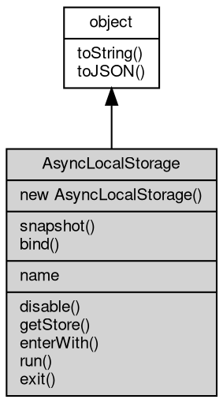

# 对象 AsyncLocalStorage
该对象允许您在异步操作中存储和检索数据

AsyncLocalStorage 可用于在异步调用链中传递数据，类似于线程本地存储。每个异步操作都可以访问其创建时的存储数据，而不会与其他异步操作的数据混淆。

以下是一个简单的示例：

```JavaScript
const {
    AsyncLocalStorage
} = require('async_hooks');
const als = new AsyncLocalStorage();

als.run({
    requestId: 'req-123'
}, () => {
    setTimeout(() => {
        const store = als.getStore();
        console.log(store.requestId); // Output: req-123
    }, 100);
});
```

## 继承关系


## 构造函数
        
### AsyncLocalStorage
**创建一个新的 AsyncLocalStorage 实例**

```JavaScript
new AsyncLocalStorage(Object options = {});
```

调用参数:
* options: Object, 一个可选的对象，用于配置 AsyncLocalStorage 实例

options 支持以下选项：
 - defaultValue: 指定默认值，当没有存储值时返回该值
 - name: 为 AsyncLocalStorage 实例指定一个名称，便于调试

## 静态函数
        
### snapshot
**创建一个快照函数，用于捕获当前的异步上下文**

```JavaScript
static Function AsyncLocalStorage.snapshot();
```

返回结果:
* Function, 返回一个函数，该函数接受一个回调并在捕获的上下文中执行它

返回的函数可以在任何时候调用，它会在捕获时的上下文中执行传入的回调函数。

示例：

```JavaScript
const runInContext = als.run({
    id: 1
}, () => AsyncLocalStorage.snapshot());
// Later in a different context
als.run({
    id: 2
}, () => {
    runInContext(() => {
        console.log(als.getStore().id); // Output: 1
    });
});
```

--------------------------
### bind
**将函数绑定到当前的异步上下文**

```JavaScript
static Function AsyncLocalStorage.bind(Function fn);
```

调用参数:
* fn: Function, 要绑定的函数

返回结果:
* Function, 返回绑定到当前上下文的新函数

返回一个新函数，该函数在调用时会在捕获时的异步上下文中执行原始函数。
这对于确保回调函数在正确的上下文中执行非常有用。

示例：

```JavaScript
const bound = als.run({
    id: 1
}, () => {
    return AsyncLocalStorage.bind(() => als.getStore());
});
als.run({
    id: 2
}, () => {
    console.log(bound().id); // Output: 1
});
```

## 成员属性
        
### name
**String, 获取 AsyncLocalStorage 实例的名称**

```JavaScript
readonly String AsyncLocalStorage.name;
```

名称在创建实例时通过 options.name 设置，用于调试目的。如果未设置，返回空字符串。

## 成员函数
        
### disable
**禁用当前 AsyncLocalStorage 实例**

```JavaScript
AsyncLocalStorage.disable();
```

调用此方法后，getStore() 将返回 undefined（除非设置了 defaultValue），并且不再传播存储数据到后续的异步操作。

--------------------------
### getStore
**获取当前异步上下文中的存储数据**

```JavaScript
Value AsyncLocalStorage.getStore();
```

返回结果:
* Value, 返回当前上下文中的存储数据

如果在 run() 或 enterWith() 设置的上下文中调用，返回对应的存储数据。
如果不在任何上下文中，返回 undefined 或创建实例时指定的 defaultValue。

--------------------------
### enterWith
**进入一个新的异步上下文，并设置存储数据**

```JavaScript
AsyncLocalStorage.enterWith(Value store);
```

调用参数:
* store: Value, 要存储的数据

与 run() 不同，enterWith() 不需要回调函数，它会在当前执行上下文中设置存储数据，
该数据会传播到后续的所有异步操作，直到当前异步上下文结束。

示例：

```JavaScript
setImmediate(() => {
    als.enterWith({
        id: 1
    });
    setTimeout(() => {
        console.log(als.getStore().id); // Output: 1
    }, 100);
});
```

--------------------------
### run
**在新的异步上下文中运行回调函数**

```JavaScript
Value AsyncLocalStorage.run(Value store,
    Function callback,
    ...args);
```

调用参数:
* store: Value, 要存储的数据
* callback: Function, 要执行的回调函数
* args: ..., 传递给回调函数的参数

返回结果:
* Value, 返回回调函数的返回值

创建一个新的异步上下文，在该上下文中设置存储数据，然后执行回调函数。
回调函数内部及其触发的所有异步操作都可以通过 getStore() 获取该存储数据。
回调执行完毕后，上下文自动恢复到调用 run() 之前的状态。

示例：

```JavaScript
const result = als.run({
    userId: 'user-1'
}, (a, b) => {
    console.log(als.getStore().userId); // Output: user-1
    return a + b;
}, 10, 20);
console.log(result); // Output: 30
```

--------------------------
### exit
**暂时退出当前异步上下文执行回调函数**

```JavaScript
Value AsyncLocalStorage.exit(Function callback,
    ...args);
```

调用参数:
* callback: Function, 要执行的回调函数
* args: ..., 传递给回调函数的参数

返回结果:
* Value, 返回回调函数的返回值

在回调执行期间，getStore() 将返回 undefined（或 defaultValue）。
回调执行完毕后，恢复到原来的上下文。

示例：

```JavaScript
als.run({
    id: 1
}, () => {
    console.log(als.getStore().id); // Output: 1
    als.exit(() => {
        console.log(als.getStore()); // Output: undefined
    });
    console.log(als.getStore().id); // Output: 1
});
```

--------------------------
### toString
**返回对象的字符串表示，一般返回 "[Native Object]"，对象可以根据自己的特性重新实现**

```JavaScript
String AsyncLocalStorage.toString();
```

返回结果:
* String, 返回对象的字符串表示

--------------------------
### toJSON
**返回对象的 JSON 格式表示，一般返回对象定义的可读属性集合**

```JavaScript
Value AsyncLocalStorage.toJSON(String key = "");
```

调用参数:
* key: String, 未使用

返回结果:
* Value, 返回包含可 JSON 序列化的值

