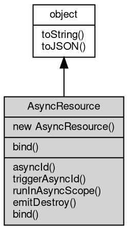

# 对象 AsyncResource
AsyncResource 是用于嵌入异步上下文跟踪的类。

扩展此类时，在构造时捕获的异步上下文会被保留，并在调用 `runInAsyncScope` 或 `bind` 时恢复。
这对于基于回调的 API 特别有用，其中回调必须在发起操作的资源的异步上下文中运行。

示例：

```JavaScript
const {
    AsyncResource,
    AsyncLocalStorage
} = require('async_hooks');
const als = new AsyncLocalStorage();

class RequestHandler extends AsyncResource {
    constructor(callback) {
        super('RequestHandler');
        this.callback = callback;
    }

    onComplete(result) {
        this.runInAsyncScope(this.callback, null, null, result);
    }
}

als.run({
    requestId: '123'
}, () => {
    const handler = new RequestHandler((err, data) => {
        console.log(als.getStore().requestId); // 输出: 123
    });
    // 稍后，在异步上下文之外：
    handler.onComplete('ok');
});
```

## 继承关系


## 构造函数
        
### AsyncResource
**创建一个新的 AsyncResource 实例**

```JavaScript
new AsyncResource(String type,
    Value triggerAsyncId = {});
```

调用参数:
* type: String, 异步资源的类型，用于诊断信息
* triggerAsyncId: Value, 可选。数字类型的 triggerAsyncId 或包含以下属性的选项对象：

## 静态函数
        
### bind
**静态方法，将函数绑定到当前异步上下文**

```JavaScript
static Function AsyncResource.bind(Function fn,
    String type = "bound-anonymous-fn",
    Value thisArg = undefined);
```

调用参数:
* fn: Function, 要绑定的函数
* type: String, 可选的内部 AsyncResource 类型字符串。默认为 "bound-anonymous-fn"。
* thisArg: Value, 可选的函数 `this` 值

返回结果:
* Function, 返回绑定后的函数

创建一个内部 AsyncResource 并将函数绑定到它。

## 成员函数
        
### asyncId
**获取分配给此资源的唯一异步 ID**

```JavaScript
Number AsyncResource.asyncId();
```

返回结果:
* Number, 返回数字类型的异步 ID

--------------------------
### triggerAsyncId
**获取此资源的触发异步 ID**

```JavaScript
Number AsyncResource.triggerAsyncId();
```

返回结果:
* Number, 返回数字类型的触发异步 ID

--------------------------
### runInAsyncScope
**在此资源的异步上下文中执行函数**

```JavaScript
Value AsyncResource.runInAsyncScope(Function fn,
    Value thisArg = undefined,
    ...args);
```

调用参数:
* fn: Function, 要执行的函数
* thisArg: Value, 回调的 `this` 值。默认为 undefined。
* args: ..., 传递给回调的额外参数

返回结果:
* Value, 返回回调函数的返回值

回调函数在构造此 AsyncResource 时激活的异步上下文中调用，
允许 [AsyncLocalStorage](AsyncLocalStorage.md) 存储被正确恢复。

--------------------------
### emitDestroy
**将此资源标记为已销毁**

```JavaScript
AsyncResource AsyncResource.emitDestroy();
```

返回结果:
* AsyncResource, 返回此 AsyncResource 的引用

在 fibjs 中这是一个空操作，为兼容既有 API 调用而保留。

--------------------------
### bind
**绑定一个函数使其在此资源的异步作用域内运行**

```JavaScript
Function AsyncResource.bind(Function fn,
    Value thisArg = undefined);
```

调用参数:
* fn: Function, 要绑定的函数
* thisArg: Value, 可选的函数 `this` 值

返回结果:
* Function, 返回绑定后的函数

返回的函数将有一个 `asyncResource` 属性引用此 AsyncResource 实例。

--------------------------
### toString
**返回对象的字符串表示，一般返回 "[Native Object]"，对象可以根据自己的特性重新实现**

```JavaScript
String AsyncResource.toString();
```

返回结果:
* String, 返回对象的字符串表示

--------------------------
### toJSON
**返回对象的 JSON 格式表示，一般返回对象定义的可读属性集合**

```JavaScript
Value AsyncResource.toJSON(String key = "");
```

调用参数:
* key: String, 未使用

返回结果:
* Value, 返回包含可 JSON 序列化的值

