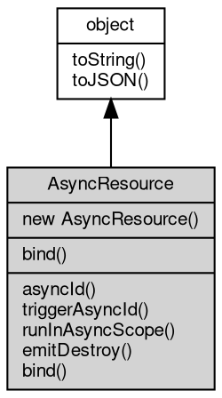

# Object AsyncResource
AsyncResource captures the asynchronous context at construction time so it can be restored later; it is the building block for wrapping callback-based APIs whose callbacks must run in the context of the operation that started them

Extend this class (or use the static `bind`) when an operation outlives the context that created
it: store the context at construction, then run the completion callback through
`runInAsyncScope`. This is how a database query, a worker task or an HTTP handler can restore the
[AsyncLocalStorage](AsyncLocalStorage.md) store of the request that scheduled it, even when the callback runs in a
different fiber or after an await.

The class records a diagnostic `(asyncId, triggerAsyncId)` pair and the captured context; fibjs
does not expose the Node.js [async_hooks](../../module/ifs/async_hooks.md) hook callbacks, so the ids are informational and
`emitDestroy` is a no-op.

Concepts:

- **Resource context**: the constructor captures the async context of the creating fiber; the
  capture is restored around `runInAsyncScope` and `bind` calls. An instance created outside any
  [AsyncLocalStorage](AsyncLocalStorage.md) context keeps an empty context and clears the store while it runs.
- **Propagation into user-created resources**: a manually created resource is the way to give
  context to code that fibjs cannot instrument by itself (a third-party event source, a poll
  loop, a queue); bind the completion [path](../../module/ifs/path.md) once, and all [AsyncLocalStorage](AsyncLocalStorage.md) instances propagate
  with it.
- **Node.js comparison**: `new AsyncResource(type, options)`, `runInAsyncScope`, `bind`, the
  static `bind`, `asyncId` and `triggerAsyncId` match Node.js; `requireManualDestroy` is accepted
  but ignored because there are no destroy hooks, and without an explicit triggerAsyncId fibjs
  records 0 while Node.js records the current executionAsyncId.

Import:

```JavaScript
const {
    AsyncResource
} = require('async_hooks');
```

Obtained from:
- `new AsyncResource(type[, options])` — create a resource around your own operation;
- `AsyncResource.bind(fn[, type[, thisArg]])` — the same capture without an explicit instance.

Example 1 — a callback-based API that must restore the request context:

```JavaScript
const {
    AsyncResource,
    AsyncLocalStorage
} = require('async_hooks');
const als = new AsyncLocalStorage();

class RequestHandler extends AsyncResource {
    constructor(callback) {
        super('RequestHandler');
        this.callback = callback;
    }

    onComplete(result) {
        this.runInAsyncScope(this.callback, null, null, result);
    }
}

const handler = als.run({
    requestId: '123'
}, () => {
    return new RequestHandler((err, data) => console.log(als.getStore().requestId, data));
});

// the callback runs outside the run() scope but still sees the request context
handler.onComplete('ok'); // 123 ok
```

Example 2 — bind an event callback to the context that subscribed it:

```JavaScript
const {
    AsyncResource,
    AsyncLocalStorage
} = require('async_hooks');
const als = new AsyncLocalStorage();

const subscription = als.run({
    topic: 'news'
}, () => {
    return {
        onEvent: AsyncResource.bind((value) => {
            console.log(als.getStore().topic, value); // news update
        })
    };
});

subscription.onEvent('update');
```

Example 3 — a resource restores its context in a later immediate:

```JavaScript
const {
    AsyncResource,
    AsyncLocalStorage
} = require('async_hooks');
const als = new AsyncLocalStorage();

als.run('captured', () => {
    const resource = new AsyncResource('Job');
    setImmediate(() => resource.runInAsyncScope(() => console.log(als.getStore())));
});
```

## Inheritance

```dot
digraph {
    node [fontname="Helvetica,sans-Serif", fontsize=10, shape="record", style="filled", fillcolor="white"];

    object [tooltip="object", URL="object.md", label="{object|toString()\ltoJSON()\l}"];
    AsyncResource [tooltip="AsyncResource", fillcolor="lightgray", id="me", label="{AsyncResource|new AsyncResource()\l|bind()\l|asyncId()\ltriggerAsyncId()\lrunInAsyncScope()\lemitDestroy()\lbind()\l}"];

    object -> AsyncResource [dir=back];
}
```

## Constructors
        
### AsyncResource
**Creates a new AsyncResource instance**

```JavaScript
new AsyncResource(String type,
    Value triggerAsyncId = {});
```

Parameters:
* type: String, the type of the async resource, used for diagnostics
* triggerAsyncId: Value, optional. A numeric triggerAsyncId or an options [object](object.md) containing the

The constructor captures the asynchronous context of the calling fiber, so any callback run
through `runInAsyncScope` or through the bound function sees the [AsyncLocalStorage](AsyncLocalStorage.md) stores of
the creation point.

options supports the following options:

```JavaScript
// fragment: options
({
    "triggerAsyncId": 0, // id of the triggering resource, informational
    "requireManualDestroy": false // accepted for Node.js compatibility, ignored by fibjs
})
```

A number may be passed directly as the second argument instead of the options [object](object.md). type is
required and must be a string; a missing or non-string type throws a TypeError.

## Static Methods
        
### bind
**Static method that binds a function to the current asynchronous context**

```JavaScript
static Function(...args) => Value AsyncResource.bind(Function(...args) => Value fn,
    String type = "bound-anonymous-fn",
    Value thisArg = undefined);
```

Parameters:
* fn: Function(...args) => Value, the function to bind
* type: String, optional internal AsyncResource type string. Default is "bound-anonymous-fn".
* thisArg: Value, optional `this` value of the function

Returns:
* Function(...args) => Value, returns the bound function

Creates an internal AsyncResource with the given type, then binds fn to the context captured at
this call. It is equivalent to creating a resource and calling its `bind` method, without
keeping the instance; the returned function also exposes the internal resource through the
`asyncResource` property.

Example — capture the current context and reuse it later:

```JavaScript
const {
    AsyncResource,
    AsyncLocalStorage
} = require('async_hooks');
const als = new AsyncLocalStorage();

const read = als.run('request-1', () => AsyncResource.bind(() => als.getStore()));
als.run('request-2', () => console.log(read())); // request-1
```

## Methods
        
### asyncId
**Gets the unique async id assigned to this resource**

```JavaScript
Number AsyncResource.asyncId();
```

Returns:
* Number, returns the numeric async id

Ids come from a [process](../../module/ifs/process.md)-wide counter and are unique within the [process](../../module/ifs/process.md); the first resource
created gets 1. In Node.js the id is the async id allocated by the async hooks subsystem, so
the values differ, but they are used in the same informational way.

--------------------------
### triggerAsyncId
**Gets the trigger async id of this resource**

```JavaScript
Number AsyncResource.triggerAsyncId();
```

Returns:
* Number, returns the numeric trigger async id

The value is the second constructor argument, or the triggerAsyncId option inside it. It
records what created the resource for diagnostics; fibjs defaults to 0 when the argument is
omitted, while Node.js defaults to the current executionAsyncId().

--------------------------
### runInAsyncScope
**Executes a function in the asynchronous context of this resource**

```JavaScript
Value AsyncResource.runInAsyncScope(Function(...args) => Value fn,
    Value thisArg = undefined,
    ...args);
```

Parameters:
* fn: Function(...args) => Value, the function to execute
* thisArg: Value, the `this` value of the callback. Default is undefined.
* args: ..., additional parameters passed to the callback

Returns:
* Value, returns the return value of the callback function

Saves the current context, restores the context captured when this AsyncResource was
constructed, calls fn with thisArg as `this` and the extra args, then restores the previous
context; the return value of fn is returned. When thisArg is undefined, the function is called
with the [global](../../module/ifs/global.md) [object](object.md) as `this`, matching the fibjs call of a plain function.

If fn throws, the error propagates after the context is restored. [AsyncLocalStorage](AsyncLocalStorage.md) stores of
the captured context are visible inside fn and in the asynchronous operations it creates.

Example — call a stored callback later while restoring its original context:

```JavaScript
const {
    AsyncResource,
    AsyncLocalStorage
} = require('async_hooks');
const als = new AsyncLocalStorage();

const resource = als.run({
    id: 7
}, () => new AsyncResource('Later'));
console.log(als.getStore()); // undefined
console.log(resource.runInAsyncScope(() => als.getStore().id)); // 7
```

--------------------------
### emitDestroy
**Marks this resource as destroyed**

```JavaScript
AsyncResource AsyncResource.emitDestroy();
```

Returns:
* AsyncResource, returns a reference to this AsyncResource

In fibjs this is a no-op kept for Node.js compatibility: fibjs does not run [async_hooks](../../module/ifs/async_hooks.md)
destroy hooks, and calling it more than once does not raise an error. It returns the resource
itself so calls can be chained.

--------------------------
### bind
**Binds a function to run within the asynchronous scope of this resource**

```JavaScript
Function(...args) => Value AsyncResource.bind(Function(...args) => Value fn,
    Value thisArg = undefined);
```

Parameters:
* fn: Function(...args) => Value, the function to bind
* thisArg: Value, optional `this` value of the function

Returns:
* Function(...args) => Value, returns the bound function

Returns a new function that restores the context of this resource (captured at construction),
calls fn (with thisArg as `this` when given, otherwise the `this` of the bound call) and
returns its result. The bound function carries an `asyncResource` property referencing this
instance, which is a fibjs extension.

Example — bind a completion callback and call it outside the context:

```JavaScript
const {
    AsyncResource
} = require('async_hooks');

const resource = new AsyncResource('Task');
const done = resource.bind((value) => value * 2, null);
console.log(done(21)); // 42
console.log(done.asyncResource === resource); // true
```

--------------------------
### toString
**Returns the string form of the [object](object.md)**

```JavaScript
String AsyncResource.toString();
```

Returns:
* String, returns the string form of the [object](object.md)

The base implementation reports an error: a native [object](object.md) has no implicit
text form, and only the classes whose value can be written as a string
override the member. [Buffer](Buffer.md) returns its content decoded with the given
[encoding](../../module/ifs/encoding.md), [HttpCookie](HttpCookie.md) returns "name=value", and so on; an override commonly
accepts optional arguments ([Buffer.toString](Buffer.md#toString) takes [encoding](../../module/ifs/encoding.md), start and
end) that are not part of this declaration.

Calling the member on a class that does not override it throws
"<Class>: the [object](object.md) can not be converted to string.", which is the
behavior to rely on when probing whether a value has a string form. See
toJSON for the serialization hook.

--------------------------
### toJSON
**Returns the JSON representation of the [object](object.md)**

```JavaScript
Value AsyncResource.toJSON(String key = "");
```

Parameters:
* key: String, the property name of the value being serialized

Returns:
* Value, returns the JSON-serializable value

JSON.stringify(value) calls value.toJSON(key) when the member exists and
serializes the returned value in its place; the key argument carries the
property name of the value inside its parent [object](object.md) (an empty string at
the top level) and may be used to build a keyed form. The base
implementation returns a plain [object](object.md) holding the readable properties of
the instance, so a native [object](object.md) serializes without per-class code; a
class with a portable shape such as [Buffer](Buffer.md) overrides it, and a JavaScript
class may override it in the same way.

The member is normally reached through JSON.stringify rather than called
directly; calling it returns the same value JSON.stringify would
serialize.

