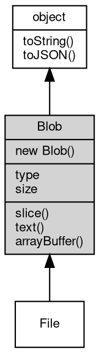

# 对象 Blob
Blob 对象用于表示不可变的原始数据块，兼容 Web 标准 Blob API。

Blob 可用于存储二进制数据、文本、图片等，常用于文件上传、数据处理等场景。Blob 支持多种数据类型的拼接、切片和读取，广泛应用于 Web、HTTP、文件系统等模块。

主要特性：
1. 支持通过数组和选项对象灵活构造，数据类型可为字符串、ArrayBuffer、TypedArray、Blob 等。
2. 支持 type、size 等只读属性，便于获取数据类型和大小。
3. 支持 slice 方法高效切片，支持类型转换。
4. 支持异步读取为文本或二进制。

常见用法示例：

```JavaScript
// Create empty Blob
const blob = new Blob();

// Create Blob containing string and binary
const blob = new Blob(["hello", new Uint8Array([1, 2, 3])], {
    type: "text/plain"
});

// Slice
const part = blob.slice(0, 5);

// Read text content
blob.text().then(txt => console.log(txt));

// Read binary content
blob.arrayBuffer().then(buf => ...);
```

## 继承关系


## 构造函数
        
### Blob
**Blob 对象构造函数**

```JavaScript
new Blob(Array blobParts = [],
    Object options = {});
```

调用参数:
* blobParts: Array, 初始化数据数组，可以包含字符串、ArrayBuffer、TypedArray、Blob 等
* options: Object, 选项对象，包含 type（MIME 类型）和 endings（换行符处理方式）属性

创建一个新的 Blob 实例，可指定数据内容和类型。

--------------------------
**Blob 对象构造函数**

```JavaScript
new Blob(Buffer blobData,
    Object options = {});
```

调用参数:
* blobData: [Buffer](Buffer.md), 初始化的二进制数据，可以是 [Buffer](Buffer.md) 或其他二进制数据类型
* options: Object, 选项对象，包含 type（MIME 类型）和 endings（换行符处理方式）属性

创建一个新的 Blob 实例，可指定数据内容和类型。

## 成员属性
        
### type
**String, Blob 对象类型，返回 Blob 的 MIME 类型（如 "text/plain"、"image/png" 等），只读属性。**

```JavaScript
readonly String Blob.type;
```

--------------------------
### size
**Integer, Blob 对象的大小，返回 Blob 数据的字节数，只读属性。**

```JavaScript
readonly Integer Blob.size;
```

## 成员函数
        
### slice
**返回指定范围的 Blob 切片**

```JavaScript
Blob Blob.slice(Integer start = 0,
    Integer end = -1,
    String contentType = "");
```

调用参数:
* start: Integer, 起始位置（字节，默认为 0）
* end: Integer, 结束位置（字节，默认为 -1，表示到末尾）
* contentType: String, 新 Blob 的 MIME 类型（可选）

返回结果:
* Blob, 返回新的 Blob 对象

创建一个新的 Blob，包含原始数据的指定区间内容。

--------------------------
### text
**以文本形式读取 Blob 内容**

```JavaScript
String Blob.text() promise;
```

返回结果:
* String, 返回包含文本内容的 Promise

异步读取 Blob 数据为字符串，返回 Promise。

--------------------------
### arrayBuffer
**以 ArrayBuffer 形式读取 Blob 内容**

```JavaScript
ArrayBuffer Blob.arrayBuffer() promise;
```

返回结果:
* ArrayBuffer, 返回包含二进制数据的 Promise

异步读取 Blob 数据为 ArrayBuffer，返回 Promise。

--------------------------
### toString
**返回对象的字符串表示，一般返回 "[Native Object]"，对象可以根据自己的特性重新实现**

```JavaScript
String Blob.toString();
```

返回结果:
* String, 返回对象的字符串表示

--------------------------
### toJSON
**返回对象的 JSON 格式表示，一般返回对象定义的可读属性集合**

```JavaScript
Value Blob.toJSON(String key = "");
```

调用参数:
* key: String, 未使用

返回结果:
* Value, 返回包含可 JSON 序列化的值

