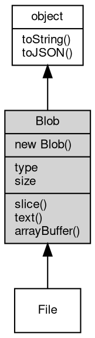

# Object Blob
An immutable container of raw bytes, the Web Blob API of fibjs

Blob holds a fixed byte sequence plus a MIME type. The bytes are concatenated and copied at
construction time, so a Blob never changes afterwards and can be passed around, sliced and
re-read at will. It is the binary value type of the Web surface of fibjs: the body helpers of
[Message](Message.md) return one, [FormData](FormData.md) stores file entries as [File](File.md) (a Blob subclass) and
[FormData](FormData.md)#encode produces one.

[File](File.md) in fibjs is a Blob with a name and a modification time: [File](File.md) extends Blob, every [File](File.md) is
accepted wherever a Blob is expected, and slice() of a [File](File.md) returns a plain Blob. Use Blob for
anonymous binary data and [File](File.md) when a file name matters (uploads, downloads, [FormData](FormData.md)).

Concepts:

- **Blob parts**: the constructor takes an array of parts - strings (utf8), Buffers,
  TypedArrays, ArrayBuffers and other Blobs; a value of any other type falls back to its DOM
  string form, so null becomes "null". The parts are concatenated in order.
- **MIME type**: the `type` option is lowercased and exposed by the read-only type property.
  fibjs keeps the value as given; the Web standard resets a type containing characters
  outside U+0020-U+007E to an empty string (plans/compat-differences.md).
- **Reading**: text() decodes the bytes as utf8 and arrayBuffer() copies them into an
  ArrayBuffer, both as promises; the fibjs calling forms textSync()/textAsync() and
  arrayBufferSync()/arrayBufferAsync() are generated from the promise declarations.
- **Slicing**: slice() copies a byte range into a new Blob and never returns a [File](File.md). Indices
  follow the [Buffer](Buffer.md) conventions: a negative value counts from the end, an index past the end
  clamps, and a start beyond end yields an empty Blob.
- **Not in the standard**: Blob.stream() and Blob.bytes() are not implemented; use
  arrayBuffer() and read the bytes from it.

Obtained from:
- `new Blob(blobParts[, options])` — the parts form;
- `new Blob(blobData[, options])` — one [Buffer](Buffer.md) or string (utf8);
- `Blob#slice` — the sliced copy;
- `[Message](Message.md)#blob` (`[http.Request](../../module/ifs/http.md#Request)#blob`, `[http.Response](../../module/ifs/http.md#Response)#blob`, `[mq.Message](../../module/ifs/mq.md#Message)#blob`) — the body;
- `[FormData](FormData.md)#encode` — the encoded body;
- `File` — a Blob with metadata, since File extends Blob.

Example 1 — build a Blob from mixed parts and read it:

```JavaScript
const blob = new Blob(['hello ', new Uint8Array([119, 111, 114, 108, 100])], {
    type: 'TEXT/Plain'
});

console.log(blob.type, blob.size); // text/plain 11
(async () => {
    console.log(await blob.text()); // hello world
})();
```

Example 2 — slice a byte range and keep or replace the type:

```JavaScript
const source = new Blob(['hello world'], {
    type: 'text/plain'
});
const part = source.slice(6); // to the end
const tail = source.slice(-5, 10); // negative start counts from the end
const typed = source.slice(0, 5, 'text/css');

console.log(part.size, tail.size, typed.size); // 5 4 5
console.log(typed.type); // text/css
console.log(tail.textSync()); // worl
```

Example 3 — a binary round trip through arrayBuffer:

```JavaScript
const source = new Blob([new Uint8Array([1, 2, 3])], {
    type: 'application/octet-stream'
});

(async () => {
    const buffer = await source.arrayBuffer();
    const copy = new Blob([buffer]);
    console.log(buffer.byteLength, copy.size); // 3 3
    console.log(new Uint8Array(buffer).join(',')); // 1,2,3
})();
```

## Inheritance

```dot
digraph {
    node [fontname="Helvetica,sans-Serif", fontsize=10, shape="record", style="filled", fillcolor="white"];

    object [tooltip="object", URL="object.md", label="{object|toString()\ltoJSON()\l}"];
    Blob [tooltip="Blob", fillcolor="lightgray", id="me", label="{Blob|new Blob()\l|type\lsize\l|slice()\ltext()\larrayBuffer()\l}"];
    File [tooltip="File", URL="File.md", label="{File}"];

    object -> Blob [dir=back];
    Blob -> File [dir=back];
}
```

## Constructors
        
### Blob
**Creates a Blob from an array of parts**

```JavaScript
new Blob(Array blobParts = [],
    Object options = {});
```

Parameters:
* blobParts: Array, the initial parts: strings, Buffers, TypedArrays, ArrayBuffers or Blobs
* options: Object, optional parameter [object](object.md)

The parts are concatenated in order into one buffer: strings contribute their utf8 bytes,
[Buffer](Buffer.md), TypedArray and ArrayBuffer parts contribute their bytes, and a Blob part
contributes its bytes. Any other value falls back to its DOM string form, so null becomes
"null" and a plain [object](object.md) becomes "[[object](object.md) Object]". The array itself is required: a
missing, null or undefined argument is accepted as an empty Blob, but a non-array value
such as a number or a Set throws TypeError 20005 (the Web BlobPart sequence accepts any
iterable, fibjs requires an array).

options supports the following properties:

```JavaScript
// fragment: options
({
    "type": "", // the MIME type, lowercased; default an empty string
    "endings": "transparent" // accepted and ignored: line endings are never converted
})
```

Example — the DOM string fallback of a non-binary part:

```JavaScript
const blob = new Blob(['a', null, new Uint8Array([98])]);

console.log(blob.size); // 6 ('a' + 'null' + 'b')
console.log(blob.textSync()); // anullb
```

--------------------------
**Creates a Blob from one [Buffer](Buffer.md) or string**

```JavaScript
new Blob(Buffer | String blobData,
    Object options = {});
```

Parameters:
* blobData: [Buffer](Buffer.md) | String, the initial binary data
* options: Object, optional parameter [object](object.md)

blobData is the whole content: a [Buffer](Buffer.md) is used as it is and a string is encoded as utf8.
The options [object](object.md) is the same as in the parts form, so only `type` has an effect. Use
this form when the bytes are already available, for example from [fs.readFile](../../module/ifs/fs.md#readFile) or a [Buffer](Buffer.md)
built by hand.

Example — wrap a [Buffer](Buffer.md) in a typed Blob:

```JavaScript
const blob = new Blob(Buffer.from('abc'), {
    type: 'X/Plain'
});

console.log(blob.size, blob.type); // 3 x/plain
console.log(blob.textSync()); // abc
```

## Properties
        
### type
**String, The MIME type of the Blob, read-only**

```JavaScript
readonly String Blob.type;
```

The lowercased `type` option given to the constructor, or an empty string when the option
is missing or not a string. fibjs keeps the value as given (apart from the lower case
form); the Web standard resets a type containing characters outside U+0020-U+007E to an
empty string.

--------------------------
### size
**Integer, The byte length of the Blob, read-only**

```JavaScript
readonly Integer Blob.size;
```

The total size of the concatenated parts; 0 for an empty Blob. It is a plain number and
is recomputed from the stored buffer, so it is constant for the lifetime of the Blob.

## Methods
        
### slice
**Returns a new Blob with a copy of a byte range**

```JavaScript
Blob Blob.slice(Integer start = 0,
    Integer end = -1,
    String contentType = "");
```

Parameters:
* start: Integer, the start byte index, default 0; a negative value counts from the end
* end: Integer, the end byte index (exclusive), default -1 meaning the end of the Blob
* contentType: String, the MIME type of the new Blob, default keeps the type of the source

Returns:
* Blob, the new Blob with the copied range

The bytes of the range are copied; the source Blob is untouched. start and end are byte
indices that follow the [Buffer](Buffer.md) conventions: a negative value counts from the end, an
index past the end clamps to the size, and start beyond end yields an empty Blob. One
fibjs detail: the default end value -1 always means the end of the Blob, so slice(x, -1)
behaves like slice(x) even when -1 is passed explicitly, while any other negative value
counts from the end (the Web standard counts -1 from the end as well). The optional
contentType replaces the type of the result; when it is omitted (or empty) the type of
the source Blob is kept. slice() always returns a plain Blob, even when the source is a
[File](File.md), so [File](File.md)#slice drops name and lastModified.

Example — extract a range and retype it:

```JavaScript
const source = new Blob(['abcdef'], {
    type: 'text/plain'
});
const part = source.slice(2, 5, 'text/css');

console.log(part.size, part.type); // 3 text/css
console.log(part.textSync()); // cde
console.log(source.size); // 6
```

--------------------------
### text
**Reads the whole Blob as text**

```JavaScript
String Blob.text() promise;
```

Returns:
* String, a Promise that resolves to the text content

The bytes are decoded as utf8 and returned as a string; decoding never throws and an
invalid byte sequence becomes the replacement character U+FFFD. The declared calling
form returns a Promise<String>; the generated textSync()/textAsync() aliases are
available too. The stored bytes are read without consuming them, so the method can be
called any number of times.

Example — read a Blob synchronously and asynchronously:

```JavaScript
const blob = new Blob(['héllo'], {
    type: 'text/plain'
});

console.log(blob.textSync()); // héllo
(async () => {
    console.log(await blob.text()); // héllo
})();
```

--------------------------
### arrayBuffer
**Reads the whole Blob as an ArrayBuffer**

```JavaScript
ArrayBuffer Blob.arrayBuffer() promise;
```

Returns:
* ArrayBuffer, a Promise that resolves to an ArrayBuffer with the Blob bytes

The bytes are copied into a new ArrayBuffer, so the result does not share memory with the
Blob and stays valid after the Blob is collected. An empty Blob yields a zero-length
ArrayBuffer. The declared calling form returns a Promise<ArrayBuffer>; the generated
arrayBufferSync()/arrayBufferAsync() aliases are available too. The MDN members
Blob.bytes() (a Uint8Array view) and Blob.stream() do not exist in fibjs.

--------------------------
### toString
**Returns the string form of the [object](object.md)**

```JavaScript
String Blob.toString();
```

Returns:
* String, returns the string form of the [object](object.md)

The base implementation reports an error: a native [object](object.md) has no implicit
text form, and only the classes whose value can be written as a string
override the member. [Buffer](Buffer.md) returns its content decoded with the given
[encoding](../../module/ifs/encoding.md), [HttpCookie](HttpCookie.md) returns "name=value", and so on; an override commonly
accepts optional arguments ([Buffer.toString](Buffer.md#toString) takes [encoding](../../module/ifs/encoding.md), start and
end) that are not part of this declaration.

Calling the member on a class that does not override it throws
"<Class>: the [object](object.md) can not be converted to string.", which is the
behavior to rely on when probing whether a value has a string form. See
toJSON for the serialization hook.

--------------------------
### toJSON
**Returns the JSON representation of the [object](object.md)**

```JavaScript
Value Blob.toJSON(String key = "");
```

Parameters:
* key: String, the property name of the value being serialized

Returns:
* Value, returns the JSON-serializable value

JSON.stringify(value) calls value.toJSON(key) when the member exists and
serializes the returned value in its place; the key argument carries the
property name of the value inside its parent [object](object.md) (an empty string at
the top level) and may be used to build a keyed form. The base
implementation returns a plain [object](object.md) holding the readable properties of
the instance, so a native [object](object.md) serializes without per-class code; a
class with a portable shape such as [Buffer](Buffer.md) overrides it, and a JavaScript
class may override it in the same way.

The member is normally reached through JSON.stringify rather than called
directly; calling it returns the same value JSON.stringify would
serialize.

