# 对象 Buffer
二进制数据缓存对象，用于 [io](../../module/ifs/io.md) 读写的数据处理

Buffer 对象为全局基础类，在任何时候都可以直接以 new Buffer(...) 创建：

```JavaScript
var buf = new Buffer();
```

## 继承关系

```dot
digraph {
    node [fontname="Helvetica,sans-Serif", fontsize=10, shape="record", style="filled", fillcolor="white"];

    object [tooltip="object", URL="object.md", label="{object|toString()\ltoJSON()\l}"];
    Buffer [tooltip="Buffer", fillcolor="lightgray", id="me", label="{Buffer|new Buffer()\l|Buffer\l|alloc()\lallocUnsafe()\lallocUnsafeSlow()\lfrom()\lconcat()\lisBuffer()\lisEncoding()\lbyteLength()\lcompare()\l|length\l|write()\lfill()\lcopy()\lset()\lreadUInt8()\lreadUInt16LE()\lreadUInt16BE()\lreadUInt32LE()\lreadUInt32BE()\lreadUIntLE()\lreadUIntBE()\lreadInt64LE()\lreadInt64BE()\lreadInt8()\lreadInt16LE()\lreadInt16BE()\lreadInt32LE()\lreadInt32BE()\lreadIntLE()\lreadIntBE()\lreadFloatLE()\lreadFloatBE()\lreadDoubleLE()\lreadDoubleBE()\lwriteUInt8()\lwriteUInt16LE()\lwriteUInt16BE()\lwriteUInt32LE()\lwriteUInt32BE()\lwriteUIntLE()\lwriteUIntBE()\lwriteInt8()\lwriteInt16LE()\lwriteInt16BE()\lwriteInt32LE()\lwriteInt32BE()\lwriteInt64LE()\lwriteInt64BE()\lwriteIntLE()\lwriteIntBE()\lwriteFloatLE()\lwriteFloatBE()\lwriteDoubleLE()\lwriteDoubleBE()\lindexOf()\llastIndexOf()\lslice()\lequals()\lcompare()\ltoString()\ltoArray()\lhex()\lbase32()\lbase58()\lbase64()\l}"];

    object -> Buffer [dir=back];
}
```


## 构造函数
        
### Buffer
**缓存对象构造函数**

```JavaScript
new Buffer(Array datas);
```

调用参数:
* datas: Array, 初始化数据数组

--------------------------
**缓存对象构造函数**

```JavaScript
new Buffer(ArrayBuffer datas,
    Integer byteOffset = 0,
    Integer length = -1);
```

调用参数:
* datas: ArrayBuffer, 初始化数据数组
* byteOffset: Integer, 指定数据起始位置，起始为 0
* length: Integer, 指定数据长度，起始位 -1，表示剩余所有数据

--------------------------
**缓存对象构造函数**

```JavaScript
new Buffer(Uint8Array datas,
    Integer byteOffset = 0,
    Integer length = -1);
```

调用参数:
* datas: Uint8Array, 初始化数据数组
* byteOffset: Integer, 指定数据起始位置，起始为 0
* length: Integer, 指定数据长度，起始位 -1，表示剩余所有数据

--------------------------
**缓存对象构造函数**

```JavaScript
new Buffer(String str,
    String codec = "utf8");
```

调用参数:
* str: String, 初始化字符串，字符串将以 utf-8 格式写入，缺省则创建一个空对象
* codec: String, 指定编码格式，允许值为："[hex](../../module/ifs/hex.md)", "[base32](../../module/ifs/base32.md)", "[base58](../../module/ifs/base58.md)", "[base64](../../module/ifs/base64.md)", "utf8", 或者 [iconv](../../module/ifs/iconv.md) 模块支持的字符集

--------------------------
**缓存对象构造函数**

```JavaScript
new Buffer(Integer size = 0);
```

调用参数:
* size: Integer, 初始化缓冲区大小

## 对象
        
**二进制数据缓存对象，用于 [io](../../module/ifs/io.md) 读写的数据处理**

```JavaScript
Buffer new Buffer;
```

## 静态函数
        
### alloc
**分配一个指定长度的新缓存区。如果大小为0，将创建一个零长度的缓存区。**

```JavaScript
static Buffer Buffer.alloc(Integer size,
    Integer fill = 0);
```

调用参数:
* size: Integer, 缓冲区的所需长度
* fill: Integer, 预先填充新缓冲区的值，可使用 string/buffer/integer 值类型。 默认值：0

返回结果:
* Buffer, 填充好的新 Buffer 对象

--------------------------
**分配一个指定长度的新缓存区。如果大小为0，将创建一个零长度的缓存区。**

```JavaScript
static Buffer Buffer.alloc(Integer size,
    String fill = "",
    String codec = "utf8");
```

调用参数:
* size: Integer, 缓冲区的所需长度
* fill: String, 预先填充新缓冲区的值，可使用 string/buffer/integer 值类型。 默认值：0
* codec: String, 指定编码格式，允许值为："[hex](../../module/ifs/hex.md)", "[base32](../../module/ifs/base32.md)", "[base58](../../module/ifs/base58.md)", "[base64](../../module/ifs/base64.md)", "utf8", 或者 [iconv](../../module/ifs/iconv.md) 模块支持的字符集

返回结果:
* Buffer, 填充好的新 Buffer 对象

--------------------------
**分配一个指定长度的新缓存区。如果大小为0，将创建一个零长度的缓存区。**

```JavaScript
static Buffer Buffer.alloc(Integer size,
    Buffer fill);
```

调用参数:
* size: Integer, 缓冲区的所需长度
* fill: Buffer, 预先填充新缓冲区的值，可使用 string/buffer/integer 值类型。 默认值：0

返回结果:
* Buffer, 填充好的新 Buffer 对象

--------------------------
### allocUnsafe
**分配一个指定长度的新缓存区。如果大小为0，将创建一个零长度的缓存区。**

```JavaScript
static Buffer Buffer.allocUnsafe(Integer size);
```

调用参数:
* size: Integer, 缓冲区的所需长度

返回结果:
* Buffer, 指定尺寸的新 Buffer 对象

--------------------------
### allocUnsafeSlow
**分配一个指定长度的新缓存区。如果大小为0，将创建一个零长度的缓存区。**

```JavaScript
static Buffer Buffer.allocUnsafeSlow(Integer size);
```

调用参数:
* size: Integer, 缓冲区的所需长度

返回结果:
* Buffer, 指定尺寸的新 Buffer 对象

--------------------------
### from
**通过给定的数组创建 Buffer 对象**

```JavaScript
static Buffer Buffer.from(Array datas);
```

调用参数:
* datas: Array, 初始化数据数组

返回结果:
* Buffer, 返回 Buffer 实例

--------------------------
**通过其他 Buffer 创建 Buffer 对象**

```JavaScript
static Buffer Buffer.from(Buffer buffer,
    Integer byteOffset = 0,
    Integer length = -1);
```

调用参数:
* buffer: Buffer, 给定 Buffer 类型变量用于创建 Buffer 对象
* byteOffset: Integer, 指定数据起始位置，起始为 0
* length: Integer, 指定数据长度，起始位 -1，表示剩余所有数据

返回结果:
* Buffer, 返回 Buffer 实例

--------------------------
**通过其他 Buffer 创建 Buffer 对象**

```JavaScript
static Buffer Buffer.from(ArrayBuffer datas,
    Integer byteOffset = 0,
    Integer length = -1);
```

调用参数:
* datas: ArrayBuffer, 初始化数据数组
* byteOffset: Integer, 指定数据起始位置，起始为 0
* length: Integer, 指定数据长度，起始位 -1，表示剩余所有数据

返回结果:
* Buffer, 返回 Buffer 实例

--------------------------
**通过其他 Buffer 创建 Buffer 对象**

```JavaScript
static Buffer Buffer.from(Uint8Array datas,
    Integer byteOffset = 0,
    Integer length = -1);
```

调用参数:
* datas: Uint8Array, 初始化数据数组
* byteOffset: Integer, 指定数据起始位置，起始为 0
* length: Integer, 指定数据长度，起始位 -1，表示剩余所有数据

返回结果:
* Buffer, 返回 Buffer 实例

--------------------------
**通过字符串创建 Buffer 对象**

```JavaScript
static Buffer Buffer.from(String str,
    String codec = "utf8");
```

调用参数:
* str: String, 初始化字符串，字符串将以 utf-8 格式写入，缺省则创建一个空对象
* codec: String, 指定编码格式，允许值为："[hex](../../module/ifs/hex.md)", "[base32](../../module/ifs/base32.md)", "[base58](../../module/ifs/base58.md)", "[base64](../../module/ifs/base64.md)", "utf8", 或者 [iconv](../../module/ifs/iconv.md) 模块支持的字符集

返回结果:
* Buffer, 返回 Buffer 实例

--------------------------
### concat
**拼接多个缓存区中的数据**

```JavaScript
static Buffer Buffer.concat(Array buflist,
    Integer cutLength = -1);
```

调用参数:
* buflist: Array, 待拼接的Buffer数组
* cutLength: Integer, 截取多少个Buffer对象

返回结果:
* Buffer, 拼接后产生的新 Buffer 对象

--------------------------
### isBuffer
**检测给定的变量是否是 Buffer 对象**

```JavaScript
static Boolean Buffer.isBuffer(Value v);
```

调用参数:
* v: Value, 给定需要检测的变量

返回结果:
* Boolean, 传入对象是否 Buffer 对象

--------------------------
### isEncoding
**检测编码格式是否被支持**

```JavaScript
static Boolean Buffer.isEncoding(String codec);
```

调用参数:
* codec: String, 待检测的编码格式

返回结果:
* Boolean, 是否支持

--------------------------
### byteLength
**返回字符串的实际字节长度**

```JavaScript
static Integer Buffer.byteLength(String str,
    String codec = "utf8");
```

调用参数:
* str: String, 待取字节的字符串，如果str为 ArrayBuffer/TypedArray/DataView/Buffer 对象，则返回它们的实际长度
* codec: String, 指定编码格式，允许值为："[hex](../../module/ifs/hex.md)", "[base32](../../module/ifs/base32.md)", "[base58](../../module/ifs/base58.md)", "[base64](../../module/ifs/base64.md)", "utf8", 或者 [iconv](../../module/ifs/iconv.md) 模块支持的字符集

返回结果:
* Integer, 返回实际字节长度

--------------------------
**返回字符串的实际字节长度**

```JavaScript
static Integer Buffer.byteLength(ArrayBuffer str);
```

调用参数:
* str: ArrayBuffer, 待取字节的字符串，如果str为 ArrayBuffer/TypedArray/DataView/Buffer 对象，则返回它们的实际长度

返回结果:
* Integer, 返回实际字节长度

--------------------------
**返回字符串的实际字节长度**

```JavaScript
static Integer Buffer.byteLength(Uint8Array str);
```

调用参数:
* str: Uint8Array, 待取字节的字符串，如果 str 为 ArrayBuffer/TypedArray/DataView/Buffer 对象，则返回它们的实际长度

返回结果:
* Integer, 返回实际字节长度

--------------------------
**返回字符串的实际字节长度**

```JavaScript
static Integer Buffer.byteLength(Buffer str);
```

调用参数:
* str: Buffer, 待取字节的字符串，如果str为 ArrayBuffer/TypedArray/DataView/Buffer 对象，则返回它们的实际长度

返回结果:
* Integer, 返回实际字节长度

--------------------------
### compare
**比较 buf1 和 buf2, 往往用于 Buffer 实例之间的排序. 该方式等价于 buf1.compare(buf2).**

```JavaScript
static Integer Buffer.compare(Buffer buf1,
    Buffer buf2);
```

调用参数:
* buf1: Buffer, 待比较的 buf
* buf2: Buffer, 待比较的 buf

返回结果:
* Integer, 返回比较字节长度

## 成员属性
        
### length
**Integer, 获取缓存对象的尺寸**

```JavaScript
readonly Integer Buffer.length;
```

## 成员函数
        
### write
**向缓存对象写入指定字符串，字符串默认为utf-8，越界时只写入部分数据**

```JavaScript
Integer Buffer.write(String str,
    Integer offset = 0,
    Integer length = -1,
    String codec = "utf8");
```

调用参数:
* str: String, 待写入的字符串
* offset: Integer, 写入起始位置
* length: Integer, 写入长度（单位字节，默认值-1），未指定时为待写入字符串的长度
* codec: String, 指定编码格式，允许值为："[hex](../../module/ifs/hex.md)", "[base32](../../module/ifs/base32.md)", "[base58](../../module/ifs/base58.md)", "[base64](../../module/ifs/base64.md)", "utf8", 或者 [iconv](../../module/ifs/iconv.md) 模块支持的字符集

返回结果:
* Integer, 写入的数据字节长度

--------------------------
**向缓存对象写入指定字符串，字符串默认为utf-8，越界时只写入部分数据**

```JavaScript
Integer Buffer.write(String str,
    Integer offset = 0,
    String codec = "utf8");
```

调用参数:
* str: String, 待写入的字符串
* offset: Integer, 写入起始位置
* codec: String, 指定编码格式，允许值为："[hex](../../module/ifs/hex.md)", "[base32](../../module/ifs/base32.md)", "[base58](../../module/ifs/base58.md)", "[base64](../../module/ifs/base64.md)", "utf8", 或者 [iconv](../../module/ifs/iconv.md) 模块支持的字符集

返回结果:
* Integer, 写入的数据字节长度

--------------------------
**向缓存对象写入指定字符串，字符串默认为utf-8，越界时只写入部分数据**

```JavaScript
Integer Buffer.write(String str,
    String codec = "utf8");
```

调用参数:
* str: String, 待写入的字符串
* codec: String, 指定编码格式，允许值为："[hex](../../module/ifs/hex.md)", "[base32](../../module/ifs/base32.md)", "[base58](../../module/ifs/base58.md)", "[base64](../../module/ifs/base64.md)", "utf8", 或者 [iconv](../../module/ifs/iconv.md) 模块支持的字符集

返回结果:
* Integer, 写入的数据字节长度

--------------------------
### fill
**为 Buffer 对象填充指定内容数据**

```JavaScript
Buffer Buffer.fill(Integer v,
    Integer offset = 0,
    Integer end = -1);
```

调用参数:
* v: Integer, 需要填充的数据，如果未指定 offset 和 end，将填充满整个 buffer
* offset: Integer, 填充起始位置
* end: Integer, 填充终止位置

返回结果:
* Buffer, 返回当前 Buffer 对象

--------------------------
**为 Buffer 对象填充指定内容数据**

```JavaScript
Buffer Buffer.fill(Buffer v,
    Integer offset = 0,
    Integer end = -1);
```

调用参数:
* v: Buffer, 需要填充的数据，如果未指定 offset 和 end，将填充满整个 buffer
* offset: Integer, 填充起始位置
* end: Integer, 填充终止位置

返回结果:
* Buffer, 返回当前 Buffer 对象

--------------------------
**为 Buffer 对象填充指定内容数据**

```JavaScript
Buffer Buffer.fill(String v,
    Integer offset = 0,
    Integer end = -1,
    String codec = "utf8");
```

调用参数:
* v: String, 需要填充的数据，如果未指定 offset 和 end，将填充满整个 buffer
* offset: Integer, 填充起始位置
* end: Integer, 填充终止位置
* codec: String, 指定编码格式，允许值为："[hex](../../module/ifs/hex.md)", "[base32](../../module/ifs/base32.md)", "[base58](../../module/ifs/base58.md)", "[base64](../../module/ifs/base64.md)", "utf8", 或者 [iconv](../../module/ifs/iconv.md) 模块支持的字符集

返回结果:
* Buffer, 返回当前 Buffer 对象

--------------------------
**为 Buffer 对象填充指定内容数据**

```JavaScript
Buffer Buffer.fill(String v,
    Integer offset,
    String codec);
```

调用参数:
* v: String, 需要填充的数据，如果未指定 offset 和 end，将填充满整个 buffer
* offset: Integer, 填充起始位置
* codec: String, 指定编码格式，允许值为："[hex](../../module/ifs/hex.md)", "[base32](../../module/ifs/base32.md)", "[base58](../../module/ifs/base58.md)", "[base64](../../module/ifs/base64.md)", "utf8", 或者 [iconv](../../module/ifs/iconv.md) 模块支持的字符集

返回结果:
* Buffer, 返回当前 Buffer 对象

--------------------------
**为 Buffer 对象填充指定内容数据**

```JavaScript
Buffer Buffer.fill(String v,
    String codec);
```

调用参数:
* v: String, 需要填充的数据，如果未指定 offset 和 end，将填充满整个 buffer
* codec: String, 指定编码格式，允许值为："[hex](../../module/ifs/hex.md)", "[base32](../../module/ifs/base32.md)", "[base58](../../module/ifs/base58.md)", "[base64](../../module/ifs/base64.md)", "utf8", 或者 [iconv](../../module/ifs/iconv.md) 模块支持的字符集

返回结果:
* Buffer, 返回当前 Buffer 对象

--------------------------
### copy
**从源缓存对象区域拷贝数据到目标缓存对象区域**

```JavaScript
Integer Buffer.copy(Buffer targetBuffer,
    Integer targetStart = 0,
    Integer sourceStart = 0,
    Integer sourceEnd = -1);
```

调用参数:
* targetBuffer: Buffer, 目标缓存对象
* targetStart: Integer, 目标缓存对象开始拷贝字节位置，缺省为 0
* sourceStart: Integer, 源缓存对象开始字节位置, 缺省为 0
* sourceEnd: Integer, 源缓存对象结束字节位置, 缺省为 -1,表示源数据长度

返回结果:
* Integer, 拷贝的数据字节长度

--------------------------
### set
**从源缓存对象区域拷贝数据到目标缓存对象区域**

```JavaScript
Integer Buffer.set(Buffer src,
    Integer start);
```

调用参数:
* src: Buffer, 目标缓存对象
* start: Integer, 源缓存对象开始字节位置

返回结果:
* Integer, 拷贝的数据字节长度

--------------------------
### readUInt8
**从缓存对象读取一个 8 位无符号整型数值**

```JavaScript
Integer Buffer.readUInt8(Integer offset = 0);
```

调用参数:
* offset: Integer, 指定读取的起始位置，缺省为 0

返回结果:
* Integer, 返回读取的整型数值

--------------------------
### readUInt16LE
**从缓存对象读取一个 16 位无符号整型数值，以低字节序的存储方式**

```JavaScript
Integer Buffer.readUInt16LE(Integer offset = 0);
```

调用参数:
* offset: Integer, 指定读取的起始位置，缺省为 0

返回结果:
* Integer, 返回读取的整型数值

--------------------------
### readUInt16BE
**从缓存对象读取一个 16 位无符号整型数值，以高字节序的存储方式**

```JavaScript
Integer Buffer.readUInt16BE(Integer offset = 0);
```

调用参数:
* offset: Integer, 指定读取的起始位置，缺省为 0

返回结果:
* Integer, 返回读取的整型数值

--------------------------
### readUInt32LE
**从缓存对象读取一个 32 位无符号整型数值，以低字节序的存储方式**

```JavaScript
Number Buffer.readUInt32LE(Integer offset = 0);
```

调用参数:
* offset: Integer, 指定读取的起始位置，缺省为 0

返回结果:
* Number, 返回读取的整型数值

--------------------------
### readUInt32BE
**从缓存对象读取一个 32 位无符号整型数值，以高字节序的存储方式**

```JavaScript
Number Buffer.readUInt32BE(Integer offset = 0);
```

调用参数:
* offset: Integer, 指定读取的起始位置，缺省为 0

返回结果:
* Number, 返回读取的整型数值

--------------------------
### readUIntLE
**从缓存对象读取一个无符号整型数值，最大支持 48 位，以低字节序的存储方式**

```JavaScript
Number Buffer.readUIntLE(Integer offset = 0,
    Integer byteLength = 6);
```

调用参数:
* offset: Integer, 指定读取的起始位置，缺省为 0
* byteLength: Integer, 指定读取的字节数，缺省 6 个字节

返回结果:
* Number, 返回读取的整型数值

--------------------------
### readUIntBE
**从缓存对象读取一个无符号整型数值，最大支持 48 位，以高字节序的存储方式**

```JavaScript
Number Buffer.readUIntBE(Integer offset = 0,
    Integer byteLength = 6);
```

调用参数:
* offset: Integer, 指定读取的起始位置，缺省为 0
* byteLength: Integer, 指定读取的字节数，缺省 6 个字节

返回结果:
* Number, 返回读取的整型数值

--------------------------
### readInt64LE
**从缓存对象读取一个 64 位整型数值，以低字节序的存储方式**

```JavaScript
Long Buffer.readInt64LE(Integer offset = 0);
```

调用参数:
* offset: Integer, 指定读取的起始位置，缺省为 0

返回结果:
* Long, 返回读取的整型数值

--------------------------
### readInt64BE
**从缓存对象读取一个 64 位整型数值，以高字节序的存储方式**

```JavaScript
Long Buffer.readInt64BE(Integer offset = 0);
```

调用参数:
* offset: Integer, 指定读取的起始位置，缺省为 0

返回结果:
* Long, 返回读取的整型数值

--------------------------
### readInt8
**从缓存对象读取一个 8 位整型数值**

```JavaScript
Integer Buffer.readInt8(Integer offset = 0);
```

调用参数:
* offset: Integer, 指定读取的起始位置，缺省为 0

返回结果:
* Integer, 返回读取的整型数值

--------------------------
### readInt16LE
**从缓存对象读取一个 16 位整型数值，以低字节序的存储方式**

```JavaScript
Integer Buffer.readInt16LE(Integer offset = 0);
```

调用参数:
* offset: Integer, 指定读取的起始位置，缺省为 0

返回结果:
* Integer, 返回读取的整型数值

--------------------------
### readInt16BE
**从缓存对象读取一个 16 位整型数值，以高字节序的存储方式**

```JavaScript
Integer Buffer.readInt16BE(Integer offset = 0);
```

调用参数:
* offset: Integer, 指定读取的起始位置，缺省为 0

返回结果:
* Integer, 返回读取的整型数值

--------------------------
### readInt32LE
**从缓存对象读取一个 32 位整型数值，以低字节序的存储方式**

```JavaScript
Integer Buffer.readInt32LE(Integer offset = 0);
```

调用参数:
* offset: Integer, 指定读取的起始位置，缺省为 0

返回结果:
* Integer, 返回读取的整型数值

--------------------------
### readInt32BE
**从缓存对象读取一个 32 位整型数值，以高字节序的存储方式**

```JavaScript
Integer Buffer.readInt32BE(Integer offset = 0);
```

调用参数:
* offset: Integer, 指定读取的起始位置，缺省为 0

返回结果:
* Integer, 返回读取的整型数值

--------------------------
### readIntLE
**从缓存对象读取一个整型数值，最大支持 48 位，以低字节序的存储方式**

```JavaScript
Number Buffer.readIntLE(Integer offset = 0,
    Integer byteLength = 6);
```

调用参数:
* offset: Integer, 指定读取的起始位置，缺省为 0
* byteLength: Integer, 指定读取的字节数，缺省 6 个字节

返回结果:
* Number, 返回读取的整型数值

--------------------------
### readIntBE
**从缓存对象读取一个整型数值，最大支持 48 位，以高字节序的存储方式**

```JavaScript
Number Buffer.readIntBE(Integer offset = 0,
    Integer byteLength = 6);
```

调用参数:
* offset: Integer, 指定读取的起始位置，缺省为 0
* byteLength: Integer, 指定读取的字节数，缺省 6 个字节

返回结果:
* Number, 返回读取的整型数值

--------------------------
### readFloatLE
**从缓存对象读取一个浮点数，以低字节序的存储方式**

```JavaScript
Number Buffer.readFloatLE(Integer offset = 0);
```

调用参数:
* offset: Integer, 指定读取的起始位置，缺省为 0

返回结果:
* Number, 返回读取的浮点数

--------------------------
### readFloatBE
**从缓存对象读取一个浮点数，以高字节序的存储方式**

```JavaScript
Number Buffer.readFloatBE(Integer offset = 0);
```

调用参数:
* offset: Integer, 指定读取的起始位置，缺省为 0

返回结果:
* Number, 返回读取的浮点数

--------------------------
### readDoubleLE
**从缓存对象读取一个双精度浮点数，以低字节序的存储方式**

```JavaScript
Number Buffer.readDoubleLE(Integer offset = 0);
```

调用参数:
* offset: Integer, 指定读取的起始位置，缺省为 0

返回结果:
* Number, 返回读取的双精度浮点数

--------------------------
### readDoubleBE
**从缓存对象读取一个双精度浮点数，以高字节序的存储方式**

```JavaScript
Number Buffer.readDoubleBE(Integer offset = 0);
```

调用参数:
* offset: Integer, 指定读取的起始位置，缺省为 0

返回结果:
* Number, 返回读取的双精度浮点数

--------------------------
### writeUInt8
**向缓存对象写入一个 8 位无符号整型数值**

```JavaScript
Integer Buffer.writeUInt8(Integer value,
    Integer offset = 0);
```

调用参数:
* value: Integer, 指定写入的数值
* offset: Integer, 指定写入的起始位置

返回结果:
* Integer, offset 加上写入的字节数

--------------------------
### writeUInt16LE
**向缓存对象写入一个 16 位无符号整型数值，以低字节序的存储方式**

```JavaScript
Integer Buffer.writeUInt16LE(Integer value,
    Integer offset = 0);
```

调用参数:
* value: Integer, 指定写入的数值
* offset: Integer, 指定写入的起始位置

返回结果:
* Integer, offset 加上写入的字节数

--------------------------
### writeUInt16BE
**向缓存对象写入一个 16 位无符号整型数值，以高字节序的存储方式**

```JavaScript
Integer Buffer.writeUInt16BE(Integer value,
    Integer offset = 0);
```

调用参数:
* value: Integer, 指定写入的数值
* offset: Integer, 指定写入的起始位置

返回结果:
* Integer, offset 加上写入的字节数

--------------------------
### writeUInt32LE
**向缓存对象写入一个 32 位无符号整型数值，以低字节序的存储方式**

```JavaScript
Integer Buffer.writeUInt32LE(Long value,
    Integer offset = 0);
```

调用参数:
* value: Long, 指定写入的数值
* offset: Integer, 指定写入的起始位置

返回结果:
* Integer, offset 加上写入的字节数

--------------------------
### writeUInt32BE
**向缓存对象写入一个 32 位无符号整型数值，以高字节序的存储方式**

```JavaScript
Integer Buffer.writeUInt32BE(Long value,
    Integer offset = 0);
```

调用参数:
* value: Long, 指定写入的数值
* offset: Integer, 指定写入的起始位置

返回结果:
* Integer, offset 加上写入的字节数

--------------------------
### writeUIntLE
**向缓存对象写入一个无符号整型数值，最大支持 48 位，以低字节序的存储方式**

```JavaScript
Integer Buffer.writeUIntLE(Long value,
    Integer offset = 0,
    Integer byteLength = 6);
```

调用参数:
* value: Long, 指定写入的数值
* offset: Integer, 指定写入的起始位置
* byteLength: Integer, 指定写入的字节数，缺省 6 个字节

返回结果:
* Integer, offset 加上写入的字节数

--------------------------
### writeUIntBE
**向缓存对象写入一个无符号整型数值，最大支持 48 位，以高字节序的存储方式**

```JavaScript
Integer Buffer.writeUIntBE(Long value,
    Integer offset = 0,
    Integer byteLength = 6);
```

调用参数:
* value: Long, 指定写入的数值
* offset: Integer, 指定写入的起始位置
* byteLength: Integer, 指定写入的字节数，缺省 6 个字节

返回结果:
* Integer, offset 加上写入的字节数

--------------------------
### writeInt8
**向缓存对象写入一个 8 位整型数值**

```JavaScript
Integer Buffer.writeInt8(Integer value,
    Integer offset = 0);
```

调用参数:
* value: Integer, 指定写入的数值
* offset: Integer, 指定写入的起始位置

返回结果:
* Integer, offset 加上写入的字节数

--------------------------
### writeInt16LE
**向缓存对象写入一个 16 位整型数值，以低字节序的存储方式**

```JavaScript
Integer Buffer.writeInt16LE(Integer value,
    Integer offset = 0);
```

调用参数:
* value: Integer, 指定写入的数值
* offset: Integer, 指定写入的起始位置

返回结果:
* Integer, offset 加上写入的字节数

--------------------------
### writeInt16BE
**向缓存对象写入一个 16 位整型数值，以高字节序的存储方式**

```JavaScript
Integer Buffer.writeInt16BE(Integer value,
    Integer offset = 0);
```

调用参数:
* value: Integer, 指定写入的数值
* offset: Integer, 指定写入的起始位置

返回结果:
* Integer, offset 加上写入的字节数

--------------------------
### writeInt32LE
**向缓存对象写入一个 32 位整型数值，以低字节序的存储方式**

```JavaScript
Integer Buffer.writeInt32LE(Integer value,
    Integer offset = 0);
```

调用参数:
* value: Integer, 指定写入的数值
* offset: Integer, 指定写入的起始位置

返回结果:
* Integer, offset 加上写入的字节数

--------------------------
### writeInt32BE
**向缓存对象写入一个 32 位整型数值，以高字节序的存储方式**

```JavaScript
Integer Buffer.writeInt32BE(Integer value,
    Integer offset = 0);
```

调用参数:
* value: Integer, 指定写入的数值
* offset: Integer, 指定写入的起始位置

返回结果:
* Integer, offset 加上写入的字节数

--------------------------
### writeInt64LE
**向缓存对象写入一个 64 位整型数值，以低字节序的存储方式**

```JavaScript
Integer Buffer.writeInt64LE(Long value,
    Integer offset = 0);
```

调用参数:
* value: Long, 指定写入的数值
* offset: Integer, 指定写入的起始位置

返回结果:
* Integer, offset 加上写入的字节数

--------------------------
### writeInt64BE
**向缓存对象写入一个 64 位整型数值，以高字节序的存储方式**

```JavaScript
Integer Buffer.writeInt64BE(Long value,
    Integer offset = 0);
```

调用参数:
* value: Long, 指定写入的数值
* offset: Integer, 指定写入的起始位置

返回结果:
* Integer, offset 加上写入的字节数

--------------------------
### writeIntLE
**向缓存对象写入一个整型数值，最大支持 48 位，以低字节序的存储方式**

```JavaScript
Integer Buffer.writeIntLE(Long value,
    Integer offset = 0,
    Integer byteLength = 6);
```

调用参数:
* value: Long, 指定写入的数值
* offset: Integer, 指定写入的起始位置
* byteLength: Integer, 指定写入的字节数，缺省 6 个字节

返回结果:
* Integer, offset 加上写入的字节数

--------------------------
### writeIntBE
**向缓存对象写入一个整型数值，最大支持 48 位，以高字节序的存储方式**

```JavaScript
Integer Buffer.writeIntBE(Long value,
    Integer offset = 0,
    Integer byteLength = 6);
```

调用参数:
* value: Long, 指定写入的数值
* offset: Integer, 指定写入的起始位置
* byteLength: Integer, 指定写入的字节数，缺省 6 个字节

返回结果:
* Integer, offset 加上写入的字节数

--------------------------
### writeFloatLE
**向缓存对象写入一个浮点数，以低字节序的存储方式**

```JavaScript
Integer Buffer.writeFloatLE(Number value,
    Integer offset);
```

调用参数:
* value: Number, 指定写入的数值
* offset: Integer, 指定写入的起始位置

返回结果:
* Integer, offset 加上写入的字节数

--------------------------
### writeFloatBE
**向缓存对象写入一个浮点数，以高字节序的存储方式**

```JavaScript
Integer Buffer.writeFloatBE(Number value,
    Integer offset);
```

调用参数:
* value: Number, 指定写入的数值
* offset: Integer, 指定写入的起始位置

返回结果:
* Integer, offset 加上写入的字节数

--------------------------
### writeDoubleLE
**向缓存对象写入一个双精度浮点数，以低字节序的存储方式**

```JavaScript
Integer Buffer.writeDoubleLE(Number value,
    Integer offset);
```

调用参数:
* value: Number, 指定写入的数值
* offset: Integer, 指定写入的起始位置

返回结果:
* Integer, offset 加上写入的字节数

--------------------------
### writeDoubleBE
**向缓存对象写入一个双精度浮点数，以高字节序的存储方式**

```JavaScript
Integer Buffer.writeDoubleBE(Number value,
    Integer offset);
```

调用参数:
* value: Number, 指定写入的数值
* offset: Integer, 指定写入的起始位置

返回结果:
* Integer, offset 加上写入的字节数

--------------------------
### indexOf
**返回某个指定数据在 Buffer 中首次出现的位置**

```JavaScript
Integer Buffer.indexOf(Integer v,
    Integer offset = 0);
```

调用参数:
* v: Integer, 待查找数据，如果未指定 offset，默认从起始位开始
* offset: Integer, 起始查找位置

返回结果:
* Integer, 返回查找到的位置，未找到返回 -1

--------------------------
**返回某个指定数据在 Buffer 中首次出现的位置**

```JavaScript
Integer Buffer.indexOf(Buffer v,
    Integer offset = 0);
```

调用参数:
* v: Buffer, 待查找数据，如果未指定 offset，默认从起始位开始
* offset: Integer, 起始查找位置

返回结果:
* Integer, 返回查找到的位置，未找到返回 -1

--------------------------
**返回某个指定数据在 Buffer 中首次出现的位置**

```JavaScript
Integer Buffer.indexOf(String v,
    Integer offset = 0);
```

调用参数:
* v: String, 待查找数据，如果未指定 offset，默认从起始位开始
* offset: Integer, 起始查找位置

返回结果:
* Integer, 返回查找到的位置，未找到返回 -1

--------------------------
### lastIndexOf
**返回某个指定数据在 Buffer 中最后出现的位置**

```JavaScript
Integer Buffer.lastIndexOf(Integer v,
    Integer offset = 0);
```

调用参数:
* v: Integer, 待查找数据，如果未指定 offset，默认从起始位开始
* offset: Integer, 起始查找位置

返回结果:
* Integer, 返回查找到的位置，未找到返回 -1

--------------------------
**返回某个指定数据在 Buffer 中最后出现的位置**

```JavaScript
Integer Buffer.lastIndexOf(Buffer v,
    Integer offset = 0);
```

调用参数:
* v: Buffer, 待查找数据，如果未指定 offset，默认从起始位开始
* offset: Integer, 起始查找位置

返回结果:
* Integer, 返回查找到的位置，未找到返回 -1

--------------------------
**返回某个指定数据在 Buffer 中最后出现的位置**

```JavaScript
Integer Buffer.lastIndexOf(String v,
    Integer offset = 0);
```

调用参数:
* v: String, 待查找数据，如果未指定 offset，默认从起始位开始
* offset: Integer, 起始查找位置

返回结果:
* Integer, 返回查找到的位置，未找到返回 -1

--------------------------
### slice
**返回一个新缓存对象，包含指定起始到缓存结尾的数据**

```JavaScript
Buffer Buffer.slice(Integer start = 0);
```

调用参数:
* start: Integer, 指定范围的起始，缺省从头开始

返回结果:
* Buffer, 返回新的缓存对象

--------------------------
**返回一个新缓存对象，包含指定范围的数据，若范围超出缓存，则只返回有效部分数据**

```JavaScript
Buffer Buffer.slice(Integer start,
    Integer end);
```

调用参数:
* start: Integer, 指定范围的起始
* end: Integer, 指定范围的结束

返回结果:
* Buffer, 返回新的缓存对象

--------------------------
### equals
**比较当前对象与给定的对象是否相等**

```JavaScript
Boolean Buffer.equals(object expected);
```

调用参数:
* expected: [object](object.md), 制定比较的目标对象

返回结果:
* Boolean, 返回对象比较的结果

--------------------------
### compare
**比较缓存区的内容**

```JavaScript
Integer Buffer.compare(Buffer buf);
```

调用参数:
* buf: Buffer, 待比较缓存对象

返回结果:
* Integer, 内容比较结果

--------------------------
### toString
**返回二进制数据的编码字符串**

```JavaScript
String Buffer.toString(String codec,
    Integer offset = 0,
    Integer end);
```

调用参数:
* codec: String, 指定编码格式，允许值为："[hex](../../module/ifs/hex.md)", "[base32](../../module/ifs/base32.md)", "[base58](../../module/ifs/base58.md)", "[base64](../../module/ifs/base64.md)", "utf8", 或者 [iconv](../../module/ifs/iconv.md) 模块支持的字符集
* offset: Integer, 读取起始位置
* end: Integer, 读取终止位置

返回结果:
* String, 返回对象的字符串表示

--------------------------
**返回二进制数据的编码字符串**

```JavaScript
String Buffer.toString(String codec,
    Integer offset = 0);
```

调用参数:
* codec: String, 指定编码格式，允许值为："[hex](../../module/ifs/hex.md)", "[base32](../../module/ifs/base32.md)", "[base58](../../module/ifs/base58.md)", "[base64](../../module/ifs/base64.md)", "utf8", 或者 [iconv](../../module/ifs/iconv.md) 模块支持的字符集
* offset: Integer, 读取起始位置

返回结果:
* String, 返回对象的字符串表示

--------------------------
**返回二进制数据的 utf8 编码字符串**

```JavaScript
String Buffer.toString();
```

返回结果:
* String, 返回对象的字符串表示

--------------------------
### toArray
**返回全部二进制数据的数组**

```JavaScript
Array Buffer.toArray();
```

返回结果:
* Array, 返回包含对象数据的数组

--------------------------
### hex
**使用 16 进制编码缓存对象内容**

```JavaScript
String Buffer.hex();
```

返回结果:
* String, 返回编码字符串

--------------------------
### base32
**使用 [base32](../../module/ifs/base32.md) 编码缓存对象内容**

```JavaScript
String Buffer.base32();
```

返回结果:
* String, 返回编码字符串

--------------------------
### base58
**使用 [base58](../../module/ifs/base58.md) 编码缓存对象内容**

```JavaScript
String Buffer.base58();
```

返回结果:
* String, 返回编码字符串

--------------------------
### base64
**使用 [base64](../../module/ifs/base64.md) 编码缓存对象内容**

```JavaScript
String Buffer.base64();
```

返回结果:
* String, 返回编码字符串

--------------------------
### toString
**返回对象的字符串表示，一般返回 "[Native Object]"，对象可以根据自己的特性重新实现**

```JavaScript
String Buffer.toString();
```

返回结果:
* String, 返回对象的字符串表示

--------------------------
### toJSON
**返回对象的 JSON 格式表示，一般返回对象定义的可读属性集合**

```JavaScript
Value Buffer.toJSON(String key = "");
```

调用参数:
* key: String, 未使用

返回结果:
* Value, 返回包含可 JSON 序列化的值

