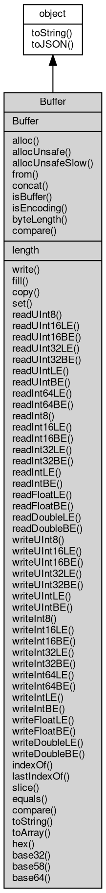

# Object Buffer
Fixed-length binary data buffer used by [io](../../module/ifs/io.md), hashing, compression and network protocols

Buffer is a subclass of Uint8Array: the content (the bytes) is mutable, while the size is
fixed at creation time. It is the binary counterpart of String - use a String for text with a
known [encoding](../../module/ifs/encoding.md) and a Buffer for raw bytes such as file content, socket payloads, digests and
encrypted data. Most fibjs [io](../../module/ifs/io.md) APIs ([fs](../../module/ifs/fs.md), [net](../../module/ifs/net.md), [crypto](../../module/ifs/crypto.md), [zlib](../../module/ifs/zlib.md), [http](../../module/ifs/http.md) bodies) read and write Buffer.

Concepts:
- Allocation and pooling: `Buffer.alloc` returns a zero-filled buffer and never uses the pool;
  `Buffer.allocUnsafe` takes uninitialized memory from an internal pool whose size is
  `Buffer.poolSize` (8 KiB by default), and `Buffer.allocUnsafeSlow` takes uninitialized memory
  outside the pool. Pooled buffers share one ArrayBuffer, so `buf.buffer` can be much larger
  than `buf` and `buf.byteOffset` is usually not 0. Never rely on the content of memory
  returned by `allocUnsafe`: it may expose bytes left by earlier allocations, which is what
  makes it faster.
- View or copy: `slice` (like the inherited `subarray`) returns a view that shares memory with
  the original buffer, so writes are visible through both; `Buffer.from(buffer)` and
  `Buffer.from(typedArray)` copy the data, while `Buffer.from(arrayBuffer)` creates a view over
  the caller's memory. Interop with the typed-array world goes through the standard
  `buf.buffer` / `buf.byteOffset` / `buf.byteLength` accessors, and a Buffer can be passed
  anywhere a Uint8Array is expected.
- Encodings: text and bytes are converted through an [encoding](../../module/ifs/encoding.md) (codec). The Node standard set
  is supported ("utf8"/"utf-8", "utf16le"/"ucs2", "latin1"/"binary", "ascii", "[base64](../../module/ifs/base64.md)",
  "base64url", "[hex](../../module/ifs/hex.md)") plus the fibjs extensions "utf16be" (and the UTF-16 LE/BE aliases),
  "utf32", "[base32](../../module/ifs/base32.md)", "[base58](../../module/ifs/base58.md)" and every charset of the [encoding](../../module/ifs/encoding.md) [module](../../module/ifs/module.md) ("gbk", "big5",
  "shift_jis"...). Conversions are not always reversible: ascii masks the high bit of every
  byte, [hex](../../module/ifs/hex.md) decoding stops at the first invalid character, and [base64](../../module/ifs/base64.md)/[base32](../../module/ifs/base32.md)/[base58](../../module/ifs/base58.md) decoding
  skips invalid characters.
- Endianness: every multi-byte accessor carries an explicit LE (little-endian) or BE
  (big-endian) suffix and does not depend on the host byte order; the variable-width accessors
  (readUIntLE/readIntLE and the BE forms) take a byteLength between 1 and 6.
- Iteration and JSON: a Buffer is indexable (`buf[0]`) and iterable (`for (const b of buf)`),
  and JSON.stringify produces the Node form {"type":"Buffer","data":[...]}.

Obtained from:
- `Buffer.alloc(size[, fill[, codec]])`, `Buffer.allocUnsafe(size)`,
  `Buffer.allocUnsafeSlow(size)`, `Buffer.from(source[, ...])` and `Buffer.concat(list[, length])`;
- the legacy constructor `new Buffer(source)`, which accepts the same sources as `Buffer.from`
  plus a number size (equivalent to `allocUnsafe`); Node discourages this form;
- [io](../../module/ifs/io.md) APIs that return Buffer objects: `fs.readFile`, `crypto.randomBytes`, `zlib.gzip`,
  `socket.read` and many more;
- the `buffer` [module](../../module/ifs/module.md): `require('buffer')` returns the Node-style [module](../../module/ifs/module.md) [object](object.md) (Buffer,
  SlowBuffer, [constants](../../module/ifs/constants.md), kMaxLength, transcode, atob, btoa, isUtf8, isAscii, [Blob](Blob.md)), while the
  [global](../../module/ifs/global.md) `Buffer` remains the class itself.

Example 1 — create buffers and convert text between encodings:

```JavaScript
const text = Buffer.from('fibjs', 'utf8');
const hex = Buffer.from('6669626a73', 'hex');
console.log(text.equals(hex)); // true
console.log(text.length, text.toString('hex')); // 5 6669626a73
console.log(text.toString('base64')); // ZmlianM=
console.log(Buffer.byteLength('fibjs'), Buffer.byteLength('中')); // 5 3
```

Example 2 — build and parse a binary record with explicit endianness:

```JavaScript
const record = Buffer.alloc(16);
record.writeUInt32BE(0x01020304, 0);
record.writeUInt16LE(0x0506, 4);
record.writeInt16BE(-2, 6);
record.writeDoubleLE(1.5, 8);
console.log(record.toString('hex')); // 010203040605fffe000000000000f83f
console.log(record.readUInt32BE(0)); // 16909060
console.log(record.readUInt16LE(4)); // 1286
console.log(record.readInt16BE(6)); // -2
console.log(record.readDoubleLE(8)); // 1.5
```

Example 3 — search, copy and share memory:

```JavaScript
const source = Buffer.from('hello world');
console.log(source.indexOf('world')); // 6
const header = Buffer.alloc(5);
console.log(source.copy(header, 0, 0, 5), header.toString()); // 5 hello
const view = source.slice(6); // shares memory with source
view[0] = 0x57; // 'W'
console.log(source.toString()); // hello World
const clone = Buffer.from(source); // independent copy
clone[0] = 0x48; // 'H'
console.log(source.toString(), clone.toString()); // hello World Hello World
console.log(Buffer.compare(Buffer.from('abc'), Buffer.from('abd'))); // -1
```

Notes: the [global](../../module/ifs/global.md) `Buffer` is the Node-compatible Uint8Array subclass from `internal/buffer`.
The four 64-bit accessors declared here (`readInt64LE`, `readInt64BE`, `writeInt64LE`,
`writeInt64BE`) are not implemented by it: use `readBigInt64LE`/`readBigUInt64LE` (BigInt
results) or `readIntLE(offset, 6)`. `writeUIntLE` with a byteLength of 1 or 2 currently throws
a ReferenceError - use `writeUInt16LE`/`writeUInt8` instead. `set` resolves to the standard
TypedArray setter and returns undefined. `Buffer.prototype` also carries Node-compatible
members that are not declared here (`includes`, `swap16`/`swap32`/`swap64`, `toJSON`,
`inspect`, `readBigInt64LE`...).

## Inheritance

```dot
digraph {
    node [fontname="Helvetica,sans-Serif", fontsize=10, shape="record", style="filled", fillcolor="white"];

    object [tooltip="object", URL="object.md", label="{object|toString()\ltoJSON()\l}"];
    Buffer [tooltip="Buffer", fillcolor="lightgray", id="me", label="{Buffer|Buffer\l|alloc()\lallocUnsafe()\lallocUnsafeSlow()\lfrom()\lconcat()\lisBuffer()\lisEncoding()\lbyteLength()\lcompare()\l|length\l|write()\lfill()\lcopy()\lset()\lreadUInt8()\lreadUInt16LE()\lreadUInt16BE()\lreadUInt32LE()\lreadUInt32BE()\lreadUIntLE()\lreadUIntBE()\lreadInt64LE()\lreadInt64BE()\lreadInt8()\lreadInt16LE()\lreadInt16BE()\lreadInt32LE()\lreadInt32BE()\lreadIntLE()\lreadIntBE()\lreadFloatLE()\lreadFloatBE()\lreadDoubleLE()\lreadDoubleBE()\lwriteUInt8()\lwriteUInt16LE()\lwriteUInt16BE()\lwriteUInt32LE()\lwriteUInt32BE()\lwriteUIntLE()\lwriteUIntBE()\lwriteInt8()\lwriteInt16LE()\lwriteInt16BE()\lwriteInt32LE()\lwriteInt32BE()\lwriteInt64LE()\lwriteInt64BE()\lwriteIntLE()\lwriteIntBE()\lwriteFloatLE()\lwriteFloatBE()\lwriteDoubleLE()\lwriteDoubleBE()\lindexOf()\llastIndexOf()\lslice()\lequals()\lcompare()\ltoString()\ltoArray()\lhex()\lbase32()\lbase58()\lbase64()\l}"];

    object -> Buffer [dir=back];
}
```

## Objects
        
### Buffer
**Creates a Buffer from a byte size, text, an array or a buffer source (legacy form)**

```JavaScript
Buffer new Buffer;
```

A number size builds an uninitialized buffer taken from the internal pool, equivalent to
`Buffer.allocUnsafe`; a string is encoded with the optional codec argument; an Array,
Uint8Array or other TypedArray is copied element by element; an ArrayBuffer,
SharedArrayBuffer or DataView becomes a view sharing the caller's memory (a byteOffset and
length are honored for ArrayBuffer, ignored for typed arrays); a Date is converted with its
toString first and any other [object](object.md) is converted with the legacy V8 array-like rules (an
[object](object.md) without length becomes an empty buffer, while Node throws). A missing/null source, a
negative or non-numeric size or calling `Buffer(...)` without `new` throws a TypeError or
RangeError like Node. Prefer `Buffer.alloc`, `Buffer.from` or `Buffer.allocUnsafe`: this
legacy form hides which allocation strategy is used and whether the memory is zero-filled.

## Static Methods
        
### alloc
**Allocates a zero-filled buffer of the given size**

```JavaScript
static Buffer Buffer.alloc(Integer size,
    Buffer | Integer fill = 0);
```

Parameters:
* size: Integer, the required length of the buffer
* fill: Buffer | Integer, the value to pre-fill the new buffer with

Returns:
* Buffer, the filled new Buffer [object](object.md)

The returned buffer is never taken from the internal pool (`buf.buffer.byteLength` equals
size) and its content is always zero-filled. fill may be an integer byte - only the low 8
bits are used (256 becomes 0) - or a Buffer/Uint8Array pattern that is repeated across the
whole buffer; the runtime also accepts a string plus a codec through the second overload.
size must be a number: a fractional size is truncated, NaN/negative/too large throws
ERR_OUT_OF_RANGE and another type throws ERR_INVALID_ARG_TYPE. Node parity.

--------------------------
**Allocates a zero-filled buffer of the given size, filled with a text pattern**

```JavaScript
static Buffer Buffer.alloc(Integer size,
    String fill = "",
    String codec = "utf8");
```

Parameters:
* size: Integer, the required length of the buffer
* fill: String, the value to pre-fill the new buffer with
* codec: String, the [encoding](../../module/ifs/encoding.md) used to decode fill

Returns:
* Buffer, the filled new Buffer [object](object.md)

fill is decoded with codec and the resulting bytes are repeated across the whole buffer; an
empty string (or a string that decodes to no bytes) leaves the buffer zero-filled. codec
accepts the standard and fibjs encodings listed in the class notes; an unknown codec throws
ERR_UNKNOWN_ENCODING. size behaves as in the previous overload. Node parity.

--------------------------
### allocUnsafe
**Allocates an uninitialized buffer of the given size from the internal pool**

```JavaScript
static Buffer Buffer.allocUnsafe(Integer size);
```

Parameters:
* size: Integer, the required length of the buffer

Returns:
* Buffer, a new Buffer [object](object.md) of the specified size

The content is whatever the pool memory held before, so it may expose bytes written by
earlier buffers. A zero length and sizes of at least half of `Buffer.poolSize` skip the
pool (then `buf.buffer.byteLength` equals size); smaller buffers share the pool ArrayBuffer,
so `buf.buffer.byteLength` is poolSize and `buf.byteOffset` is usually not 0. Use
`Buffer.alloc` when the content must be zeroed. Node parity.

--------------------------
### allocUnsafeSlow
**Allocates an uninitialized buffer of the given size outside the internal pool**

```JavaScript
static Buffer Buffer.allocUnsafeSlow(Integer size);
```

Parameters:
* size: Integer, the required length of the buffer

Returns:
* Buffer, a new Buffer [object](object.md) of the specified size

Like `allocUnsafe`, the content is not zeroed, but the buffer never shares memory with
other buffers: `buf.buffer.byteLength` equals size and `buf.byteOffset` is 0.

--------------------------
### from
**Creates a Buffer by copying an array of numbers**

```JavaScript
static Buffer Buffer.from(Array datas);
```

Parameters:
* datas: Array, the initial data array

Returns:
* Buffer, returns a Buffer instance

Each element is converted to a byte with ToUint8 semantics: values are truncated and wrapped
modulo 256 (256 becomes 0, -1 becomes 255, 1.7 becomes 1) and non-numeric elements are
coerced with Number() first. The data is copied, so later changes to the array are not
reflected. Node parity.

--------------------------
**Creates a Buffer by copying the bytes of another Buffer**

```JavaScript
static Buffer Buffer.from(Buffer buffer,
    Integer byteOffset = 0,
    Integer length = -1);
```

Parameters:
* buffer: Buffer, the given variable of type Buffer used to create the Buffer [object](object.md)
* byteOffset: Integer, the data start position, starting from 0
* length: Integer, the data length, default -1, meaning all remaining data

Returns:
* Buffer, returns a Buffer instance

The whole source is copied into a new, independent buffer: writes to one are not visible in
the other. byteOffset and length belong to the legacy signature but are ignored by the
current runtime (Node ignores them too); use `buffer.slice(start, end)` plus `Buffer.from`
for a partial copy. Passing an ArrayBuffer instead creates a view over the same memory, see
the ArrayBuffer overload. Node parity.

--------------------------
**Creates a Buffer from an ArrayBuffer (view) or a typed array (copy)**

```JavaScript
static Buffer Buffer.from(ArrayBuffer | Uint8Array datas,
    Integer byteOffset = 0,
    Integer length = -1);
```

Parameters:
* datas: ArrayBuffer | Uint8Array, the initial data array
* byteOffset: Integer, the data start position, starting from 0
* length: Integer, the data length, default -1, meaning all remaining data

Returns:
* Buffer, returns a Buffer instance

For an ArrayBuffer or SharedArrayBuffer the result is a view over the caller's memory, so
writes are visible on both sides: byteOffset selects the first byte and length the number
of bytes (default: to the end). A negative byteOffset throws a RangeError, a length beyond
the end throws ERR_BUFFER_OUT_OF_BOUNDS and a fractional length is truncated. For a
Uint8Array (or other typed array) the elements are copied into a new buffer and
byteOffset/length are ignored; a DataView is also accepted at runtime and wrapped as a
view. Node parity.

--------------------------
**Creates a Buffer from a string using the given [encoding](../../module/ifs/encoding.md)**

```JavaScript
static Buffer Buffer.from(String str,
    String codec = "utf8");
```

Parameters:
* str: String, the initial string; an empty string creates an empty buffer
* codec: String, the [encoding](../../module/ifs/encoding.md) used to decode str

Returns:
* Buffer, returns a Buffer instance

str is decoded with codec (utf8 by default). Decoding is lenient like Node: a "[hex](../../module/ifs/hex.md)" string
is cut at the first non-[hex](../../module/ifs/hex.md) character and a trailing odd digit is dropped, while [base64](../../module/ifs/base64.md),
base64url, [base32](../../module/ifs/base32.md) and [base58](../../module/ifs/base58.md) skip invalid characters, so malformed input rarely throws. An
unknown codec throws ERR_UNKNOWN_ENCODING; an empty string creates an empty buffer. The
runtime also accepts a Date (converted with toString first). Node parity.

--------------------------
### concat
**Creates a Buffer by concatenating a list of buffers**

```JavaScript
static Buffer Buffer.concat(Array buflist,
    Integer cutLength = -1);
```

Parameters:
* buflist: Array, the Buffer array to concatenate
* cutLength: Integer, the number of bytes to cut, default -1, meaning concatenate all data

Returns:
* Buffer, the new Buffer [object](object.md) produced by concatenation

Every entry of buflist must be a Buffer or Uint8Array; an entry of another type, or a
non-Array buflist, throws ERR_INVALID_ARG_TYPE. cutLength is the total number of bytes to
copy: when omitted it is the sum of the entry lengths, a smaller value truncates the
result and a larger value leaves the tail uninitialized because the result is allocated
with allocUnsafe. The declared default -1 only applies when the argument is omitted; an
explicit negative or fractional value throws ERR_OUT_OF_RANGE. An empty list returns an
empty buffer. Node parity.

Example — join chunks and truncate the result:

```JavaScript
const a = Buffer.from('foo');
const b = Buffer.from('bar');
console.log(Buffer.concat([a, b]).toString()); // foobar
console.log(Buffer.concat([a, b], 4).toString()); // foob
console.log(Buffer.concat([]).length); // 0
```

--------------------------
### isBuffer
**Checks whether a value is a Buffer**

```JavaScript
static Boolean Buffer.isBuffer(Value v);
```

Parameters:
* v: Value, the given variable to check

Returns:
* Boolean, whether the passed [object](object.md) is a Buffer [object](object.md)

The [test](../../module/ifs/test.md) walks the Buffer prototype chain: a Uint8Array, an ArrayBuffer or a string is not
a Buffer, while an [object](object.md) built from `Buffer.prototype` is. Node parity.

--------------------------
### isEncoding
**Checks whether an [encoding](../../module/ifs/encoding.md) name is supported**

```JavaScript
static Boolean Buffer.isEncoding(String codec);
```

Parameters:
* codec: String, the [encoding](../../module/ifs/encoding.md) format to check

Returns:
* Boolean, whether it is supported

True for the Node standard encodings, matched case-insensitively ("utf8", "utf16le",
"ucs2", "latin1", "binary", "ascii", "[base64](../../module/ifs/base64.md)", "base64url", "[hex](../../module/ifs/hex.md)"), and for the
fibjs extensions ("utf16be", "utf32", "[base32](../../module/ifs/base32.md)", "[base58](../../module/ifs/base58.md)" and the [encoding](../../module/ifs/encoding.md) [module](../../module/ifs/module.md)
charsets such as "gbk"). An empty string, a name containing whitespace or a non-string
returns false. `Buffer.byteLength` silently treats an unknown codec as utf8, while
`Buffer.from` throws ERR_UNKNOWN_ENCODING. Node parity.

--------------------------
### byteLength
**Returns the byte length of a Buffer, an ArrayBuffer or a typed array**

```JavaScript
static Integer Buffer.byteLength(ArrayBuffer | Uint8Array | Buffer str);
```

Parameters:
* str: ArrayBuffer | Uint8Array | Buffer, a Buffer, Uint8Array, ArrayBuffer, DataView or SharedArrayBuffer

Returns:
* Integer, returns the actual byte length

For a Buffer or Uint8Array the view length is returned; for an ArrayBuffer or a
SharedArrayBuffer the full byte length of the backing memory is returned and a DataView
reports its own view length (accepted at runtime although not in the declared union). Any
other value throws ERR_INVALID_ARG_TYPE. Node parity.

--------------------------
**Returns the number of bytes a string occupies in the given [encoding](../../module/ifs/encoding.md)**

```JavaScript
static Integer Buffer.byteLength(String str,
    String codec = "utf8");
```

Parameters:
* str: String, the string whose bytes are measured
* codec: String, the [encoding](../../module/ifs/encoding.md) used for the measurement

Returns:
* Integer, returns the actual byte length

The result depends on the codec: "utf8" counts the encoded bytes (3 per CJK character,
4 for a surrogate pair), "utf16le"/"ucs2" count 2 bytes per code unit, "utf32" counts 4
bytes per code point, "ascii"/"binary" count one byte per code unit and "[hex](../../module/ifs/hex.md)" is
floor(length / 2) without validating the digits. An unknown codec is measured as utf8
rather than rejected, matching Node.

--------------------------
### compare
**Compares two buffers in lexicographic byte order**

```JavaScript
static Integer Buffer.compare(Buffer buf1,
    Buffer buf2);
```

Parameters:
* buf1: Buffer, the buf to compare
* buf2: Buffer, the buf to compare

Returns:
* Integer, returns the comparison result: -1 if buf1 is less than buf2, 0 if equal, 1 if greater

Equivalent to `buf1.compare(buf2)`: bytes are compared pairwise and the first difference
decides; a shorter buffer that is a prefix of the other sorts first. Only Buffer/Uint8Array
values are accepted - a string throws ERR_INVALID_ARG_TYPE. The result is normalized to -1,
0 or 1, so it can be returned directly from an Array#sort comparator. Node parity.

## Properties
        
### length
**Integer, The length of the buffer in bytes (read-only)**

```JavaScript
readonly Integer Buffer.length;
```

Equal to byteLength and to the number of addressable elements: valid indexes run from 0 to
`buf.length - 1`. The size is fixed when the buffer is created - use `slice` to obtain a
smaller or larger view of the same memory. The accessor is inherited from Uint8Array;
reading an out-of-range index returns undefined and writing one is silently ignored. Node
parity.

## Methods
        
### write
**Writes a string into the buffer and returns the number of bytes written**

```JavaScript
Integer Buffer.write(String str,
    Integer offset = 0,
    Integer length = -1,
    String codec = "utf8");
```

Parameters:
* str: String, the string to write
* offset: Integer, the write start position
* length: Integer, the maximum number of bytes to write; omit to write the whole string
* codec: String, the [encoding](../../module/ifs/encoding.md) used for the conversion

Returns:
* Integer, the byte length of the data written

Writes str starting at offset (default 0), encoded with codec (utf8 by default). The write
never grows the buffer: it stops at the end of the buffer or after length bytes (default:
no explicit limit), and a multi-byte character that would not fit completely is not written
at all. The result is the number of bytes actually written, not the remaining capacity.
offset must be an integer within [0, length] and length within [0, length - offset], or a
RangeError (ERR_OUT_OF_RANGE) is thrown; an unknown codec throws ERR_UNKNOWN_ENCODING and a
non-string value throws ERR_INVALID_ARG_TYPE. The codec may also be passed as the second or
third argument, see the overloads. Node parity.

Example — write at an offset, with an [encoding](../../module/ifs/encoding.md) and with a length limit:

```JavaScript
const buf = Buffer.alloc(6);
console.log(buf.write('hello')); // 5
console.log(buf.write('XY', 5)); // 1
console.log(buf.write('6162', 0, 'hex')); // 2
console.log(buf.write('abcdef', 2, 2)); // 2
console.log(buf.toString()); // ababoX
```

--------------------------
**Writes a string with an explicit [encoding](../../module/ifs/encoding.md), starting at offset**

```JavaScript
Integer Buffer.write(String str,
    Integer offset = 0,
    String codec = "utf8");
```

Parameters:
* str: String, the string to write
* offset: Integer, the write start position
* codec: String, the [encoding](../../module/ifs/encoding.md) used for the conversion

Returns:
* Integer, the byte length of the data written

Same as `write(str, offset, length, codec)` with length omitted, so the encoded string is
written up to the end of the buffer or the end of the data. offset defaults to 0.

--------------------------
**Writes a string with an explicit [encoding](../../module/ifs/encoding.md) at the beginning of the buffer**

```JavaScript
Integer Buffer.write(String str,
    String codec = "utf8");
```

Parameters:
* str: String, the string to write
* codec: String, the [encoding](../../module/ifs/encoding.md) used for the conversion

Returns:
* Integer, the byte length of the data written

Same as `write(str, offset, length, codec)` with offset 0 and no explicit length limit.

--------------------------
### fill
**Fills the buffer with a byte value or a repeated byte pattern**

```JavaScript
Buffer Buffer.fill(Buffer | Integer v,
    Integer offset = 0,
    Integer end = -1);
```

Parameters:
* v: Buffer | Integer, the data to fill with
* offset: Integer, the fill start position
* end: Integer, the fill end position

Returns:
* Buffer, returns the current Buffer [object](object.md)

v may be an integer (only the low 8 bits are used, 256 becomes 0) or a Buffer/Uint8Array
whose bytes are repeated to fill the range. The range runs from offset (default 0) to end
(default: the end of the buffer) and excludes end; a negative or fractional offset/end
throws a RangeError, an offset beyond the buffer is a no-op and an end beyond the buffer
throws. The runtime also accepts a string plus an optional codec (see the other overloads)
and coerces any other value with Number(); an empty Buffer value throws
ERR_INVALID_ARG_VALUE. Returns this, so calls can be chained. Node parity.

Example — a byte value, a string range and a repeated Buffer pattern:

```JavaScript
const buf = Buffer.alloc(5);
buf.fill(0x61);
buf.fill('bc', 1, 3);
console.log(buf.toString()); // abcaa
const pat = Buffer.alloc(4);
pat.fill(Buffer.from('xy'));
pat.fill(0x2e, 0, 2);
console.log(pat.toString()); // ..xy
```

--------------------------
**Fills the buffer with a string pattern decoded with the given [encoding](../../module/ifs/encoding.md)**

```JavaScript
Buffer Buffer.fill(String v,
    Integer offset = 0,
    Integer end = -1,
    String codec = "utf8");
```

Parameters:
* v: String, the data to fill with
* offset: Integer, the fill start position
* end: Integer, the fill end position
* codec: String, the [encoding](../../module/ifs/encoding.md) used to decode the pattern

Returns:
* Buffer, returns the current Buffer [object](object.md)

The string is decoded with codec (utf8 by default) and the resulting bytes are repeated
across the range; a pattern longer than the range is truncated and a pattern that decodes
to no bytes (for example an empty string) fills the range with zeros. Range rules,
validation and the chainable return value are the same as the integer/Buffer overload.

--------------------------
**Fills the buffer with a string pattern from offset to the end**

```JavaScript
Buffer Buffer.fill(String v,
    Integer offset,
    String codec);
```

Parameters:
* v: String, the data to fill with
* offset: Integer, the fill start position
* codec: String, the [encoding](../../module/ifs/encoding.md) used to decode the pattern

Returns:
* Buffer, returns the current Buffer [object](object.md)

Same as the four-argument form with end omitted: the range runs from offset to the end of
the buffer.

--------------------------
**Fills the whole buffer with a string pattern**

```JavaScript
Buffer Buffer.fill(String v,
    String codec);
```

Parameters:
* v: String, the data to fill with
* codec: String, the [encoding](../../module/ifs/encoding.md) used to decode the pattern

Returns:
* Buffer, returns the current Buffer [object](object.md)

Same as the four-argument form with offset 0 and end omitted, i.e. the decoded pattern is
repeated over the whole buffer.

--------------------------
### copy
**Copies bytes from this buffer into another buffer and returns the byte count**

```JavaScript
Integer Buffer.copy(Buffer targetBuffer,
    Integer targetStart = 0,
    Integer sourceStart = 0,
    Integer sourceEnd = -1);
```

Parameters:
* targetBuffer: Buffer, the target buffer [object](object.md)
* targetStart: Integer, the target buffer start copy byte position, default is 0
* sourceStart: Integer, the source buffer start byte position, default is 0
* sourceEnd: Integer, the source buffer end byte position, default -1 for the source length

Returns:
* Integer, the byte length of the data copied

Copies the source range [sourceStart, sourceEnd) - defaults 0 and the source length, with
sourceEnd truncated to the source length - into targetBuffer starting at targetStart
(default 0). targetBuffer may be any Buffer or Uint8Array. Overlapping source and target
regions are handled safely (memmove semantics). The result is the number of bytes copied:
0 when the ranges are empty or targetStart is beyond the target length. A negative or
non-numeric argument throws RangeError / ERR_INVALID_ARG_TYPE. Node parity.

Example — copy a range into a target and shift bytes inside one buffer:

```JavaScript
const src = Buffer.from('hello');
const dst = Buffer.alloc(8);
console.log(src.copy(dst, 2, 0, 3)); // 3
console.log(dst.toString('hex')); // 000068656c000000
console.log(src.copy(src, 1, 0, 4)); // 4
console.log(src.toString()); // hhell
```

--------------------------
### set
**Copies a typed array into this buffer at the given offset (TypedArray set)**

```JavaScript
Integer Buffer.set(Buffer src,
    Integer start);
```

Parameters:
* src: Buffer, the source buffer [object](object.md)
* start: Integer, the write start position of the target buffer [object](object.md)

Returns:
* Integer, returns undefined, not the number of bytes copied

At runtime this member is the standard Uint8Array set method, so it accepts any typed
array or array-like value (not only a Buffer) and its return value is undefined - the
declared Integer result belongs to the legacy native class. start defaults to 0 and must
be a valid index; a RangeError ("offset is out of bounds") is thrown when the source does
not fit in the remaining space. Use `copy` for Buffer-shaped arguments and a byte count.
Node parity.

--------------------------
### readUInt8
**Reads an unsigned 8-bit integer from the buffer**

```JavaScript
Integer Buffer.readUInt8(Integer offset = 0);
```

Parameters:
* offset: Integer, the start position to read at, default is 0

Returns:
* Integer, returns the integer value read

Returns the byte at offset as a number in [0, 255]; offset defaults to 0 and does not use
any endianness. An out-of-range or non-integer offset throws a RangeError
(ERR_BUFFER_OUT_OF_BOUNDS when the width crosses the end of the buffer). Node parity.

--------------------------
### readUInt16LE
**Reads an unsigned 16-bit integer in little-endian order from the buffer**

```JavaScript
Integer Buffer.readUInt16LE(Integer offset = 0);
```

Parameters:
* offset: Integer, the start position to read at, default is 0

Returns:
* Integer, returns the integer value read

Returns the two bytes at offset as a number in [0, 65535], low byte first; offset defaults
to 0. The offset is validated against the buffer length and a bad value throws a RangeError
like the other fixed-width readers. Node parity.

Example — the same two bytes read in both byte orders:

```JavaScript
const buf = Buffer.from('1234', 'hex'); // bytes 0x12 0x34
console.log(buf.readUInt16LE(0)); // 13330
console.log(buf.readUInt16BE(0)); // 4660
```

--------------------------
### readUInt16BE
**Reads an unsigned 16-bit integer in big-endian order from the buffer**

```JavaScript
Integer Buffer.readUInt16BE(Integer offset = 0);
```

Parameters:
* offset: Integer, the start position to read at, default is 0

Returns:
* Integer, returns the integer value read

Returns the two bytes at offset as a number in [0, 65535], high byte first; offset defaults
to 0. The offset is validated against the buffer length and a bad value throws a RangeError
like the other fixed-width readers. Node parity.

--------------------------
### readUInt32LE
**Reads an unsigned 32-bit integer in little-endian order from the buffer**

```JavaScript
Number Buffer.readUInt32LE(Integer offset = 0);
```

Parameters:
* offset: Integer, the start position to read at, default is 0

Returns:
* Number, returns the integer value read

Returns the four bytes at offset as a Number in [0, 4294967295], low byte first; the value
is exact because JavaScript numbers hold it without loss. offset defaults to 0. Node
parity.

--------------------------
### readUInt32BE
**Reads an unsigned 32-bit integer in big-endian order from the buffer**

```JavaScript
Number Buffer.readUInt32BE(Integer offset = 0);
```

Parameters:
* offset: Integer, the start position to read at, default is 0

Returns:
* Number, returns the integer value read

Returns the four bytes at offset as a Number in [0, 4294967295], high byte first; the value
is exact because JavaScript numbers hold it without loss. offset defaults to 0. Node
parity.

--------------------------
### readUIntLE
**Reads an unsigned integer of 1 to 6 bytes in little-endian order from the buffer**

```JavaScript
Number Buffer.readUIntLE(Integer offset = 0,
    Integer byteLength = 6);
```

Parameters:
* offset: Integer, the start position to read at, default is 0
* byteLength: Integer, the number of bytes to read, default is 6 bytes

Returns:
* Number, returns the integer value read

Reads byteLength bytes at offset (default 0), low byte first, and returns the value in
[0, 2^(8*byteLength) - 1] as a Number (up to 2^48 - 1). byteLength is required at runtime -
the declared 6-byte default is not applied by the [global](../../module/ifs/global.md) Buffer - and must be an integer in
[1, 6]; anything else throws ERR_OUT_OF_RANGE. Node parity.

--------------------------
### readUIntBE
**Reads an unsigned integer of 1 to 6 bytes in big-endian order from the buffer**

```JavaScript
Number Buffer.readUIntBE(Integer offset = 0,
    Integer byteLength = 6);
```

Parameters:
* offset: Integer, the start position to read at, default is 0
* byteLength: Integer, the number of bytes to read, default is 6 bytes

Returns:
* Number, returns the integer value read

Reads byteLength bytes at offset (default 0), high byte first, and returns the value in
[0, 2^(8*byteLength) - 1] as a Number (up to 2^48 - 1). byteLength is required at runtime -
the declared 6-byte default is not applied by the [global](../../module/ifs/global.md) Buffer - and must be an integer in
[1, 6]; anything else throws ERR_OUT_OF_RANGE. Node parity.

--------------------------
### readInt64LE
**Reads a signed 64-bit integer in little-endian order (not implemented at runtime)**

```JavaScript
Long Buffer.readInt64LE(Integer offset = 0);
```

Parameters:
* offset: Integer, the start position to read at, default is 0

Returns:
* Long, returns the integer value read; undefined at runtime, see above

The declared member is not available on the [global](../../module/ifs/global.md) Buffer class: the Node-compatible
runtime implements 64-bit access through `readBigInt64LE`/`readBigUInt64LE`, which return
a BigInt. For a Number use `readIntLE(offset, 6)` (48-bit) or combine two 32-bit reads.
Calling this member on a Buffer throws a TypeError because the property is undefined.

--------------------------
### readInt64BE
**Reads a signed 64-bit integer in big-endian order (not implemented at runtime)**

```JavaScript
Long Buffer.readInt64BE(Integer offset = 0);
```

Parameters:
* offset: Integer, the start position to read at, default is 0

Returns:
* Long, returns the integer value read; undefined at runtime, see above

The declared member is not available on the [global](../../module/ifs/global.md) Buffer class: the Node-compatible
runtime implements 64-bit access through `readBigInt64BE`/`readBigUInt64BE`, which return
a BigInt. For a Number use `readIntBE(offset, 6)` (48-bit) or combine two 32-bit reads.
Calling this member on a Buffer throws a TypeError because the property is undefined.

--------------------------
### readInt8
**Reads a signed 8-bit integer from the buffer**

```JavaScript
Integer Buffer.readInt8(Integer offset = 0);
```

Parameters:
* offset: Integer, the start position to read at, default is 0

Returns:
* Integer, returns the integer value read

Returns the byte at offset as a two's-complement number in [-128, 127]; offset defaults to
0 and is validated like the other fixed-width readers. Node parity.

--------------------------
### readInt16LE
**Reads a signed 16-bit integer in little-endian order from the buffer**

```JavaScript
Integer Buffer.readInt16LE(Integer offset = 0);
```

Parameters:
* offset: Integer, the start position to read at, default is 0

Returns:
* Integer, returns the integer value read

Returns the two bytes at offset as a two's-complement number in [-32768, 32767], low byte
first; offset defaults to 0. Node parity.

--------------------------
### readInt16BE
**Reads a signed 16-bit integer in big-endian order from the buffer**

```JavaScript
Integer Buffer.readInt16BE(Integer offset = 0);
```

Parameters:
* offset: Integer, the start position to read at, default is 0

Returns:
* Integer, returns the integer value read

Returns the two bytes at offset as a two's-complement number in [-32768, 32767], high byte
first; offset defaults to 0. Node parity.

--------------------------
### readInt32LE
**Reads a signed 32-bit integer in little-endian order from the buffer**

```JavaScript
Integer Buffer.readInt32LE(Integer offset = 0);
```

Parameters:
* offset: Integer, the start position to read at, default is 0

Returns:
* Integer, returns the integer value read

Returns the four bytes at offset as a two's-complement number in [-2147483648, 2147483647],
low byte first; offset defaults to 0. Node parity.

--------------------------
### readInt32BE
**Reads a signed 32-bit integer in big-endian order from the buffer**

```JavaScript
Integer Buffer.readInt32BE(Integer offset = 0);
```

Parameters:
* offset: Integer, the start position to read at, default is 0

Returns:
* Integer, returns the integer value read

Returns the four bytes at offset as a two's-complement number in [-2147483648, 2147483647],
high byte first; offset defaults to 0. Node parity.

--------------------------
### readIntLE
**Reads a signed integer of 1 to 6 bytes in little-endian order from the buffer**

```JavaScript
Number Buffer.readIntLE(Integer offset = 0,
    Integer byteLength = 6);
```

Parameters:
* offset: Integer, the start position to read at, default is 0
* byteLength: Integer, the number of bytes to read, default is 6 bytes

Returns:
* Number, returns the integer value read

Reads byteLength bytes at offset (default 0), low byte first, and sign-extends the result
to a Number (the sign bit is the top bit of the last byte). byteLength is required at
runtime - the declared 6-byte default is not applied - and must be an integer in [1, 6];
anything else throws ERR_OUT_OF_RANGE. Node parity.

--------------------------
### readIntBE
**Reads a signed integer of 1 to 6 bytes in big-endian order from the buffer**

```JavaScript
Number Buffer.readIntBE(Integer offset = 0,
    Integer byteLength = 6);
```

Parameters:
* offset: Integer, the start position to read at, default is 0
* byteLength: Integer, the number of bytes to read, default is 6 bytes

Returns:
* Number, returns the integer value read

Reads byteLength bytes at offset (default 0), high byte first, and sign-extends the result
to a Number (the sign bit is the top bit of the first byte). byteLength is required at
runtime - the declared 6-byte default is not applied - and must be an integer in [1, 6];
anything else throws ERR_OUT_OF_RANGE. Node parity.

--------------------------
### readFloatLE
**Reads a 32-bit IEEE 754 float in little-endian order from the buffer**

```JavaScript
Number Buffer.readFloatLE(Integer offset = 0);
```

Parameters:
* offset: Integer, the start position to read at, default is 0

Returns:
* Number, returns the floating-point number read

Returns the four bytes at offset (default 0) as a Number, low byte first. NaN and Infinity
values are preserved; note that the value is stored with single precision and is rounded on
write. Offset validation throws a RangeError. Node parity.

--------------------------
### readFloatBE
**Reads a 32-bit IEEE 754 float in big-endian order from the buffer**

```JavaScript
Number Buffer.readFloatBE(Integer offset = 0);
```

Parameters:
* offset: Integer, the start position to read at, default is 0

Returns:
* Number, returns the floating-point number read

Returns the four bytes at offset (default 0) as a Number, high byte first. NaN and Infinity
values are preserved; note that the value is stored with single precision and is rounded on
write. Offset validation throws a RangeError. Node parity.

--------------------------
### readDoubleLE
**Reads a 64-bit IEEE 754 double in little-endian order from the buffer**

```JavaScript
Number Buffer.readDoubleLE(Integer offset = 0);
```

Parameters:
* offset: Integer, the start position to read at, default is 0

Returns:
* Number, returns the double-precision floating-point number read

Returns the eight bytes at offset (default 0) as a Number, low byte first; all JavaScript
Number values round-trip exactly. Offset validation throws a RangeError. Node parity.

--------------------------
### readDoubleBE
**Reads a 64-bit IEEE 754 double in big-endian order from the buffer**

```JavaScript
Number Buffer.readDoubleBE(Integer offset = 0);
```

Parameters:
* offset: Integer, the start position to read at, default is 0

Returns:
* Number, returns the double-precision floating-point number read

Returns the eight bytes at offset (default 0) as a Number, high byte first; all JavaScript
Number values round-trip exactly. Offset validation throws a RangeError. Node parity.

--------------------------
### writeUInt8
**Writes an unsigned 8-bit integer and returns the offset after it**

```JavaScript
Integer Buffer.writeUInt8(Integer value,
    Integer offset = 0);
```

Parameters:
* value: Integer, the value to write
* offset: Integer, the start position to write at

Returns:
* Integer, the offset plus the number of bytes written

value must be in [0, 255], otherwise ERR_OUT_OF_RANGE is thrown. The result is offset + 1;
offset defaults to 0 and must address a byte inside the buffer or a RangeError is thrown.
Node parity.

--------------------------
### writeUInt16LE
**Writes an unsigned 16-bit integer in little-endian order and returns the offset**

```JavaScript
Integer Buffer.writeUInt16LE(Integer value,
    Integer offset = 0);
```

Parameters:
* value: Integer, the value to write
* offset: Integer, the start position to write at

Returns:
* Integer, the offset plus the number of bytes written

value must be in [0, 65535]; two bytes are written low byte first and the result is
offset + 2. The offset must leave two bytes inside the buffer, otherwise a RangeError
(ERR_BUFFER_OUT_OF_BOUNDS when the width crosses the end) is thrown. Node parity.

--------------------------
### writeUInt16BE
**Writes an unsigned 16-bit integer in big-endian order and returns the offset**

```JavaScript
Integer Buffer.writeUInt16BE(Integer value,
    Integer offset = 0);
```

Parameters:
* value: Integer, the value to write
* offset: Integer, the start position to write at

Returns:
* Integer, the offset plus the number of bytes written

value must be in [0, 65535]; two bytes are written high byte first and the result is
offset + 2. The offset must leave two bytes inside the buffer, otherwise a RangeError
(ERR_BUFFER_OUT_OF_BOUNDS when the width crosses the end) is thrown. Node parity.

--------------------------
### writeUInt32LE
**Writes an unsigned 32-bit integer in little-endian order and returns the offset**

```JavaScript
Integer Buffer.writeUInt32LE(Long value,
    Integer offset = 0);
```

Parameters:
* value: Long, the value to write
* offset: Integer, the start position to write at

Returns:
* Integer, the offset plus the number of bytes written

value must be in [0, 4294967295] - the declared Long type is limited to 32 unsigned bits at
runtime, so a negative value or one above 0xffffffff throws ERR_OUT_OF_RANGE (Node does
the same). Four bytes are written low byte first and the result is offset + 4. Node parity.

--------------------------
### writeUInt32BE
**Writes an unsigned 32-bit integer in big-endian order and returns the offset**

```JavaScript
Integer Buffer.writeUInt32BE(Long value,
    Integer offset = 0);
```

Parameters:
* value: Long, the value to write
* offset: Integer, the start position to write at

Returns:
* Integer, the offset plus the number of bytes written

value must be in [0, 4294967295] - the declared Long type is limited to 32 unsigned bits at
runtime, so a negative value or one above 0xffffffff throws ERR_OUT_OF_RANGE (Node does
the same). Four bytes are written high byte first and the result is offset + 4. Node parity.

--------------------------
### writeUIntLE
**Writes an unsigned integer of 1 to 6 bytes in little-endian order**

```JavaScript
Integer Buffer.writeUIntLE(Long value,
    Integer offset = 0,
    Integer byteLength = 6);
```

Parameters:
* value: Long, the value to write
* offset: Integer, the start position to write at
* byteLength: Integer, the number of bytes to write, default is 6 bytes

Returns:
* Integer, the offset plus the number of bytes written

The value must be in [0, 2^(8*byteLength) - 1], otherwise ERR_OUT_OF_RANGE is thrown, and
the result is offset + byteLength. byteLength is required at runtime (the declared 6-byte
default is not applied) and must be an integer in [1, 6]. Warning: the current runtime
throws a ReferenceError for byteLength 1 or 2 - use `writeUInt8`/`writeUInt16LE` instead.
Node parity for byteLength 3 to 6.

--------------------------
### writeUIntBE
**Writes an unsigned integer of 1 to 6 bytes in big-endian order**

```JavaScript
Integer Buffer.writeUIntBE(Long value,
    Integer offset = 0,
    Integer byteLength = 6);
```

Parameters:
* value: Long, the value to write
* offset: Integer, the start position to write at
* byteLength: Integer, the number of bytes to write, default is 6 bytes

Returns:
* Integer, the offset plus the number of bytes written

The value must be in [0, 2^(8*byteLength) - 1], otherwise ERR_OUT_OF_RANGE is thrown, and
the result is offset + byteLength. byteLength is required at runtime (the declared 6-byte
default is not applied) and must be an integer in [1, 6]. Node parity.

--------------------------
### writeInt8
**Writes a signed 8-bit integer and returns the offset after it**

```JavaScript
Integer Buffer.writeInt8(Integer value,
    Integer offset = 0);
```

Parameters:
* value: Integer, the value to write
* offset: Integer, the start position to write at

Returns:
* Integer, the offset plus the number of bytes written

value must be in [-128, 127] (two's complement), otherwise ERR_OUT_OF_RANGE is thrown; the
result is offset + 1. offset defaults to 0. Node parity.

--------------------------
### writeInt16LE
**Writes a signed 16-bit integer in little-endian order and returns the offset**

```JavaScript
Integer Buffer.writeInt16LE(Integer value,
    Integer offset = 0);
```

Parameters:
* value: Integer, the value to write
* offset: Integer, the start position to write at

Returns:
* Integer, the offset plus the number of bytes written

value must be in [-32768, 32767] (two's complement); two bytes are written low byte first
and the result is offset + 2. A bad value or an offset without room for two bytes throws a
RangeError. Node parity.

--------------------------
### writeInt16BE
**Writes a signed 16-bit integer in big-endian order and returns the offset**

```JavaScript
Integer Buffer.writeInt16BE(Integer value,
    Integer offset = 0);
```

Parameters:
* value: Integer, the value to write
* offset: Integer, the start position to write at

Returns:
* Integer, the offset plus the number of bytes written

value must be in [-32768, 32767] (two's complement); two bytes are written high byte first
and the result is offset + 2. A bad value or an offset without room for two bytes throws a
RangeError. Node parity.

--------------------------
### writeInt32LE
**Writes a signed 32-bit integer in little-endian order and returns the offset**

```JavaScript
Integer Buffer.writeInt32LE(Integer value,
    Integer offset = 0);
```

Parameters:
* value: Integer, the value to write
* offset: Integer, the start position to write at

Returns:
* Integer, the offset plus the number of bytes written

value must be in [-2147483648, 2147483647] (two's complement); four bytes are written low
byte first and the result is offset + 4. Node parity.

--------------------------
### writeInt32BE
**Writes a signed 32-bit integer in big-endian order and returns the offset**

```JavaScript
Integer Buffer.writeInt32BE(Integer value,
    Integer offset = 0);
```

Parameters:
* value: Integer, the value to write
* offset: Integer, the start position to write at

Returns:
* Integer, the offset plus the number of bytes written

value must be in [-2147483648, 2147483647] (two's complement); four bytes are written high
byte first and the result is offset + 4. Node parity.

--------------------------
### writeInt64LE
**Writes a signed 64-bit integer in little-endian order (not implemented at runtime)**

```JavaScript
Integer Buffer.writeInt64LE(Long value,
    Integer offset = 0);
```

Parameters:
* value: Long, the value to write
* offset: Integer, the start position to write at

Returns:
* Integer, the offset plus the number of bytes written; undefined at runtime, see above

The declared member is not available on the [global](../../module/ifs/global.md) Buffer class: the Node-compatible
runtime implements 64-bit access through `writeBigInt64LE`/`writeBigUInt64LE`, which take
a BigInt. Calling this member on a Buffer throws a TypeError because the property is
undefined; for 48-bit values use `writeIntLE(value, offset, 6)`.

--------------------------
### writeInt64BE
**Writes a signed 64-bit integer in big-endian order (not implemented at runtime)**

```JavaScript
Integer Buffer.writeInt64BE(Long value,
    Integer offset = 0);
```

Parameters:
* value: Long, the value to write
* offset: Integer, the start position to write at

Returns:
* Integer, the offset plus the number of bytes written; undefined at runtime, see above

The declared member is not available on the [global](../../module/ifs/global.md) Buffer class: the Node-compatible
runtime implements 64-bit access through `writeBigInt64BE`/`writeBigUInt64BE`, which take
a BigInt. Calling this member on a Buffer throws a TypeError because the property is
undefined; for 48-bit values use `writeIntBE(value, offset, 6)`.

--------------------------
### writeIntLE
**Writes a signed integer of 1 to 6 bytes in little-endian order**

```JavaScript
Integer Buffer.writeIntLE(Long value,
    Integer offset = 0,
    Integer byteLength = 6);
```

Parameters:
* value: Long, the value to write
* offset: Integer, the start position to write at
* byteLength: Integer, the number of bytes to write, default is 6 bytes

Returns:
* Integer, the offset plus the number of bytes written

The value must be in [-2^(8*byteLength - 1), 2^(8*byteLength - 1) - 1] (two's complement),
otherwise ERR_OUT_OF_RANGE is thrown, and the result is offset + byteLength. byteLength is
required at runtime (the declared 6-byte default is not applied) and must be an integer in
[1, 6]. Node parity.

--------------------------
### writeIntBE
**Writes a signed integer of 1 to 6 bytes in big-endian order**

```JavaScript
Integer Buffer.writeIntBE(Long value,
    Integer offset = 0,
    Integer byteLength = 6);
```

Parameters:
* value: Long, the value to write
* offset: Integer, the start position to write at
* byteLength: Integer, the number of bytes to write, default is 6 bytes

Returns:
* Integer, the offset plus the number of bytes written

The value must be in [-2^(8*byteLength - 1), 2^(8*byteLength - 1) - 1] (two's complement),
otherwise ERR_OUT_OF_RANGE is thrown, and the result is offset + byteLength. byteLength is
required at runtime (the declared 6-byte default is not applied) and must be an integer in
[1, 6]. Node parity.

--------------------------
### writeFloatLE
**Writes a 32-bit IEEE 754 float in little-endian order**

```JavaScript
Integer Buffer.writeFloatLE(Number value,
    Integer offset);
```

Parameters:
* value: Number, the value to write
* offset: Integer, the start position to write at

Returns:
* Integer, the offset plus the number of bytes written

The value is converted with Number() and stored as a single-precision float (low byte
first), so it may be rounded; NaN and Infinity are preserved. The result is offset + 4.
offset defaults to 0 at runtime even though the declaration lists it without a default, and
an offset without room for four bytes throws a RangeError. Node parity.

--------------------------
### writeFloatBE
**Writes a 32-bit IEEE 754 float in big-endian order**

```JavaScript
Integer Buffer.writeFloatBE(Number value,
    Integer offset);
```

Parameters:
* value: Number, the value to write
* offset: Integer, the start position to write at

Returns:
* Integer, the offset plus the number of bytes written

The value is converted with Number() and stored as a single-precision float (high byte
first), so it may be rounded; NaN and Infinity are preserved. The result is offset + 4.
offset defaults to 0 at runtime even though the declaration lists it without a default, and
an offset without room for four bytes throws a RangeError. Node parity.

--------------------------
### writeDoubleLE
**Writes a 64-bit IEEE 754 double in little-endian order**

```JavaScript
Integer Buffer.writeDoubleLE(Number value,
    Integer offset);
```

Parameters:
* value: Number, the value to write
* offset: Integer, the start position to write at

Returns:
* Integer, the offset plus the number of bytes written

The value is converted with Number() and stored as a double (low byte first), so every
JavaScript Number round-trips exactly; the result is offset + 8. offset defaults to 0 at
runtime even though the declaration lists it without a default, and an offset without room
for eight bytes throws a RangeError. Node parity.

--------------------------
### writeDoubleBE
**Writes a 64-bit IEEE 754 double in big-endian order**

```JavaScript
Integer Buffer.writeDoubleBE(Number value,
    Integer offset);
```

Parameters:
* value: Number, the value to write
* offset: Integer, the start position to write at

Returns:
* Integer, the offset plus the number of bytes written

The value is converted with Number() and stored as a double (high byte first), so every
JavaScript Number round-trips exactly; the result is offset + 8. offset defaults to 0 at
runtime even though the declaration lists it without a default, and an offset without room
for eight bytes throws a RangeError. Node parity.

--------------------------
### indexOf
**Returns the first position of a value in the buffer, or -1**

```JavaScript
Integer Buffer.indexOf(Buffer | String | Integer v,
    Integer offset = 0);
```

Parameters:
* v: Buffer | String | Integer, the data to find
* offset: Integer, the start search position

Returns:
* Integer, returns the position found, or -1 if not found

v may be a number (masked to its low 8 bits), a string or a Buffer/Uint8Array byte
sequence. A string is encoded as utf8, or with the [encoding](../../module/ifs/encoding.md) passed as the third argument
(`indexOf(value, byteOffset, [encoding](../../module/ifs/encoding.md))`); an invalid value type throws
ERR_INVALID_ARG_TYPE. offset defaults to 0: a negative offset is counted from the end and
clamped to 0, an offset at or beyond the buffer length returns -1 without throwing, and an
empty needle returns the clamped offset. Node parity.

Example — search with a number, a string and a byte sequence:

```JavaScript
const buf = Buffer.from('abcabc');
console.log(buf.indexOf(0x62)); // 1
console.log(buf.indexOf('bc', 2)); // 4
console.log(buf.indexOf(Buffer.from('62', 'hex'))); // 1
console.log(buf.indexOf('zz')); // -1
```

--------------------------
### lastIndexOf
**Returns the last position of a value in the buffer, or -1**

```JavaScript
Integer Buffer.lastIndexOf(Buffer | String | Integer v,
    Integer offset = -1);
```

Parameters:
* v: Buffer | String | Integer, the data to find
* offset: Integer, the start search position

Returns:
* Integer, returns the position found, or -1 if not found

The reverse search of `indexOf`, with the same value forms (number, string, Buffer or
Uint8Array; a third argument selects the string [encoding](../../module/ifs/encoding.md)). offset defaults to -1, meaning
the search starts at the end of the buffer; a negative offset is counted from the end and
the search returns -1 when it falls before the start. An empty needle returns the clamped
offset (the buffer length with the default offset). Node parity.

--------------------------
### slice
**Returns a view of the tail of the buffer sharing its memory**

```JavaScript
Buffer Buffer.slice(Integer start = 0);
```

Parameters:
* start: Integer, the start of the range, default is from the beginning

Returns:
* Buffer, returns the new buffer [object](object.md)

The result is a new Buffer addressing the same bytes as this one (Node's slice and the
inherited subarray behave this way): writes are visible through both objects and no data
is copied. start defaults to 0; a negative start is counted from the end and values
outside the buffer are clamped. Use `Buffer.from(buffer)` when an independent copy is
needed.

Example — a slice is a window, not a copy:

```JavaScript
const buf = Buffer.from('abcd');
const view = buf.slice(1, 3);
view[0] = 0x58; // 'X'
console.log(buf.toString(), view.toString()); // aXcd Xc
const copy = Buffer.from(buf.slice(1, 3));
copy[0] = 0x59; // 'Y'
console.log(buf.toString(), copy.toString()); // aXcd Yc
```

--------------------------
**Returns a view of the range [start, end) sharing the buffer memory**

```JavaScript
Buffer Buffer.slice(Integer start,
    Integer end);
```

Parameters:
* start: Integer, the start of the range
* end: Integer, the end of the range

Returns:
* Buffer, returns the new buffer [object](object.md)

start and end are both optional and may be negative (counted from the end); fractional
values are truncated and out-of-range values are clamped. When start >= end the result is
an empty view. Like the one-argument form, the view shares memory with the original and
writes are visible through both.

--------------------------
### equals
**Compares whether this buffer has the same bytes as another buffer**

```JavaScript
Boolean Buffer.equals(object expected);
```

Parameters:
* expected: [object](object.md), the target [object](object.md) to compare with

Returns:
* Boolean, returns the [object](object.md) comparison result

True only when the two byte sequences have the same length and content. The argument must
be a Buffer or Uint8Array - a string throws ERR_INVALID_ARG_TYPE. Use `compare` for
ordering instead of equality. Node parity.

--------------------------
### compare
**Compares this buffer with another in lexicographic byte order**

```JavaScript
Integer Buffer.compare(Buffer buf);
```

Parameters:
* buf: Buffer, the buffer [object](object.md) to compare

Returns:
* Integer, the content comparison result

With one argument the whole buffers are compared and the result is normalized to -1, 0 or 1
(a shorter buffer that is a prefix of the other sorts first). The runtime additionally
accepts Node's range form `compare(target, targetStart, targetEnd, sourceStart, sourceEnd)`
to compare selected byte ranges. The argument must be a Buffer or Uint8Array. Node parity.

Example — ordering and equality:

```JavaScript
const a = Buffer.from('abc');
console.log(a.compare(Buffer.from('abd'))); // -1
console.log(a.compare(Buffer.from('abc'))); // 0
console.log(a.compare(Buffer.from('ab'))); // 1
console.log(a.equals(Buffer.from('abc'))); // true
```

--------------------------
### toString
**Decodes the range [offset, end) of the buffer into a string**

```JavaScript
String Buffer.toString(String codec,
    Integer offset = 0,
    Integer end);
```

Parameters:
* codec: String, the [encoding](../../module/ifs/encoding.md) used for the conversion
* offset: Integer, the read start position
* end: Integer, the read end position

Returns:
* String, returns the string representation of the [object](object.md)

codec selects the [encoding](../../module/ifs/encoding.md); offset (default 0) and end (default: the buffer length) delimit
the decoded range. Negative or out-of-range offsets are clamped and an end not greater than
offset produces an empty string, so bad ranges never throw - but an unknown codec throws
ERR_UNKNOWN_ENCODING. The runtime also allows `toString()` and `toString(codec, offset)`
with the same clamping. Node parity.

Example — decode text, [hex](../../module/ifs/hex.md) and a range:

```JavaScript
const buf = Buffer.from('fibjs');
console.log(buf.toString()); // fibjs
console.log(buf.toString('hex')); // 6669626a73
console.log(buf.toString('utf8', 1)); // ibjs
console.log(buf.toString('utf8', 1, 4)); // ibj
```

--------------------------
**Decodes the buffer from offset to the end into a string**

```JavaScript
String Buffer.toString(String codec,
    Integer offset = 0);
```

Parameters:
* codec: String, the [encoding](../../module/ifs/encoding.md) used for the conversion
* offset: Integer, the read start position

Returns:
* String, returns the string representation of the [object](object.md)

Same as the three-argument form with end omitted, i.e. the decoded range runs from offset
(default 0) to the end of the buffer.

--------------------------
### toArray
**Returns the buffer content as an array of integers**

```JavaScript
Integer Buffer.toArray();
```

Returns:
* Integer, returns an array containing the [object](object.md) data

Every byte becomes a number in [0, 255], in order. The array is a fresh copy: modifying it
does not affect the buffer, and the serialized form matches the JSON representation Node
uses. Node parity.

Example — inspect and modify a byte array:

```JavaScript
const buf = Buffer.from([0x66, 0x69, 0x62]);
const bytes = buf.toArray();
bytes[0] = 0;
console.log(bytes.join(',')); // 0,105,98
console.log(buf.toString()); // fib
```

--------------------------
### hex
**Encodes the whole buffer as a lowercase hexadecimal string**

```JavaScript
String Buffer.hex();
```

Returns:
* String, returns the encoded string

Equivalent to `buf.toString('[hex](../../module/ifs/hex.md)')`; fibjs convenience shortcut.

Example — encode bytes:

```JavaScript
console.log(Buffer.from([0xde, 0xad, 0xbe, 0xef]).hex()); // deadbeef
```

--------------------------
### base32
**Encodes the whole buffer in unpadded lowercase Base32 (fibjs extension)**

```JavaScript
String Buffer.base32();
```

Returns:
* String, returns the encoded string

RFC 4648 alphabet in lower case without '=' padding, so the result length is
ceil(bytes * 8 / 5); decoding accepts padding again (see `Buffer.from(str, "[base32](../../module/ifs/base32.md)")`).
Node has no Base32 support.

Example — encode two bytes:

```JavaScript
console.log(Buffer.from('hi').base32()); // nbuq
```

--------------------------
### base58
**Encodes the whole buffer in Base58 with the Bitcoin alphabet (fibjs extension)**

```JavaScript
String Buffer.base58();
```

Returns:
* String, returns the encoded string

Leading zero bytes are encoded as leading '1' characters and decoding accepts the same
format (see `Buffer.from(str, "[base58](../../module/ifs/base58.md)")`). Node has no Base58 support.

Example — encode four bytes:

```JavaScript
console.log(Buffer.from('1234').base58()); // 2FwFnT
```

--------------------------
### base64
**Encodes the whole buffer in standard Base64 with '=' padding**

```JavaScript
String Buffer.base64();
```

Returns:
* String, returns the encoded string

Equivalent to `buf.toString('[base64](../../module/ifs/base64.md)')`; use `toString('base64url')` for the URL-safe
alphabet without padding. Node parity.

Example — encode text:

```JavaScript
console.log(Buffer.from('fibjs').base64()); // ZmlianM=
```

--------------------------
### toJSON
**Returns the JSON representation of the [object](object.md)**

```JavaScript
Value Buffer.toJSON(String key = "");
```

Parameters:
* key: String, the property name of the value being serialized

Returns:
* Value, returns the JSON-serializable value

JSON.stringify(value) calls value.toJSON(key) when the member exists and
serializes the returned value in its place; the key argument carries the
property name of the value inside its parent [object](object.md) (an empty string at
the top level) and may be used to build a keyed form. The base
implementation returns a plain [object](object.md) holding the readable properties of
the instance, so a native [object](object.md) serializes without per-class code; a
class with a portable shape such as Buffer overrides it, and a JavaScript
class may override it in the same way.

The member is normally reached through JSON.stringify rather than called
directly; calling it returns the same value JSON.stringify would
serialize.

