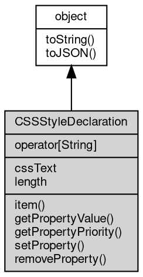

# Object CSSStyleDeclaration
CSSStyleDeclaration is the live view of an element's inline `style` declaration block, obtained from the `style` property of an HTML-mode element

The style attribute is the single source of truth: reads and writes of this [object](object.md) are
synchronized with the attribute in real time (and therefore with the innerHTML/outerHTML
serialization), and the [object](object.md) is cached, so `element.style === element.style`. The class is
not constructible; instances exist only through `element.style` for elements created by
parsing a document as text/html, and the [global](../../module/ifs/global.md) CSSStyleDeclaration name is provided so the
[object](object.md) can be recognized with instanceof.

Concepts:

- **Declaration block model**: the [object](object.md) exposes the declarations of the style attribute, not
  the computed style. `length`/`item()` enumerate the declared properties, and the [object](object.md) is a
  view: changes made elsewhere on the attribute are visible immediately, and removing the
  attribute empties the [object](object.md).
- **Property names**: standard CSS property names are lowercased and case-insensitive, custom
  properties (--*) are case-sensitive. Named access uses camelCase (`style.maxWidth`),
  `cssFloat` maps to the CSS `float` property, and the string index also accepts hyphenated
  names (`style['max-width']`). getPropertyValue/setProperty take the hyphenated form and do
  not convert camelCase. There is no numeric index: style[0] is undefined, use item().
- **Tolerant parsing**: a declaration without a colon, with an empty name or value, an empty
  segment or a comment is dropped; quoted strings and nested parentheses ([url](../../module/ifs/url.md)(...),
  calc(...)) are preserved. Duplicate declarations follow the CSS cascade rule: a later plain
  declaration does not override an earlier !important one, otherwise the later one replaces
  the earlier and moves to the end of the block.
- **Values are verbatim**: fibjs stores the value string without validating or normalizing it,
  while browsers drop invalid values, normalize [colors](../../module/ifs/colors.md) and expand shorthands. Assigning a
  number or boolean to a named property stringifies it; assigning null, undefined or an empty
  string removes the declaration. Setting cssText to an empty or whitespace-only string (or
  to null) removes the style attribute.

Obtained from:
- `element.style` — for an element of a document parsed with [DOMParser](DOMParser.md) as text/html, e.g.
  doc.getElementById(...), doc.body, doc.documentElement or a detached createElement()
  result; XML-mode elements throw Error [20009] instead. The identity is stable per element.

Example 1 — read the inline style of a parsed element:

```JavaScript
const doc = new DOMParser().parseFromString(
    '<div id="box" style="max-width: 100%; height: auto"></div>', 'text/html');
const style = doc.getElementById('box').style;

console.log(style.cssText); // max-width: 100%; height: auto
console.log(style.length); // 2
console.log(style.item(0)); // max-width
console.log(style.getPropertyValue('max-width')); // 100%
console.log(style.maxWidth); // 100%
```

Example 2 — change declarations with camelCase and methods:

```JavaScript
const doc = new DOMParser().parseFromString('', 'text/html');
const img = doc.getElementById('i');

img.style.width = '400px';
img.style.setProperty('display', 'none', 'important');
console.log(img.getAttribute('style'));
// width: 400px; display: none !important;

console.log(img.style.getPropertyPriority('display')); // important
img.style.removeProperty('display');
console.log(img.getAttribute('style')); // width: 400px;
```

Example 3 — bulk cssText, custom properties and deletion:

```JavaScript
const doc = new DOMParser().parseFromString(
    '<div id="d" style="color: red"></div>', 'text/html');
const style = doc.getElementById('d').style;

style.cssText = 'color: red !important; background: blue; color: green';
console.log(style.getPropertyValue('color')); // red
console.log(style.getPropertyValue('background')); // blue

style.setProperty('--gap', '8px');
delete style.background;
console.log(doc.getElementById('d').getAttribute('style'));
// color: red !important; --gap: 8px;
```

## Inheritance


## Operators
        
### operator[String]
**Accesses declarations through JS-style names (named property access)**

```JavaScript
Variant CSSStyleDeclaration[String];
```

Reading `style.maxWidth` converts the camelCase name to 'max-width' and returns its
value, or an empty string when the declaration is absent; `style['max-width']` and
`style['--gap']` work as well, and `style.cssFloat` maps to the CSS `float` property.
Writing converts the name the same way and stores the stringified value; assigning null,
undefined or an empty string removes the declaration, and `delete style.name` removes it
too. Numeric indexes are not mapped (style[0] is undefined, use item()).

Example — camelCase access, cssFloat and deletion:

```JavaScript
const doc = new DOMParser()
    .parseFromString('', 'text/html');
const style = doc.getElementById('i').style;

console.log(style.maxWidth); // 100%
style.width = '400px';
style.cssFloat = 'left';
console.log(doc.getElementById('i').getAttribute('style'));
// max-width: 100%; width: 400px; float: left;

delete style.width;
console.log(JSON.stringify(style.width)); // ""
```

## Properties
        
### cssText
**String, Queries and sets the textual form of the declaration block**

```JavaScript
String CSSStyleDeclaration.cssText;
```

Reading returns the raw text of the style attribute verbatim (original spacing, casing and
trailing semicolon included), not a re-serialized form. Writing parses the string as a
declaration block and replaces all content; an empty or whitespace-only string, or a
string without a single valid declaration, removes the style attribute. Assigning null
removes the attribute as well.

--------------------------
### length
**Integer, Returns the number of declarations in the declaration block**

```JavaScript
readonly Integer CSSStyleDeclaration.length;
```

Counts the declarations parsed from the style attribute and is 0 when the attribute is
absent or empty. Computed or inherited properties are not included.

## Methods
        
### item
**Returns the property name of the declaration at the specified index**

```JavaScript
String CSSStyleDeclaration.item(Integer index);
```

Parameters:
* index: Integer, the index of the declaration

Returns:
* String, returns the property name, or an empty string if the index is out of range

The index follows declaration order. A negative index or an index beyond the last
declaration returns an empty string instead of throwing. Standard names come back
lowercased, custom properties in their original spelling.

--------------------------
### getPropertyValue
**Queries the value of the specified CSS property**

```JavaScript
String CSSStyleDeclaration.getPropertyValue(String property);
```

Parameters:
* property: String, the CSS property name (hyphenated form, e.g. "max-width"), case-insensitive

Returns:
* String, returns the property value, or an empty string if it is not set

Pass the hyphenated name ('max-width'): the lookup is case-insensitive for standard
properties and case-sensitive for custom properties (--*). A camelCase name is not
converted and returns an empty string because it is not a declared property name. The
value is returned as stored, without normalization.

--------------------------
### getPropertyPriority
**Queries whether the specified CSS property has the !important priority**

```JavaScript
String CSSStyleDeclaration.getPropertyPriority(String property);
```

Parameters:
* property: String, the CSS property name (hyphenated form)

Returns:
* String, returns "important" if the !important priority is present, otherwise an empty string

The lookup follows the same name rules as getPropertyValue. Returns the exact string
'important' when the declaration carries the priority, otherwise an empty string.

--------------------------
### setProperty
**Sets a CSS property value**

```JavaScript
CSSStyleDeclaration.setProperty(String property,
    String value,
    String priority = "");
```

Parameters:
* property: String, the CSS property name (hyphenated form); "--" starts a custom property
* value: String, the CSS property value; an empty value removes the property
* priority: String, the priority, "important" for !important, empty by default

The property name must be hyphenated ('max-width'); standard names are lowercased, custom
properties keep their case. An existing declaration is replaced in place, a new one is
appended at the end of the block, and an empty value removes the declaration. Values are
stored verbatim, so fibjs does not validate or normalize CSS values the way browsers do.
The priority accepts only '' or 'important' (case-insensitive); any other value makes the
whole call a no-op.

Example — priority, invalid priority and removal:

```JavaScript
const doc = new DOMParser().parseFromString('<div id="d"></div>', 'text/html');
const style = doc.getElementById('d').style;

style.setProperty('position', 'absolute', 'important');
console.log(style.getPropertyValue('position')); // absolute
console.log(style.getPropertyPriority('position')); // important

style.setProperty('position', 'x', 'bogus'); // invalid priority: no-op
console.log(style.getPropertyValue('position')); // absolute
console.log(style.removeProperty('position')); // absolute
```

--------------------------
### removeProperty
**Removes the specified CSS property**

```JavaScript
String CSSStyleDeclaration.removeProperty(String property);
```

Parameters:
* property: String, the name of the CSS property to remove (hyphenated form)

Returns:
* String, returns the removed property value, or an empty string if the property does not exist

The lookup follows the same name rules as getPropertyValue. Removing the last declaration
removes the style attribute from the element; removing a missing property is not an error.

--------------------------
### toString
**Returns the string form of the [object](object.md)**

```JavaScript
String CSSStyleDeclaration.toString();
```

Returns:
* String, returns the string form of the [object](object.md)

The base implementation reports an error: a native [object](object.md) has no implicit
text form, and only the classes whose value can be written as a string
override the member. [Buffer](Buffer.md) returns its content decoded with the given
[encoding](../../module/ifs/encoding.md), [HttpCookie](HttpCookie.md) returns "name=value", and so on; an override commonly
accepts optional arguments ([Buffer.toString](Buffer.md#toString) takes [encoding](../../module/ifs/encoding.md), start and
end) that are not part of this declaration.

Calling the member on a class that does not override it throws
"<Class>: the [object](object.md) can not be converted to string.", which is the
behavior to rely on when probing whether a value has a string form. See
toJSON for the serialization hook.

--------------------------
### toJSON
**Returns the JSON representation of the [object](object.md)**

```JavaScript
Value CSSStyleDeclaration.toJSON(String key = "");
```

Parameters:
* key: String, the property name of the value being serialized

Returns:
* Value, returns the JSON-serializable value

JSON.stringify(value) calls value.toJSON(key) when the member exists and
serializes the returned value in its place; the key argument carries the
property name of the value inside its parent [object](object.md) (an empty string at
the top level) and may be used to build a keyed form. The base
implementation returns a plain [object](object.md) holding the readable properties of
the instance, so a native [object](object.md) serializes without per-class code; a
class with a portable shape such as [Buffer](Buffer.md) overrides it, and a JavaScript
class may override it in the same way.

The member is normally reached through JSON.stringify rather than called
directly; calling it returns the same value JSON.stringify would
serialize.

