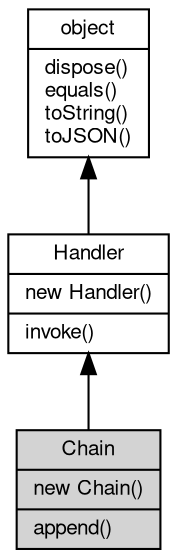

# 对象 Chain
消息处理器链处理对象

消息处理器链处理对象用于链接一系列消息处理器，按照指定的顺序链式处理。创建方法：

```JavaScript
var chain = new mq.Chain([
    func1, func2
]);
```

## 继承关系


## 构造函数
        
### Chain
**构造一个消息处理器链处理对象**

```JavaScript
new Chain(Array hdlrs);
```

调用参数:
* hdlrs: Array, 处理器数组

## 成员函数
        
### append
**添加处理器数组**

```JavaScript
Chain.append(Array hdlrs);
```

调用参数:
* hdlrs: Array, 处理器数组

--------------------------
**添加处理器**

```JavaScript
Chain.append(Handler hdlr);
```

调用参数:
* hdlr: [Handler](Handler.md), 内置消息处理器，处理函数，链式处理数组，路由对象，详见 [mq.Handler](../../module/ifs/mq.md#Handler)

--------------------------
### invoke
**处理一个消息或对象**

```JavaScript
Handler Chain.invoke(object v) async;
```

调用参数:
* v: [object](object.md), 指定处理的消息或对象

返回结果:
* [Handler](Handler.md), 返回下一步的处理器

--------------------------
### dispose
**强制回收对象，调用此方法后，对象资源将立即释放**

```JavaScript
Chain.dispose();
```

--------------------------
### equals
**比较当前对象与给定的对象是否相等**

```JavaScript
Boolean Chain.equals(object expected);
```

调用参数:
* expected: [object](object.md), 制定比较的目标对象

返回结果:
* Boolean, 返回对象比较的结果

--------------------------
### toString
**返回对象的字符串表示，一般返回 "[Native Object]"，对象可以根据自己的特性重新实现**

```JavaScript
String Chain.toString();
```

返回结果:
* String, 返回对象的字符串表示

--------------------------
### toJSON
**返回对象的 JSON 格式表示，一般返回对象定义的可读属性集合**

```JavaScript
Value Chain.toJSON(String key = "");
```

调用参数:
* key: String, 未使用

返回结果:
* Value, 返回包含可 JSON 序列化的值

