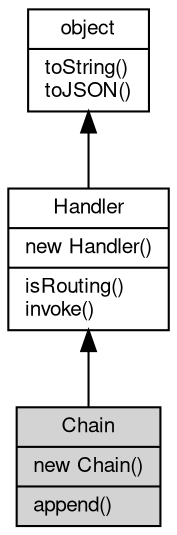

# 对象 Chain
消息处理器链处理对象

Chain 对象是 fibjs 中的一个消息处理器链处理对象，用于链接一系列消息处理器，按照指定的顺序链式处理。创建 Chain 对象的方法如下：
```
var chain = new mq.Chain([
   func1, func2
]);
```

在此创建方法中，func1 和 func2 都是消息处理器的函数对象。Chain 对象将这些处理器按照顺序依次链接在一起，形成一个处理器链。处理器在处理每个消息时，都可以对消息进行自定义的处理，然后再将消息交给下一个处理器进行处理。这样，一个消息就可以一步步地被处理到最终的状态。

Chain 对象的invoke()函数用于处理一个消息或对象。调用此函数时，Chain 对象会将消息或对象依次传递给每个处理器，并按照处理器的顺序依次处理，直到所有处理器都处理完毕。这个过程中，每个处理器都可以对消息或对象进行自定义的处理，也可以选择将消息或对象传递给下一个处理器进行处理。

在实际应用中，Chain 对象可以应用到各种场景中，比如在 web 框架中，可以将请求消息依次传递给各个处理器进行处理；在消息队列中，可以将一批消息依次传递给各个处理器进行处理。Chain 对象的使用方式非常灵活，可以根据实际需求进行自定义处理，具有很高的扩展性和可重用性。

## 继承关系


## 构造函数
        
### Chain
**构造一个消息处理器链处理对象**

```JavaScript
new Chain(Handler hdlrs[]);
```

调用参数:
* hdlrs[]: [Handler](Handler.md), 处理器数组

## 成员函数
        
### append
**添加处理器数组**

```JavaScript
Chain.append(Handler hdlrs[]);
```

调用参数:
* hdlrs[]: [Handler](Handler.md), 处理器数组

--------------------------
**添加处理器**

```JavaScript
Chain.append(Handler hdlr);
```

调用参数:
* hdlr: [Handler](Handler.md), 内置消息处理器，处理函数，链式处理数组，路由对象，详见 [mq.Handler](../../module/ifs/mq.md#Handler)

--------------------------
### isRouting
**查询当前处理器是否支持路由**

```JavaScript
Boolean Chain.isRouting();
```

返回结果:
* Boolean, 返回当前处理器是否支持路由

--------------------------
### invoke
**处理一个消息或对象**

```JavaScript
Handler Chain.invoke(object v) async;
```

调用参数:
* v: [object](object.md), 指定处理的消息或对象

返回结果:
* [Handler](Handler.md), 返回下一步的处理器

--------------------------
### toString
**返回对象的字符串表示，一般返回 "[Native Object]"，对象可以根据自己的特性重新实现**

```JavaScript
String Chain.toString();
```

返回结果:
* String, 返回对象的字符串表示

--------------------------
### toJSON
**返回对象的 JSON 格式表示，一般返回对象定义的可读属性集合**

```JavaScript
Value Chain.toJSON(String key = "");
```

调用参数:
* key: String, 未使用

返回结果:
* Value, 返回包含可 JSON 序列化的值

