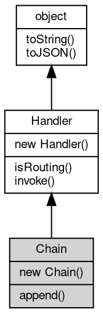

# Object Chain
A message handler chain that runs a series of handlers in order

Chain links several handlers into one handler: the value is passed to each
element in turn, each element may change it, and the chain ends when the queue
is exhausted or the value is ended. It is the [object](object.md) behind the array form of
every handler parameter — `new [mq.Handler](../../module/ifs/mq.md#Handler)([a, b])`, the handler array of an
[http](../../module/ifs/http.md) server and the array returned by a handling function all become a Chain —
so the class is usually reached through that conversion rather than
constructed by name.

Concepts:
- **Order**: the elements run in the order they were given; append adds to the
  end. A handler returning nothing finishes its own stage and the chain moves
  to the next element, so a chain of plain functions behaves like a pipeline.
- **Ending the chain**: calling end() on a [Message](Message.md) or response.end() on an
  [http.Request](../../module/ifs/http.md#Request) marks the value as finished; the chain stops before the next
  element, which is the way a middle handler short-circuits a request.
- **Returning a handler**: a handling function may return another handler,
  function, array (a nested Chain) or routing map (a nested [Routing](Routing.md)); the
  returned handler runs before the next element of the queue.
- **Fibers**: plain functions run in the fiber that invoked the chain, while a
  handler [object](object.md) (another Chain, a [Routing](Routing.md), a repeater) runs in its own
  fiber, which matters when the elements share mutable state.

Obtained from:
- `new [mq.Chain](../../module/ifs/mq.md#Chain)([...])` — the constructor below;
- `new [mq.Handler](../../module/ifs/mq.md#Handler)([...])` — the array form of the [Handler](Handler.md) constructor returns
  a Chain (see [Handler](Handler.md));
- any array passed where a handler is expected ([http.Server](../../module/ifs/http.md#Server), [net.TcpServer](../../module/ifs/net.md#TcpServer),
  [Routing.append](Routing.md#append), [mq.invoke](../../module/ifs/mq.md#invoke)) is converted through the same [path](../../module/ifs/path.md).

Example 1 — handlers run in order and may change the value:

```JavaScript
const mq = require('mq');

const order = [];
const chain = new mq.Chain([
    (v) => {
        order.push('first');
    },
    (v) => {
        order.push('second');
    },
    (v) => {
        order.push('third');
    }
]);

mq.invoke(chain, new mq.Message());
console.log(order.join(' -> ')); // first -> second -> third
```

Example 2 — end() stops the chain:

```JavaScript
const mq = require('mq');
const http = require('http');

const seen = [];
const chain = new mq.Chain([
    (v) => {
        seen.push('before');
    },
    (v) => {
        v.end();
    },
    (v) => {
        seen.push('after');
    }
]);

mq.invoke(chain, new mq.Message());
console.log(seen.join(',')); // before

// the response form ends an http pipeline the same way
const seen2 = [];
const chain2 = new mq.Chain([
    (req) => {
        seen2.push('request');
    },
    (req) => {
        req.response.end();
    },
    (req) => {
        seen2.push('unreachable');
    }
]);

mq.invoke(chain2, new http.Request());
console.log(seen2.join(',')); // request
```

## Inheritance

```dot
digraph {
    node [fontname="Helvetica,sans-Serif", fontsize=10, shape="record", style="filled", fillcolor="white"];

    object [tooltip="object", URL="object.md", label="{object|toString()\ltoJSON()\l}"];
    Handler [tooltip="Handler", URL="Handler.md", label="{Handler|new Handler()\l|isRouting()\linvoke()\l}"];
    Chain [tooltip="Chain", fillcolor="lightgray", id="me", label="{Chain|new Chain()\l|append()\l}"];

    object -> Handler [dir=back];
    Handler -> Chain [dir=back];
}
```

## Constructors
        
### Chain
**Constructs a message handler chain [object](object.md)**

```JavaScript
new Chain(Handler hdlrs[]);
```

Parameters:
* hdlrs[]: [Handler](Handler.md), the handlers to link, each converted like a single handler

Every element is converted with the same rules as a single handler: a
[Handler](Handler.md) [object](object.md) is used as it is, an array becomes a nested Chain, a
function becomes a JavaScript handler called with the message the chain
receives, a routing map [object](object.md) becomes a [Routing](Routing.md), and a [path](../../module/ifs/path.md)/address
string becomes a file handler or an [http](../../module/ifs/http.md)(s) repeater. The elements run in
order; see the class description for the chain semantics.

Example — a chain mixing the accepted forms:

```JavaScript
const mq = require('mq');

const chain = new mq.Chain([
    (v) => {
        console.log('function');
    },
    new mq.Handler((v) => {
        console.log('handler');
    }),
    {
        '/': (v) => console.log('nested map')
    }
]);

const msg = new mq.Message();
msg.value = '/';
mq.invoke(chain, msg);
```

## Methods
        
### append
**Adds a handler array to the end of the chain**

```JavaScript
Chain.append(Handler hdlrs[]);
```

Parameters:
* hdlrs[]: [Handler](Handler.md), the handlers to append, each converted like a single handler

The elements are converted like the constructor argument and appended in
order, so they run after the handlers already in the chain. The member
returns nothing; the chain is modified in place.

Example — extend a chain and run it:

```JavaScript
const mq = require('mq');

const chain = new mq.Chain([() => console.log('one')]);
chain.append([() => console.log('two'), () => console.log('three')]);
chain.append(() => console.log('four'));

mq.invoke(chain, new mq.Message());
```

--------------------------
**Adds a handler to the end of the chain**

```JavaScript
Chain.append(Function(object req, ...params) => Value hdlr);
```

Parameters:
* hdlr: [Handler](Handler.md) | [Handler](Handler.md)[] | Function([object](object.md) req, ...params) => Value | Object | String, the handler appended to the chain

hdlr may be given in any of these forms:
- a [Handler](Handler.md) [object](object.md), invoked as it is;
- an array of handlers, wrapped in a nested Chain and invoked in order;
- a handler function `(req, ...params) => any`, called with the same
  message the chain receives;
- a routing map [object](object.md), whose values are handlers in these same forms;
- a [path](../../module/ifs/path.md)/address string, converted through the [Handler](Handler.md) constructor.

The handler is appended after the existing elements and runs when its turn
comes; the member returns nothing.

--------------------------
### isRouting
**Queries whether the current handler supports routing**

```JavaScript
Boolean Chain.isRouting();
```

Returns:
* Boolean, returns whether the current handler supports routing

A routing handler matches messages by itself and is used for the message
as it is; a non-routing handler is a terminal stage of a chain or a
function. [Routing](Routing.md), [HttpRepeater](HttpRepeater.md) and file handlers return true, while
JavaScript handlers and chains made only of them return false. Chain
returns true when at least one of its elements routes; [Routing.append](Routing.md#append)
reads the flag to decide whether the remaining [path](../../module/ifs/path.md) must be handed to the
handler as a sub-route.

Example — the flag of the concrete classes:

```JavaScript
const mq = require('mq');

console.log(new mq.Routing({
    '/a': () => {}
}).isRouting()); // true
console.log(new mq.Chain([() => {}]).isRouting()); // false

const repeater = new mq.Handler('http://127.0.0.1:8080/');
console.log(repeater.isRouting()); // true
```

--------------------------
### invoke
**Processes a message or [object](object.md)**

```JavaScript
Handler Chain.invoke(object v) async;
```

Parameters:
* v: [object](object.md), the message or [object](object.md) to [process](../../module/ifs/process.md)

Returns:
* [Handler](Handler.md), returns the next handler

The call is a single stage of the pipeline: the handler processes v and
the returned value is the next handler to run, or null when the message
processing is finished. For a JavaScript handler this is the value the
function returned (converted to a handler); for a routing it is the
handler of the matched rule; for a chain it is the handler that should run
next. The method is asynchronous and blocks the current fiber until the
stage completes; [mq.invoke](../../module/ifs/mq.md#invoke) is the loop that keeps invoking the returned
handler until null.

Example — run one stage and continue with the returned handler:

```JavaScript
const mq = require('mq');

const step = new mq.Handler((v) => {
    console.log('stage: ' + v.value);
    return new mq.Handler((v) => console.log('returned handler ran'));
});

const msg = new mq.Message();
msg.value = 'x';
const next = step.invoke(msg);
console.log(next instanceof mq.Handler); // true
next.invoke(msg);
```

--------------------------
### toString
**Returns the string form of the [object](object.md)**

```JavaScript
String Chain.toString();
```

Returns:
* String, returns the string form of the [object](object.md)

The base implementation reports an error: a native [object](object.md) has no implicit
text form, and only the classes whose value can be written as a string
override the member. [Buffer](Buffer.md) returns its content decoded with the given
[encoding](../../module/ifs/encoding.md), [HttpCookie](HttpCookie.md) returns "name=value", and so on; an override commonly
accepts optional arguments ([Buffer.toString](Buffer.md#toString) takes [encoding](../../module/ifs/encoding.md), start and
end) that are not part of this declaration.

Calling the member on a class that does not override it throws
"<Class>: the [object](object.md) can not be converted to string.", which is the
behavior to rely on when probing whether a value has a string form. See
toJSON for the serialization hook.

--------------------------
### toJSON
**Returns the JSON representation of the [object](object.md)**

```JavaScript
Value Chain.toJSON(String key = "");
```

Parameters:
* key: String, the property name of the value being serialized

Returns:
* Value, returns the JSON-serializable value

JSON.stringify(value) calls value.toJSON(key) when the member exists and
serializes the returned value in its place; the key argument carries the
property name of the value inside its parent [object](object.md) (an empty string at
the top level) and may be used to build a keyed form. The base
implementation returns a plain [object](object.md) holding the readable properties of
the instance, so a native [object](object.md) serializes without per-class code; a
class with a portable shape such as [Buffer](Buffer.md) overrides it, and a JavaScript
class may override it in the same way.

The member is normally reached through JSON.stringify rather than called
directly; calling it returns the same value JSON.stringify would
serialize.

