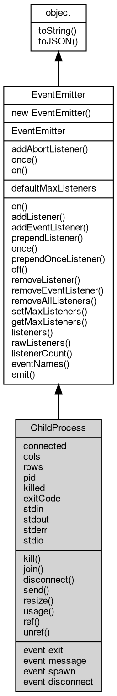

# 对象 ChildProcess
子进程对象

```JavaScript
var child_process = require("child_process");
var child = child_process.spawn("ls");
```

## 继承关系


## 静态函数
        
### addAbortListener
**监听一个 [AbortSignal](AbortSignal.md) 的 abort 事件，返回一个可释放的对象**

```JavaScript
static Object ChildProcess.addAbortListener(EventEmitter signal,
    Function func);
```

调用参数:
* signal: [EventEmitter](EventEmitter.md), 要监听的 [AbortSignal](AbortSignal.md) 对象
* func: Function, abort 事件的处理函数

返回结果:
* Object, 返回一个包含 `[Symbol.dispose]` 方法的 Disposable 对象

返回的对象包含 `[Symbol.dispose]()` 方法，调用后将移除监听器。如果信号已中止，则监听器会被立即调用。

--------------------------
### once
**创建一个 Promise，等待指定事件触发一次后解析**

```JavaScript
static Object ChildProcess.once(EventEmitter emitter,
    Value ev,
    Object options = {});
```

调用参数:
* emitter: [EventEmitter](EventEmitter.md), 要监听的事件触发器对象
* ev: Value, 指定事件的名称
* options: Object, 可选参数对象

返回结果:
* Object, 返回 Promise，以事件参数数组解析

返回一个 Promise，当目标事件触发时以事件参数数组解析。如果在此期间触发 'error' 事件（且监听的不是 'error' 事件本身），Promise 将被拒绝。

options 参数可包含：
- signal: [AbortSignal](AbortSignal.md)，用于取消等待

--------------------------
### on
**创建一个异步迭代器，持续监听指定事件**

```JavaScript
static Object ChildProcess.on(EventEmitter emitter,
    Value ev,
    Object options = {});
```

调用参数:
* emitter: [EventEmitter](EventEmitter.md), 要监听的事件触发器对象
* ev: Value, 指定事件的名称
* options: Object, 可选参数对象

返回结果:
* Object, 返回 AsyncIterator 对象

返回一个 AsyncIterator，每次事件触发时产出事件参数数组。如果触发 'error' 事件，迭代器将抛出错误。

options 参数可包含：
- signal: [AbortSignal](AbortSignal.md)，用于取消迭代
- close: 字符串数组，指定结束迭代的事件名称

## 静态属性
        
### defaultMaxListeners
**Integer, 默认全局最大监听器数**

```JavaScript
static Integer ChildProcess.defaultMaxListeners;
```

## 成员属性
        
### connected
**Boolean, 查询与子进程的管道是否正常连接**

```JavaScript
readonly Boolean ChildProcess.connected;
```

--------------------------
### cols
**Integer, 查询当前终端的列数**

```JavaScript
readonly Integer ChildProcess.cols;
```

--------------------------
### rows
**Integer, 查询当前终端的行数**

```JavaScript
readonly Integer ChildProcess.rows;
```

--------------------------
### pid
**Integer, 读取当前对象指向的进程的 id**

```JavaScript
readonly Integer ChildProcess.pid;
```

--------------------------
### killed
**Boolean, 查询当前对象指向的进程是否已经退出**

```JavaScript
readonly Boolean ChildProcess.killed;
```

--------------------------
### exitCode
**Integer, 查询和设置当前进程的退出码**

```JavaScript
readonly Integer ChildProcess.exitCode;
```

--------------------------
### stdin
**[Stream](Stream.md), 读取当前对象指向的进程的标准输入对象**

```JavaScript
readonly Stream ChildProcess.stdin;
```

--------------------------
### stdout
**[Stream](Stream.md), 读取当前对象指向的进程的标准输出对象**

```JavaScript
readonly Stream ChildProcess.stdout;
```

--------------------------
### stderr
**[Stream](Stream.md), 读取当前对象指向的进程的标准错误对象**

```JavaScript
readonly Stream ChildProcess.stderr;
```

--------------------------
### stdio
**Array, 读取当前对象指向进程的标准 IO 对象列表**

```JavaScript
readonly Array ChildProcess.stdio;
```

数组中包含子进程的标准 IO 流,与 spawn 时传入的 stdio 选项对应。管道项为
[Stream](Stream.md) 对象,其他项为 null。

## 成员函数
        
### kill
**杀掉当前对象指向的进程，并传递信号**

```JavaScript
ChildProcess.kill(Integer signal);
```

调用参数:
* signal: Integer, 传递的信号

--------------------------
**杀掉当前对象指向的进程，并传递信号**

```JavaScript
ChildProcess.kill(String signal = "SIGTERM");
```

调用参数:
* signal: String, 传递的信号

--------------------------
### join
**等待当前对象指向的进程结束，并返回进程结束代码**

```JavaScript
Integer ChildProcess.join() async;
```

返回结果:
* Integer, 进程的结束代码

--------------------------
### disconnect
**关闭与子进程的 ipc 管道**

```JavaScript
ChildProcess.disconnect();
```

--------------------------
### send
**向当前子进程发送一个消息**

```JavaScript
ChildProcess.send(Value msg);
```

调用参数:
* msg: Value, 指定发送的消息

--------------------------
### resize
**调整当前子进程的终端大小**

```JavaScript
ChildProcess.resize(Integer cols,
    Integer rows);
```

调用参数:
* cols: Integer, 终端的列数
* rows: Integer, 终端的行数

--------------------------
### usage
**查询当前进程占用的内存和花费的时间**

```JavaScript
Object ChildProcess.usage();
```

返回结果:
* Object, 返回包含时间报告

内存报告生成类似以下结果：

```JavaScript
{
    "user": 132379,
    "system": 50507,
    "rss": 8622080
}
```

其中：
- user 返回进程在用户代码中花费的时间，单位为微秒值（百万分之一秒）
- system 返回进程在系统代码中花费的时间，单位为微秒值（百万分之一秒）
- rss 返回进程当前占用物理内存大小

--------------------------
### ref
**维持 fibjs 进程不退出，在对象绑定期间阻止 fibjs 进程退出**

```JavaScript
ChildProcess ChildProcess.ref();
```

返回结果:
* ChildProcess, 返回当前对象

--------------------------
### unref
**允许 fibjs 进程退出，在对象绑定期间允许 fibjs 进程退出**

```JavaScript
ChildProcess ChildProcess.unref();
```

返回结果:
* ChildProcess, 返回当前对象

--------------------------
### on
**绑定一个事件处理函数到对象**

```JavaScript
Object ChildProcess.on(Value ev,
    Function func);
```

调用参数:
* ev: Value, 指定事件的名称
* func: Function, 指定事件处理函数

返回结果:
* Object, 返回事件对象本身，便于链式调用

--------------------------
**绑定一个事件处理函数到对象**

```JavaScript
Object ChildProcess.on(Object map);
```

调用参数:
* map: Object, 指定事件映射关系，对象属性名称将作为事件名称，属性的值将作为事件处理函数

返回结果:
* Object, 返回事件对象本身，便于链式调用

--------------------------
### addListener
**绑定一个事件处理函数到对象**

```JavaScript
Object ChildProcess.addListener(Value ev,
    Function func);
```

调用参数:
* ev: Value, 指定事件的名称
* func: Function, 指定事件处理函数

返回结果:
* Object, 返回事件对象本身，便于链式调用

--------------------------
**绑定一个事件处理函数到对象**

```JavaScript
Object ChildProcess.addListener(Object map);
```

调用参数:
* map: Object, 指定事件映射关系，对象属性名称将作为事件名称，属性的值将作为事件处理函数

返回结果:
* Object, 返回事件对象本身，便于链式调用

--------------------------
### addEventListener
**绑定一个事件处理函数到对象**

```JavaScript
Object ChildProcess.addEventListener(Value ev,
    Function func,
    Object options = {});
```

调用参数:
* ev: Value, 指定事件的名称
* func: Function, 指定事件处理函数
* options: Object, 指定事件处理函数的选项

返回结果:
* Object, 返回事件对象本身，便于链式调用

options 参数是一个对象，它可以包含以下属性：
- once: 如果为 true，则事件处理函数只会触发一次，触发后会被移除

--------------------------
### prependListener
**绑定一个事件处理函数到对象起始**

```JavaScript
Object ChildProcess.prependListener(Value ev,
    Function func);
```

调用参数:
* ev: Value, 指定事件的名称
* func: Function, 指定事件处理函数

返回结果:
* Object, 返回事件对象本身，便于链式调用

--------------------------
**绑定一个事件处理函数到对象起始**

```JavaScript
Object ChildProcess.prependListener(Object map);
```

调用参数:
* map: Object, 指定事件映射关系，对象属性名称将作为事件名称，属性的值将作为事件处理函数

返回结果:
* Object, 返回事件对象本身，便于链式调用

--------------------------
### once
**绑定一个一次性事件处理函数到对象，一次性处理函数只会触发一次**

```JavaScript
Object ChildProcess.once(Value ev,
    Function func);
```

调用参数:
* ev: Value, 指定事件的名称
* func: Function, 指定事件处理函数

返回结果:
* Object, 返回事件对象本身，便于链式调用

--------------------------
**绑定一个一次性事件处理函数到对象，一次性处理函数只会触发一次**

```JavaScript
Object ChildProcess.once(Object map);
```

调用参数:
* map: Object, 指定事件映射关系，对象属性名称将作为事件名称，属性的值将作为事件处理函数

返回结果:
* Object, 返回事件对象本身，便于链式调用

--------------------------
### prependOnceListener
**绑定一个事件处理函数到对象起始**

```JavaScript
Object ChildProcess.prependOnceListener(Value ev,
    Function func);
```

调用参数:
* ev: Value, 指定事件的名称
* func: Function, 指定事件处理函数

返回结果:
* Object, 返回事件对象本身，便于链式调用

--------------------------
**绑定一个事件处理函数到对象起始**

```JavaScript
Object ChildProcess.prependOnceListener(Object map);
```

调用参数:
* map: Object, 指定事件映射关系，对象属性名称将作为事件名称，属性的值将作为事件处理函数

返回结果:
* Object, 返回事件对象本身，便于链式调用

--------------------------
### off
**从对象处理队列中取消指定函数**

```JavaScript
Object ChildProcess.off(Value ev,
    Function func);
```

调用参数:
* ev: Value, 指定事件的名称
* func: Function, 指定事件处理函数

返回结果:
* Object, 返回事件对象本身，便于链式调用

--------------------------
**取消对象处理队列中的全部函数**

```JavaScript
Object ChildProcess.off(Value ev);
```

调用参数:
* ev: Value, 指定事件的名称

返回结果:
* Object, 返回事件对象本身，便于链式调用

--------------------------
**从对象处理队列中取消指定函数**

```JavaScript
Object ChildProcess.off(Object map);
```

调用参数:
* map: Object, 指定事件映射关系，对象属性名称作为事件名称，属性的值作为事件处理函数

返回结果:
* Object, 返回事件对象本身，便于链式调用

--------------------------
### removeListener
**从对象处理队列中取消指定函数**

```JavaScript
Object ChildProcess.removeListener(Value ev,
    Function func);
```

调用参数:
* ev: Value, 指定事件的名称
* func: Function, 指定事件处理函数

返回结果:
* Object, 返回事件对象本身，便于链式调用

--------------------------
**取消对象处理队列中的全部函数**

```JavaScript
Object ChildProcess.removeListener(Value ev);
```

调用参数:
* ev: Value, 指定事件的名称

返回结果:
* Object, 返回事件对象本身，便于链式调用

--------------------------
**从对象处理队列中取消指定函数**

```JavaScript
Object ChildProcess.removeListener(Object map);
```

调用参数:
* map: Object, 指定事件映射关系，对象属性名称作为事件名称，属性的值作为事件处理函数

返回结果:
* Object, 返回事件对象本身，便于链式调用

--------------------------
### removeEventListener
**从对象处理队列中取消指定函数**

```JavaScript
Object ChildProcess.removeEventListener(Value ev,
    Function func,
    Object options = {});
```

调用参数:
* ev: Value, 指定事件的名称
* func: Function, 指定事件处理函数
* options: Object, 指定事件处理函数的选项

返回结果:
* Object, 返回事件对象本身，便于链式调用

--------------------------
### removeAllListeners
**从对象处理队列中取消所有事件的所有监听器， 如果指定事件，则移除指定事件的所有监听器。**

```JavaScript
Object ChildProcess.removeAllListeners(Value ev);
```

调用参数:
* ev: Value, 指定事件的名称

返回结果:
* Object, 返回事件对象本身，便于链式调用

--------------------------
**从对象处理队列中取消所有事件的所有监听器， 如果指定事件，则移除指定事件的所有监听器。**

```JavaScript
Object ChildProcess.removeAllListeners(Array evs = []);
```

调用参数:
* evs: Array, 指定事件的名称

返回结果:
* Object, 返回事件对象本身，便于链式调用

--------------------------
### setMaxListeners
**监听器的默认限制的数量，仅用于兼容**

```JavaScript
ChildProcess.setMaxListeners(Integer n);
```

调用参数:
* n: Integer, 指定事件的数量

--------------------------
### getMaxListeners
**获取监听器的默认限制的数量，仅用于兼容**

```JavaScript
Integer ChildProcess.getMaxListeners();
```

返回结果:
* Integer, 返回默认限制数量

--------------------------
### listeners
**查询对象指定事件的监听器数组**

```JavaScript
Array ChildProcess.listeners(Value ev);
```

调用参数:
* ev: Value, 指定事件的名称

返回结果:
* Array, 返回指定事件的监听器数组

--------------------------
### rawListeners
**查询对象指定事件的监听器数组，包含 once 包装函数**

```JavaScript
Array ChildProcess.rawListeners(Value ev);
```

调用参数:
* ev: Value, 指定事件的名称

返回结果:
* Array, 返回指定事件的监听器数组

--------------------------
### listenerCount
**查询对象指定事件的监听器数量**

```JavaScript
Integer ChildProcess.listenerCount(Value ev);
```

调用参数:
* ev: Value, 指定事件的名称

返回结果:
* Integer, 返回指定事件的监听器数量

--------------------------
**查询对象指定事件的监听器数量**

```JavaScript
Integer ChildProcess.listenerCount(Value o,
    Value ev);
```

调用参数:
* o: Value, 指定查询的对象
* ev: Value, 指定事件的名称

返回结果:
* Integer, 返回指定事件的监听器数量

--------------------------
### eventNames
**查询监听器事件名称**

```JavaScript
Array ChildProcess.eventNames();
```

返回结果:
* Array, 返回事件名称数组

--------------------------
### emit
**主动触发一个事件**

```JavaScript
Boolean ChildProcess.emit(Value ev,
    ...args);
```

调用参数:
* ev: Value, 事件名称
* args: ..., 事件参数，将会传递给事件处理函数

返回结果:
* Boolean, 返回事件触发状态，有响应事件返回 true，否则返回 false

--------------------------
### toString
**返回对象的字符串表示，一般返回 "[Native Object]"，对象可以根据自己的特性重新实现**

```JavaScript
String ChildProcess.toString();
```

返回结果:
* String, 返回对象的字符串表示

--------------------------
### toJSON
**返回对象的 JSON 格式表示，一般返回对象定义的可读属性集合**

```JavaScript
Value ChildProcess.toJSON(String key = "");
```

调用参数:
* key: String, 未使用

返回结果:
* Value, 返回包含可 JSON 序列化的值

## 事件
        
### exit
**查询和绑定进程退出事件，相当于 on("exit", func);**

```JavaScript
event ChildProcess.exit();
```

--------------------------
### message
**查询和绑定子进程消息事件，相当于 on("message", func);**

```JavaScript
event ChildProcess.message();
```

--------------------------
### spawn
**查询和绑定子进程启动事件，相当于 on("spawn", func);**

```JavaScript
event ChildProcess.spawn();
```

--------------------------
### disconnect
**查询和绑定子进程断开连接事件，相当于 on("disconnect", func);**

```JavaScript
event ChildProcess.disconnect();
```

