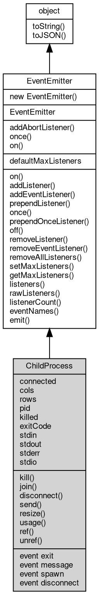

# Object ChildProcess
A handle to a child [process](../../module/ifs/process.md) created by spawn, fork or the callback form of exec, execFile and run

The [object](object.md) is an [EventEmitter](EventEmitter.md) that exposes the [process](../../module/ifs/process.md) id, its stdio streams and its exit
state. It is created by the [child_process](../../module/ifs/child_process.md) [module](../../module/ifs/module.md); the synchronous forms of exec, execFile and
run return a buffered result instead, so use the callback form when the handle is needed.

Concepts:

- **Lifecycle**: `pid` is available immediately; `exitCode` is null while the [process](../../module/ifs/process.md) runs and
  `killed` records whether kill was called (or a timeout or abort signal fired). After the exit
  `exitCode` holds 0-255 for a normal exit, or the negative signal number (-15 for SIGTERM, -9
  for SIGKILL) when the [process](../../module/ifs/process.md) died from a signal. Node.js reports null in that case and
  exposes the signal separately through `signalCode`.
- **Waiting**: `join()` blocks the current fiber until the [process](../../module/ifs/process.md) exits and returns the same
  value as `exitCode`; wait before reading state or letting the parent finish. `ref` and `unref`
  control whether a running child keeps the fibjs [process](../../module/ifs/process.md) alive.
- **stdio**: descriptors configured as 'pipe' are exposed as [Stream](Stream.md) objects through `stdin`,
  `stdout`, `stderr` and the `stdio` array; 'ignore' and 'inherit' descriptors are null. Read
  the output streams to drain them, otherwise the child can block on a full pipe buffer.
- **Terminal (pty)**: with `stdio: 'pty'` stdin and stdout are a pseudo terminal; `cols`, `rows`
  and `resize` are available in this mode and throw Error 20024 for other children.
- **IPC**: a fork child, or a spawn with an 'ipc' stdio entry, gets a message channel;
  `connected`, `send` and `disconnect` operate on it and incoming messages are delivered to the
  'message' event. Only one 'ipc' entry is allowed per child (ERR_IPC_ONE_PIPE).
- **Events**: the implementation emits `exit` and the Node-style `close` event (emitted after
  the stdio streams close, not declared above) with `(code, signal)`; code is null on a signal
  death and signal is null on a normal exit. `spawn` fires after a successful spawn and
  `disconnect` fires when the IPC channel closes.
- **Node.js comparison**: fibjs adds `join()` and `usage()`; Node has `signalCode`, `kill`
  returns a boolean, `send` accepts a callback and a signal death is not encoded as a negative
  exit code.

Obtained from:
- `child_process.spawn(...)` and `child_process.fork(...)` — always return a ChildProcess;
- `child_process.exec(...)`, `execFile(...)` and `run(...)` — return one only in the callback
  form; their synchronous form returns the buffered output or the exit code.

Example 1 — read the stdout and stderr pipes of a spawned child:

```JavaScript
const child_process = require('child_process');

const script = 'console.log("out"); console.error("err");';
const child = child_process.spawn(process.execPath, ['-e', script]);
console.log(child.stdout.readAll().toString().trim()); // out
console.log(child.stderr.readAll().toString().trim()); // err
console.log(child.join()); // 0
```

Example 2 — kill a child and observe the exit event:

```JavaScript
const child_process = require('child_process');
const coroutine = require('coroutine');

const child = child_process.spawn(process.execPath, ['-e', 'setTimeout(() => {}, 30000)']);
child.on('exit', (code, signal) => {
    console.log('exit', code, signal); // exit null SIGTERM
});
child.kill(); // SIGTERM by default
console.log('join', child.join()); // join -15
coroutine.sleep(1);
```

Example 3 — fork a [module](../../module/ifs/module.md) and exchange IPC messages:

```JavaScript
const child_process = require('child_process');
const fs = require('fs');
const os = require('os');
const path = require('path');

const dir = fs.mkdtempSync(path.join(os.tmpdir(), 'fibjs-ipc-'));
const childCode = 'process.on("message", (m) => { process.send(m * 2);' +
    ' setTimeout(() => process.exit(0), 50); });';
fs.writeFile(path.join(dir, 'echo.js'), childCode);

const child = child_process.fork(path.join(dir, 'echo.js'), {
    silent: true
});
child.on('message', (m) => console.log('message', m)); // message 42
child.send(21);
console.log('join', child.join()); // join 0
console.log('connected', child.connected); // connected false

fs.rmSync(dir, {
    recursive: true,
    force: true
});
```

## Inheritance

```dot
digraph {
    node [fontname="Helvetica,sans-Serif", fontsize=10, shape="record", style="filled", fillcolor="white"];

    object [tooltip="object", URL="object.md", label="{object|toString()\ltoJSON()\l}"];
    EventEmitter [tooltip="EventEmitter", URL="EventEmitter.md", label="{EventEmitter|new EventEmitter()\l|EventEmitter\l|addAbortListener()\lonce()\lon()\l|defaultMaxListeners\l|on()\laddListener()\laddEventListener()\lprependListener()\lonce()\lprependOnceListener()\loff()\lremoveListener()\lremoveEventListener()\lremoveAllListeners()\lsetMaxListeners()\lgetMaxListeners()\llisteners()\lrawListeners()\llistenerCount()\leventNames()\lemit()\l}"];
    ChildProcess [tooltip="ChildProcess", fillcolor="lightgray", id="me", label="{ChildProcess|connected\lcols\lrows\lpid\lkilled\lexitCode\lstdin\lstdout\lstderr\lstdio\l|kill()\ljoin()\ldisconnect()\lsend()\lresize()\lusage()\lref()\lunref()\l|event exit\levent message\levent spawn\levent disconnect\l}"];

    object -> EventEmitter [dir=back];
    EventEmitter -> ChildProcess [dir=back];
}
```

## Static Methods
        
### addAbortListener
**Registers a one-shot abort handler on an [AbortSignal](AbortSignal.md)**

```JavaScript
static Object ChildProcess.addAbortListener(EventEmitter signal,
    Function(Object ev) func);
```

Parameters:
* signal: [EventEmitter](EventEmitter.md), the [AbortSignal](AbortSignal.md) [object](object.md) to listen to
* func: Function(Object ev), the handler for the abort event

Returns:
* Object, returns a Disposable [object](object.md) containing a `[Symbol.dispose]` method

The handler is called at most once when the signal is aborted, and it is removed from the
signal afterwards. If the signal is already aborted the handler is invoked synchronously.
The returned [object](object.md) has a `[Symbol.dispose]()` method that removes the handler, so it can be
released before the abort happens.

Example — abort handling with automatic cleanup:

```JavaScript
const events = require('events');

const controller = new AbortController();
const disposable = events.addAbortListener(controller.signal,
    () => console.log('aborted'));

controller.abort(); // aborted
disposable[Symbol.dispose](); // safe to call after the listener fired
console.log(controller.signal.listenerCount('abort')); // 0
```

--------------------------
### once
**Creates a Promise resolved by the next occurrence of an event**

```JavaScript
static Object ChildProcess.once(EventEmitter emitter,
    Value ev,
    Object options = {});
```

Parameters:
* emitter: [EventEmitter](EventEmitter.md), the event emitter [object](object.md) to listen to
* ev: Value, the event name to listen for
* options: Object, optional parameter [object](object.md)

Returns:
* Object, returns a Promise that resolves with the array of event parameters

The Promise resolves with the array of the emit arguments when the event fires; it rejects
when `error` is emitted while waiting, unless the waited event is `error` itself, or when
the signal option aborts. The temporary listeners are removed when the Promise settles.

options supports the following option:

```JavaScript
// fragment: options
({
    "signal": null // AbortSignal; aborting rejects the Promise with an AbortError
});
```

Example — awaiting the next occurrence of an event:

```JavaScript
const EventEmitter = require('events');

(async () => {
    const emitter = new EventEmitter();
    const waiting = EventEmitter.once(emitter, 'ready');

    emitter.emit('ready', 200, 'ok');
    console.log(JSON.stringify(await waiting)); // [200,"ok"]
})();
```

--------------------------
### on
**Creates an async iterator that yields event occurrences**

```JavaScript
static Object ChildProcess.on(EventEmitter emitter,
    Value ev,
    Object options = {});
```

Parameters:
* emitter: [EventEmitter](EventEmitter.md), the event emitter [object](object.md) to listen to
* ev: Value, the event name to listen for
* options: Object, optional parameter [object](object.md)

Returns:
* Object, returns an AsyncIterator [object](object.md)

Each next() resolves with `{ value: [args...], done: false }` when the event fires and with
`{ done: true }` after an event named in the `close` option fires or the signal aborts; an
`error` event rejects the pending call. The listeners are registered when the iterator is
created and removed when the iteration ends or the signal aborts.

options supports the following options:

```JavaScript
// fragment: options
({
    "signal": null, // AbortSignal; aborting rejects pending and future next() calls
    "close": [] // event names; the first one to fire ends the iteration
});
```

Example — iterating the occurrences of an event:

```JavaScript
const EventEmitter = require('events');

(async () => {
    const emitter = new EventEmitter();
    const iterator = EventEmitter.on(emitter, 'data', {
        close: ['end']
    });

    emitter.emit('data', 1);
    emitter.emit('data', 2);
    emitter.emit('end');

    for await (const args of iterator)
    console.log(JSON.stringify(args)); // [1] then [2]
})();
```

## Static Properties
        
### defaultMaxListeners
**Integer, The [process](../../module/ifs/process.md)-wide default listener limit reported by getMaxListeners()**

```JavaScript
static Integer ChildProcess.defaultMaxListeners;
```

Defaults to 10. Assigning a value changes getMaxListeners() for every emitter that never
called setMaxListeners(); an emitter with an explicit limit keeps it. The limit is
informational: fibjs never warns when the number of listeners exceeds it.

## Properties
        
### connected
**Boolean, Queries whether the pipe to the child [process](../../module/ifs/process.md) is properly connected**

```JavaScript
readonly Boolean ChildProcess.connected;
```

True while the message channel is usable: for a fork child, or a spawn with an 'ipc' stdio
entry, until the channel closes or the [process](../../module/ifs/process.md) exits. It is false for processes without an
IPC channel. See send, disconnect and the message event.

--------------------------
### cols
**Integer, Number of terminal columns of the child [process](../../module/ifs/process.md)**

```JavaScript
readonly Integer ChildProcess.cols;
```

Only available in 'pty' mode; reading it for a non-pty child throws Error 20024 ("cols
property only available in PTY mode"). The default is 80 and resize updates it.

--------------------------
### rows
**Integer, Number of terminal rows of the child [process](../../module/ifs/process.md)**

```JavaScript
readonly Integer ChildProcess.rows;
```

Only available in 'pty' mode; reading it for a non-pty child throws Error 20024 ("rows
property only available in PTY mode"). The default is 24 and resize updates it.

--------------------------
### pid
**Integer, Reads the id of the [process](../../module/ifs/process.md) this [object](object.md) refers to**

```JavaScript
readonly Integer ChildProcess.pid;
```

The operating system [process](../../module/ifs/process.md) id, available immediately after a successful spawn. A
spawnSync result reports pid 0 when the [process](../../module/ifs/process.md) could not be spawned; a ChildProcess
instance always has a real pid because spawn failures throw before it is returned.

--------------------------
### killed
**Boolean, Queries whether the [process](../../module/ifs/process.md) this [object](object.md) refers to has already been killed**

```JavaScript
readonly Boolean ChildProcess.killed;
```

True once kill has been called, or a timeout or [AbortSignal](AbortSignal.md) has terminated the [process](../../module/ifs/process.md);
false for a [process](../../module/ifs/process.md) that ended on its own. Node.js sets killed only when a signal was
successfully delivered, so the flag has slightly different semantics there.

--------------------------
### exitCode
**Integer, Queries and sets the exit code of the current [process](../../module/ifs/process.md)**

```JavaScript
readonly Integer ChildProcess.exitCode;
```

null while the [process](../../module/ifs/process.md) is still running (see join). After the exit it holds 0-255 for a
normal exit or the negative signal number for a signal death (-15 for SIGTERM, -9 for
SIGKILL); Node.js reports null in the signal case and uses signalCode instead.

--------------------------
### stdin
**[Stream](Stream.md), Reads the standard input [object](object.md) of the [process](../../module/ifs/process.md) this [object](object.md) refers to**

```JavaScript
readonly Stream ChildProcess.stdin;
```

A writable [Stream](Stream.md) when the descriptor is configured as 'pipe'; null for 'ignore' and
'inherit'. Write input and call close() to signal EOF; remember to close a piped stdin when
the child waits for input. In 'pty' mode stdin is the terminal.

--------------------------
### stdout
**[Stream](Stream.md), Reads the standard output [object](object.md) of the [process](../../module/ifs/process.md) this [object](object.md) refers to**

```JavaScript
readonly Stream ChildProcess.stdout;
```

A readable [Stream](Stream.md) when the descriptor is configured as 'pipe'; null for 'ignore' and
'inherit'. Read it (for example with readAll) to drain the pipe; in 'pty' mode stdout is
the terminal.

Example:

```JavaScript
const child_process = require('child_process');

const child = child_process.spawn(process.execPath, ['-e', 'console.log("data")']);
console.log(child.stdout.readAll().toString().trim()); // data
console.log(child.join()); // 0
```

--------------------------
### stderr
**[Stream](Stream.md), Reads the standard error [object](object.md) of the [process](../../module/ifs/process.md) this [object](object.md) refers to**

```JavaScript
readonly Stream ChildProcess.stderr;
```

A readable [Stream](Stream.md) when the descriptor is configured as 'pipe'; null for 'ignore' and
'inherit'. Read it to collect error output; a child can block when an undrained pipe
buffer fills up.

--------------------------
### stdio
**Array, Reads the list of standard IO objects of the [process](../../module/ifs/process.md) this [object](object.md) refers to**

```JavaScript
readonly Array ChildProcess.stdio;
```

The array is indexed by file descriptor and corresponds to the stdio option passed to
spawn: pipe entries are [Stream](Stream.md) objects, all other entries (ignore, inherit, ipc) are null.
Extra pipe descriptors (3 and above) are reached through this array; indexes 0, 1 and 2
mirror stdin, stdout and stderr.

## Methods
        
### kill
**Sends a signal to the [process](../../module/ifs/process.md) this [object](object.md) refers to**

```JavaScript
ChildProcess.kill(String | Integer signal = "SIGTERM");
```

Parameters:
* signal: String | Integer, the signal to deliver

 signal may be a number, or a name such as "SIGTERM"; the default is SIGTERM. The call only
 delivers the signal and returns immediately, so use join to wait for the exit. After the
 call `killed` is true; when the [process](../../module/ifs/process.md) dies from the signal `exitCode` becomes the negative
 signal number and the exit event reports (null, signal name). Killing a [process](../../module/ifs/process.md) that has
 already exited throws Error 3 (no such [process](../../module/ifs/process.md)). Numeric signals are POSIX only; on Windows
 use the signal names supported by the platform.

--------------------------
### join
**Waits for the [process](../../module/ifs/process.md) this [object](object.md) refers to to exit and returns the exit code**

```JavaScript
Integer ChildProcess.join() async;
```

Returns:
* Integer, the exit code of the [process](../../module/ifs/process.md)

Blocks the current fiber until the [process](../../module/ifs/process.md) exits; the return value equals `exitCode` at
that moment: 0-255 for a normal exit or the negative signal number for a signal death.
Calling join after the exit returns the stored code. This is a fibjs extension; in Node.js
wait for the 'exit' event or use the promise form of exec instead.

Example:

```JavaScript
const child_process = require('child_process');

const child = child_process.spawn(process.execPath, ['-e', 'process.exit(7)']);
console.log(child.join()); // 7
console.log(child.exitCode); // 7
```

--------------------------
### disconnect
**Closes the ipc pipe to the child [process](../../module/ifs/process.md)**

```JavaScript
ChildProcess.disconnect();
```

After the call `connected` is false and send fails; the disconnect event is emitted when
the channel closes. Calling it when no channel is connected throws Error 20024 ("IPC
channel is already disconnected").

--------------------------
### send
**Sends a message to the current child [process](../../module/ifs/process.md)**

```JavaScript
ChildProcess.send(Value msg);
```

Parameters:
* msg: Value, the message to send

 The value is serialized as JSON-compatible data and delivered to the child's message
 handler (process.on('message') in the child). There is no callback form; it throws Error
 20009 when the channel is not available (no 'ipc' stdio entry and no fork IPC), and the
 child must still be running.

--------------------------
### resize
**Resizes the terminal of the current child [process](../../module/ifs/process.md)**

```JavaScript
ChildProcess.resize(Integer cols,
    Integer rows);
```

Parameters:
* cols: Integer, the number of terminal columns
* rows: Integer, the number of terminal rows

 Only available when the child runs in 'pty' mode; otherwise it throws Error 20024
 ("resize() only available in PTY mode"). Both dimensions must be positive, otherwise
 Error 20004; the default size is 80 columns by 24 rows.

--------------------------
### usage
**Queries the memory used and the time spent by the current [process](../../module/ifs/process.md)**

```JavaScript
Object ChildProcess.usage();
```

Returns:
* Object, returns the report containing the time information

The report is taken from the child [process](../../module/ifs/process.md), not from the fibjs [process](../../module/ifs/process.md), and can be called
while the child runs. The fields are `user` and `system` in microseconds (millionths of a
second) and `rss` in bytes of physical memory. This is a fibjs extension.

The report looks similar to:

```JavaScript
// fragment: report shape
({
    "user": 132379,
    "system": 50507,
    "rss": 8622080
})
```

--------------------------
### ref
**Keeps the fibjs [process](../../module/ifs/process.md) alive while this child is running**

```JavaScript
ChildProcess ChildProcess.ref();
```

Returns:
* ChildProcess, returns the current [object](object.md)

 A referenced child prevents the fibjs [process](../../module/ifs/process.md) from exiting while its event loop is
 otherwise empty; children are referenced by default. Returns the [object](object.md) so calls can be
 chained. See unref for the opposite behavior.

--------------------------
### unref
**Allows the fibjs [process](../../module/ifs/process.md) to exit while this child is still running**

```JavaScript
ChildProcess ChildProcess.unref();
```

Returns:
* ChildProcess, returns the current [object](object.md)

 After unref the child no longer holds the fibjs [process](../../module/ifs/process.md) open, so the parent can exit (and
 the child keeps running). Returns the [object](object.md) so calls can be chained. The parent should
 still observe or kill the child when its result matters.

--------------------------
### on
**Appends an event handler to the emitter**

```JavaScript
Object ChildProcess.on(Value ev,
    Function(...args) func);
```

Parameters:
* ev: Value, the event name to bind
* func: Function(...args), the event handler function, called with the emit arguments

Returns:
* Object, returns the event [object](object.md) itself for chaining

The listener is called with the arguments of emit() and `this` set to the emitter; the
emitter itself is returned so registrations can be chained. The same function may be
registered several times for one event and each copy is called. See the class documentation
for the dispatch order.

--------------------------
**Appends several event handlers to the emitter**

```JavaScript
Object ChildProcess.on(Object map);
```

Parameters:
* map: Object, the event mapping; [object](object.md) property names are used as event names

Returns:
* Object, returns the event [object](object.md) itself for chaining

Every enumerable property of the map whose value is a function is registered under its
property name. Properties are processed in order; a value that is not a function makes the
call fail with an invalid-type error while entries processed before it stay registered.

Example — registering several handlers at once:

```JavaScript
const EventEmitter = require('events');

const emitter = new EventEmitter();
emitter.on({
    connect: () => console.log('connect'),
    close: () => console.log('close')
});

emitter.emit('connect'); // connect
emitter.emit('close'); // close
```

--------------------------
### addListener
**Appends an event handler to the emitter**

```JavaScript
Object ChildProcess.addListener(Value ev,
    Function(...args) func);
```

Parameters:
* ev: Value, the event name to bind
* func: Function(...args), the event handler function

Returns:
* Object, returns the event [object](object.md) itself for chaining

Alias of on(ev, func), provided for Node.js compatibility.

--------------------------
**Appends several event handlers to the emitter**

```JavaScript
Object ChildProcess.addListener(Object map);
```

Parameters:
* map: Object, the event mapping; [object](object.md) property names are used as event names

Returns:
* Object, returns the event [object](object.md) itself for chaining

Alias of on(map), provided for Node.js compatibility.

--------------------------
### addEventListener
**Appends an event handler to the emitter with an options [object](object.md)**

```JavaScript
Object ChildProcess.addEventListener(Value ev,
    Function(...args) func,
    Object options = {});
```

Parameters:
* ev: Value, the event name to bind
* func: Function(...args), the event handler function, called with the emit arguments
* options: Object, the options of the event handler

Returns:
* Object, returns the event [object](object.md) itself for chaining

Web-style alias of on(); the only supported option is `once`, which registers a one-shot
handler exactly like once(). The listener receives the plain emit arguments and not an [Event](Event.md)
[object](object.md); see the [DOMEvent](DOMEvent.md) class for the DOM-style event [object](object.md) used by [AbortSignal](AbortSignal.md) and
fetch-style APIs.

options supports the following option:

```JavaScript
// fragment: options
({
    "once": false // when true, the handler is removed before its single invocation
});
```

Example — a one-shot DOM-style registration:

```JavaScript
const EventEmitter = require('events');

const emitter = new EventEmitter();
emitter.addEventListener('ping', () => console.log('ping'), {
    once: true
});

emitter.emit('ping'); // ping
console.log(emitter.emit('ping')); // false
console.log(emitter.listenerCount('ping')); // 0
```

--------------------------
### prependListener
**Inserts an event handler at the front of the queue**

```JavaScript
Object ChildProcess.prependListener(Value ev,
    Function(...args) func);
```

Parameters:
* ev: Value, the event name to bind
* func: Function(...args), the event handler function

Returns:
* Object, returns the event [object](object.md) itself for chaining

The listener is called before the listeners registered with on()/addListener() the next time
the event is emitted. When several prependListener() calls are made, the last one registered
is called first, because every call inserts at the same position.

Example — insertion at the front of the queue:

```JavaScript
const EventEmitter = require('events');

const emitter = new EventEmitter();
emitter.on('order', () => console.log('on'));
emitter.prependListener('order', () => console.log('prepend'));

emitter.emit('order'); // prepend, then on
```

--------------------------
**Inserts several event handlers at the front of the queue**

```JavaScript
Object ChildProcess.prependListener(Object map);
```

Parameters:
* map: Object, the event mapping; [object](object.md) property names are used as event names

Returns:
* Object, returns the event [object](object.md) itself for chaining

Map form of prependListener(); every function property is inserted at the front, so the
properties of the map are called in reverse order.

--------------------------
### once
**Appends a one-shot event handler to the emitter**

```JavaScript
Object ChildProcess.once(Value ev,
    Function(...args) func);
```

Parameters:
* ev: Value, the event name to bind
* func: Function(...args), the event handler function

Returns:
* Object, returns the event [object](object.md) itself for chaining

The handler is wrapped and removes itself from the queue before it is called, so it runs at
most once. off() removes it when passed the original function, listeners() returns the
original function, and rawListeners() returns the internal wrapper whose `_func` property
holds the original. See Example 2 in the class documentation.

--------------------------
**Appends several one-shot event handlers to the emitter**

```JavaScript
Object ChildProcess.once(Object map);
```

Parameters:
* map: Object, the event mapping; [object](object.md) property names are used as event names

Returns:
* Object, returns the event [object](object.md) itself for chaining

Map form of once(); every function property is registered as a one-shot listener under its
property name.

--------------------------
### prependOnceListener
**Inserts a one-shot event handler at the front of the queue**

```JavaScript
Object ChildProcess.prependOnceListener(Value ev,
    Function(...args) func);
```

Parameters:
* ev: Value, the event name to bind
* func: Function(...args), the event handler function

Returns:
* Object, returns the event [object](object.md) itself for chaining

Combines prependListener() and once(): the handler is called first and only once, and it is
removed before its invocation.

--------------------------
**Inserts several one-shot event handlers at the front of the queue**

```JavaScript
Object ChildProcess.prependOnceListener(Object map);
```

Parameters:
* map: Object, the event mapping; [object](object.md) property names are used as event names

Returns:
* Object, returns the event [object](object.md) itself for chaining

Map form of prependOnceListener(); every function property is inserted as a one-shot
listener, and the properties of the map are called in reverse order.

--------------------------
### off
**Removes an event handler from the emitter**

```JavaScript
Object ChildProcess.off(Value ev,
    Function(...args) func);
```

Parameters:
* ev: Value, the event name to unbind
* func: Function(...args), the event handler function

Returns:
* Object, returns the event [object](object.md) itself for chaining

The first matching listener is removed; when the same function was registered several times
only one copy is removed per call, so repeat the call to remove the others. A once() wrapper
is matched by its original function as well. Removing a listener emits the `removeListener`
meta event after the removal.

--------------------------
**Removes all event handlers of one event**

```JavaScript
Object ChildProcess.off(Value ev);
```

Parameters:
* ev: Value, the event name to unbind

Returns:
* Object, returns the event [object](object.md) itself for chaining

Every listener of the event is removed and `removeListener` is emitted once per removed
listener. The call succeeds when the event has no listener.

Example — removing every listener of one event:

```JavaScript
const EventEmitter = require('events');

const emitter = new EventEmitter();
emitter.on('data', () => console.log('first'));
emitter.on('data', () => console.log('second'));

emitter.off('data');
console.log(emitter.emit('data')); // false
```

--------------------------
**Removes several event handlers from the emitter**

```JavaScript
Object ChildProcess.off(Object map);
```

Parameters:
* map: Object, the event mapping; [object](object.md) property names are used as event names

Returns:
* Object, returns the event [object](object.md) itself for chaining

Every enumerable property of the map whose value is a function names an event from which
that function is removed (one copy per event). A value that is not a function makes the call
fail with an invalid-type error.

--------------------------
### removeListener
**Removes an event handler from the emitter**

```JavaScript
Object ChildProcess.removeListener(Value ev,
    Function(...args) func);
```

Parameters:
* ev: Value, the event name to unbind
* func: Function(...args), the event handler function

Returns:
* Object, returns the event [object](object.md) itself for chaining

Alias of off(ev, func), provided for Node.js compatibility.

--------------------------
**Removes all event handlers of one event**

```JavaScript
Object ChildProcess.removeListener(Value ev);
```

Parameters:
* ev: Value, the event name to unbind

Returns:
* Object, returns the event [object](object.md) itself for chaining

Alias of off(ev), provided for Node.js compatibility.

--------------------------
**Removes several event handlers from the emitter**

```JavaScript
Object ChildProcess.removeListener(Object map);
```

Parameters:
* map: Object, the event mapping; [object](object.md) property names are used as event names

Returns:
* Object, returns the event [object](object.md) itself for chaining

Alias of off(map), provided for Node.js compatibility.

--------------------------
### removeEventListener
**Removes an event handler with an options [object](object.md)**

```JavaScript
Object ChildProcess.removeEventListener(Value ev,
    Function(...args) func,
    Object options = {});
```

Parameters:
* ev: Value, the event name to unbind
* func: Function(...args), the event handler function
* options: Object, the options of the event handler, ignored

Returns:
* Object, returns the event [object](object.md) itself for chaining

Web-style alias of off(ev, func); the options [object](object.md) is accepted and ignored, and a once()
wrapper is matched by its original function like off().

--------------------------
### removeAllListeners
**Removes all listeners of one event**

```JavaScript
Object ChildProcess.removeAllListeners(Value ev);
```

Parameters:
* ev: Value, the event name to remove

Returns:
* Object, returns the event [object](object.md) itself for chaining

Equivalent to off(ev): every listener of the event is removed, including once() wrappers
matched by their original function, and `removeListener` is emitted once per removal.

--------------------------
**Removes all listeners of the given events, or of the whole emitter**

```JavaScript
Object ChildProcess.removeAllListeners(Array evs = []);
```

Parameters:
* evs: Array, the event names to remove

Returns:
* Object, returns the event [object](object.md) itself for chaining

An empty array — including the no-argument call, because the parameter defaults to [] —
clears every string-keyed event; symbol-keyed listeners are left in place, unlike Node.js
which removes them too. A non-empty array clears each named event as
removeAllListeners(ev) does.

Example — clearing selected events and the whole emitter:

```JavaScript
const EventEmitter = require('events');

const emitter = new EventEmitter();
emitter.on('a', () => {});
emitter.on('b', () => {});
emitter.on('c', () => {});

emitter.removeAllListeners(['a', 'b']);
console.log(emitter.listenerCount('a'), emitter.listenerCount('c')); // 0 1

emitter.removeAllListeners();
console.log(emitter.eventNames().length); // 0
```

--------------------------
### setMaxListeners
**Stores a per-emitter listener limit**

```JavaScript
ChildProcess.setMaxListeners(Integer n);
```

Parameters:
* n: Integer, the number of events

The value is reported by getMaxListeners() and is otherwise informational: fibjs never warns
when the number of listeners exceeds it. This member exists for Node.js compatibility. A
negative value throws; 0 is accepted and stored as-is, while Node.js treats 0 as unlimited.

--------------------------
### getMaxListeners
**Returns the listener limit of the emitter**

```JavaScript
Integer ChildProcess.getMaxListeners();
```

Returns:
* Integer, returns the default limit

Returns the value set by setMaxListeners(), or the [process](../../module/ifs/process.md)-wide defaultMaxListeners (10)
when no explicit value was set.

--------------------------
### listeners
**Returns a copy of the listener array of an event**

```JavaScript
Array ChildProcess.listeners(Value ev);
```

Parameters:
* ev: Value, the event name to query

Returns:
* Array, returns the listener array of the specified event

One-shot wrappers are unwrapped, so the result contains the functions passed to
on()/once() and can be passed to off(); an unknown event produces an empty array.

Example — once() listeners are returned unwrapped:

```JavaScript
const EventEmitter = require('events');

const emitter = new EventEmitter();

function onTick() {
    console.log('tick');
}

emitter.once('tick', onTick);
console.log(emitter.listeners('tick')[0] === onTick); // true
console.log(emitter.rawListeners('tick')[0] === onTick); // false
```

--------------------------
### rawListeners
**Returns the internal listener array of an event**

```JavaScript
Array ChildProcess.rawListeners(Value ev);
```

Parameters:
* ev: Value, the event name to query

Returns:
* Array, returns the listener array of the specified event

The array is not unwrapped: a listener registered with once() appears as the internal
wrapper function whose `_func` property holds the original function. An unknown event
produces an empty array.

--------------------------
### listenerCount
**Returns the number of listeners of an event**

```JavaScript
Integer ChildProcess.listenerCount(Value ev);
```

Parameters:
* ev: Value, the event name to query

Returns:
* Integer, returns the number of listeners of the specified event

One-shot listeners count as one and an unknown event returns 0.

--------------------------
**Returns the number of listeners of an event on another [object](object.md)**

```JavaScript
Integer ChildProcess.listenerCount(Value o,
    Value ev);
```

Parameters:
* o: Value, the [object](object.md) to query
* ev: Value, the event name to query

Returns:
* Integer, returns the number of listeners of the specified event

Counts without requiring the target to be an [EventEmitter](EventEmitter.md): any [object](object.md) with registered
events can be queried. The call is normally written as
`EventEmitter.listenerCount(target, 'data')`.

Example — counting the listeners of another [object](object.md):

```JavaScript
const EventEmitter = require('events');

const emitter = new EventEmitter();
emitter.on('data', () => {});
emitter.on('data', () => {});

console.log(EventEmitter.listenerCount(emitter, 'data')); // 2
```

--------------------------
### eventNames
**Returns the names of the events with at least one listener**

```JavaScript
Array ChildProcess.eventNames();
```

Returns:
* Array, returns the array of event names

Only string-keyed events are reported; symbol-keyed events are omitted and numeric event
names are returned as numbers (Node.js also reports symbol events).

--------------------------
### emit
**Emits an event and returns whether a listener was called**

```JavaScript
Boolean ChildProcess.emit(Value ev,
    ...args);
```

Parameters:
* ev: Value, event name
* args: ..., event parameters, which are passed to the event handler

Returns:
* Boolean, returns whether the event had a listener to respond to it

Listeners are called as described by the dispatch model in the class documentation: the
first one runs synchronously on the current fiber, the remaining ones run in parallel
fibers, and the call returns after all of them finish; an exception raised by a listener is
thrown back to the caller. Emitting `error` with no listener throws instead of returning
false: an Error argument is thrown as-is and any other value is wrapped in
`Error("Unhandled error. (...)")`. [Event](Event.md) names are strings or symbols; `emit()` does not
match a listener registered with a numeric name.

--------------------------
### toString
**Returns the string form of the [object](object.md)**

```JavaScript
String ChildProcess.toString();
```

Returns:
* String, returns the string form of the [object](object.md)

The base implementation reports an error: a native [object](object.md) has no implicit
text form, and only the classes whose value can be written as a string
override the member. [Buffer](Buffer.md) returns its content decoded with the given
[encoding](../../module/ifs/encoding.md), [HttpCookie](HttpCookie.md) returns "name=value", and so on; an override commonly
accepts optional arguments ([Buffer.toString](Buffer.md#toString) takes [encoding](../../module/ifs/encoding.md), start and
end) that are not part of this declaration.

Calling the member on a class that does not override it throws
"<Class>: the [object](object.md) can not be converted to string.", which is the
behavior to rely on when probing whether a value has a string form. See
toJSON for the serialization hook.

--------------------------
### toJSON
**Returns the JSON representation of the [object](object.md)**

```JavaScript
Value ChildProcess.toJSON(String key = "");
```

Parameters:
* key: String, the property name of the value being serialized

Returns:
* Value, returns the JSON-serializable value

JSON.stringify(value) calls value.toJSON(key) when the member exists and
serializes the returned value in its place; the key argument carries the
property name of the value inside its parent [object](object.md) (an empty string at
the top level) and may be used to build a keyed form. The base
implementation returns a plain [object](object.md) holding the readable properties of
the instance, so a native [object](object.md) serializes without per-class code; a
class with a portable shape such as [Buffer](Buffer.md) overrides it, and a JavaScript
class may override it in the same way.

The member is normally reached through JSON.stringify rather than called
directly; calling it returns the same value JSON.stringify would
serialize.

## Events
        
### exit
**Queries and binds the [process](../../module/ifs/process.md) exit event, equivalent to on("exit", func)**

```JavaScript
event ChildProcess.exit(Value code,
    Value signal);
```

Parameters:
* code: Value, the exit code, null when the [process](../../module/ifs/process.md) was killed by a signal
* signal: Value, the signal name, null when the [process](../../module/ifs/process.md) exited normally

The handler receives (code, signal): code is the exit status 0-255 for a normal exit and
null when the [process](../../module/ifs/process.md) was killed by a signal; signal is the signal name for a signal death
and null on a normal exit. The implementation also emits the Node-style 'close' event with
the same arguments after the stdio streams have closed.

--------------------------
### message
**Queries and binds the child [process](../../module/ifs/process.md) message event, equivalent to on("message", func)**

```JavaScript
event ChildProcess.message(Value msg);
```

Parameters:
* msg: Value, the decoded message sent by the child [process](../../module/ifs/process.md)

Emitted when a message sent from the child ([process.send](../../module/ifs/process.md#send)) is received; the value is the
decoded message. Only meaningful for children that have an IPC channel, which fork creates
by default.

--------------------------
### spawn
**Queries and binds the child [process](../../module/ifs/process.md) spawn event, equivalent to on("spawn", func)**

```JavaScript
event ChildProcess.spawn();
```

Emitted after the [process](../../module/ifs/process.md) has been spawned successfully. It is not emitted when the spawn
fails: in that case spawn throws before a ChildProcess exists and spawnSync reports the
failure in its error field instead.

--------------------------
### disconnect
**Queries and binds the child [process](../../module/ifs/process.md) disconnect event, equivalent to on("disconnect", func)**

```JavaScript
event ChildProcess.disconnect();
```

Emitted when the IPC channel closes, either after disconnect is called or when the channel
is torn down (for example because the child exited). Only meaningful for children with an
IPC channel.

