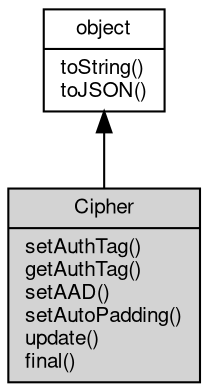

# 对象 Cipher
对称加密算法对象

## 继承关系


## 成员函数
        
### setAuthTag
**设置认证标签**

```JavaScript
Cipher Cipher.setAuthTag(Buffer buffer,
    String encoding = "buffer");
```

调用参数:
* buffer: [Buffer](Buffer.md), 指定认证标签数据
* encoding: String, 指定认证标签数据编码方式

返回结果:
* Cipher, 返回当前 Cipher 对象

--------------------------
**设置认证标签**

```JavaScript
Cipher Cipher.setAuthTag(String buffer,
    String encoding = "utf8");
```

调用参数:
* buffer: String, 指定认证标签数据
* encoding: String, 指定认证标签数据编码方式

返回结果:
* Cipher, 返回当前 Cipher 对象

--------------------------
### getAuthTag
**查询认证标签**

```JavaScript
Buffer Cipher.getAuthTag();
```

返回结果:
* [Buffer](Buffer.md), 返回认证标签数据

--------------------------
### setAAD
**设置附加身份验证数据**

```JavaScript
Cipher Cipher.setAAD(Buffer buffer,
    Object options = {});
```

调用参数:
* buffer: [Buffer](Buffer.md), 指定附加身份验证数据
* options: Object, 指定附加身份验证数据选项

返回结果:
* Cipher, 返回当前 Cipher 对象

--------------------------
**设置附加身份验证数据**

```JavaScript
Cipher Cipher.setAAD(String buffer,
    Object options = {});
```

调用参数:
* buffer: String, 指定附加身份验证数据
* options: Object, 指定附加身份验证数据选项

返回结果:
* Cipher, 返回当前 Cipher 对象

--------------------------
### setAutoPadding
**设置自动填充**

```JavaScript
Cipher Cipher.setAutoPadding(Boolean autoPadding = true);
```

调用参数:
* autoPadding: Boolean, 指定是否自动填充

返回结果:
* Cipher, 返回当前 Cipher 对象

--------------------------
### update
**更新数据**

```JavaScript
Value Cipher.update(Buffer data,
    String inputEncoding = "buffer",
    String outputEncoding = "buffer");
```

调用参数:
* data: [Buffer](Buffer.md), 指定要更新的数据
* inputEncoding: String, 指定输入数据编码方式
* outputEncoding: String, 指定输出数据编码方式

返回结果:
* Value, 返回更新后的数据

--------------------------
**更新数据**

```JavaScript
Value Cipher.update(String data,
    String inputEncoding = "utf8",
    String outputEncoding = "buffer");
```

调用参数:
* data: String, 指定要更新的数据
* inputEncoding: String, 指定输入数据编码方式
* outputEncoding: String, 指定输出数据编码方式

返回结果:
* Value, 返回更新后的数据

--------------------------
### final
**终止数据**

```JavaScript
Value Cipher.final(String outputEncoding = "buffer");
```

调用参数:
* outputEncoding: String, 指定输出数据编码方式

返回结果:
* Value, 返回更新后的数据

--------------------------
### toString
**返回对象的字符串表示，一般返回 "[Native Object]"，对象可以根据自己的特性重新实现**

```JavaScript
String Cipher.toString();
```

返回结果:
* String, 返回对象的字符串表示

--------------------------
### toJSON
**返回对象的 JSON 格式表示，一般返回对象定义的可读属性集合**

```JavaScript
Value Cipher.toJSON(String key = "");
```

调用参数:
* key: String, 未使用

返回结果:
* Value, 返回包含可 JSON 序列化的值

