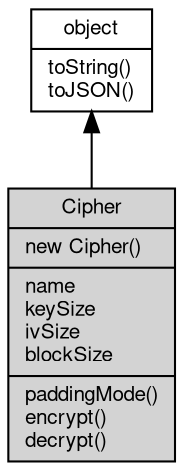

# 对象 Cipher
对称加密算法对象

Cipher 对象属于 [crypto](../../module/ifs/crypto.md) 模块，创建：

```JavaScript
var c = new crypto.Cipher(crypto.AES, crypto.ECB, ...);
```

下面以 AES 为例，演示如何使用 Cipher 对象进行加密和解密：

 首先，我们需要获取一个对称加密的 Cipher 对象，如 AES 加密算法：

```JavaScript
const crypto = require('crypto');
const key = crypto.randomBytes(16); // generate a 16-byte random key
const cipher = new crypto.Cipher(crypto.AES, crypto.ECB, key);
```

以上代码中，我们通过 ``randomBytes`` 方法生成了 16 字节的随机数，作为 AES 密钥。然后，我们创建了一个 AES 算法的 Cipher 对象，使用 ECB 分组密码工作模式，并使用生成的随机数作为密钥。

接下来，我们使用 Cipher 对象的 ``encrypt`` 方法对明文进行加密：

```JavaScript
const plaintext = 'Hello, world!';
const encrypted = cipher.encrypt(plaintext);
console.log(encrypted); // output encrypted data
```

以上代码中，我们使用 ``encrypt`` 方法对字符串 ``Hello, world!`` 进行加密，并输出加密后的结果。

针对以上代码，需要注意以下几点：

- 在进行加密之前，需要先创建一个对称加密的 Cipher 对象，并设置加密算法、密码和分组密码工作模式等参数。
- 在调用加密方法后，我们可以得到加密后的数据，这通常是一个 [Buffer](Buffer.md) 对象。需要注意，输出的是二进制数据，需要使用相应的方式打印，例如使用 ``Hex`` 等方式进行转换。

如果要解密该数据，我们同样需要一个 Cipher 对象，也是基于 AES 算法，且使用相同的 key 和分组密码工作模式：

```JavaScript
const decipher = new crypto.Cipher(crypto.AES, crypto.ECB, key);
const decrypted = decipher.decrypt(encrypted);
console.log(decrypted.toString()); // output decrypted data
```

在这里，我们创建了一个新的 Cipher 对象，使用相同的 key 和密码工作模式，并且使用 ``decrypt`` 方法对加密数据进行解密。解密的结果是一个 [Buffer](Buffer.md) 对象，需要转换为字符串才能被正确输出。

## 继承关系


## 构造函数
        
### Cipher
**Cipher 构造函数，仅用于 ARC4 初始化**

```JavaScript
new Cipher(Integer provider,
    Buffer key);
```

调用参数:
* provider: Integer, 指定加密算法
* key: [Buffer](Buffer.md), 指定加密解密密码

--------------------------
**Cipher 构造函数**

```JavaScript
new Cipher(Integer provider,
    Integer mode,
    Buffer key);
```

调用参数:
* provider: Integer, 指定加密算法
* mode: Integer, 指定分组密码工作模式
* key: [Buffer](Buffer.md), 指定加密解密密码

--------------------------
**Cipher 构造函数**

```JavaScript
new Cipher(Integer provider,
    Integer mode,
    Buffer key,
    Buffer iv);
```

调用参数:
* provider: Integer, 指定加密算法
* mode: Integer, 指定分组密码工作模式
* key: [Buffer](Buffer.md), 指定加密解密密码
* iv: [Buffer](Buffer.md), 指定初始向量

## 成员属性
        
### name
**String, 返回当前算法名称**

```JavaScript
readonly String Cipher.name;
```

--------------------------
### keySize
**Integer, 返回当前算法密码长度，以位为单位**

```JavaScript
readonly Integer Cipher.keySize;
```

--------------------------
### ivSize
**Integer, 返回当前算法初始向量长度，以字节为单位**

```JavaScript
readonly Integer Cipher.ivSize;
```

--------------------------
### blockSize
**Integer, 返回当前算法数据块长度，以字节为单位**

```JavaScript
readonly Integer Cipher.blockSize;
```

## 成员函数
        
### paddingMode
**使用填充模式**

```JavaScript
Cipher.paddingMode(Integer mode);
```

调用参数:
* mode: Integer, 指定填充模式，缺省为 PADDING_PKCS7

--------------------------
### encrypt
**使用当前算法密码加密数据**

```JavaScript
Buffer Cipher.encrypt(Buffer data) async;
```

调用参数:
* data: [Buffer](Buffer.md), 指定要加密的数据

返回结果:
* [Buffer](Buffer.md), 返回加密后的数据

--------------------------
### decrypt
**使用当前算法密码解密数据**

```JavaScript
Buffer Cipher.decrypt(Buffer data) async;
```

调用参数:
* data: [Buffer](Buffer.md), 指定要解密的数据

返回结果:
* [Buffer](Buffer.md), 返回解密后的数据

--------------------------
### toString
**返回对象的字符串表示，一般返回 "[Native Object]"，对象可以根据自己的特性重新实现**

```JavaScript
String Cipher.toString();
```

返回结果:
* String, 返回对象的字符串表示

--------------------------
### toJSON
**返回对象的 JSON 格式表示，一般返回对象定义的可读属性集合**

```JavaScript
Value Cipher.toJSON(String key = "");
```

调用参数:
* key: String, 未使用

返回结果:
* Value, 返回包含可 JSON 序列化的值

