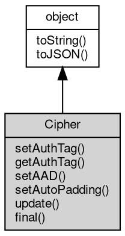

# Object Cipher
Symmetric cipher [object](object.md) that transforms a byte stream with a secret key

A Cipher is the [object](object.md) behind the [crypto.createCipheriv](../../module/ifs/crypto.md#createCipheriv) family: an encrypting
instance is created by `createCipheriv`/`createCipher`, a decrypting one by
`createDecipheriv`/`createDecipher`. Both sides of a conversation use the same
algorithm, key and IV; the sender feeds the plaintext through a Cipher and the
receiver feeds the ciphertext through a Decipher. Instances are stateful and
single-use: call `update` any number of times and `final` exactly once.

Concepts:
- **Modes and IV**: block ciphers (AES, SM4) need a mode such as 'cbc', 'ctr' or
  'gcm' and, for almost every mode, an unpredictable IV of the size reported by
  [crypto.getCipherInfo](../../module/ifs/crypto.md#getCipherInfo). Reusing an IV with the same key destroys the security
  guarantees, especially in CTR and GCM; generate it with [crypto.randomBytes](../../module/ifs/crypto.md#randomBytes) and
  send it next to the ciphertext. ECB uses no IV: pass an empty [Buffer](Buffer.md).
- **Pipeline and state**: `update` returns the transformed bytes, not the Cipher,
  so it cannot be chained; `setAAD`, `setAuthTag` and `setAutoPadding` return the
  Cipher and can be chained. `final` produces the last block. The [object](object.md) does not
  track its state strictly: after `final` the behavior is unspecified, so drop the
  instance instead of reusing it, as Node.js does.
- **Padding**: block modes require the plaintext to be a multiple of the block
  size. fibjs pads the last block automatically (PKCS#7) and removes the padding
  when decrypting; call `setAutoPadding(false)` when the data is already aligned or
  the protocol defines its own padding, then feed exactly the same length.
- **AEAD**: GCM, CCM, OCB and ChaCha20-Poly1305 authenticate the ciphertext with a
  tag. Encrypting: `setAAD`, `update`/`final`, then `getAuthTag`. Decrypting:
  `setAAD` with the same data, `setAuthTag`, then `update`/`final`; a mismatch makes
  `final` throw. The tag is 16 bytes by default; the `authTagLength` option selects
  another valid length at creation time (required for CCM and OCB; GCM accepts 4, 8
  and 12 to 16 bytes). fibjs does not require you to provide a tag: forgetting
  `setAuthTag` on a decipher returns unauthenticated plaintext, so always set it.
- **Output [encoding](../../module/ifs/encoding.md)**: `update`, `final` and the ciphertext forms return a [Buffer](Buffer.md)
  by default. With an output [encoding](../../module/ifs/encoding.md) they return a string produced by a
  [StringDecoder](StringDecoder.md), so multi-byte characters and partial blocks survive across calls;
  once a string [encoding](../../module/ifs/encoding.md) is used, every later call must use the same one and
  requesting a [Buffer](Buffer.md) afterwards throws "Inconsistent [encoding](../../module/ifs/encoding.md)".
- **Keys**: the key may be a [Buffer](Buffer.md), a string (always decoded as utf8) or a secret
  [KeyObject](KeyObject.md); any other [KeyObject](KeyObject.md) throws "Invalid key type".

Obtained from:
- `crypto.createCipheriv(algorithm, key, iv[, options])` — encrypt with an explicit
  key and IV;
- `crypto.createDecipheriv(algorithm, key, iv[, options])` — the decrypting
  counterpart;
- `crypto.createCipher(algorithm, password[, options])` and
  `crypto.createDecipher(algorithm, password[, options])` — legacy password-derived
  keys, kept for compatibility only.

Example 1 — AES-256-CBC with a fixed key and IV:

```JavaScript
const crypto = require('crypto');

// Fixed key and IV only to keep this example deterministic.
const key = Buffer.from('0123456789abcdef0123456789abcdef');
const iv = Buffer.from('0123456789abcdef');

const cipher = crypto.createCipheriv('aes-256-cbc', key, iv);
const ciphertext = Buffer.concat([cipher.update('The quick brown fox'), cipher.final()]);
console.log(ciphertext.toString('hex'));
// 3fb71aa5df5cb45088bb79102524e2abc7078c035faedf007eb212d98060f5f8

const decipher = crypto.createDecipheriv('aes-256-cbc', key, iv);
const plaintext = Buffer.concat([decipher.update(ciphertext), decipher.final()]);
console.log(plaintext.toString()); // The quick brown fox
```

Example 2 — AES-256-GCM with additional authenticated data and a tag:

```JavaScript
const crypto = require('crypto');

const key = Buffer.alloc(32, 7); // 32-byte key
const iv = Buffer.alloc(12, 3); // 12-byte nonce, unique per message in real code

const cipher = crypto.createCipheriv('aes-256-gcm', key, iv);
cipher.setAAD(Buffer.from('v1')); // authenticated but not encrypted
const ciphertext = Buffer.concat([cipher.update('secret message'), cipher.final()]);
const tag = cipher.getAuthTag();
console.log(tag.length); // 16

const decipher = crypto.createDecipheriv('aes-256-gcm', key, iv);
decipher.setAAD(Buffer.from('v1'));
decipher.setAuthTag(tag);
console.log(Buffer.concat([decipher.update(ciphertext), decipher.final()]).toString());
// secret message
```

Example 3 — streaming updates with a string output [encoding](../../module/ifs/encoding.md):

```JavaScript
const crypto = require('crypto');

const key = Buffer.from('0123456789abcdef0123456789abcdef');
const iv = Buffer.from('0123456789abcdef');

const cipher = crypto.createCipheriv('aes-256-cbc', key, iv);
// Nothing is emitted until a full block is available; concatenate the parts.
const first = cipher.update('hello', 'utf8', 'hex');
const second = cipher.update('world', 'utf8', 'hex');
const last = cipher.final('hex');
console.log(first + second + last);
// c69358c9b5fa6ca34727b9175610fc25
```

## Inheritance

```dot
digraph {
    node [fontname="Helvetica,sans-Serif", fontsize=10, shape="record", style="filled", fillcolor="white"];

    object [tooltip="object", URL="object.md", label="{object|toString()\ltoJSON()\l}"];
    Cipher [tooltip="Cipher", fillcolor="lightgray", id="me", label="{Cipher|setAuthTag()\lgetAuthTag()\lsetAAD()\lsetAutoPadding()\lupdate()\lfinal()\l}"];

    object -> Cipher [dir=back];
}
```

## Methods
        
### setAuthTag
**Supplies the authentication tag when decrypting an AEAD cipher**

```JavaScript
Cipher Cipher.setAuthTag(Buffer | String buffer,
    String encoding = "utf8");
```

Parameters:
* buffer: [Buffer](Buffer.md) | String, the authentication tag data
* encoding: String, the [encoding](../../module/ifs/encoding.md) of a string authentication tag data, default "utf8"

Returns:
* Cipher, returns the current Cipher [object](object.md)

Valid only on a decrypting Cipher in an authenticated mode, only once, and
before final(). The buffer form takes the bytes as they are; a string is decoded
with [encoding](../../module/ifs/encoding.md) (default "utf8"). The tag length must match the authTagLength
option given to [crypto.createDecipheriv](../../module/ifs/crypto.md#createDecipheriv) (16 by default for GCM and
chacha20-poly1305). Calling it on an encrypting Cipher, twice, or with a wrong
length throws "Invalid setAuthTag"/"Invalid authTagLength"; Node.js enforces the
same rules with its own error codes.

Example: the tag and AAD together authenticate the ciphertext:

```JavaScript
const crypto = require('crypto');

const key = Buffer.alloc(32, 7);
const iv = Buffer.alloc(12, 3);
const cipher = crypto.createCipheriv('aes-256-gcm', key, iv);
cipher.setAAD(Buffer.from('v1'));
const ciphertext = Buffer.concat([cipher.update('secret message'), cipher.final()]);
const tag = cipher.getAuthTag();

const decipher = crypto.createDecipheriv('aes-256-gcm', key, iv);
decipher.setAAD(Buffer.from('v1'));
decipher.setAuthTag(tag);
console.log(Buffer.concat([decipher.update(ciphertext), decipher.final()]).toString());
// secret message
```

--------------------------
### getAuthTag
**Returns the authentication tag produced by an AEAD encryption**

```JavaScript
Buffer Cipher.getAuthTag();
```

Returns:
* [Buffer](Buffer.md), returns the authentication tag data

Valid only after final() on an encrypting Cipher in an authenticated mode. The
returned [Buffer](Buffer.md) holds authTagLength bytes (16 unless another length was selected
at creation time). Calling it before final(), on a decrypting Cipher, or on a
non-AEAD algorithm throws "Invalid authTag". The tag is not secret but must be
transmitted with the ciphertext and checked by the receiver; a missing tag on
the decrypting side is not detected, so treat the tag as mandatory.

--------------------------
### setAAD
**Supplies the additional authenticated data (AAD) of an AEAD cipher**

```JavaScript
Cipher Cipher.setAAD(Buffer | String buffer,
    Object options = {});
```

Parameters:
* buffer: [Buffer](Buffer.md) | String, the additional authenticated data
* options: Object, the additional authenticated data options to use

Returns:
* Cipher, returns the current Cipher [object](object.md)

Valid only in authenticated modes and, on both the encrypting and the decrypting
side, before the first update(). The same AAD must be given on both sides: it is
authenticated (any change makes final() throw) but not encrypted. A string is
decoded with options.encoding (default "utf8"); the buffer form takes the bytes
as they are. In CCM mode setAAD() requires options.plaintextLength, the byte
length of the plaintext, on both sides. Calling it on a non-AEAD Cipher or too
late throws "Invalid setAAD" (Node.js reports ERR_CRYPTO_INVALID_STATE).

options supports the following options:

```JavaScript
// fragment: options accepted by setAAD
({
    "encoding": "utf8", // how a string buffer is decoded
    "plaintextLength": -1 // CCM only: plaintext byte length, required
})
```

--------------------------
### setAutoPadding
**Enables or disables automatic PKCS#7 padding**

```JavaScript
Cipher Cipher.setAutoPadding(Boolean autoPadding = true);
```

Parameters:
* autoPadding: Boolean, specifies whether to pad automatically

Returns:
* Cipher, returns the current Cipher [object](object.md)

Enabled by default. Leave it on for block modes when the data is not aligned to
the block size; call setAutoPadding(false) when the protocol defines its own
padding and pass whole blocks. With padding disabled, final() throws when the
accumulated length is not a multiple of the block size. It must be called before
final() and works on both encrypting and decrypting Ciphers; Node.js provides
the same switch.

Example: aligned data with padding disabled round-trips exactly:

```JavaScript
const crypto = require('crypto');

const key = Buffer.alloc(32, 1);
const iv = Buffer.alloc(16, 2);
const cipher = crypto.createCipheriv('aes-256-cbc', key, iv);
cipher.setAutoPadding(false);
const ciphertext = Buffer.concat([cipher.update(Buffer.alloc(16, 5)), cipher.final()]);
console.log(ciphertext.length); // 16

const decipher = crypto.createDecipheriv('aes-256-cbc', key, iv);
decipher.setAutoPadding(false);
const plaintext = Buffer.concat([decipher.update(ciphertext), decipher.final()]);
console.log(plaintext.equals(Buffer.alloc(16, 5))); // true
```

--------------------------
### update
**Transforms the next part of the data stream**

```JavaScript
Value Cipher.update(Buffer | String data,
    String inputEncoding = "utf8",
    String outputEncoding = "buffer");
```

Parameters:
* data: [Buffer](Buffer.md) | String, the data to update
* inputEncoding: String, the [encoding](../../module/ifs/encoding.md) of the input data, default "utf8"
* outputEncoding: String, the [encoding](../../module/ifs/encoding.md) of the output data

Returns:
* Value, returns the updated data

data may be a [Buffer](Buffer.md) or a string decoded with inputEncoding (default "utf8"); a
[Buffer](Buffer.md) ignores inputEncoding. The return value is the transformed data, not the
Cipher: with outputEncoding "buffer" (default) a [Buffer](Buffer.md), otherwise a string in
that [encoding](../../module/ifs/encoding.md). The string form goes through a [StringDecoder](StringDecoder.md), so a multi-byte
character or a partial block may be buffered and returned by a later call. Once
a string output [encoding](../../module/ifs/encoding.md) is used, all later update()/final() calls must use the
same [encoding](../../module/ifs/encoding.md), otherwise "Inconsistent [encoding](../../module/ifs/encoding.md)" is thrown. In CCM mode the
message length is bounded by the mode (about 2^24-1 bytes); the bound depends on
the IV length. Calling update() after final() is not supported and may throw an
OpenSSL error; Node.js raises ERR_CRYPTO_INVALID_STATE instead.

--------------------------
### final
**Finalizes the stream and returns the last transformed block**

```JavaScript
Value Cipher.final(String outputEncoding = "buffer");
```

Parameters:
* outputEncoding: String, the [encoding](../../module/ifs/encoding.md) of the output data

Returns:
* Value, returns the updated data

Writes the pending padding (when enabled) or the buffered block and closes the
Cipher; call it exactly once. In an authenticated mode, encryption final()
computes the tag later returned by getAuthTag(), while decryption final()
verifies the tag supplied with setAuthTag and throws when it does not match (the
message comes from OpenSSL). For CCM decryption the authentication result is
reported here even when update() already returned the plaintext. outputEncoding
must match any string [encoding](../../module/ifs/encoding.md) used by update() before; with "buffer" a [Buffer](Buffer.md)
is returned. After final() the instance must not be reused; Node.js throws
ERR_CRYPTO_INVALID_STATE on reuse.

--------------------------
### toString
**Returns the string form of the [object](object.md)**

```JavaScript
String Cipher.toString();
```

Returns:
* String, returns the string form of the [object](object.md)

The base implementation reports an error: a native [object](object.md) has no implicit
text form, and only the classes whose value can be written as a string
override the member. [Buffer](Buffer.md) returns its content decoded with the given
[encoding](../../module/ifs/encoding.md), [HttpCookie](HttpCookie.md) returns "name=value", and so on; an override commonly
accepts optional arguments ([Buffer.toString](Buffer.md#toString) takes [encoding](../../module/ifs/encoding.md), start and
end) that are not part of this declaration.

Calling the member on a class that does not override it throws
"<Class>: the [object](object.md) can not be converted to string.", which is the
behavior to rely on when probing whether a value has a string form. See
toJSON for the serialization hook.

--------------------------
### toJSON
**Returns the JSON representation of the [object](object.md)**

```JavaScript
Value Cipher.toJSON(String key = "");
```

Parameters:
* key: String, the property name of the value being serialized

Returns:
* Value, returns the JSON-serializable value

JSON.stringify(value) calls value.toJSON(key) when the member exists and
serializes the returned value in its place; the key argument carries the
property name of the value inside its parent [object](object.md) (an empty string at
the top level) and may be used to build a keyed form. The base
implementation returns a plain [object](object.md) holding the readable properties of
the instance, so a native [object](object.md) serializes without per-class code; a
class with a portable shape such as [Buffer](Buffer.md) overrides it, and a JavaScript
class may override it in the same way.

The member is normally reached through JSON.stringify rather than called
directly; calling it returns the same value JSON.stringify would
serialize.

