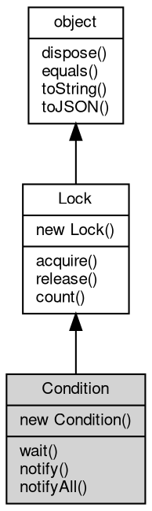

# 对象 Condition
条件变量对象

条件变量是利用纤程间共享的全局变量来进行同步的一种机制，主要包括两个动作：
1）一个线程等待某个条件成立，而将自己挂起；
2）另一个线程使条件成立，并通知等待的纤程向下执行。

为了防止竞争，每个条件变量都需要一个[Lock](Lock.md)的配合（[Lock](Lock.md)可自行显式创建并传递进来，也可交由fibjs为您创建）

通过使用条件变量，可以利用一个条件变量控制一批纤程的开关；

以下是两个纤程调度的实例：

```JavaScript
var coroutine = require("coroutine");
var cond = new coroutine.Condition();
var ready = false;
var state = "ready";

function funcwait() {
    cond.acquire();
    while (!ready)
        cond.wait();
    state = "go"
    cond.release();
}

coroutine.start(funcwait);

cond.acquire();
console.log(state)
ready = true;
cond.notify();
coroutine.sleep();
console.log(state);
```

will output:
```sh
ready
go
```

## 继承关系


## 构造函数
        
### Condition
**条件变量构造函数（条件变量所需的锁由fibjs内部构造）**

```JavaScript
new Condition();
```

--------------------------
**条件变量构造函数**

```JavaScript
new Condition(Lock lock);
```

调用参数:
* lock: [Lock](Lock.md), 使用自行构造的锁

## 成员函数
        
### wait
**使纤程进入阻塞状态**

```JavaScript
Condition.wait();
```

--------------------------
### notify
**通知一个被阻塞的纤程（最后加入纤程池的）向下继续执行**

```JavaScript
Condition.notify();
```

--------------------------
### notifyAll
**通知所有被阻塞的纤程向下继续执行**

```JavaScript
Condition.notifyAll();
```

--------------------------
### acquire
**获取锁的拥有权**

```JavaScript
Boolean Condition.acquire(Boolean blocking = true);
```

调用参数:
* blocking: Boolean, 指定是否等待，为 true 时等待，缺省为真

返回结果:
* Boolean, 返回是否成功获取锁，为 true 表示成功获取

acquire 方法用于获取锁的拥有权，当锁处于可获取状态时，此方法立即返回 true。

当锁不可获取，且 blocking 为 true，则当前纤程进入休眠，当其他纤程释放锁后，此方法返回 true。

当锁不可获取，且 blocking 为 false，则方法返回 false。

--------------------------
### release
**释放锁的拥有权**

```JavaScript
Condition.release();
```

此方法将释放对锁的拥有权，如果当前纤程未拥有锁，此方法将抛出错误。

--------------------------
### count
**查询当前等待任务数**

```JavaScript
Integer Condition.count();
```

返回结果:
* Integer, 返回任务数

--------------------------
### dispose
**强制回收对象，调用此方法后，对象资源将立即释放**

```JavaScript
Condition.dispose();
```

--------------------------
### equals
**比较当前对象与给定的对象是否相等**

```JavaScript
Boolean Condition.equals(object expected);
```

调用参数:
* expected: [object](object.md), 制定比较的目标对象

返回结果:
* Boolean, 返回对象比较的结果

--------------------------
### toString
**返回对象的字符串表示，一般返回 "[Native Object]"，对象可以根据自己的特性重新实现**

```JavaScript
String Condition.toString();
```

返回结果:
* String, 返回对象的字符串表示

--------------------------
### toJSON
**返回对象的 JSON 格式表示，一般返回对象定义的可读属性集合**

```JavaScript
Value Condition.toJSON(String key = "");
```

调用参数:
* key: String, 未使用

返回结果:
* Value, 返回包含可 JSON 序列化的值

