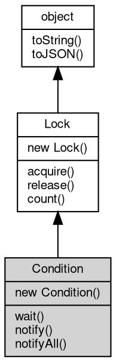

# Object Condition
A condition variable: park fibers until shared state becomes true

A Condition lets fibers wait for a state instead of polling. `wait` releases the lock
that protects the state and parks the calling fiber, then re-acquires the lock before
returning; a fiber that changed the state calls `notify` to wake one waiter or
`notifyAll` to wake all of them. Every Condition is bound to a lock — one supplied to
the constructor or an internal one created for the condition — and derives from [Lock](Lock.md),
so `acquire`, `release` and `count` operate on that lock.

Concepts:

- **[Lock](Lock.md) protocol**: acquire the lock, [test](../../module/ifs/test.md) the condition and call `wait` while it is
false. `wait` releases the lock before parking and re-acquires it before returning, so
another fiber cannot change the state between the [test](../../module/ifs/test.md) and the wait. Always wait in a
`while` loop: a waiter may be woken by `notifyAll`, or the condition may already have
been consumed by another fiber.
- **notify releases the lock**: `notify` and `notifyAll` release the caller's lock
(one level, exactly like `release`) before waking the waiters, which then re-acquire
it one by one. The notifying fiber no longer holds the lock afterwards, so re-acquire
it before touching the shared state again.
- **Timeout**: `wait(ms)` returns true when it was notified and false when the timeout
elapsed first; the lock is re-acquired in both cases. The default is -1, which waits
forever.
- **Diagnostics**: `count()` reports how many fibers are parked in wait, not how many
wait for the lock.
- **Related primitives**: Condition waits for an arbitrary state, [Event](Event.md) releases a
group of fibers at once without a lock, [Semaphore](Semaphore.md) counts permits; all of them park
only the calling fiber.
- **Node.js**: there is no condition variable in Node.js. The usual substitute is a
promise that the state change resolves, which cannot release a lock atomically because
Node.js has no fiber-level locks.

Obtained from:
- `new [coroutine.Condition](../../module/ifs/coroutine.md#Condition)()` — creates the condition with its own internal lock;
- `new [coroutine.Condition](../../module/ifs/coroutine.md#Condition)(lock)` — binds it to an existing lock (a [Lock](Lock.md), or another
[Lock](Lock.md)-derived [object](object.md) such as a [Semaphore](Semaphore.md) or an [Event](Event.md)).

Example 1 — a worker parks until the main fiber flips a flag:

```JavaScript
const coroutine = require('coroutine');

const cond = new coroutine.Condition();
let ready = false;

const worker = coroutine.start(function() {
    cond.acquire();
    while (!ready)
        cond.wait(); // releases the lock while parked
    console.log('worker saw ready = true');
    cond.release();
});

coroutine.sleep(5);
cond.acquire();
ready = true;
cond.notify(); // wakes the worker and releases the lock
worker.join();
console.log('main done');
```

will output:
```sh
worker saw ready = true
main done
```

Example 2 — notifyAll wakes every parked fiber:

```JavaScript
const coroutine = require('coroutine');

const cond = new coroutine.Condition();
let woken = 0;

for (let i = 0; i < 3; i++) {
    coroutine.start(function() {
        cond.acquire();
        cond.wait(200);
        woken++;
        cond.release();
    });
}

coroutine.sleep(5);
cond.acquire();
console.log('parked waiters:', cond.count());
cond.notifyAll();
cond.release();

coroutine.sleep(20);
console.log('woken:', woken);
```

will output:
```sh
parked waiters: 3
woken: 3
```

## Inheritance

```dot
digraph {
    node [fontname="Helvetica,sans-Serif", fontsize=10, shape="record", style="filled", fillcolor="white"];

    object [tooltip="object", URL="object.md", label="{object|toString()\ltoJSON()\l}"];
    Lock [tooltip="Lock", URL="Lock.md", label="{Lock|new Lock()\l|acquire()\lrelease()\lcount()\l}"];
    Condition [tooltip="Condition", fillcolor="lightgray", id="me", label="{Condition|new Condition()\l|wait()\lnotify()\lnotifyAll()\l}"];

    object -> Lock [dir=back];
    Lock -> Condition [dir=back];
}
```

## Constructors
        
### Condition
**Creates a condition variable with its own internal lock**

```JavaScript
new Condition();
```

The internal lock is created by fibjs and is only reachable through this condition, so
the acquire/release protocol of the condition also applies to it.

--------------------------
**Creates a condition variable bound to the given lock**

```JavaScript
new Condition(Lock lock);
```

Parameters:
* lock: [Lock](Lock.md), the lock used by the condition

The supplied lock becomes the lock of the condition: `acquire` and `release` act on it
and `wait` releases and re-acquires it. Any [Lock](Lock.md)-derived [object](object.md) can be passed, which
allows one lock to protect several conditions or to be shared with other primitives.
The caller keeps ownership of the [object](object.md) and must not use a lock that is acquired
elsewhere in an incompatible way.

## Methods
        
### wait
**Waits until notified or until the timeout elapses**

```JavaScript
Boolean Condition.wait(Integer timeout = -1) async;
```

Parameters:
* timeout: Integer, maximum time to wait in milliseconds, -1 waits forever

Returns:
* Boolean, true when notified, false on timeout

The call must be made while the calling fiber owns the lock: it releases the lock,
parks the fiber, and re-acquires the lock before returning, which makes the
[test](../../module/ifs/test.md)-then-wait sequence atomic with respect to other fibers. It returns true when it
was woken by `notify`/`notifyAll` and false when the timeout elapsed first; the
default timeout is -1, which waits forever. `waitAsync(ms)` is the promise form.

Example — a timeout returns false and the lock is held again afterwards:

```JavaScript
const coroutine = require('coroutine');

const cond = new coroutine.Condition();
cond.acquire();

const start = Date.now();
console.log('wait(20) timed out:', cond.wait(20) === false);
console.log('waited at least 15ms:', Date.now() - start >= 15);

cond.release();
```

will output:
```sh
wait(20) timed out: true
waited at least 15ms: true
```

--------------------------
### notify
**Wakes one parked fiber**

```JavaScript
Condition.notify();
```

Releases the caller's lock and resumes the fiber that has been waiting the longest, if
any; with no waiter the call only releases the lock. The call returns undefined, and
the notifying fiber must re-acquire the lock before touching the shared state again.

Example — waking a single waiter releases the caller's lock:

```JavaScript
const coroutine = require('coroutine');

const cond = new coroutine.Condition();
let ready = false;

const worker = coroutine.start(function() {
    cond.acquire();
    while (!ready)
        cond.wait();
    console.log('worker released');
    cond.release();
});

coroutine.sleep(5);
cond.acquire();
console.log('parked waiters:', cond.count());
ready = true;
cond.notify(); // releases the lock, so no release() below
console.log('main continues');
worker.join();
```

will output:
```sh
parked waiters: 1
main continues
worker released
```

--------------------------
### notifyAll
**Wakes every parked fiber**

```JavaScript
Condition.notifyAll();
```

Releases the caller's lock and resumes every fiber waiting on the condition; each of
them re-acquires the lock in turn. Use it when a state change satisfies the condition
of several waiters at once, for example when a queue is closed or a batch is
published. The call returns undefined.

--------------------------
### acquire
**Acquires the lock**

```JavaScript
Boolean Condition.acquire(Boolean blocking = true) async;
```

Parameters:
* blocking: Boolean, true to wait for the lock, false to return immediately

Returns:
* Boolean, true when the lock was acquired, false only with `blocking` false

When the lock is free the call returns true at once. When another fiber owns it and
`blocking` is true (the default), the calling fiber is suspended until that fiber
releases the lock, and the call then returns true; when `blocking` is false the call
returns false immediately without waiting. The owner may acquire the lock again, so
`acquire(false)` from the owning fiber returns true even if other fibers are waiting.
The argument is coerced to boolean, and `acquireAsync()` is the promise form that does
not block the calling fiber.

Example — the same fiber may re-enter the lock:

```JavaScript
const coroutine = require('coroutine');

const lock = new coroutine.Lock();

console.log('first acquire:', lock.acquire());
console.log('acquire again in the same fiber:', lock.acquire());
lock.release();
console.log('after one release, acquire(false):', lock.acquire(false));
lock.release();
lock.release();

console.log('fibers waiting:', lock.count());
```

will output:
```sh
first acquire: true
acquire again in the same fiber: true
after one release, acquire(false): true
fibers waiting: 0
```

--------------------------
### release
**Releases the lock**

```JavaScript
Condition.release();
```

Removes one level of ownership from the calling fiber; the lock becomes free for other
fibers when the last level is released, and one of the waiting fibers is resumed.
Releasing a lock that the calling fiber does not own is a programming error: debug
builds abort on the assertion, while release builds silently corrupt the lock state,
so keep the calls balanced with `try`/`finally`. The call returns undefined.

--------------------------
### count
**Number of fibers blocked in acquire**

```JavaScript
Integer Condition.count();
```

Returns:
* Integer, number of fibers waiting for the lock

The value covers the waits on this lock only: the owning fiber and fibers that used
`acquire(false)` are not counted, and the recursion depth of the owner is not
reported. Use it for diagnostics and monitoring, never as a synchronization condition.

--------------------------
### toString
**Returns the string form of the [object](object.md)**

```JavaScript
String Condition.toString();
```

Returns:
* String, returns the string form of the [object](object.md)

The base implementation reports an error: a native [object](object.md) has no implicit
text form, and only the classes whose value can be written as a string
override the member. [Buffer](Buffer.md) returns its content decoded with the given
[encoding](../../module/ifs/encoding.md), [HttpCookie](HttpCookie.md) returns "name=value", and so on; an override commonly
accepts optional arguments ([Buffer.toString](Buffer.md#toString) takes [encoding](../../module/ifs/encoding.md), start and
end) that are not part of this declaration.

Calling the member on a class that does not override it throws
"<Class>: the [object](object.md) can not be converted to string.", which is the
behavior to rely on when probing whether a value has a string form. See
toJSON for the serialization hook.

--------------------------
### toJSON
**Returns the JSON representation of the [object](object.md)**

```JavaScript
Value Condition.toJSON(String key = "");
```

Parameters:
* key: String, the property name of the value being serialized

Returns:
* Value, returns the JSON-serializable value

JSON.stringify(value) calls value.toJSON(key) when the member exists and
serializes the returned value in its place; the key argument carries the
property name of the value inside its parent [object](object.md) (an empty string at
the top level) and may be used to build a keyed form. The base
implementation returns a plain [object](object.md) holding the readable properties of
the instance, so a native [object](object.md) serializes without per-class code; a
class with a portable shape such as [Buffer](Buffer.md) overrides it, and a JavaScript
class may override it in the same way.

The member is normally reached through JSON.stringify rather than called
directly; calling it returns the same value JSON.stringify would
serialize.

