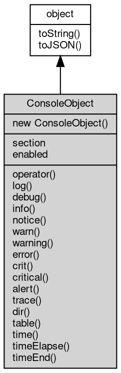

# Object ConsoleObject
Console-like logger bound to a pair of writable objects

A ConsoleObject writes log records to two writable objects: the stdout [object](object.md)
receives INFO and PRINT records, the stderr [object](object.md) receives WARN, ERROR, CRIT,
ALERT and `trace` records. The class is exposed as `console.Console` (there is no
[global](../../module/ifs/global.md) `ConsoleObject`) and is also the type returned by `util.debuglog` and
`util.debug`, which binds the same methods to the [process](../../module/ifs/process.md)-wide logging system
with a section prefix instead of explicit streams.

Concepts:

- **Per-instance streams and [timers](../../module/ifs/timers.md)**: the streams are captured when the [object](object.md)
  is created; `time`, `timeElapse` and `timeEnd` keep their [timers](../../module/ifs/timers.md) per instance,
  so they are independent of the [console](../../module/ifs/console.md) [module](../../module/ifs/module.md) [timers](../../module/ifs/timers.md) and of other instances.
- **Writable objects**: a stream is anything with a `write(text)` method, not
  necessarily an [io](../../module/ifs/io.md) stream. The formatted record and a trailing newline are
  passed to write() synchronously and its return value is ignored.
- **Filtering**: the [global](../../module/ifs/global.md) `console.loglevel` applies to every instance. For a
  debug logger the section must additionally be listed in NODE_DEBUG for INFO
  and DEBUG records; WARN and above are written even when the section is
  disabled, while Node.js drops every level of a disabled debug logger.
- **Node.js differences**: there is no `print`, `assert`, `count`, `countReset`,
  `timeLog`, `group`, `groupEnd` or `dirxml` on this [object](object.md); `operator(...)`
  makes the [object](object.md) callable as a debug logger, which Node.js provides for
  [util.debuglog](../../module/ifs/util.md#debuglog) but not for [console.Console](../../module/ifs/console.md#Console).

Obtained from:

- `new [console.Console](../../module/ifs/console.md#Console)()` — writes through the [global](../../module/ifs/global.md) logging devices, prefixed
  with `"<pid>: "`;
- `new [console.Console](../../module/ifs/console.md#Console)(out)` — one writable [object](object.md) for both streams;
- `new [console.Console](../../module/ifs/console.md#Console)(out, err)` — separate stdout and stderr objects;
- `new [console.Console](../../module/ifs/console.md#Console)({ "stdout": out, "stderr": err })` — options form, `out`
  is required and `err` defaults to it;
- `util.debuglog(section)` / `[util.debug](../../module/ifs/util.md#debug)(section)` — conditional debug logger
  selected by the NODE_DEBUG environment variable.

Example 1 — capture stdout and stderr separately:

```JavaScript
const io = require('io');
const out = new io.MemoryStream();
const err = new io.MemoryStream();
const c = new console.Console(out, err);

c.log('to stdout');
c.error('to stderr');

out.rewind();
err.rewind();
console.log(out.readAll().toString().trim()); // to stdout
console.log(err.readAll().toString().trim()); // to stderr
```

Example 2 — options form with a plain writable [object](object.md):

```JavaScript
let captured = '';
const c = new console.Console({
    stdout: {
        write: (text) => {
            captured += text;
        }
    }
});
c.log('custom sink');
console.log(JSON.stringify(captured)); // "custom sink\n"
```

Example 3 — sample a per-instance timer:

```JavaScript
const io = require('io');
const out = new io.MemoryStream();
const c = new console.Console(out, out);

c.time('work');
let sum = 0;
for (let i = 0; i < 100000; i++) sum += i;
c.timeEnd('work');

out.rewind();
console.log(out.readAll().toString().startsWith('work: ')); // true
```

## Inheritance


## Constructors
        
### ConsoleObject
**Creates a logger that writes through the [global](../../module/ifs/global.md) logging devices**

```JavaScript
new ConsoleObject();
```

The instance has no stream of its own: every record goes to the devices
configured with [console.add](../../module/ifs/console.md#add)/use (the built-in [console](../../module/ifs/console.md) device by default) and
is prefixed with `"<pid>: "`. Use the two-argument form to write to explicit
streams instead.

--------------------------
**Creates a logger bound to writable objects**

```JavaScript
new ConsoleObject(Value out,
    Value err = undefined);
```

Parameters:
* out: Value, writable [object](object.md) for INFO and PRINT records, or an options [object](object.md)
* err: Value, writable [object](object.md) for WARN and above; defaults to out

`out` must be a writable [object](object.md), that is any [object](object.md) with a `write()` method
such as an [io](../../module/ifs/io.md) stream; when `err` is omitted, null or undefined it defaults
to `out`, otherwise it must be writable too. When the single argument is an
[object](object.md) without a `write()` method it is read as an options [object](object.md) with
`stdout` and `stderr` properties, where `stdout` is required and `stderr`
defaults to `out`. Invalid arguments throw Error 20024, for example
"ConsoleObject: stdout must have a write() method." or "ConsoleObject:
options.stdout is required.". Each record is the formatted text plus a
newline, written synchronously; the [global](../../module/ifs/global.md) logging system is not used.

Example:

```JavaScript
const io = require('io');
const out = new io.MemoryStream();
const c = new console.Console({
    stdout: out
});

c.log('captured');

out.rewind();
console.log(JSON.stringify(out.readAll().toString())); // "captured\n"
```

## Properties
        
### section
**String, Section name of a debug logger; empty for a stream [console](../../module/ifs/console.md)**

```JavaScript
readonly String ConsoleObject.section;
```

Set when the [object](object.md) comes from `util.debuglog(section)` or
`util.debug(section)` and empty for a [console.Console](../../module/ifs/console.md#Console) instance created with
streams. Together with the [process](../../module/ifs/process.md) id it forms the record prefix
(`SECTION pid: `), shown in upper case, that the debug logger adds when it
writes to the [global](../../module/ifs/global.md) devices.

Example:

```JavaScript
const util = require('util');
const log = util.debuglog('myapp');
console.log(log.section); // myapp
```

--------------------------
### enabled
**Boolean, Whether a debug logger is enabled by the NODE_DEBUG environment variable**

```JavaScript
readonly Boolean ConsoleObject.enabled;
```

A section is enabled when it appears, case-insensitively, as a
comma-separated entry of NODE_DEBUG; the value is re-checked for every
record and is always true for a stream [console](../../module/ifs/console.md) with an empty section. When
the section is disabled INFO and DEBUG records are dropped while WARN and
above are still written; Node.js drops every level of a disabled debug
logger.

Example:

```JavaScript
const util = require('util');
console.log(util.debuglog('myapp').enabled); // false unless NODE_DEBUG=myapp
```

## Methods
        
### operator
**Callable form of this [object](object.md); logs at DEBUG level like debug**

```JavaScript
ConsoleObject.operator(...args);
```

Parameters:
* args: ..., optional argument list

Calling the [object](object.md) itself, `logger('message')` or `logger('%s', value)`, is
equivalent to `debug(...)`: the record is written at DEBUG(7) and filtered
by the [global](../../module/ifs/global.md) loglevel. `util.debuglog(section)` returns such a callable
logger, which is how Node.js code normally uses it.

Example:

```JavaScript
const io = require('io');
const out = new io.MemoryStream();
const c = new console.Console(out, out);

c('called as a function');

out.rewind();
console.log(out.readAll().toString().trim()); // called as a function
```

--------------------------
### log
**Writes an INFO record to the stdout [object](object.md)**

```JavaScript
ConsoleObject.log(...args);
```

Parameters:
* args: ..., optional argument list

The record is the formatted text plus a newline, written synchronously to
the stdout [object](object.md) given to the constructor; the [global](../../module/ifs/global.md) [console.loglevel](../../module/ifs/console.md#loglevel) can
filter it. A leading string argument is a printf-like template where only
`%s`, `%d`, `%j` and `%%` are substituted; other specifiers stay literal and
their values are appended at the end. Level INFO(6).

Example:

```JavaScript
const io = require('io');
const out = new io.MemoryStream();
const c = new console.Console(out, out);

c.log('value = %d', 42);

out.rewind();
console.log(JSON.stringify(out.readAll().toString())); // "value = 42\n"
```

--------------------------
### debug
**Writes a DEBUG record to the stdout [object](object.md)**

```JavaScript
ConsoleObject.debug(...args);
```

Parameters:
* args: ..., optional argument list

The lowest standard level, useful when [console.loglevel](../../module/ifs/console.md#loglevel) is raised to DEBUG
to trace execution; a disabled debug logger drops this level. The record
goes to the stdout [object](object.md) and accepts the same printf-like template as
`log`. Level DEBUG(7).

--------------------------
### info
**Writes an INFO record to the stdout [object](object.md), same as log**

```JavaScript
ConsoleObject.info(...args);
```

Parameters:
* args: ..., optional argument list

Identical to `log`; the name follows the Node.js [console](../../module/ifs/console.md) surface. Level
INFO(6).

--------------------------
### notice
**Writes a NOTICE record to the stdout [object](object.md)**

```JavaScript
ConsoleObject.notice(...args);
```

Parameters:
* args: ..., optional argument list

Records a normal but significant message; less severe than WARN and more
important than INFO. Level NOTICE(5); this is a fibjs extension, Node.js has
no [console.notice](../../module/ifs/console.md#notice).

--------------------------
### warn
**Writes a WARN record to the stderr [object](object.md)**

```JavaScript
ConsoleObject.warn(...args);
```

Parameters:
* args: ..., optional argument list

Warning messages go to the stderr writable [object](object.md) because WARN(4) is one of
the error levels; for a debug logger the section prefix is added. Accepts
the printf-like template of `log`. Node.js [console.warn](../../module/ifs/console.md#warn) also writes to
stderr.

Example:

```JavaScript
const io = require('io');
const out = new io.MemoryStream();
const err = new io.MemoryStream();
const c = new console.Console(out, err);

c.warn('disk %d%% full', 91);

err.rewind();
console.log(err.readAll().toString().trim()); // disk 91% full
```

--------------------------
### warning
**Writes a WARN record to the stderr [object](object.md), same as warn**

```JavaScript
ConsoleObject.warning(...args);
```

Parameters:
* args: ..., optional argument list

Identical to `warn`; kept as a separate name for code that reads better
with the long form. Node.js has no [console.warning](../../module/ifs/console.md#warning).

--------------------------
### error
**Writes an ERROR record to the stderr [object](object.md)**

```JavaScript
ConsoleObject.error(...args);
```

Parameters:
* args: ..., optional argument list

Records an error and writes it to the stderr [object](object.md); for a debug logger the
section prefix is added. Level ERROR(3). Node.js [console.error](../../module/ifs/console.md#error) also writes
to stderr.

--------------------------
### crit
**Writes a CRIT record to the stderr [object](object.md), same as critical**

```JavaScript
ConsoleObject.crit(...args);
```

Parameters:
* args: ..., optional argument list

Records a critical condition and writes it to the stderr [object](object.md). Level
CRIT(2), below ERROR in number and therefore more severe.

--------------------------
### critical
**Writes a CRIT record to the stderr [object](object.md)**

```JavaScript
ConsoleObject.critical(...args);
```

Parameters:
* args: ..., optional argument list

Records a critical condition and writes it to the stderr [object](object.md); identical
to `crit`. Level CRIT(2); Node.js has no [console.critical](../../module/ifs/console.md#critical).

--------------------------
### alert
**Writes an ALERT record to the stderr [object](object.md)**

```JavaScript
ConsoleObject.alert(...args);
```

Parameters:
* args: ..., optional argument list

Records the most severe condition at ALERT(1); it is the highest severity
level, meant for conditions that need immediate action. Node.js has no
[console.alert](../../module/ifs/console.md#alert).

--------------------------
### trace
**Writes a call stack at WARN level to the stderr [object](object.md)**

```JavaScript
ConsoleObject.trace(...args);
```

Parameters:
* args: ..., optional argument list

Formats the optional arguments like `log`, prefixes the text with `Trace: `
and appends the current call stack, then writes the whole record to the
stderr [object](object.md) at WARN(4) level.

--------------------------
### dir
**Renders a value with [util.inspect](../../module/ifs/util.md#inspect) and writes it to the stdout [object](object.md)**

```JavaScript
ConsoleObject.dir(Value obj,
    Object options = {});
```

Parameters:
* obj: Value, specifies the [object](object.md) to [process](../../module/ifs/process.md)
* options: Object, specifies the format control options

Like [console.dir](../../module/ifs/console.md#dir), but the record goes to this instance's stdout [object](object.md)
instead of the [global](../../module/ifs/global.md) devices. options are the [util.inspect](../../module/ifs/util.md#inspect) options
(`colors`, `depth`, `table`, `fields`, `encode_string`, `maxArrayLength`,
`maxStringLength`); see [console.dir](../../module/ifs/console.md#dir) for the defaults.

Example:

```JavaScript
const io = require('io');
const out = new io.MemoryStream();
const c = new console.Console(out, out);

c.dir({
    a: 1
}, {
    colors: false
});

out.rewind();
console.log(out.readAll().toString().includes('"a": 1')); // true
```

--------------------------
### table
**Renders records as a text table on the stdout [object](object.md)**

```JavaScript
ConsoleObject.table(Value obj);
```

Parameters:
* obj: Value, the [object](object.md) to display

An [object](object.md) is rendered as an `(index)`/`Values` table of its properties, an
array of primitives as an `(index)`/`Values` table and an array of records
with one column per key; a key missing from a record leaves an empty cell.
The table goes to the stdout [object](object.md) instead of the [global](../../module/ifs/global.md) devices.

Example:

```JavaScript
const io = require('io');
const out = new io.MemoryStream();
const c = new console.Console(out, out);

c.table([{
    name: 'alpha',
    size: 12
}]);

out.rewind();
console.log(out.readAll().toString().includes('alpha')); // true
```

--------------------------
**Renders records as a text table with selected columns**

```JavaScript
ConsoleObject.table(Value obj,
    Array fields);
```

Parameters:
* obj: Value, the [object](object.md) to display
* fields: Array, the fields to display

Same as `table(Value obj)`, but only the columns listed in `fields` are
shown, in that order; the `(index)` column is always kept and a missing
field leaves its cell empty.

--------------------------
### time
**Starts or restarts a timer under a label, scoped to this instance**

```JavaScript
ConsoleObject.time(String label = "time");
```

Parameters:
* label: String, the timer label, defaults to "time"

Timers are stored per ConsoleObject, so they are independent of the [timers](../../module/ifs/timers.md) of
the [console](../../module/ifs/console.md) [module](../../module/ifs/module.md) and of other instances. Starting an existing label
silently restarts it; the default label is `"time"` and the measurements are
printed by timeElapse/timeEnd as `label: <elapsed>ms` at INFO level.

--------------------------
### timeElapse
**Prints the value of an instance timer without stopping it**

```JavaScript
ConsoleObject.timeElapse(String label = "time");
```

Parameters:
* label: String, the timer label, defaults to "time"

Outputs `label: <elapsed>ms` at INFO level to the stdout [object](object.md); the timer
keeps running, so it can be sampled repeatedly before timeEnd. A label that
was never started is treated as zero and prints a huge value instead of
throwing.

--------------------------
### timeEnd
**Stops an instance timer and writes its final value**

```JavaScript
ConsoleObject.timeEnd(String label = "time");
```

Parameters:
* label: String, the timer label, defaults to "time"

Outputs `label: <elapsed>ms` at INFO level to the stdout [object](object.md) and removes
the timer from the instance. An unknown label measures from zero and prints
a huge value without warning.

--------------------------
### toString
**Returns the string form of the [object](object.md)**

```JavaScript
String ConsoleObject.toString();
```

Returns:
* String, returns the string form of the [object](object.md)

The base implementation reports an error: a native [object](object.md) has no implicit
text form, and only the classes whose value can be written as a string
override the member. [Buffer](Buffer.md) returns its content decoded with the given
[encoding](../../module/ifs/encoding.md), [HttpCookie](HttpCookie.md) returns "name=value", and so on; an override commonly
accepts optional arguments ([Buffer.toString](Buffer.md#toString) takes [encoding](../../module/ifs/encoding.md), start and
end) that are not part of this declaration.

Calling the member on a class that does not override it throws
"<Class>: the [object](object.md) can not be converted to string.", which is the
behavior to rely on when probing whether a value has a string form. See
toJSON for the serialization hook.

--------------------------
### toJSON
**Returns the JSON representation of the [object](object.md)**

```JavaScript
Value ConsoleObject.toJSON(String key = "");
```

Parameters:
* key: String, the property name of the value being serialized

Returns:
* Value, returns the JSON-serializable value

JSON.stringify(value) calls value.toJSON(key) when the member exists and
serializes the returned value in its place; the key argument carries the
property name of the value inside its parent [object](object.md) (an empty string at
the top level) and may be used to build a keyed form. The base
implementation returns a plain [object](object.md) holding the readable properties of
the instance, so a native [object](object.md) serializes without per-class code; a
class with a portable shape such as [Buffer](Buffer.md) overrides it, and a JavaScript
class may override it in the same way.

The member is normally reached through JSON.stringify rather than called
directly; calling it returns the same value JSON.stringify would
serialize.

