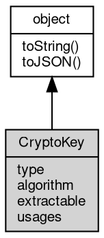

# 对象 CryptoKey
CryptoKey 类来表示对称或非对称密钥，每种密钥公开不同的功能

## 继承关系


## 成员属性
        
### type
**String, 密钥的类型，对于秘密（对称）密钥，此属性为 'secret'，对于公共（非对称）密钥，此属性为 'public' 或 'private'**

```JavaScript
readonly String CryptoKey.type;
```

--------------------------
### algorithm
**Object, 密钥的算法信息**

```JavaScript
readonly Object CryptoKey.algorithm;
```

--------------------------
### extractable
**Boolean, 密钥是否可以导出到外部**

```JavaScript
readonly Boolean CryptoKey.extractable;
```

--------------------------
### usages
**Array, 密钥的用途，可以是以下值的数组：**

```JavaScript
readonly Array CryptoKey.usages;
```

- 'encrypt'
- 'decrypt'
- 'sign'
- 'verify'
- 'deriveKey'
- 'deriveBits'
- 'wrapKey'
- 'unwrapKey'

## 成员函数
        
### toString
**返回对象的字符串表示，一般返回 "[Native Object]"，对象可以根据自己的特性重新实现**

```JavaScript
String CryptoKey.toString();
```

返回结果:
* String, 返回对象的字符串表示

--------------------------
### toJSON
**返回对象的 JSON 格式表示，一般返回对象定义的可读属性集合**

```JavaScript
Value CryptoKey.toJSON(String key = "");
```

调用参数:
* key: String, 未使用

返回结果:
* Value, 返回包含可 JSON 序列化的值

