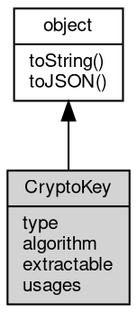

# Object CryptoKey
Handle to a Web Crypto key: key material plus algorithm, extractable flag and usages

CryptoKey represents a secret (symmetric) key, an asymmetric private key or an asymmetric
public key together with the metadata that controls how it may be used. The key material
never leaves the [object](object.md) except through `subtle.exportKey`, and only when `extractable` is
true.

Obtained from:
- `subtle.generateKey` — one CryptoKey for HMAC and a `{ publicKey, privateKey }` pair for
  ECDSA, Ed25519 and [ECDH](ECDH.md);
- `subtle.importKey` — wraps existing raw, pkcs8, spki or JWK material.

CryptoKey is not constructible (`new CryptoKey()` throws) and its four properties are
read-only snapshots: mutating `algorithm` or `usages` has no effect on the key.

Concepts:

- **type**: 'secret' for HMAC keys, 'public' or 'private' for asymmetric keys.
- **algorithm**: an [object](object.md) describing the key: `{ name: 'ECDSA', namedCurve: 'P-256' }`,
  `{ name: 'Ed25519' }`, `{ name: '[ECDH](ECDH.md)', namedCurve: 'P-256' }` or
  `{ name: 'HMAC', hash: { name: 'SHA-256' }, length: 512 }`; `length` in bits appears on
  generated HMAC keys.
- **extractable**: whether `subtle.exportKey` may serialize the key. Public keys are
  always extractable; private and secret keys follow the extractable argument of
  generateKey/importKey.
- **usages**: the operations the key accepts ('sign', 'verify', 'encrypt', 'decrypt',
  'wrapKey', 'unwrapKey', 'deriveKey', 'deriveBits'). The order of the array is not
  guaranteed, so treat it as a set. Using a key for an operation outside its usages
  throws.

Example 1 — inspect the two halves of a generated pair:

```JavaScript
const crypto = require('crypto');

(async () => {
    const pair = await crypto.subtle.generateKey({
        name: 'ECDSA',
        namedCurve: 'P-256'
    }, false, ['sign', 'verify']);

    console.log(pair.privateKey.type, pair.privateKey.extractable); // private false
    console.log(pair.publicKey.type, pair.publicKey.extractable); // public true
    console.log(JSON.stringify(pair.privateKey.algorithm));
    // {"name":"ECDSA","namedCurve":"P-256"}
    console.log(JSON.stringify(pair.publicKey.usages)); // ["verify"]
})();
```

Example 2 — import a secret key and read its metadata:

```JavaScript
const crypto = require('crypto');

(async () => {
    const key = await crypto.subtle.importKey('raw', Buffer.from('key material'), {
        name: 'HMAC',
        hash: 'SHA-256'
    }, true, ['sign', 'verify']);

    console.log(key.type, key.extractable); // secret true
    console.log(key.usages.slice().sort().join(',')); // sign,verify
})();
```

## Inheritance

```dot
digraph {
    node [fontname="Helvetica,sans-Serif", fontsize=10, shape="record", style="filled", fillcolor="white"];

    object [tooltip="object", URL="object.md", label="{object|toString()\ltoJSON()\l}"];
    CryptoKey [tooltip="CryptoKey", fillcolor="lightgray", id="me", label="{CryptoKey|type\lalgorithm\lextractable\lusages\l}"];

    object -> CryptoKey [dir=back];
}
```

## Properties
        
### type
**String, The type of the key**

```JavaScript
readonly String CryptoKey.type;
```

One of 'secret' (an HMAC key), 'public' or 'private' (an asymmetric key). The property
is read-only; assigning to it has no effect.

Example - the two halves of a generated pair report different [types](../../module/ifs/types.md):

```JavaScript
const crypto = require('crypto');

(async () => {
    const pair = await crypto.subtle.generateKey({
        name: 'Ed25519'
    }, false, ['sign', 'verify']);
    console.log(pair.privateKey.type, pair.publicKey.type); // private public
})();
```

--------------------------
### algorithm
**Object, The algorithm the key was created for, as a plain [object](object.md)**

```JavaScript
readonly Object CryptoKey.algorithm;
```

The shape depends on the key type: `{ name: 'ECDSA', namedCurve: 'P-256' }`,
`{ name: 'Ed25519' }`, `{ name: '[ECDH](ECDH.md)', namedCurve: 'P-256' }`, or
`{ name: 'HMAC', hash: { name: 'SHA-256' }, length: 512 }` where `length` is in bits
and only present on generated HMAC keys (an imported HMAC key reports just name and
hash). The value is a snapshot: modifying it does not change the key.

Example - the HMAC length resolved by generateKey is reported here:

```JavaScript
const crypto = require('crypto');

(async () => {
    const key = await crypto.subtle.generateKey({
        name: 'HMAC',
        hash: 'SHA-256',
        length: 256
    }, false, ['sign']);
    console.log(JSON.stringify(key.algorithm));
    // {"name":"HMAC","hash":{"name":"SHA-256"},"length":256}
})();
```

--------------------------
### extractable
**Boolean, Whether the key may be exported by `subtle.exportKey`**

```JavaScript
readonly Boolean CryptoKey.extractable;
```

Public keys are always extractable; private and secret keys are extractable only when
the extractable argument of generateKey/importKey was true. Exporting a key whose
extractable is false rejects with `Key is not extractable` (Error 20024). The property
is read-only.

Example - a non-extractable secret key cannot be exported:

```JavaScript
const crypto = require('crypto');

(async () => {
    const key = await crypto.subtle.importKey('raw', Buffer.from('key material'), {
        name: 'HMAC',
        hash: 'SHA-256'
    }, false, ['sign']);
    console.log(key.extractable); // false

    try {
        await crypto.subtle.exportKey('raw', key);
    } catch (err) {
        console.log(err.message); // Key is not extractable
    }
})();
```

--------------------------
### usages
**String, The operations the key is allowed to perform**

```JavaScript
readonly String CryptoKey.usages;
```

Each entry is one of 'sign', 'verify', 'encrypt', 'decrypt', 'wrapKey', 'unwrapKey',
'deriveKey' and 'deriveBits'; only the subset the algorithm supports can be requested
(HMAC keys accept 'sign'/'verify', ECDSA and Ed25519 private keys accept 'sign', their
public keys 'verify', and [ECDH](ECDH.md) private keys 'deriveKey'/'deriveBits'). The order is
not guaranteed and the property is read-only; using the key outside its usages throws.

Example - a key imported with both usages:

```JavaScript
const crypto = require('crypto');

(async () => {
    const key = await crypto.subtle.importKey('raw', Buffer.from('key material'), {
        name: 'HMAC',
        hash: 'SHA-256'
    }, true, ['sign', 'verify']);
    console.log(key.usages.slice().sort().join(',')); // sign,verify
})();
```

## Methods
        
### toString
**Returns the string form of the [object](object.md)**

```JavaScript
String CryptoKey.toString();
```

Returns:
* String, returns the string form of the [object](object.md)

The base implementation reports an error: a native [object](object.md) has no implicit
text form, and only the classes whose value can be written as a string
override the member. [Buffer](Buffer.md) returns its content decoded with the given
[encoding](../../module/ifs/encoding.md), [HttpCookie](HttpCookie.md) returns "name=value", and so on; an override commonly
accepts optional arguments ([Buffer.toString](Buffer.md#toString) takes [encoding](../../module/ifs/encoding.md), start and
end) that are not part of this declaration.

Calling the member on a class that does not override it throws
"<Class>: the [object](object.md) can not be converted to string.", which is the
behavior to rely on when probing whether a value has a string form. See
toJSON for the serialization hook.

--------------------------
### toJSON
**Returns the JSON representation of the [object](object.md)**

```JavaScript
Value CryptoKey.toJSON(String key = "");
```

Parameters:
* key: String, the property name of the value being serialized

Returns:
* Value, returns the JSON-serializable value

JSON.stringify(value) calls value.toJSON(key) when the member exists and
serializes the returned value in its place; the key argument carries the
property name of the value inside its parent [object](object.md) (an empty string at
the top level) and may be used to build a keyed form. The base
implementation returns a plain [object](object.md) holding the readable properties of
the instance, so a native [object](object.md) serializes without per-class code; a
class with a portable shape such as [Buffer](Buffer.md) overrides it, and a JavaScript
class may override it in the same way.

The member is normally reached through JSON.stringify rather than called
directly; calling it returns the same value JSON.stringify would
serialize.

