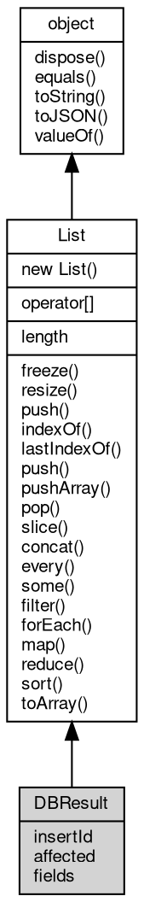

# 对象 DBResult
数据库结果集合对象

## 继承关系


## 成员属性
        
### insertId
**Long, 查询当前操作插入数据库的 rowid**

```JavaScript
readonly Long DBResult.insertId;
```

--------------------------
### affected
**Long, 查询当前操作影响的数据库条目数**

```JavaScript
readonly Long DBResult.affected;
```

--------------------------
### fields
**Array, 查询当前结果的字段名数组**

```JavaScript
readonly Array DBResult.fields;
```

--------------------------
### length
**Integer, 获取数组的尺寸**

```JavaScript
readonly Integer DBResult.length;
```

## 成员函数
        
### freeze
**冻结数组内容，禁止一些修改操作**

```JavaScript
DBResult.freeze();
```

--------------------------
### resize
**修改数组尺寸**

```JavaScript
DBResult.resize(Integer sz);
```

调用参数:
* sz: Integer, 指定新尺寸

--------------------------
### push
**在数组结尾添加一个元素**

```JavaScript
Integer DBResult.push(Variant v);
```

调用参数:
* v: Variant, 指定添加的元素

返回结果:
* Integer, 添加元素之后数组的长度

--------------------------
### indexOf
**返回在list中可以找到给定元素的第一个索引，如果不存在，则返回-1**

```JavaScript
Integer DBResult.indexOf(Variant searchElement,
    Integer fromIndex = 0);
```

调用参数:
* searchElement: Variant, 要查找的元素
* fromIndex: Integer, 开始查找的位置。如果该索引值大于或等于数组长度，意味着不会在数组里查找，返回-1。

返回结果:
* Integer, 首个被找到的元素在数组中的索引位置; 若没有找到则返回 -1

如果参数 fromIndex 中提供的索引值是一个负值，则将其作为数组末尾的一个抵消，即-1表示从最后一个元素开始查找，
-2表示从倒数第二个元素开始查找 ，以此类推。

注意：如果参数中提供的索引值是一个负值，仍然从前向后查询数组。如果抵消后的索引值仍小于0，则整个数组都将会被查询。其默认值为0.

--------------------------
### lastIndexOf
**lastIndexOf() 方法返回指定元素在数组中的最后一个的索引，如果不存在则返回 -1。从数组的后面向前查找，从 fromIndex 处开始。**

```JavaScript
Integer DBResult.lastIndexOf(Variant searchElement,
    Integer fromIndex = 0);
```

调用参数:
* searchElement: Variant, 要查找的元素
* fromIndex: Integer, 从此位置开始逆向查找。默认为数组的长度减 1，即整个数组都被查找。

返回结果:
* Integer, 给定元素在数组中最后一次出现的索引位置; 若没有找到则返回 -1

如果参数 searchElement 大于或等于数组的长度，则整个数组会被查找。
如果为负值，将其视为从数组末尾向前的偏移。即使该值为负，数组仍然会被从后向前查找。
如果该值为负时，其绝对值大于数组长度，则方法返回 -1，即数组不会被查找

--------------------------
### push
**在数组结尾添加一个元素**

```JavaScript
Integer DBResult.push(...);
```

调用参数:
* ...: 指定添加的多个元素

返回结果:
* Integer, 添加元素之后数组的长度

--------------------------
### pushArray
**在数组结尾添加一组元素**

```JavaScript
DBResult.pushArray(Array data);
```

调用参数:
* data: Array, 添加的一组元素

--------------------------
### pop
**返回数组结尾的一个元素**

```JavaScript
Variant DBResult.pop();
```

返回结果:
* Variant, 结尾的元素

--------------------------
### slice
**返回一个新数组，包含指定范围的数据，若范围超出缓存，则只返回有效部分数据**

```JavaScript
List DBResult.slice(Integer start = 0,
    Integer end = -1);
```

调用参数:
* start: Integer, 指定范围的起始，缺省从头开始
* end: Integer, 指定范围的结束，缺省到缓存结尾

返回结果:
* List, 返回新的数组

--------------------------
### concat
**将当前数组与给定的一个或者多个数组合并**

```JavaScript
List DBResult.concat(...);
```

调用参数:
* ...: 给定的一个或多个数组

返回结果:
* List, 返回合并的数组

--------------------------
### every
**检测全部数据是否通过测试函数**

```JavaScript
Boolean DBResult.every(Function func,
    Value thisArg = undefined);
```

调用参数:
* func: Function, 测试函数
* thisArg: Value, 调用测试函数的参数，可省略

返回结果:
* Boolean, 全部通过测试则返回 true

--------------------------
### some
**检测一些数据是否通过测试函数**

```JavaScript
Boolean DBResult.some(Function func,
    Value thisArg = undefined);
```

调用参数:
* func: Function, 测试函数
* thisArg: Value, 调用测试函数的参数，可省略

返回结果:
* Boolean, 全部不通过测试则返回 false，否则返回true

--------------------------
### filter
**过滤通过测试的数据成为一个新的数组**

```JavaScript
List DBResult.filter(Function func,
    Value thisArg = undefined);
```

调用参数:
* func: Function, 测试函数
* thisArg: Value, 调用过滤函数的参数，可省略

返回结果:
* List, 经过过滤的新数组

--------------------------
### forEach
**遍历处理全部数据**

```JavaScript
DBResult.forEach(Function func,
    Value thisArg = undefined);
```

调用参数:
* func: Function, 处理函数
* thisArg: Value, 调用处理函数的参数，可省略

--------------------------
### map
**遍历处理全部数据并返回结果**

```JavaScript
List DBResult.map(Function func,
    Value thisArg = undefined);
```

调用参数:
* func: Function, 处理函数
* thisArg: Value, 调用处理函数的参数，可省略

返回结果:
* List, 处理结果数组

--------------------------
### reduce
**遍历处理全部数据并返回累积结果**

```JavaScript
Value DBResult.reduce(Function func,
    Value initVal = undefined);
```

调用参数:
* func: Function, 处理函数
* initVal: Value, 初始值，可省略

返回结果:
* Value, 处理结果数组

--------------------------
### sort
**排序全部数据并返回列表本身**

```JavaScript
List DBResult.sort(Function func);
```

调用参数:
* func: Function, 比较处理函数

返回结果:
* List, 列表本身

--------------------------
**排序全部数据并返回列表本身**

```JavaScript
List DBResult.sort();
```

返回结果:
* List, 列表本身

--------------------------
### toArray
**返回列表的 js 数组**

```JavaScript
Array DBResult.toArray();
```

返回结果:
* Array, 包含数据的 js 数组

--------------------------
### dispose
**强制回收对象，调用此方法后，对象资源将立即释放**

```JavaScript
DBResult.dispose();
```

--------------------------
### equals
**比较当前对象与给定的对象是否相等**

```JavaScript
Boolean DBResult.equals(object expected);
```

调用参数:
* expected: object, 制定比较的目标对象

返回结果:
* Boolean, 返回对象比较的结果

--------------------------
### toString
**返回对象的字符串表示，一般返回 "[Native Object]"，对象可以根据自己的特性重新实现**

```JavaScript
String DBResult.toString();
```

返回结果:
* String, 返回对象的字符串表示

--------------------------
### toJSON
**返回对象的 JSON 格式表示，一般返回对象定义的可读属性集合**

```JavaScript
Value DBResult.toJSON(String key = "");
```

调用参数:
* key: String, 未使用

返回结果:
* Value, 返回包含可 JSON 序列化的值

--------------------------
### valueOf
**返回对象本身的数值**

```JavaScript
Value DBResult.valueOf();
```

返回结果:
* Value, 返回对象本身的数值

