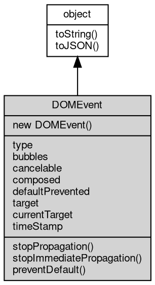

# 对象 DOMEvent
DOMEvent 表示一个 W3C DOM 事件对象

DOMEvent 实现了标准的 Web [Event](Event.md) 接口，提供事件类型、冒泡、取消等标准事件属性。

```JavaScript
const ev = new Event('click', {
    bubbles: true,
    cancelable: true
});
console.log(ev.type); // 'click'
console.log(ev.bubbles); // true
console.log(ev.cancelable); // true
```

## 继承关系


## 构造函数
        
### DOMEvent
**DOMEvent 构造函数**

```JavaScript
new DOMEvent(String type,
    Object eventInitDict = {});
```

调用参数:
* type: String, 事件类型
* eventInitDict: Object, 可选的事件初始化字典

## 成员属性
        
### type
**String, 事件类型**

```JavaScript
readonly String DOMEvent.type;
```

--------------------------
### bubbles
**Boolean, 事件是否冒泡**

```JavaScript
readonly Boolean DOMEvent.bubbles;
```

--------------------------
### cancelable
**Boolean, 事件是否可取消**

```JavaScript
readonly Boolean DOMEvent.cancelable;
```

--------------------------
### composed
**Boolean, 事件是否可穿越 Shadow DOM 边界**

```JavaScript
readonly Boolean DOMEvent.composed;
```

--------------------------
### defaultPrevented
**Boolean, 是否已调用 preventDefault()**

```JavaScript
readonly Boolean DOMEvent.defaultPrevented;
```

--------------------------
### target
**Value, 事件目标**

```JavaScript
readonly Value DOMEvent.target;
```

--------------------------
### currentTarget
**Value, 当前事件目标**

```JavaScript
readonly Value DOMEvent.currentTarget;
```

--------------------------
### timeStamp
**Number, 事件创建时间戳**

```JavaScript
readonly Number DOMEvent.timeStamp;
```

## 成员函数
        
### stopPropagation
**阻止事件的进一步传播**

```JavaScript
DOMEvent.stopPropagation();
```

--------------------------
### stopImmediatePropagation
**阻止同一事件的其他监听器被调用**

```JavaScript
DOMEvent.stopImmediatePropagation();
```

--------------------------
### preventDefault
**如果事件可取消，则取消该事件**

```JavaScript
DOMEvent.preventDefault();
```

--------------------------
### toString
**返回对象的字符串表示，一般返回 "[Native Object]"，对象可以根据自己的特性重新实现**

```JavaScript
String DOMEvent.toString();
```

返回结果:
* String, 返回对象的字符串表示

--------------------------
### toJSON
**返回对象的 JSON 格式表示，一般返回对象定义的可读属性集合**

```JavaScript
Value DOMEvent.toJSON(String key = "");
```

调用参数:
* key: String, 未使用

返回结果:
* Value, 返回包含可 JSON 序列化的值

