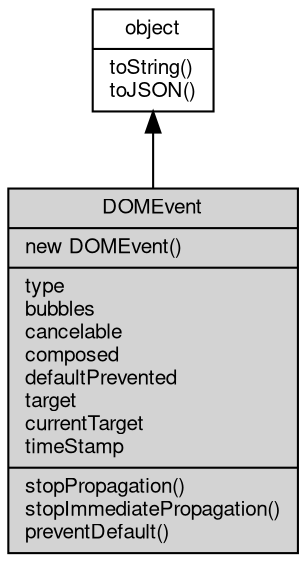

# Object DOMEvent
DOMEvent is the DOM-style event [object](object.md) installed as the [global](../../module/ifs/global.md) `[Event](Event.md)` class: a value

carrying an event type, the DOM event flags and the propagation/cancellation methods of the W3C
[Event](Event.md) interface

fibjs has no DOM tree and no event dispatch pipeline: EventTarget is the [EventEmitter](EventEmitter.md) class
(on/off/emit, without dispatchEvent), so a DOMEvent is a stand-alone [object](object.md) that you create,
pass to listeners yourself and read; the runtime never produces one. The class exists for
Node.js and Web compatibility, where `new [Event](Event.md)(type, init)` creates synthetic event objects.

Concepts:

- **DOM event model**: an event carries `type` plus the flags `bubbles`, `cancelable` and
  `composed`, and offers `preventDefault()` for cancelable events. `defaultPrevented` latches
  to true at the first `preventDefault()` call on a cancelable event and stays true;
  `stopPropagation()` and `stopImmediatePropagation()` are accepted no-ops because there is no
  propagation [path](../../module/ifs/path.md) to stop.
- **No dispatch**: `target` and `currentTarget` are always null, even when the [object](object.md) is passed
  to a listener. Nothing in fibjs constructs a DOMEvent except its own constructor.
- **Do not confuse with `coroutine.Event`**: the [module](../../module/ifs/module.md)-level `[Event](Event.md)` class is the fiber
  synchronization primitive (wait/set/pulse). The [global](../../module/ifs/global.md) name `Event` is this DOM class; the
  [coroutine](../../module/ifs/coroutine.md) primitive is only reachable as `coroutine.Event`. See the [Event](Event.md) interface and the
  [coroutine](../../module/ifs/coroutine.md) [module](../../module/ifs/module.md).
- **Initialization dictionary**: only the boolean value true enables a flag (1 and 'true' do
  not); the dictionary must be an [object](object.md) or null, anything else throws TypeError [20005].
- **timeStamp**: milliseconds since the Unix epoch measured at construction, directly
  comparable with Date.now(); MDN specifies a high-resolution timestamp relative to the time
  origin instead.

Obtained from:
- `new [Event](Event.md)(type, eventInitDict = {})` — the only way to create one; `type` is required and
  unknown dictionary keys are ignored.

Example 1 — create an event and read its flags:

```JavaScript
const ev = new Event('click', {
    bubbles: true,
    cancelable: true
});
console.log(ev.type); // click
console.log(ev.bubbles); // true
console.log(ev.cancelable); // true
console.log(ev.composed); // false
```

Example 2 — cancellation only works on a cancelable event:

```JavaScript
const fixed = new Event('change', {
    cancelable: true
});
fixed.preventDefault();
console.log(fixed.defaultPrevented); // true

const uncancelable = new Event('change');
uncancelable.preventDefault();
console.log(uncancelable.defaultPrevented); // false
```

Example 3 — pass an event [object](object.md) to an EventTarget listener:

```JavaScript
const target = new EventTarget();
target.on('tick', (ev) => {
    console.log(ev.type); // tick
    console.log(ev.target); // null: fibjs does not populate the target
});
target.emit('tick', new Event('tick'));
```

## Inheritance

```dot
digraph {
    node [fontname="Helvetica,sans-Serif", fontsize=10, shape="record", style="filled", fillcolor="white"];

    object [tooltip="object", URL="object.md", label="{object|toString()\ltoJSON()\l}"];
    DOMEvent [tooltip="DOMEvent", fillcolor="lightgray", id="me", label="{DOMEvent|new DOMEvent()\l|type\lbubbles\lcancelable\lcomposed\ldefaultPrevented\ltarget\lcurrentTarget\ltimeStamp\l|stopPropagation()\lstopImmediatePropagation()\lpreventDefault()\l}"];

    object -> DOMEvent [dir=back];
}
```

## Constructors
        
### DOMEvent
**DOMEvent constructor**

```JavaScript
new DOMEvent(String type,
    Object eventInitDict = {});
```

Parameters:
* type: String, event type, a required string
* eventInitDict: Object, optional event initialization dictionary

`type` is required and must be a string; the flags all default to false. `eventInitDict`
accepts `bubbles`, `cancelable` and `composed`; a flag is enabled only when its value is
the boolean true (the values 1 and 'true' do not count). Unknown keys are ignored and
passing null is the same as omitting the dictionary. A non-string type or a non-[object](object.md)
dictionary throws TypeError [20005], extra arguments throw TypeError [20001].

Example — an event with all flags enabled:

```JavaScript
const ev = new Event('load', {
    bubbles: true,
    cancelable: true,
    composed: true
});
console.log(ev.type, ev.bubbles, ev.cancelable, ev.composed);
// load true true true
```

## Properties
        
### type
**String, [Event](Event.md) type**

```JavaScript
readonly String DOMEvent.type;
```

The string passed to the constructor; an empty string is allowed. The property is
read-only: assigning to it is silently ignored instead of throwing.

--------------------------
### bubbles
**Boolean, Whether the event bubbles**

```JavaScript
readonly Boolean DOMEvent.bubbles;
```

True when the constructor dictionary had `bubbles: true`. fibjs has no event propagation,
so the flag is informational and does not change how listeners are called.

--------------------------
### cancelable
**Boolean, Whether the event is cancelable**

```JavaScript
readonly Boolean DOMEvent.cancelable;
```

True when the constructor dictionary had `cancelable: true`. Only a cancelable event can
latch `defaultPrevented` through preventDefault().

--------------------------
### composed
**Boolean, Whether the event can cross Shadow DOM boundaries**

```JavaScript
readonly Boolean DOMEvent.composed;
```

True when the constructor dictionary had `composed: true`. fibjs has no DOM tree, so the
flag is informational.

--------------------------
### defaultPrevented
**Boolean, Whether preventDefault() has been called**

```JavaScript
readonly Boolean DOMEvent.defaultPrevented;
```

False at construction. It becomes true at the first preventDefault() call on a cancelable
event and stays true; calling preventDefault() on a non-cancelable event leaves it false.

--------------------------
### target
**Value, [Event](Event.md) target**

```JavaScript
readonly Value DOMEvent.target;
```

Always null in fibjs: the runtime never dispatches a DOMEvent, and passing the [object](object.md) to
an [EventEmitter](EventEmitter.md) listener does not populate it.

--------------------------
### currentTarget
**Value, Current event target**

```JavaScript
readonly Value DOMEvent.currentTarget;
```

Always null in fibjs, for the same reason as target: there is no capture/bubble [path](../../module/ifs/path.md) that
could update it during dispatch.

--------------------------
### timeStamp
**Number, [Event](Event.md) creation timestamp**

```JavaScript
readonly Number DOMEvent.timeStamp;
```

Milliseconds since the Unix epoch, measured when the constructor runs, so it is directly
comparable with Date.now() and fixed at construction. MDN defines timeStamp as a
high-resolution value relative to the time origin instead.

## Methods
        
### stopPropagation
**Stops further propagation of the event**

```JavaScript
DOMEvent.stopPropagation();
```

Accepted for Web API compatibility and does nothing, because fibjs has no propagation
[path](../../module/ifs/path.md) to stop. It returns undefined and never throws.

--------------------------
### stopImmediatePropagation
**Prevents other listeners of the same event from being called**

```JavaScript
DOMEvent.stopImmediatePropagation();
```

Accepted for Web API compatibility and does nothing: listeners are managed by
[EventEmitter](EventEmitter.md), which has no concept of immediate propagation. It returns undefined.

--------------------------
### preventDefault
**Cancels the event if it is cancelable**

```JavaScript
DOMEvent.preventDefault();
```

On a cancelable event the call latches `defaultPrevented` to true; on a non-cancelable
event it is a no-op. The method returns undefined, is safe to call repeatedly, and does
not stop other listeners because fibjs has no dispatch pipeline to influence.

Example — cancellation requires cancelable: true:

```JavaScript
const ev = new Event('submit', {
    cancelable: true
});

ev.stopPropagation(); // accepted no-op
ev.preventDefault();
ev.preventDefault(); // idempotent
console.log(ev.defaultPrevented); // true
```

--------------------------
### toString
**Returns the string form of the [object](object.md)**

```JavaScript
String DOMEvent.toString();
```

Returns:
* String, returns the string form of the [object](object.md)

The base implementation reports an error: a native [object](object.md) has no implicit
text form, and only the classes whose value can be written as a string
override the member. [Buffer](Buffer.md) returns its content decoded with the given
[encoding](../../module/ifs/encoding.md), [HttpCookie](HttpCookie.md) returns "name=value", and so on; an override commonly
accepts optional arguments ([Buffer.toString](Buffer.md#toString) takes [encoding](../../module/ifs/encoding.md), start and
end) that are not part of this declaration.

Calling the member on a class that does not override it throws
"<Class>: the [object](object.md) can not be converted to string.", which is the
behavior to rely on when probing whether a value has a string form. See
toJSON for the serialization hook.

--------------------------
### toJSON
**Returns the JSON representation of the [object](object.md)**

```JavaScript
Value DOMEvent.toJSON(String key = "");
```

Parameters:
* key: String, the property name of the value being serialized

Returns:
* Value, returns the JSON-serializable value

JSON.stringify(value) calls value.toJSON(key) when the member exists and
serializes the returned value in its place; the key argument carries the
property name of the value inside its parent [object](object.md) (an empty string at
the top level) and may be used to build a keyed form. The base
implementation returns a plain [object](object.md) holding the readable properties of
the instance, so a native [object](object.md) serializes without per-class code; a
class with a portable shape such as [Buffer](Buffer.md) overrides it, and a JavaScript
class may override it in the same way.

The member is normally reached through JSON.stringify rather than called
directly; calling it returns the same value JSON.stringify would
serialize.

