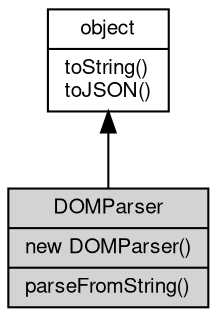

# 对象 DOMParser
DOMParser 接口提供将 XML 或 HTML 源代码字符串解析为 DOM Document 的能力

DOMParser 可以将字符串中的 XML 或 HTML 源代码解析为 DOM 文档：

```JavaScript
const parser = new DOMParser();

// 解析 HTML
const htmlDoc = parser.parseFromString('<html><body>Hello</body></html>', 'text/html');
console.log(htmlDoc.body.textContent); // 输出: Hello

// 解析 XML
const xmlDoc = parser.parseFromString('<root><item>data</item></root>', 'text/xml');
console.log(xmlDoc.documentElement.nodeName); // 输出: root
```

支持的 MIME 类型包括：
- text/html - 解析为 HTML 文档
- text/[xml](../../module/ifs/xml.md) - 解析为 XML 文档
- application/[xml](../../module/ifs/xml.md) - 解析为 XML 文档
- application/xhtml+[xml](../../module/ifs/xml.md) - 解析为 XHTML 文档
- image/svg+[xml](../../module/ifs/xml.md) - 解析为 SVG 文档

## 继承关系


## 构造函数
        
### DOMParser
**构造一个 DOMParser 对象**

```JavaScript
new DOMParser();
```

## 成员函数
        
### parseFromString
**将字符串解析为 DOM 文档**

```JavaScript
XmlDocument DOMParser.parseFromString(String string,
    String mimeType);
```

调用参数:
* string: String, 要解析的 HTML 或 XML 字符串
* mimeType: String, 指定文本类型，支持 "text/html", "text/[xml](../../module/ifs/xml.md)", "application/[xml](../../module/ifs/xml.md)", "application/xhtml+[xml](../../module/ifs/xml.md)", "image/svg+[xml](../../module/ifs/xml.md)"

返回结果:
* [XmlDocument](XmlDocument.md), 返回解析后的 [XmlDocument](XmlDocument.md) 对象

--------------------------
### toString
**返回对象的字符串表示，一般返回 "[Native Object]"，对象可以根据自己的特性重新实现**

```JavaScript
String DOMParser.toString();
```

返回结果:
* String, 返回对象的字符串表示

--------------------------
### toJSON
**返回对象的 JSON 格式表示，一般返回对象定义的可读属性集合**

```JavaScript
Value DOMParser.toJSON(String key = "");
```

调用参数:
* key: String, 未使用

返回结果:
* Value, 返回包含可 JSON 序列化的值

