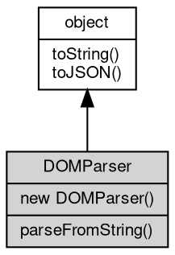

# Object DOMParser
DOMParser parses an HTML or XML source string into an [XmlDocument](XmlDocument.md); the class is a [global](../../module/ifs/global.md) and Node.js has no equivalent

`new DOMParser().parseFromString(source, mimeType)` returns a full [XmlDocument](XmlDocument.md) that can be
navigated with the [xml](../../module/ifs/xml.md) DOM API (documentElement, getElementById, querySelector, childNodes...)
and serialized again with [XMLSerializer](XMLSerializer.md). There is no [module](../../module/ifs/module.md) to require, and
`instanceof DOMParser` recognizes the instances.

Concepts:

- **HTML and XML modes**: text/html selects the tolerant HTML parser: tag and attribute names
  are lowercased, html/head/body wrappers are created when they are missing, and elements
  expose the HTML-only properties such as style, dataset and classList. The XML modes are
  strict and namespace-aware, preserve letter case, and expose those HTML-only properties as
  Error [20009] instead.
- **MIME gate**: only the exact strings text/html, text/[xml](../../module/ifs/xml.md), application/[xml](../../module/ifs/xml.md),
  application/xhtml+[xml](../../module/ifs/xml.md) and image/svg+[xml](../../module/ifs/xml.md) are accepted (the four XML variants parse
  identically as XML). The comparison is case-sensitive and rejects parameters, so 'TEXT/XML'
  or 'text/[xml](../../module/ifs/xml.md); charset=utf-8' throw Error [20024].
- **Parse errors**: an XML syntax error throws Error [20024] with the parser location
  ("XmlParser: error on line N at column M: ..."), where browsers instead return a document
  containing a parsererror element. HTML parsing is tolerant and rarely fails.
- **Parse limits**: the third options argument is a fibjs extension over the two-argument MDN
  signature; it accepts maxElementDepth (default 1000) and maxNodeCount (default 1000000),
  exactly like [xml.parse](../../module/ifs/xml.md#parse). A value of 0, a negative value or Infinity disables the limit,
  exceeding one throws Error [20024], and a non-numeric option throws TypeError [20004].

Obtained from:
- `new DOMParser()` — the constructor takes no arguments; the [global](../../module/ifs/global.md) also lets code recognize
  the class with instanceof.

Example 1 — parse HTML and navigate the result:

```JavaScript
const doc = new DOMParser().parseFromString(
    '<div id="box"><b>hello</b></div>', 'text/html');

console.log(doc.documentElement.nodeName); // HTML
console.log(doc.body.firstChild.tagName); // DIV
console.log(doc.getElementById('box').textContent); // hello
```

Example 2 — parse XML with a namespace:

```JavaScript
const doc = new DOMParser().parseFromString(
    '<rss xmlns:dc="urn:dc"><item dc:id="7">text</item></rss>', 'text/xml');
const item = doc.documentElement.firstChild;

console.log(doc.documentElement.nodeName); // rss
console.log(item.getAttribute('dc:id')); // 7
console.log(item.textContent); // text
```

Example 3 — MIME validation and parse limits:

```JavaScript
const parser = new DOMParser();

try {
    parser.parseFromString('<a/>', 'text/plain');
} catch (e) {
    console.log(e.message); // DOMParser: Invalid MIME type: text/plain
}

try {
    parser.parseFromString('<a><b/></a>', 'text/xml', {
        maxElementDepth: 1
    });
} catch (e) {
    console.log(e.number); // 20024
}
```

## Inheritance

```dot
digraph {
    node [fontname="Helvetica,sans-Serif", fontsize=10, shape="record", style="filled", fillcolor="white"];

    object [tooltip="object", URL="object.md", label="{object|toString()\ltoJSON()\l}"];
    DOMParser [tooltip="DOMParser", fillcolor="lightgray", id="me", label="{DOMParser|new DOMParser()\l|parseFromString()\l}"];

    object -> DOMParser [dir=back];
}
```

## Constructors
        
### DOMParser
**Constructs a DOMParser [object](object.md)**

```JavaScript
new DOMParser();
```

The constructor takes no arguments; calling it with any argument throws TypeError [20001].
The parser it creates is stateless, so one instance can be reused for any number of
parseFromString calls.

Example — create a parser:

```JavaScript
const parser = new DOMParser();
console.log(parser instanceof DOMParser); // true
```

## Methods
        
### parseFromString
**Parses a string into a DOM document**

```JavaScript
XmlDocument DOMParser.parseFromString(String string,
    String mimeType,
    Object options = {});
```

Parameters:
* string: String, the HTML or XML source string; a [Buffer](Buffer.md) is accepted and decoded as UTF-8
* mimeType: String, the text type; one of "text/html", "text/[xml](../../module/ifs/xml.md)", "application/[xml](../../module/ifs/xml.md)",
* options: Object, the parse limits, consistent with [xml.parse](../../module/ifs/xml.md#parse), default { maxElementDepth:

Returns:
* [XmlDocument](XmlDocument.md), returns the parsed [XmlDocument](XmlDocument.md) [object](object.md)

The MIME type selects the parser and must be one of the five exact strings listed by the
class description; invalid values throw Error [20024]. Invalid XML throws Error [20024]
with the parser location as well. The optional options argument is a fibjs extension that
overrides the parse limits of [xml.parse](../../module/ifs/xml.md#parse).

options supports the following options:

```JavaScript
// fragment: options
({
    "maxElementDepth": 1000, // maximum element nesting, error above it
    "maxNodeCount": 1000000 // maximum node count, error above it
})
```

Example — parse XML and navigate the result:

```JavaScript
const parser = new DOMParser();
const doc = parser.parseFromString('<root><item id="1">data</item></root>', 'text/xml');

console.log(doc.documentElement.nodeName); // root
console.log(doc.documentElement.firstChild.id); // 1
console.log(doc.documentElement.textContent); // data
```

--------------------------
### toString
**Returns the string form of the [object](object.md)**

```JavaScript
String DOMParser.toString();
```

Returns:
* String, returns the string form of the [object](object.md)

The base implementation reports an error: a native [object](object.md) has no implicit
text form, and only the classes whose value can be written as a string
override the member. [Buffer](Buffer.md) returns its content decoded with the given
[encoding](../../module/ifs/encoding.md), [HttpCookie](HttpCookie.md) returns "name=value", and so on; an override commonly
accepts optional arguments ([Buffer.toString](Buffer.md#toString) takes [encoding](../../module/ifs/encoding.md), start and
end) that are not part of this declaration.

Calling the member on a class that does not override it throws
"<Class>: the [object](object.md) can not be converted to string.", which is the
behavior to rely on when probing whether a value has a string form. See
toJSON for the serialization hook.

--------------------------
### toJSON
**Returns the JSON representation of the [object](object.md)**

```JavaScript
Value DOMParser.toJSON(String key = "");
```

Parameters:
* key: String, the property name of the value being serialized

Returns:
* Value, returns the JSON-serializable value

JSON.stringify(value) calls value.toJSON(key) when the member exists and
serializes the returned value in its place; the key argument carries the
property name of the value inside its parent [object](object.md) (an empty string at
the top level) and may be used to build a keyed form. The base
implementation returns a plain [object](object.md) holding the readable properties of
the instance, so a native [object](object.md) serializes without per-class code; a
class with a portable shape such as [Buffer](Buffer.md) overrides it, and a JavaScript
class may override it in the same way.

The member is normally reached through JSON.stringify rather than called
directly; calling it returns the same value JSON.stringify would
serialize.

