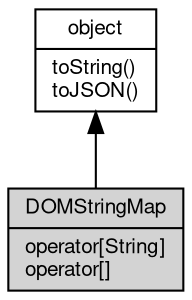

# Object DOMStringMap
DOMStringMap is the live camelCase view of the `data-*` attributes of an element, obtained from the `dataset` property

Each key maps to one data-* attribute: `data-user-id` is exposed as `userId`, and writing or
deleting a key updates the attribute in real time (and therefore the innerHTML/outerHTML
serialization). The [object](object.md) is cached per element, so `element.dataset === element.dataset`.
Instances exist only for elements of a document parsed as text/html; in XML mode the property
throws Error [20009]. The class is not constructible, and the [global](../../module/ifs/global.md) DOMStringMap name is
provided so the [object](object.md) can be recognized with instanceof.

Concepts:

- **data-* mapping**: reading converts every '-' followed by a lowercase letter into the
  uppercase letter and keeps all other characters, so `data-user-id` becomes `userId`,
  `data-a--b` becomes `a-B` and a trailing dash is preserved. Writing performs the inverse
  (an uppercase letter becomes '-' plus its lowercase), which makes keys and attributes
  round-trip, but different keys can also name the same attribute: both `aB` and `a-b` map to
  `data-a-b`. The HTML parser lowercases attribute names, so a source attribute written
  data-UserId is read as `dataset.userid`.
- **Proxy semantics**: a read returns the attribute value as a string, or undefined when the
  attribute is absent. Writing stringifies the value (numbers, booleans, arrays, objects and
  Buffers all end up as text); assigning null, undefined or an empty string removes the
  attribute but leaves the key behind as an own property holding the assigned value, still
  listed by Object.keys and `in`; `delete` removes both the attribute and the key.
- **Enumeration**: Object.keys and for..in list the camelCase keys of the current data-*
  attributes in attribute order.
- **Numeric keys**: a data-123 attribute is also readable as dataset[123] because the index is
  stringified before the lookup. The indexed accessor is read-only, so an indexed assignment
  throws TypeError 'Indexed Property is read-only.' while the named form dataset['123']
  writes the attribute.

Obtained from:
- `element.dataset` — for an element of a document parsed with [DOMParser](DOMParser.md) as text/html; the
  identity is stable per element.

Example 1 — read camelCase keys:

```JavaScript
const doc = new DOMParser().parseFromString(
    '<div id="user" data-user-id="12345" data-user-name="John"></div>', 'text/html');
const dataset = doc.getElementById('user').dataset;

console.log(dataset.userId); // 12345
console.log(dataset.userName); // John
console.log(dataset.missing); // undefined
```

Example 2 — write, remove and delete:

```JavaScript
const doc = new DOMParser().parseFromString('<div id="user"></div>', 'text/html');
const el = doc.getElementById('user');
const dataset = el.dataset;

dataset.sourceHash = 'abc';
console.log(el.getAttribute('data-source-hash')); // abc

dataset.temp = 'x';
dataset.temp = null; // removes the attribute
console.log(el.getAttribute('data-temp')); // null
delete dataset.temp; // clears the leftover key
console.log(Object.keys(dataset).join()); // sourceHash
```

Example 3 — numeric keys, dashes and aliasing:

```JavaScript
const doc = new DOMParser().parseFromString(
    '<div id="d" data-123="n" data-a--b="double" data-a-b="alias" data-flag></div>',
    'text/html');
const el = doc.getElementById('d');

console.log(el.dataset[123]); // n
console.log(el.dataset['a-B']); // double
console.log(el.dataset.aB); // alias (aB maps to data-a-b)
console.log(JSON.stringify(el.dataset.flag)); // ""

el.dataset.aB = 'changed';
console.log(el.getAttribute('data-a-b')); // changed

try {
    el.dataset[9] = 'nine'; // indexed write is read-only
} catch (e) {
    console.log(e.message); // Indexed Property is read-only.
}
```

## Inheritance


## Operators
        
### operator[String]
**Accesses data-* attributes with camelCase keys (named property access)**

```JavaScript
Variant DOMStringMap[String];
```

Reading converts the key to the attribute name and returns its value, or undefined when
the attribute does not exist. Writing stringifies the value and sets the attribute;
assigning null, undefined or an empty string removes the attribute but leaves the key as
an own property holding the assigned value until it is deleted. `delete dataset.key`
removes both. Keys are matched exactly: `userId` maps to data-user-id while `userID`
maps to data-user-i-d, and `dataset['user-id']` maps through unchanged.

Example — write, remove and delete:

```JavaScript
const doc = new DOMParser()
    .parseFromString('<div id="d" data-user-id="7"></div>', 'text/html');
const el = doc.getElementById('d');

console.log(el.dataset.userId); // 7
el.dataset.sourceHash = 'abc';
console.log(el.getAttribute('data-source-hash')); // abc
delete el.dataset.sourceHash;
console.log(el.getAttribute('data-source-hash')); // null
```

--------------------------
### operator[]
**Accesses data-* attributes with numeric keys (read-only indexed access)**

```JavaScript
readonly Variant DOMStringMap[];
```

The index is converted to its decimal string, so dataset[123] and dataset['123'] both read
data-123 and return undefined when the attribute is absent. There is no indexed setter:
assigning dataset[9] throws TypeError 'Indexed Property is read-only.' while the named
form dataset['9'] writes the attribute.

Example — read data-123 through the index:

```JavaScript
const doc = new DOMParser()
    .parseFromString('<div id="d" data-123="n"></div>', 'text/html');
const dataset = doc.getElementById('d').dataset;

console.log(dataset[123]); // n
try {
    dataset[9] = 'nine';
} catch (e) {
    console.log(e.message); // Indexed Property is read-only.
}
```

## Methods
        
### toString
**Returns the string form of the [object](object.md)**

```JavaScript
String DOMStringMap.toString();
```

Returns:
* String, returns the string form of the [object](object.md)

The base implementation reports an error: a native [object](object.md) has no implicit
text form, and only the classes whose value can be written as a string
override the member. [Buffer](Buffer.md) returns its content decoded with the given
[encoding](../../module/ifs/encoding.md), [HttpCookie](HttpCookie.md) returns "name=value", and so on; an override commonly
accepts optional arguments ([Buffer.toString](Buffer.md#toString) takes [encoding](../../module/ifs/encoding.md), start and
end) that are not part of this declaration.

Calling the member on a class that does not override it throws
"<Class>: the [object](object.md) can not be converted to string.", which is the
behavior to rely on when probing whether a value has a string form. See
toJSON for the serialization hook.

--------------------------
### toJSON
**Returns the JSON representation of the [object](object.md)**

```JavaScript
Value DOMStringMap.toJSON(String key = "");
```

Parameters:
* key: String, the property name of the value being serialized

Returns:
* Value, returns the JSON-serializable value

JSON.stringify(value) calls value.toJSON(key) when the member exists and
serializes the returned value in its place; the key argument carries the
property name of the value inside its parent [object](object.md) (an empty string at
the top level) and may be used to build a keyed form. The base
implementation returns a plain [object](object.md) holding the readable properties of
the instance, so a native [object](object.md) serializes without per-class code; a
class with a portable shape such as [Buffer](Buffer.md) overrides it, and a JavaScript
class may override it in the same way.

The member is normally reached through JSON.stringify rather than called
directly; calling it returns the same value JSON.stringify would
serialize.

