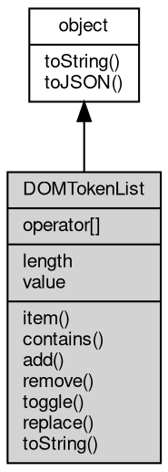

# 对象 DOMTokenList
DOMTokenList 对象，表示一组空格分隔的标记，常用于 classList 属性

DOMTokenList 是表示一组空格分隔的标记的接口。它可以用于表示 CSS 类列表。

示例:

```JavaScript
var xml = require('xml');
var doc = xml.parse('<div class="foo bar"></div>', 'text/html');
var div = doc.documentElement;
var classList = div.classList;
console.log(classList.length); // 2
console.log(classList.item(0)); // "foo"
console.log(classList.contains("bar")); // true
classList.add("baz");
console.log(div.className); // "foo bar baz"
```

## 继承关系


## 操作符
        
### operator[]
**返回指定索引处的标记**

```JavaScript
readonly String DOMTokenList[];
```

## 成员属性
        
### length
**Integer, 返回集合中的标记数量**

```JavaScript
readonly Integer DOMTokenList.length;
```

--------------------------
### value
**String, 返回集合中所有标记的字符串表示，用空格分隔**

```JavaScript
readonly String DOMTokenList.value;
```

## 成员函数
        
### item
**返回指定索引处的标记**

```JavaScript
String DOMTokenList.item(Integer index);
```

调用参数:
* index: Integer, 标记的索引

返回结果:
* String, 返回标记字符串，如果索引超出范围则返回 null

--------------------------
### contains
**检查集合中是否包含指定的标记**

```JavaScript
Boolean DOMTokenList.contains(String token);
```

调用参数:
* token: String, 要检查的标记

返回结果:
* Boolean, 如果包含该标记则返回 true，否则返回 false

--------------------------
### add
**向集合中添加一个或多个标记**

```JavaScript
DOMTokenList.add(...tokens);
```

调用参数:
* tokens: ..., 要添加的标记，可变参数

--------------------------
### remove
**从集合中移除一个或多个标记**

```JavaScript
DOMTokenList.remove(...tokens);
```

调用参数:
* tokens: ..., 要移除的标记，可变参数

--------------------------
### toggle
**如果标记存在则移除它，否则添加它**

```JavaScript
Boolean DOMTokenList.toggle(String token,
    ...force);
```

调用参数:
* token: String, 要切换的标记
* force: ..., 可选。如果为 true，则只添加标记；如果为 false，则只移除标记

返回结果:
* Boolean, 如果操作后标记存在则返回 true，否则返回 false

--------------------------
### replace
**用新标记替换现有标记**

```JavaScript
Boolean DOMTokenList.replace(String oldToken,
    String newToken);
```

调用参数:
* oldToken: String, 要替换的标记
* newToken: String, 新标记

返回结果:
* Boolean, 如果替换成功则返回 true，否则返回 false

--------------------------
### toString
**返回集合中所有标记的字符串表示，用空格分隔**

```JavaScript
String DOMTokenList.toString();
```

返回结果:
* String, 返回标记字符串

--------------------------
### toJSON
**返回对象的 JSON 格式表示，一般返回对象定义的可读属性集合**

```JavaScript
Value DOMTokenList.toJSON(String key = "");
```

调用参数:
* key: String, 未使用

返回结果:
* Value, 返回包含可 JSON 序列化的值

