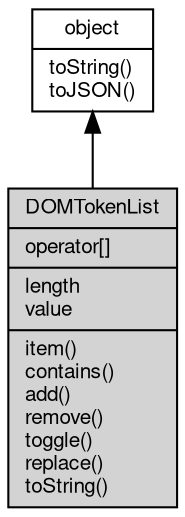

# Object DOMTokenList
The DOMTokenList [object](object.md) represents a set of space-separated tokens, commonly

used for the classList property of an element

DOMTokenList is the interface representing a set of space-separated tokens. In fibjs it
wraps the class attribute of an element: reading re-parses the attribute and the
mutation methods write the token set back, so the [object](object.md) is a live view rather than a
copy. Token matching is case-sensitive. The interface is not constructible and not
exported as a [global](../../module/ifs/global.md) (typeof DOMTokenList is undefined); the only way to obtain one is
`element.classList` in HTML mode, while reading classList on an XML element throws an
invalid-call error (20009).

Concepts:

- **Token parsing**: tokens are separated by space, tab, line feed, carriage return or
  form feed; leading, trailing and repeated separators are ignored and empty tokens are
  dropped. value keeps the raw attribute string while length and item() report the
  parsed view, so a class attribute ` b   a ` yields value `" b   a "` but two tokens,
  b and a.
- **Live view**: the same DOMTokenList [object](object.md) is cached per element and every read
  re-parses the current class attribute. Changing className or the class attribute
  through the attribute methods is immediately visible through the list, and the
  mutation methods write the normalized token set back to the attribute (single spaces
  between tokens, no leading or trailing separator).
- **Differences from MDN**: fibjs implements only the class-attribute use case.
  supports(), forEach(), keys(), values(), entries() and the iteration protocol are not
  available, so use length, item() and indexed access. add() silently ignores empty
  tokens and tokens containing whitespace, where the standard throws a
  SyntaxError/InvalidCharacterError. toggle() and replace() perform no validation at
  all: an empty token can be written (it is invisible to later parses) and a token
  containing spaces is written verbatim (it parses as several tokens later). value is
  read-only here, while the standard defines it as settable.

Obtained from:
- `element.classList` — a cached, live DOMTokenList for the class attribute; HTML mode
  only. There is no constructor and no [module](../../module/ifs/module.md) export.

Example 1 — read and inspect the tokens of a class attribute:

```JavaScript
const xml = require('xml');

const doc = xml.parse('<html><body><p class="note  wide">Hi</p></body></html>',
    'text/html');
const para = doc.querySelector('p');
const list = para.classList;

console.log(list.value); // note  wide
console.log(list.length); // 2
console.log(list.item(0)); // note
console.log(list[1]); // wide
console.log(list.item(2)); // null
console.log(list.contains('wide')); // true
```

Example 2 — change the class of an element through the list:

```JavaScript
const xml = require('xml');

const doc = xml.parse('<html><body><button class="btn">Go</button></body></html>',
    'text/html');
const button = doc.querySelector('button');

button.classList.add('primary', 'btn'); // the duplicate is ignored
button.classList.remove('btn');
button.classList.toggle('disabled');
console.log(button.className); // primary disabled
console.log(String(button)); // <button class="primary disabled">Go</button>
```

Example 3 — the view is live and className stays authoritative:

```JavaScript
const xml = require('xml');

const doc = xml.parse('<html><body><div class="a b"></div></body></html>',
    'text/html');
const div = doc.querySelector('div');
const list = div.classList;

console.log(list === div.classList); // true, the object is cached

div.className = 'x y z'; // an external change is picked up
console.log(list.length); // 3
console.log(list.toggle('y')); // false, y was removed
console.log(div.className); // x z
```

## Inheritance

```dot
digraph {
    node [fontname="Helvetica,sans-Serif", fontsize=10, shape="record", style="filled", fillcolor="white"];

    object [tooltip="object", URL="object.md", label="{object|toString()\ltoJSON()\l}"];
    DOMTokenList [tooltip="DOMTokenList", fillcolor="lightgray", id="me", label="{DOMTokenList|operator[]\l|length\lvalue\l|item()\lcontains()\ladd()\lremove()\ltoggle()\lreplace()\ltoString()\l}"];

    object -> DOMTokenList [dir=back];
}
```

## Operators
        
### operator[]
**Returns the token at the specified index, or undefined when the index is**

```JavaScript
readonly String DOMTokenList[];
```

out of range

The index is 0-based and applied to the parsed token set at the time of the read.
Unlike item(), an out-of-range index yields undefined rather than null.

## Properties
        
### length
**Integer, Returns the number of tokens in the set**

```JavaScript
readonly Integer DOMTokenList.length;
```

The value is recomputed on every read from the current class attribute, so it
reflects external changes to className or to the class attribute. Empty tokens and
duplicate separators are not counted.

--------------------------
### value
**String, Returns the raw class attribute string**

```JavaScript
readonly String DOMTokenList.value;
```

Contrary to the standard the property is read-only (an assignment is silently
ignored) and the string is returned verbatim, including repeated or leading
separators: it is not the normalized form that the mutation methods write.
An empty string is returned when the class attribute is absent. toString() and
String(list) return the same value.

## Methods
        
### item
**Returns the token at the specified index**

```JavaScript
String DOMTokenList.item(Integer index);
```

Parameters:
* index: Integer, the index of the token

Returns:
* String, returns the token string, or null if the index is out of range

The index is 0-based; a negative index or an index greater than or equal to length
returns null. A numeric string is accepted and converted.

--------------------------
### contains
**Checks whether the set contains the specified token**

```JavaScript
Boolean DOMTokenList.contains(String token);
```

Parameters:
* token: String, the token to check

Returns:
* Boolean, returns true if the token is contained, otherwise false

The comparison is case-sensitive and exact; an empty string never matches. A value
that is not a string throws a type error (20005) instead of being converted.

--------------------------
### add
**Adds one or more tokens to the set**

```JavaScript
DOMTokenList.add(...tokens);
```

Parameters:
* tokens: ..., the tokens to add, variadic parameter

Tokens are appended in argument order and are written back to the class attribute
separated by single spaces. Tokens that are empty, already present or contain
whitespace are silently skipped (the standard throws for the last two cases).
Arguments are converted with the usual type checks, so a number throws 20005.

Example — add tokens and observe the normalized attribute:

```JavaScript
const xml = require('xml');

const doc = xml.parse('<html><body><div class="a b"></div></body></html>',
    'text/html');
const div = doc.querySelector('div');

div.classList.add('c', 'a', '', 'x y');
console.log(div.className); // a b c
```

--------------------------
### remove
**Removes one or more tokens from the set**

```JavaScript
DOMTokenList.remove(...tokens);
```

Parameters:
* tokens: ..., the tokens to remove, variadic parameter

Each named token is removed once (naming a duplicated token removes a single
occurrence) and unknown tokens are ignored; the remaining tokens are written back
separated by single spaces. Removing the last token leaves an empty class
attribute. Arguments are converted with the usual type checks, so a number throws
20005.

--------------------------
### toggle
**Removes the token if it exists, otherwise adds it**

```JavaScript
Boolean DOMTokenList.toggle(String token,
    ...force);
```

Parameters:
* token: String, the token to toggle
* force: ..., optional. If true, only adds the token; if false, only removes the token

Returns:
* Boolean, returns true if the token is present after the operation, otherwise false

Without force the return value tells whether the token is present after the call.
With force the operation only adds (truthy) or only removes (falsy); the value is
coerced with the usual boolean rules, so any non-empty string means true. fibjs
performs no token validation here: an empty token is appended as-is and a token
containing whitespace is written verbatim.

Example — conditional toggling with the force argument:

```JavaScript
const xml = require('xml');

const doc = xml.parse('<html><body><div class="menu"></div></body></html>',
    'text/html');
const div = doc.querySelector('div');

div.classList.toggle('menu', true); // already there, no change
div.classList.toggle('open', true); // force add
console.log(div.className); // menu open
console.log(div.classList.toggle('open', false)); // false
console.log(div.className); // menu
```

--------------------------
### replace
**Replaces an existing token with a new token**

```JavaScript
Boolean DOMTokenList.replace(String oldToken,
    String newToken);
```

Parameters:
* oldToken: String, the token to replace
* newToken: String, the new token

Returns:
* Boolean, returns true if the replacement succeeded, otherwise false

Returns false and leaves the set unchanged when oldToken is absent. When newToken
is already present at another position, oldToken is simply removed; otherwise
oldToken is overwritten in place, so its position is preserved. No token validation
is performed: newToken is written verbatim even when it contains whitespace.
Argument type errors throw 20005.

--------------------------
### toString
**Returns the string representation of the set**

```JavaScript
String DOMTokenList.toString();
```

Returns:
* String, returns the token string

Equivalent to value: the raw class attribute string, not a normalized token list.
Called implicitly by string concatenation and by String(list).

--------------------------
### toJSON
**Returns the JSON representation of the [object](object.md)**

```JavaScript
Value DOMTokenList.toJSON(String key = "");
```

Parameters:
* key: String, the property name of the value being serialized

Returns:
* Value, returns the JSON-serializable value

JSON.stringify(value) calls value.toJSON(key) when the member exists and
serializes the returned value in its place; the key argument carries the
property name of the value inside its parent [object](object.md) (an empty string at
the top level) and may be used to build a keyed form. The base
implementation returns a plain [object](object.md) holding the readable properties of
the instance, so a native [object](object.md) serializes without per-class code; a
class with a portable shape such as [Buffer](Buffer.md) overrides it, and a JavaScript
class may override it in the same way.

The member is normally reached through JSON.stringify rather than called
directly; calling it returns the same value JSON.stringify would
serialize.

