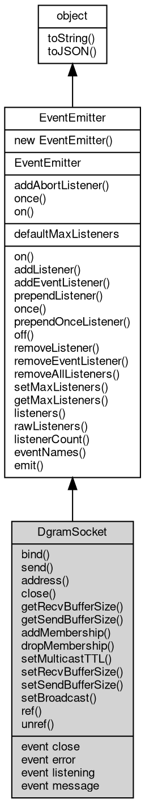

# 对象 DgramSocket
[dgram.Socket](../../module/ifs/dgram.md#Socket) 对象是一个封装了数据包函数功能的 [EventEmitter](EventEmitter.md)。

DgramSocket 实例是由 [dgram.createSocket](../../module/ifs/dgram.md#createSocket)() 创建的。创建 [dgram.Socket](../../module/ifs/dgram.md#Socket) 实例不需要使用 new 关键字。

创建方法：

```JavaScript
var dgram = require('dgram');
var sock = dgram.createSocket('udp4');
```

## 继承关系


## 静态函数
        
### addAbortListener
**监听一个 [AbortSignal](AbortSignal.md) 的 abort 事件，返回一个可释放的对象**

```JavaScript
static Object DgramSocket.addAbortListener(EventEmitter signal,
    Function func);
```

调用参数:
* signal: [EventEmitter](EventEmitter.md), 要监听的 [AbortSignal](AbortSignal.md) 对象
* func: Function, abort 事件的处理函数

返回结果:
* Object, 返回一个包含 `[Symbol.dispose]` 方法的 Disposable 对象

返回的对象包含 `[Symbol.dispose]()` 方法，调用后将移除监听器。如果信号已中止，则监听器会被立即调用。

--------------------------
### once
**创建一个 Promise，等待指定事件触发一次后解析**

```JavaScript
static Object DgramSocket.once(EventEmitter emitter,
    Value ev,
    Object options = {});
```

调用参数:
* emitter: [EventEmitter](EventEmitter.md), 要监听的事件触发器对象
* ev: Value, 指定事件的名称
* options: Object, 可选参数对象

返回结果:
* Object, 返回 Promise，以事件参数数组解析

返回一个 Promise，当目标事件触发时以事件参数数组解析。如果在此期间触发 'error' 事件（且监听的不是 'error' 事件本身），Promise 将被拒绝。

options 参数可包含：
- signal: [AbortSignal](AbortSignal.md)，用于取消等待

--------------------------
### on
**创建一个异步迭代器，持续监听指定事件**

```JavaScript
static Object DgramSocket.on(EventEmitter emitter,
    Value ev,
    Object options = {});
```

调用参数:
* emitter: [EventEmitter](EventEmitter.md), 要监听的事件触发器对象
* ev: Value, 指定事件的名称
* options: Object, 可选参数对象

返回结果:
* Object, 返回 AsyncIterator 对象

返回一个 AsyncIterator，每次事件触发时产出事件参数数组。如果触发 'error' 事件，迭代器将抛出错误。

options 参数可包含：
- signal: [AbortSignal](AbortSignal.md)，用于取消迭代
- close: 字符串数组，指定结束迭代的事件名称

## 静态属性
        
### defaultMaxListeners
**Integer, 默认全局最大监听器数**

```JavaScript
static Integer DgramSocket.defaultMaxListeners;
```

## 成员函数
        
### bind
**该方法会令 [dgram.Socket](../../module/ifs/dgram.md#Socket) 在指定的 `port` 和 `addr` 上监听数据包信息。绑定完成时会触发一个 `listening` 事件。**

```JavaScript
DgramSocket.bind(Integer port = 0,
    String addr = "") async;
```

调用参数:
* port: Integer, 指定绑定端口，若 `port` 未指定或为 0，操作系统会尝试绑定一个随机的端口
* addr: String, 指定绑定地址，若 address 未指定，操作系统会尝试在所有地址上监听。

--------------------------
**该方法会令 [dgram.Socket](../../module/ifs/dgram.md#Socket) 在 `opts` 指定的 `port` 和 `address` 上监听数据包信息。绑定完成时会触发一个 `listening` 事件。**

```JavaScript
DgramSocket.bind(Object opts) async;
```

调用参数:
* opts: Object, 指定绑定参数

--------------------------
### send
**在 socket 上发送一个数据包**

```JavaScript
Integer DgramSocket.send(Buffer msg,
    Integer port,
    String address = "") async;
```

调用参数:
* msg: [Buffer](Buffer.md), 指定发送的数据
* port: Integer, 指定发送的目的端口
* address: String, 指定发送的目的地址

返回结果:
* Integer, 返回发送尺寸

--------------------------
**在 socket 上发送一个数据包**

```JavaScript
Integer DgramSocket.send(Buffer msg,
    Integer offset,
    Integer length,
    Integer port,
    String address = "") async;
```

调用参数:
* msg: [Buffer](Buffer.md), 指定发送的数据
* offset: Integer, 从指定偏移开始发送
* length: Integer, 之发送指定长度
* port: Integer, 指定发送的目的端口
* address: String, 指定发送的目的地址

返回结果:
* Integer, 返回发送尺寸

--------------------------
### address
**返回一个包含 socket 地址信息的对象。对于 UDP socket，该对象将包含 address、family 和 port 属性。**

```JavaScript
NObject DgramSocket.address();
```

返回结果:
* NObject, 返回对象绑定地址

--------------------------
### close
**关闭当前 socket**

```JavaScript
DgramSocket.close();
```

--------------------------
**关闭当前 socket**

```JavaScript
DgramSocket.close(Function callback);
```

调用参数:
* callback: Function, 关闭完成后的回调函数，它相当于为 `close` 事件添加了一个监听器

--------------------------
### getRecvBufferSize
**查询 socket 接收缓冲区大小**

```JavaScript
Integer DgramSocket.getRecvBufferSize();
```

返回结果:
* Integer, 返回查询结果

--------------------------
### getSendBufferSize
**查询 socket 发送缓冲区大小**

```JavaScript
Integer DgramSocket.getSendBufferSize();
```

返回结果:
* Integer, 返回查询结果

--------------------------
### addMembership
**使用 IP_ADD_MEMBERSHIP 套接字选项加入给定 multicastAddress 和 multicastInterface 处的多播组。如果未指定 multicastInterface 参数，操作系统将选择一个接口并向其添加成员资格。要向每个可用接口添加成员资格，请多次调用 addMembership ，每个接口调用一次。**

```JavaScript
DgramSocket.addMembership(String multicastAddress,
    String multicastInterface = "");
```

调用参数:
* multicastAddress: String, 指定要加入的多播组地址
* multicastInterface: String, 指定要加入的多播组接口

--------------------------
### dropMembership
**使用 IP_DROP_MEMBERSHIP 套接字选项在 multicastAddress 处留下多播组。当套接字关闭或进程终止时，内核会自动调用此方法，因此大多数应用程序永远没有理由调用此方法。**

```JavaScript
DgramSocket.dropMembership(String multicastAddress,
    String multicastInterface = "");
```

调用参数:
* multicastAddress: String, 指定要删除的多播组地址
* multicastInterface: String, 指定要删除的多播组接口

--------------------------
### setMulticastTTL
**设置 IP_MULTICAST_TTL 套接字选项**

```JavaScript
DgramSocket.setMulticastTTL(Integer ttl);
```

调用参数:
* ttl: Integer, 指定要设置的 ttl，ttl 参数可以介于 0 和 255 之间。大多数系统上的默认值为 1。

--------------------------
### setRecvBufferSize
**设置 socket 接收缓冲区大小**

```JavaScript
DgramSocket.setRecvBufferSize(Integer size);
```

调用参数:
* size: Integer, 指定要设置的尺寸

--------------------------
### setSendBufferSize
**设置 socket 发送缓冲区大小**

```JavaScript
DgramSocket.setSendBufferSize(Integer size);
```

调用参数:
* size: Integer, 指定要设置的尺寸

--------------------------
### setBroadcast
**设置或清除 SO_BROADCAST socket 选项**

```JavaScript
DgramSocket.setBroadcast(Boolean flag);
```

调用参数:
* flag: Boolean, 当设置为 true, UDP包会被发送到一个本地接口的广播地址

--------------------------
### ref
**维持 fibjs 进程不退出，在对象绑定期间阻止 fibjs 进程退出**

```JavaScript
DgramSocket DgramSocket.ref();
```

返回结果:
* DgramSocket, 返回当前对象

--------------------------
### unref
**允许 fibjs 进程退出，在对象绑定期间允许 fibjs 进程退出**

```JavaScript
DgramSocket DgramSocket.unref();
```

返回结果:
* DgramSocket, 返回当前对象

--------------------------
### on
**绑定一个事件处理函数到对象**

```JavaScript
Object DgramSocket.on(Value ev,
    Function func);
```

调用参数:
* ev: Value, 指定事件的名称
* func: Function, 指定事件处理函数

返回结果:
* Object, 返回事件对象本身，便于链式调用

--------------------------
**绑定一个事件处理函数到对象**

```JavaScript
Object DgramSocket.on(Object map);
```

调用参数:
* map: Object, 指定事件映射关系，对象属性名称将作为事件名称，属性的值将作为事件处理函数

返回结果:
* Object, 返回事件对象本身，便于链式调用

--------------------------
### addListener
**绑定一个事件处理函数到对象**

```JavaScript
Object DgramSocket.addListener(Value ev,
    Function func);
```

调用参数:
* ev: Value, 指定事件的名称
* func: Function, 指定事件处理函数

返回结果:
* Object, 返回事件对象本身，便于链式调用

--------------------------
**绑定一个事件处理函数到对象**

```JavaScript
Object DgramSocket.addListener(Object map);
```

调用参数:
* map: Object, 指定事件映射关系，对象属性名称将作为事件名称，属性的值将作为事件处理函数

返回结果:
* Object, 返回事件对象本身，便于链式调用

--------------------------
### addEventListener
**绑定一个事件处理函数到对象**

```JavaScript
Object DgramSocket.addEventListener(Value ev,
    Function func,
    Object options = {});
```

调用参数:
* ev: Value, 指定事件的名称
* func: Function, 指定事件处理函数
* options: Object, 指定事件处理函数的选项

返回结果:
* Object, 返回事件对象本身，便于链式调用

options 参数是一个对象，它可以包含以下属性：
- once: 如果为 true，则事件处理函数只会触发一次，触发后会被移除

--------------------------
### prependListener
**绑定一个事件处理函数到对象起始**

```JavaScript
Object DgramSocket.prependListener(Value ev,
    Function func);
```

调用参数:
* ev: Value, 指定事件的名称
* func: Function, 指定事件处理函数

返回结果:
* Object, 返回事件对象本身，便于链式调用

--------------------------
**绑定一个事件处理函数到对象起始**

```JavaScript
Object DgramSocket.prependListener(Object map);
```

调用参数:
* map: Object, 指定事件映射关系，对象属性名称将作为事件名称，属性的值将作为事件处理函数

返回结果:
* Object, 返回事件对象本身，便于链式调用

--------------------------
### once
**绑定一个一次性事件处理函数到对象，一次性处理函数只会触发一次**

```JavaScript
Object DgramSocket.once(Value ev,
    Function func);
```

调用参数:
* ev: Value, 指定事件的名称
* func: Function, 指定事件处理函数

返回结果:
* Object, 返回事件对象本身，便于链式调用

--------------------------
**绑定一个一次性事件处理函数到对象，一次性处理函数只会触发一次**

```JavaScript
Object DgramSocket.once(Object map);
```

调用参数:
* map: Object, 指定事件映射关系，对象属性名称将作为事件名称，属性的值将作为事件处理函数

返回结果:
* Object, 返回事件对象本身，便于链式调用

--------------------------
### prependOnceListener
**绑定一个事件处理函数到对象起始**

```JavaScript
Object DgramSocket.prependOnceListener(Value ev,
    Function func);
```

调用参数:
* ev: Value, 指定事件的名称
* func: Function, 指定事件处理函数

返回结果:
* Object, 返回事件对象本身，便于链式调用

--------------------------
**绑定一个事件处理函数到对象起始**

```JavaScript
Object DgramSocket.prependOnceListener(Object map);
```

调用参数:
* map: Object, 指定事件映射关系，对象属性名称将作为事件名称，属性的值将作为事件处理函数

返回结果:
* Object, 返回事件对象本身，便于链式调用

--------------------------
### off
**从对象处理队列中取消指定函数**

```JavaScript
Object DgramSocket.off(Value ev,
    Function func);
```

调用参数:
* ev: Value, 指定事件的名称
* func: Function, 指定事件处理函数

返回结果:
* Object, 返回事件对象本身，便于链式调用

--------------------------
**取消对象处理队列中的全部函数**

```JavaScript
Object DgramSocket.off(Value ev);
```

调用参数:
* ev: Value, 指定事件的名称

返回结果:
* Object, 返回事件对象本身，便于链式调用

--------------------------
**从对象处理队列中取消指定函数**

```JavaScript
Object DgramSocket.off(Object map);
```

调用参数:
* map: Object, 指定事件映射关系，对象属性名称作为事件名称，属性的值作为事件处理函数

返回结果:
* Object, 返回事件对象本身，便于链式调用

--------------------------
### removeListener
**从对象处理队列中取消指定函数**

```JavaScript
Object DgramSocket.removeListener(Value ev,
    Function func);
```

调用参数:
* ev: Value, 指定事件的名称
* func: Function, 指定事件处理函数

返回结果:
* Object, 返回事件对象本身，便于链式调用

--------------------------
**取消对象处理队列中的全部函数**

```JavaScript
Object DgramSocket.removeListener(Value ev);
```

调用参数:
* ev: Value, 指定事件的名称

返回结果:
* Object, 返回事件对象本身，便于链式调用

--------------------------
**从对象处理队列中取消指定函数**

```JavaScript
Object DgramSocket.removeListener(Object map);
```

调用参数:
* map: Object, 指定事件映射关系，对象属性名称作为事件名称，属性的值作为事件处理函数

返回结果:
* Object, 返回事件对象本身，便于链式调用

--------------------------
### removeEventListener
**从对象处理队列中取消指定函数**

```JavaScript
Object DgramSocket.removeEventListener(Value ev,
    Function func,
    Object options = {});
```

调用参数:
* ev: Value, 指定事件的名称
* func: Function, 指定事件处理函数
* options: Object, 指定事件处理函数的选项

返回结果:
* Object, 返回事件对象本身，便于链式调用

--------------------------
### removeAllListeners
**从对象处理队列中取消所有事件的所有监听器， 如果指定事件，则移除指定事件的所有监听器。**

```JavaScript
Object DgramSocket.removeAllListeners(Value ev);
```

调用参数:
* ev: Value, 指定事件的名称

返回结果:
* Object, 返回事件对象本身，便于链式调用

--------------------------
**从对象处理队列中取消所有事件的所有监听器， 如果指定事件，则移除指定事件的所有监听器。**

```JavaScript
Object DgramSocket.removeAllListeners(Array evs = []);
```

调用参数:
* evs: Array, 指定事件的名称

返回结果:
* Object, 返回事件对象本身，便于链式调用

--------------------------
### setMaxListeners
**监听器的默认限制的数量，仅用于兼容**

```JavaScript
DgramSocket.setMaxListeners(Integer n);
```

调用参数:
* n: Integer, 指定事件的数量

--------------------------
### getMaxListeners
**获取监听器的默认限制的数量，仅用于兼容**

```JavaScript
Integer DgramSocket.getMaxListeners();
```

返回结果:
* Integer, 返回默认限制数量

--------------------------
### listeners
**查询对象指定事件的监听器数组**

```JavaScript
Array DgramSocket.listeners(Value ev);
```

调用参数:
* ev: Value, 指定事件的名称

返回结果:
* Array, 返回指定事件的监听器数组

--------------------------
### rawListeners
**查询对象指定事件的监听器数组，包含 once 包装函数**

```JavaScript
Array DgramSocket.rawListeners(Value ev);
```

调用参数:
* ev: Value, 指定事件的名称

返回结果:
* Array, 返回指定事件的监听器数组

--------------------------
### listenerCount
**查询对象指定事件的监听器数量**

```JavaScript
Integer DgramSocket.listenerCount(Value ev);
```

调用参数:
* ev: Value, 指定事件的名称

返回结果:
* Integer, 返回指定事件的监听器数量

--------------------------
**查询对象指定事件的监听器数量**

```JavaScript
Integer DgramSocket.listenerCount(Value o,
    Value ev);
```

调用参数:
* o: Value, 指定查询的对象
* ev: Value, 指定事件的名称

返回结果:
* Integer, 返回指定事件的监听器数量

--------------------------
### eventNames
**查询监听器事件名称**

```JavaScript
Array DgramSocket.eventNames();
```

返回结果:
* Array, 返回事件名称数组

--------------------------
### emit
**主动触发一个事件**

```JavaScript
Boolean DgramSocket.emit(Value ev,
    ...args);
```

调用参数:
* ev: Value, 事件名称
* args: ..., 事件参数，将会传递给事件处理函数

返回结果:
* Boolean, 返回事件触发状态，有响应事件返回 true，否则返回 false

--------------------------
### toString
**返回对象的字符串表示，一般返回 "[Native Object]"，对象可以根据自己的特性重新实现**

```JavaScript
String DgramSocket.toString();
```

返回结果:
* String, 返回对象的字符串表示

--------------------------
### toJSON
**返回对象的 JSON 格式表示，一般返回对象定义的可读属性集合**

```JavaScript
Value DgramSocket.toJSON(String key = "");
```

调用参数:
* key: String, 未使用

返回结果:
* Value, 返回包含可 JSON 序列化的值

## 事件
        
### close
**`close` 事件将在使用 `close()` 关闭一个 `socket` 之后触发。该事件一旦触发，这个 `socket` 上将不会触发新的 `message` 事件**

```JavaScript
event DgramSocket.close();
```

--------------------------
### error
**当有任何错误发生时，`error` 事件将被触发**

```JavaScript
event DgramSocket.error();
```

--------------------------
### listening
**当一个 `socket` 开始监听数据包信息时，`listening` 事件将被触发。该事件会在创建 UDP socket 之后被立即触发**

```JavaScript
event DgramSocket.listening();
```

--------------------------
### message
**当有新的数据包被 `socket` 接收时，`message` 事件会被触发。`msg` 和 `rinfo` 会作为参数传递到该事件的处理函数中。**

```JavaScript
event DgramSocket.message(Buffer msg,
    NObject rinfo);
```

调用参数:
* msg: [Buffer](Buffer.md), 接收到的数据包
* rinfo: NObject, 包含接收数据包的远程信息的对象。该对象包含 `address`、`port` 和 `family` 属性，分别表示远程地址、端口和协议族。

