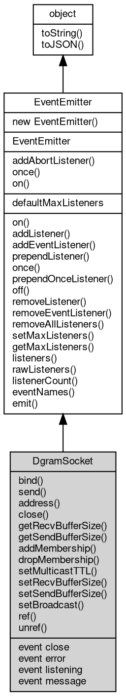

# Object DgramSocket
A UDP datagram socket: an [EventEmitter](EventEmitter.md) endpoint that binds a local port, sends one datagram at a time to a destination, and delivers every received datagram through the 'message' event

DgramSocket is the concrete socket behind [dgram.createSocket](../../module/ifs/dgram.md#createSocket). It plays two roles:
- **receiver**: bind to a local port (or let the first send bind automatically) and handle every
  datagram in the 'message' event;
- **sender**: send one datagram at a time with the synchronous, callback or promise form of send.

DgramSocket inherits on/once/off/emit and the listener bookkeeping of [EventEmitter](EventEmitter.md) and adds the
UDP operations: bind, send, address, close, the buffer-size and multicast accessors and the
ref/unref pair. See the [dgram](../../module/ifs/dgram.md) [module](../../module/ifs/module.md) for the UDP model, the size limits and the
broadcast/multicast rules.

Concepts:

- **[Message](Message.md) boundaries**: each send produces exactly one 'message' event and the payload is never
  split or merged; delivery, ordering and duplication are not guaranteed.
- **Binding**: the socket is created unbound; bind assigns the local address and emits
  'listening' during the call, so the synchronous form returns after the event has been handled
  (Node.js emits it on a later tick). send on an unbound socket binds it first to a random port
  on 0.0.0.0 or ::.
- **Call forms**: bind and send follow the asynchronous conventions of the [module](../../module/ifs/module.md) — without a
  callback they block the calling fiber and return the result, with a trailing callback they run
  asynchronously, and the Sync/Async aliases exist as well. Receiving is event-only: datagrams
  arrive at the 'message' event, whose handler runs in its own fiber and may block or call the
  socket without stalling the sender.
- **Remote information**: a message handler receives the payload and an [object](object.md) with the sender
  address, family, port and payload size.
- **Lifetime**: close releases the handle and emits 'close'; the address and buffer-size getters
  then fail with EBADF, so do not reuse the socket. A bound socket keeps the [process](../../module/ifs/process.md) alive until
  close or unref; ref restores the keep-alive.
- **Node.js differences**: create instances with [dgram.createSocket](../../module/ifs/dgram.md#createSocket) only (new [dgram.Socket](../../module/ifs/dgram.md#Socket)() is
  not constructible); there is no recv method; bind(opts) reads only the required port and
  address keys; errors are thrown rather than emitted through 'error'; and there are no
  setTTL/setMulticastLoopback/setMulticastInterface, source-specific membership or connect
  methods.

Obtained from:
- `dgram.createSocket('udp4' | 'udp6' | options[, callback])` — the only creation [path](../../module/ifs/path.md).

Example 1 — a request/response round trip with an explicit local port:

```JavaScript
const dgram = require('dgram');
const coroutine = require('coroutine');

const server = dgram.createSocket('udp4');
server.bind(0, '127.0.0.1');
server.on('message', (msg, rinfo) => {
    console.log(rinfo.address, rinfo.size); // 127.0.0.1 4
    server.send('pong', rinfo.port, rinfo.address);
});

const client = dgram.createSocket('udp4');
let reply = null;
client.on('message', (msg) => {
    reply = msg.toString();
});
client.send('ping', server.address().port, '127.0.0.1');

let waited = 0;
while (reply === null && waited < 1000) {
    coroutine.sleep(10);
    waited += 10;
}
console.log(reply); // pong

client.close();
server.close();
```

Example 2 — the options form, address() and the socket buffer sizes:

```JavaScript
const dgram = require('dgram');

const socket = dgram.createSocket({
    type: 'udp4',
    reuseAddr: true,
    recvBufferSize: 65536,
    sendBufferSize: 65536
});
socket.bind({
    port: 0,
    address: '127.0.0.1'
});

const info = socket.address();
console.log(info.family, info.address, info.port > 0); // IPv4 127.0.0.1 true
console.log(socket.getRecvBufferSize() > 0, socket.getSendBufferSize() > 0); // true true

socket.close();
```

Example 3 — an event-driven receiver handling several datagrams:

```JavaScript
const dgram = require('dgram');
const coroutine = require('coroutine');

const received = [];
const socket = dgram.createSocket('udp4', (msg) => {
    received.push(msg.toString());
});
socket.bind(0, '127.0.0.1');

const sender = dgram.createSocket('udp4');
sender.send('one', socket.address().port, '127.0.0.1');
sender.send('two', socket.address().port, '127.0.0.1');
sender.send('three', socket.address().port, '127.0.0.1');

let waited = 0;
while (received.length < 3 && waited < 1000) {
    coroutine.sleep(10);
    waited += 10;
}
console.log(received.length, received.indexOf('one') >= 0); // 3 true

sender.close();
socket.close();
```

Example 4 — joining a multicast group (needs a multicast-capable interface):

```JavaScript
// requires: network
const dgram = require('dgram');
const coroutine = require('coroutine');

const group = '225.0.0.100';
const port = 41234;

let got = null;
const member = dgram.createSocket({
    type: 'udp4',
    reuseAddr: true
});
member.bind(port);
member.addMembership(group);
member.setMulticastTTL(1);
member.on('message', (msg) => {
    got = msg.toString();
});

const sender = dgram.createSocket('udp4');
sender.send('multicast', port, group);

let waited = 0;
while (got === null && waited < 1000) {
    coroutine.sleep(10);
    waited += 10;
}
console.log(got); // multicast

sender.close();
member.close();
```

## Inheritance

```dot
digraph {
    node [fontname="Helvetica,sans-Serif", fontsize=10, shape="record", style="filled", fillcolor="white"];

    object [tooltip="object", URL="object.md", label="{object|toString()\ltoJSON()\l}"];
    EventEmitter [tooltip="EventEmitter", URL="EventEmitter.md", label="{EventEmitter|new EventEmitter()\l|EventEmitter\l|addAbortListener()\lonce()\lon()\l|defaultMaxListeners\l|on()\laddListener()\laddEventListener()\lprependListener()\lonce()\lprependOnceListener()\loff()\lremoveListener()\lremoveEventListener()\lremoveAllListeners()\lsetMaxListeners()\lgetMaxListeners()\llisteners()\lrawListeners()\llistenerCount()\leventNames()\lemit()\l}"];
    DgramSocket [tooltip="DgramSocket", fillcolor="lightgray", id="me", label="{DgramSocket|bind()\lsend()\laddress()\lclose()\lgetRecvBufferSize()\lgetSendBufferSize()\laddMembership()\ldropMembership()\lsetMulticastTTL()\lsetRecvBufferSize()\lsetSendBufferSize()\lsetBroadcast()\lref()\lunref()\l|event close\levent error\levent listening\levent message\l}"];

    object -> EventEmitter [dir=back];
    EventEmitter -> DgramSocket [dir=back];
}
```

## Static Methods
        
### addAbortListener
**Registers a one-shot abort handler on an [AbortSignal](AbortSignal.md)**

```JavaScript
static Object DgramSocket.addAbortListener(EventEmitter signal,
    Function(Object ev) func);
```

Parameters:
* signal: [EventEmitter](EventEmitter.md), the [AbortSignal](AbortSignal.md) [object](object.md) to listen to
* func: Function(Object ev), the handler for the abort event

Returns:
* Object, returns a Disposable [object](object.md) containing a `[Symbol.dispose]` method

The handler is called at most once when the signal is aborted, and it is removed from the
signal afterwards. If the signal is already aborted the handler is invoked synchronously.
The returned [object](object.md) has a `[Symbol.dispose]()` method that removes the handler, so it can be
released before the abort happens.

Example — abort handling with automatic cleanup:

```JavaScript
const events = require('events');

const controller = new AbortController();
const disposable = events.addAbortListener(controller.signal,
    () => console.log('aborted'));

controller.abort(); // aborted
disposable[Symbol.dispose](); // safe to call after the listener fired
console.log(controller.signal.listenerCount('abort')); // 0
```

--------------------------
### once
**Creates a Promise resolved by the next occurrence of an event**

```JavaScript
static Object DgramSocket.once(EventEmitter emitter,
    Value ev,
    Object options = {});
```

Parameters:
* emitter: [EventEmitter](EventEmitter.md), the event emitter [object](object.md) to listen to
* ev: Value, the event name to listen for
* options: Object, optional parameter [object](object.md)

Returns:
* Object, returns a Promise that resolves with the array of event parameters

The Promise resolves with the array of the emit arguments when the event fires; it rejects
when `error` is emitted while waiting, unless the waited event is `error` itself, or when
the signal option aborts. The temporary listeners are removed when the Promise settles.

options supports the following option:

```JavaScript
// fragment: options
({
    "signal": null // AbortSignal; aborting rejects the Promise with an AbortError
});
```

Example — awaiting the next occurrence of an event:

```JavaScript
const EventEmitter = require('events');

(async () => {
    const emitter = new EventEmitter();
    const waiting = EventEmitter.once(emitter, 'ready');

    emitter.emit('ready', 200, 'ok');
    console.log(JSON.stringify(await waiting)); // [200,"ok"]
})();
```

--------------------------
### on
**Creates an async iterator that yields event occurrences**

```JavaScript
static Object DgramSocket.on(EventEmitter emitter,
    Value ev,
    Object options = {});
```

Parameters:
* emitter: [EventEmitter](EventEmitter.md), the event emitter [object](object.md) to listen to
* ev: Value, the event name to listen for
* options: Object, optional parameter [object](object.md)

Returns:
* Object, returns an AsyncIterator [object](object.md)

Each next() resolves with `{ value: [args...], done: false }` when the event fires and with
`{ done: true }` after an event named in the `close` option fires or the signal aborts; an
`error` event rejects the pending call. The listeners are registered when the iterator is
created and removed when the iteration ends or the signal aborts.

options supports the following options:

```JavaScript
// fragment: options
({
    "signal": null, // AbortSignal; aborting rejects pending and future next() calls
    "close": [] // event names; the first one to fire ends the iteration
});
```

Example — iterating the occurrences of an event:

```JavaScript
const EventEmitter = require('events');

(async () => {
    const emitter = new EventEmitter();
    const iterator = EventEmitter.on(emitter, 'data', {
        close: ['end']
    });

    emitter.emit('data', 1);
    emitter.emit('data', 2);
    emitter.emit('end');

    for await (const args of iterator)
    console.log(JSON.stringify(args)); // [1] then [2]
})();
```

## Static Properties
        
### defaultMaxListeners
**Integer, The [process](../../module/ifs/process.md)-wide default listener limit reported by getMaxListeners()**

```JavaScript
static Integer DgramSocket.defaultMaxListeners;
```

Defaults to 10. Assigning a value changes getMaxListeners() for every emitter that never
called setMaxListeners(); an emitter with an explicit limit keeps it. The limit is
informational: fibjs never warns when the number of listeners exceeds it.

## Methods
        
### bind
**Binds the socket to a local port and address and starts delivering received datagrams to the 'message' event**

```JavaScript
DgramSocket.bind(Integer port = 0,
    String addr = "") async;
```

Parameters:
* port: Integer, the local port, 0 to let the operating system choose
* addr: String, the local address, empty to bind every local address

port defaults to 0, which asks the operating system for a free port (read it back with
address); addr defaults to "", which binds every local address (0.0.0.0 for udp4, :: for
udp6). The recvBufferSize and sendBufferSize options passed to createSocket are applied
here. The same operation is also available as bind(opts) with an options [object](object.md).

The 'listening' event is emitted during bind — in the synchronous form it has already been
handled when the call returns — while Node.js emits it on a later tick. Binding a socket
that is already bound throws error 20009, and binding a port in use throws EADDRINUSE.
Node.js additionally accepts exclusive/fd options; fibjs does not.

Example — bind to an ephemeral port and report the assigned address:

```JavaScript
const dgram = require('dgram');

const socket = dgram.createSocket('udp4');
let info = null;
socket.on('listening', () => {
    info = socket.address();
});

socket.bind(0, '127.0.0.1');
console.log(info.family, info.address, info.port > 0); // IPv4 127.0.0.1 true

socket.close();
```

--------------------------
**Binds the socket with an options [object](object.md); both `port` and `address` are required**

```JavaScript
DgramSocket.bind(Object opts) async;
```

Parameters:
* opts: Object, the binding options

The options [object](object.md) accepts:

```JavaScript
// fragment: options
({
    port: 0, // the local port, 0 to let the operating system choose
    address: "127.0.0.1" // the local address to bind; required even when port is 0
})
```

Unlike Node.js, exclusive, fd and the remaining bind options are not read, and a missing
key throws error 20002. The 'listening' event and the error behavior are the same as in the
port/address form above.

--------------------------
### send
**Sends one datagram to the given destination and returns the number of bytes sent**

```JavaScript
Integer DgramSocket.send(Buffer | String msg,
    Integer port,
    String address = "") async;
```

Parameters:
* msg: [Buffer](Buffer.md) | String, the datagram payload
* port: Integer, the destination port
* address: String, the destination address or host name, empty for the loopback address

Returns:
* Integer, the number of bytes sent

msg may be a [Buffer](Buffer.md) or a string, which is encoded as utf8; the whole payload becomes one
datagram. address defaults to the loopback address of the socket family (127.0.0.1 for
udp4, ::1 for udp6), unlike Node.js which requires it; a host name is accepted and resolved
through the system resolver, which throws ENOTFOUND or EAI_AGAIN for unknown names.

An unbound socket is bound automatically first (emitting 'listening') to a random port on
every local address. A payload larger than 65507 bytes for udp4 (65527 for udp6) throws
EMSGSIZE, and sending to a broadcast address without setBroadcast(true) throws EACCES. The
trailing callback form receives (err, bytes); sendSync/sendAsync and the promises namespace
are generated as well.

The byte-range form send(msg, offset, length, port, address) sends the slice
[offset, offset + length) of the utf8-encoded payload and throws error 20004 for a negative
offset or a non-positive length.

Example — send the last word of a larger payload:

```JavaScript
const dgram = require('dgram');
const coroutine = require('coroutine');

const server = dgram.createSocket('udp4');
let got = null;
server.on('message', (msg) => {
    got = msg.toString();
});
server.bind(0, '127.0.0.1');

const client = dgram.createSocket('udp4');
const sent = client.send('hello world', 6, 5, server.address().port, '127.0.0.1');

let waited = 0;
while (got === null && waited < 1000) {
    coroutine.sleep(10);
    waited += 10;
}
console.log(sent, got); // 5 world

client.close();
server.close();
```

--------------------------
**Sends a byte range of the payload as one datagram**

```JavaScript
Integer DgramSocket.send(Buffer | String msg,
    Integer offset,
    Integer length,
    Integer port,
    String address = "") async;
```

Parameters:
* msg: [Buffer](Buffer.md) | String, the datagram payload
* offset: Integer, the first byte to send
* length: Integer, the number of bytes to send
* port: Integer, the destination port
* address: String, the destination address or host name, empty for the loopback address

Returns:
* Integer, the number of bytes sent

offset and length are byte counts; a string msg is encoded as utf8 before slicing. offset
must be non-negative and length positive, otherwise error 20004 is thrown. The destination
and the error behavior are the same as in the three-argument form above.

--------------------------
### address
**Returns the local address the socket is bound to, as an [object](object.md) with the family, address and port**

```JavaScript
(String family, String address, Integer port) DgramSocket.address();
```

Returns:
* (String family, String address, Integer port), the bound address information

family is 'IPv4' or 'IPv6'. A bound socket is required: before bind (and after close) the
underlying handle is not available and the call throws EBADF, comparable to the
ERR_SOCKET_DGRAM_NOT_RUNNING error of Node.js. A socket bound implicitly by send can be
queried too.

--------------------------
### close
**Closes the socket and releases the underlying handle**

```JavaScript
DgramSocket.close();
```

The 'close' event is emitted when the handle has been released; no further 'message' events
are delivered. A second close throws error 20009 ('[dgram](../../module/ifs/dgram.md): socket is already closing.'),
whereas Node.js throws ERR_SOCKET_DGRAM_NOT_RUNNING. Do not use the socket after close:
address and the buffer-size getters fail with EBADF. The close(Function() callback)
overload is equivalent to close() with a listener on the 'close' event.

--------------------------
**Closes the socket and calls back when the handle has been released**

```JavaScript
DgramSocket.close(Function() callback);
```

Parameters:
* callback: Function(), the function called on the 'close' event

The callback is registered as a 'close' listener, so it runs asynchronously after the close
completes; it receives no arguments and errors are not reported to it.

Example — wait for the close callback:

```JavaScript
const dgram = require('dgram');
const coroutine = require('coroutine');

const socket = dgram.createSocket('udp4');
socket.bind(0, '127.0.0.1');

socket.close(() => {
    console.log('closed'); // closed
});
coroutine.sleep(50);
```

--------------------------
### getRecvBufferSize
**Returns the operating-system receive buffer size of the socket in bytes**

```JavaScript
Integer DgramSocket.getRecvBufferSize();
```

Returns:
* Integer, the receive buffer size in bytes

The value is the real size reported by the operating system and may differ from the size
passed to setRecvBufferSize or to the recvBufferSize option (Linux, for example, may round
or double the request). The socket must be bound, otherwise the call throws EBADF.

--------------------------
### getSendBufferSize
**Returns the operating-system send buffer size of the socket in bytes**

```JavaScript
Integer DgramSocket.getSendBufferSize();
```

Returns:
* Integer, the send buffer size in bytes

The value is the real size reported by the operating system and may differ from the size
passed to setSendBufferSize or to the sendBufferSize option. The socket must be bound,
otherwise the call throws EBADF.

--------------------------
### addMembership
**Joins a multicast group on the given interface (IP_ADD_MEMBERSHIP)**

```JavaScript
DgramSocket.addMembership(String multicastAddress,
    String multicastInterface = "");
```

Parameters:
* multicastAddress: String, the multicast group address to join
* multicastInterface: String, the local interface address, empty to let the system choose

The socket must be bound before joining. multicastInterface selects the local interface by
its address; when it is empty the operating system picks one, and addMembership can be
called once per interface to join on several of them. Membership is released by
dropMembership or automatically when the socket is closed or the [process](../../module/ifs/process.md) exits, so most
programs never call dropMembership explicitly. An invalid address throws EINVAL. Node.js
additionally offers source-specific membership and interface/TTL helpers, fibjs does not.

Example — join a group and receive a datagram sent to it (needs a multicast-capable
interface):

```JavaScript
// requires: network
const dgram = require('dgram');
const coroutine = require('coroutine');

const group = '225.0.0.100';
const port = 41234;

let got = null;
const member = dgram.createSocket({
    type: 'udp4',
    reuseAddr: true
});
member.bind(port);
member.addMembership(group);
member.setMulticastTTL(1);
member.on('message', (msg) => {
    got = msg.toString();
});

const sender = dgram.createSocket('udp4');
sender.send('multicast', port, group);

let waited = 0;
while (got === null && waited < 1000) {
    coroutine.sleep(10);
    waited += 10;
}
console.log(got); // multicast

sender.close();
member.close();
```

--------------------------
### dropMembership
**Leaves the multicast group joined with addMembership (IP_DROP_MEMBERSHIP)**

```JavaScript
DgramSocket.dropMembership(String multicastAddress,
    String multicastInterface = "");
```

Parameters:
* multicastAddress: String, the multicast group address to leave
* multicastInterface: String, the local interface address, empty for the system choice

multicastInterface must match the interface used when the group was joined on one specific
interface. Closing the socket or terminating the [process](../../module/ifs/process.md) removes all memberships, so
calling this is rarely necessary. An invalid address throws EINVAL.

--------------------------
### setMulticastTTL
**Sets the hop limit of outgoing multicast datagrams (IP_MULTICAST_TTL)**

```JavaScript
DgramSocket.setMulticastTTL(Integer ttl);
```

Parameters:
* ttl: Integer, the multicast hop limit, 0 to 255

ttl is 0 to 255 and defaults to 1, so a multicast datagram stays on the local network; a
value outside the range throws EINVAL. The option affects multicast destinations only, not
the unicast time-to-live, and Node.js exposes the same setter.

--------------------------
### setRecvBufferSize
**Sets the operating-system receive buffer size in bytes**

```JavaScript
DgramSocket.setRecvBufferSize(Integer size);
```

Parameters:
* size: Integer, the requested receive buffer size in bytes

The requested size is a hint: the operating system may round or clamp it, so read the
effective value back with getRecvBufferSize. Passing recvBufferSize to createSocket applies
the same setting while binding.

--------------------------
### setSendBufferSize
**Sets the operating-system send buffer size in bytes**

```JavaScript
DgramSocket.setSendBufferSize(Integer size);
```

Parameters:
* size: Integer, the requested send buffer size in bytes

The requested size is a hint: the operating system may round or clamp it, so read the
effective value back with getSendBufferSize. Passing sendBufferSize to createSocket applies
the same setting while binding.

--------------------------
### setBroadcast
**Enables or disables sending to the broadcast address (SO_BROADCAST)**

```JavaScript
DgramSocket.setBroadcast(Boolean flag);
```

Parameters:
* flag: Boolean, true to allow broadcast sends

Broadcast is disabled by default, and a send to an address such as 255.255.255.255 then
throws EACCES; call setBroadcast(true) first. When the host has no route for the broadcast
address the send fails with EHOSTUNREACH or ENETUNREACH instead. Receiving broadcast
traffic needs no option, and Node.js exposes the same setter.

--------------------------
### ref
**Keeps the fibjs [process](../../module/ifs/process.md) alive while the socket is bound (the default)**

```JavaScript
DgramSocket DgramSocket.ref();
```

Returns:
* DgramSocket, the socket itself

A bound socket holds a reference that prevents the [process](../../module/ifs/process.md) from exiting; ref restores that
reference after unref. Node.js has the same pair.

--------------------------
### unref
**Allows the fibjs [process](../../module/ifs/process.md) to exit while the socket is bound**

```JavaScript
DgramSocket DgramSocket.unref();
```

Returns:
* DgramSocket, the socket itself

unref removes the keep-alive reference, so a program whose only remaining work is receiving
datagrams can exit; processing continues while other references keep the loop alive.
Node.js has the same method.

--------------------------
### on
**Appends an event handler to the emitter**

```JavaScript
Object DgramSocket.on(Value ev,
    Function(...args) func);
```

Parameters:
* ev: Value, the event name to bind
* func: Function(...args), the event handler function, called with the emit arguments

Returns:
* Object, returns the event [object](object.md) itself for chaining

The listener is called with the arguments of emit() and `this` set to the emitter; the
emitter itself is returned so registrations can be chained. The same function may be
registered several times for one event and each copy is called. See the class documentation
for the dispatch order.

--------------------------
**Appends several event handlers to the emitter**

```JavaScript
Object DgramSocket.on(Object map);
```

Parameters:
* map: Object, the event mapping; [object](object.md) property names are used as event names

Returns:
* Object, returns the event [object](object.md) itself for chaining

Every enumerable property of the map whose value is a function is registered under its
property name. Properties are processed in order; a value that is not a function makes the
call fail with an invalid-type error while entries processed before it stay registered.

Example — registering several handlers at once:

```JavaScript
const EventEmitter = require('events');

const emitter = new EventEmitter();
emitter.on({
    connect: () => console.log('connect'),
    close: () => console.log('close')
});

emitter.emit('connect'); // connect
emitter.emit('close'); // close
```

--------------------------
### addListener
**Appends an event handler to the emitter**

```JavaScript
Object DgramSocket.addListener(Value ev,
    Function(...args) func);
```

Parameters:
* ev: Value, the event name to bind
* func: Function(...args), the event handler function

Returns:
* Object, returns the event [object](object.md) itself for chaining

Alias of on(ev, func), provided for Node.js compatibility.

--------------------------
**Appends several event handlers to the emitter**

```JavaScript
Object DgramSocket.addListener(Object map);
```

Parameters:
* map: Object, the event mapping; [object](object.md) property names are used as event names

Returns:
* Object, returns the event [object](object.md) itself for chaining

Alias of on(map), provided for Node.js compatibility.

--------------------------
### addEventListener
**Appends an event handler to the emitter with an options [object](object.md)**

```JavaScript
Object DgramSocket.addEventListener(Value ev,
    Function(...args) func,
    Object options = {});
```

Parameters:
* ev: Value, the event name to bind
* func: Function(...args), the event handler function, called with the emit arguments
* options: Object, the options of the event handler

Returns:
* Object, returns the event [object](object.md) itself for chaining

Web-style alias of on(); the only supported option is `once`, which registers a one-shot
handler exactly like once(). The listener receives the plain emit arguments and not an [Event](Event.md)
[object](object.md); see the [DOMEvent](DOMEvent.md) class for the DOM-style event [object](object.md) used by [AbortSignal](AbortSignal.md) and
fetch-style APIs.

options supports the following option:

```JavaScript
// fragment: options
({
    "once": false // when true, the handler is removed before its single invocation
});
```

Example — a one-shot DOM-style registration:

```JavaScript
const EventEmitter = require('events');

const emitter = new EventEmitter();
emitter.addEventListener('ping', () => console.log('ping'), {
    once: true
});

emitter.emit('ping'); // ping
console.log(emitter.emit('ping')); // false
console.log(emitter.listenerCount('ping')); // 0
```

--------------------------
### prependListener
**Inserts an event handler at the front of the queue**

```JavaScript
Object DgramSocket.prependListener(Value ev,
    Function(...args) func);
```

Parameters:
* ev: Value, the event name to bind
* func: Function(...args), the event handler function

Returns:
* Object, returns the event [object](object.md) itself for chaining

The listener is called before the listeners registered with on()/addListener() the next time
the event is emitted. When several prependListener() calls are made, the last one registered
is called first, because every call inserts at the same position.

Example — insertion at the front of the queue:

```JavaScript
const EventEmitter = require('events');

const emitter = new EventEmitter();
emitter.on('order', () => console.log('on'));
emitter.prependListener('order', () => console.log('prepend'));

emitter.emit('order'); // prepend, then on
```

--------------------------
**Inserts several event handlers at the front of the queue**

```JavaScript
Object DgramSocket.prependListener(Object map);
```

Parameters:
* map: Object, the event mapping; [object](object.md) property names are used as event names

Returns:
* Object, returns the event [object](object.md) itself for chaining

Map form of prependListener(); every function property is inserted at the front, so the
properties of the map are called in reverse order.

--------------------------
### once
**Appends a one-shot event handler to the emitter**

```JavaScript
Object DgramSocket.once(Value ev,
    Function(...args) func);
```

Parameters:
* ev: Value, the event name to bind
* func: Function(...args), the event handler function

Returns:
* Object, returns the event [object](object.md) itself for chaining

The handler is wrapped and removes itself from the queue before it is called, so it runs at
most once. off() removes it when passed the original function, listeners() returns the
original function, and rawListeners() returns the internal wrapper whose `_func` property
holds the original. See Example 2 in the class documentation.

--------------------------
**Appends several one-shot event handlers to the emitter**

```JavaScript
Object DgramSocket.once(Object map);
```

Parameters:
* map: Object, the event mapping; [object](object.md) property names are used as event names

Returns:
* Object, returns the event [object](object.md) itself for chaining

Map form of once(); every function property is registered as a one-shot listener under its
property name.

--------------------------
### prependOnceListener
**Inserts a one-shot event handler at the front of the queue**

```JavaScript
Object DgramSocket.prependOnceListener(Value ev,
    Function(...args) func);
```

Parameters:
* ev: Value, the event name to bind
* func: Function(...args), the event handler function

Returns:
* Object, returns the event [object](object.md) itself for chaining

Combines prependListener() and once(): the handler is called first and only once, and it is
removed before its invocation.

--------------------------
**Inserts several one-shot event handlers at the front of the queue**

```JavaScript
Object DgramSocket.prependOnceListener(Object map);
```

Parameters:
* map: Object, the event mapping; [object](object.md) property names are used as event names

Returns:
* Object, returns the event [object](object.md) itself for chaining

Map form of prependOnceListener(); every function property is inserted as a one-shot
listener, and the properties of the map are called in reverse order.

--------------------------
### off
**Removes an event handler from the emitter**

```JavaScript
Object DgramSocket.off(Value ev,
    Function(...args) func);
```

Parameters:
* ev: Value, the event name to unbind
* func: Function(...args), the event handler function

Returns:
* Object, returns the event [object](object.md) itself for chaining

The first matching listener is removed; when the same function was registered several times
only one copy is removed per call, so repeat the call to remove the others. A once() wrapper
is matched by its original function as well. Removing a listener emits the `removeListener`
meta event after the removal.

--------------------------
**Removes all event handlers of one event**

```JavaScript
Object DgramSocket.off(Value ev);
```

Parameters:
* ev: Value, the event name to unbind

Returns:
* Object, returns the event [object](object.md) itself for chaining

Every listener of the event is removed and `removeListener` is emitted once per removed
listener. The call succeeds when the event has no listener.

Example — removing every listener of one event:

```JavaScript
const EventEmitter = require('events');

const emitter = new EventEmitter();
emitter.on('data', () => console.log('first'));
emitter.on('data', () => console.log('second'));

emitter.off('data');
console.log(emitter.emit('data')); // false
```

--------------------------
**Removes several event handlers from the emitter**

```JavaScript
Object DgramSocket.off(Object map);
```

Parameters:
* map: Object, the event mapping; [object](object.md) property names are used as event names

Returns:
* Object, returns the event [object](object.md) itself for chaining

Every enumerable property of the map whose value is a function names an event from which
that function is removed (one copy per event). A value that is not a function makes the call
fail with an invalid-type error.

--------------------------
### removeListener
**Removes an event handler from the emitter**

```JavaScript
Object DgramSocket.removeListener(Value ev,
    Function(...args) func);
```

Parameters:
* ev: Value, the event name to unbind
* func: Function(...args), the event handler function

Returns:
* Object, returns the event [object](object.md) itself for chaining

Alias of off(ev, func), provided for Node.js compatibility.

--------------------------
**Removes all event handlers of one event**

```JavaScript
Object DgramSocket.removeListener(Value ev);
```

Parameters:
* ev: Value, the event name to unbind

Returns:
* Object, returns the event [object](object.md) itself for chaining

Alias of off(ev), provided for Node.js compatibility.

--------------------------
**Removes several event handlers from the emitter**

```JavaScript
Object DgramSocket.removeListener(Object map);
```

Parameters:
* map: Object, the event mapping; [object](object.md) property names are used as event names

Returns:
* Object, returns the event [object](object.md) itself for chaining

Alias of off(map), provided for Node.js compatibility.

--------------------------
### removeEventListener
**Removes an event handler with an options [object](object.md)**

```JavaScript
Object DgramSocket.removeEventListener(Value ev,
    Function(...args) func,
    Object options = {});
```

Parameters:
* ev: Value, the event name to unbind
* func: Function(...args), the event handler function
* options: Object, the options of the event handler, ignored

Returns:
* Object, returns the event [object](object.md) itself for chaining

Web-style alias of off(ev, func); the options [object](object.md) is accepted and ignored, and a once()
wrapper is matched by its original function like off().

--------------------------
### removeAllListeners
**Removes all listeners of one event**

```JavaScript
Object DgramSocket.removeAllListeners(Value ev);
```

Parameters:
* ev: Value, the event name to remove

Returns:
* Object, returns the event [object](object.md) itself for chaining

Equivalent to off(ev): every listener of the event is removed, including once() wrappers
matched by their original function, and `removeListener` is emitted once per removal.

--------------------------
**Removes all listeners of the given events, or of the whole emitter**

```JavaScript
Object DgramSocket.removeAllListeners(Array evs = []);
```

Parameters:
* evs: Array, the event names to remove

Returns:
* Object, returns the event [object](object.md) itself for chaining

An empty array — including the no-argument call, because the parameter defaults to [] —
clears every string-keyed event; symbol-keyed listeners are left in place, unlike Node.js
which removes them too. A non-empty array clears each named event as
removeAllListeners(ev) does.

Example — clearing selected events and the whole emitter:

```JavaScript
const EventEmitter = require('events');

const emitter = new EventEmitter();
emitter.on('a', () => {});
emitter.on('b', () => {});
emitter.on('c', () => {});

emitter.removeAllListeners(['a', 'b']);
console.log(emitter.listenerCount('a'), emitter.listenerCount('c')); // 0 1

emitter.removeAllListeners();
console.log(emitter.eventNames().length); // 0
```

--------------------------
### setMaxListeners
**Stores a per-emitter listener limit**

```JavaScript
DgramSocket.setMaxListeners(Integer n);
```

Parameters:
* n: Integer, the number of events

The value is reported by getMaxListeners() and is otherwise informational: fibjs never warns
when the number of listeners exceeds it. This member exists for Node.js compatibility. A
negative value throws; 0 is accepted and stored as-is, while Node.js treats 0 as unlimited.

--------------------------
### getMaxListeners
**Returns the listener limit of the emitter**

```JavaScript
Integer DgramSocket.getMaxListeners();
```

Returns:
* Integer, returns the default limit

Returns the value set by setMaxListeners(), or the [process](../../module/ifs/process.md)-wide defaultMaxListeners (10)
when no explicit value was set.

--------------------------
### listeners
**Returns a copy of the listener array of an event**

```JavaScript
Array DgramSocket.listeners(Value ev);
```

Parameters:
* ev: Value, the event name to query

Returns:
* Array, returns the listener array of the specified event

One-shot wrappers are unwrapped, so the result contains the functions passed to
on()/once() and can be passed to off(); an unknown event produces an empty array.

Example — once() listeners are returned unwrapped:

```JavaScript
const EventEmitter = require('events');

const emitter = new EventEmitter();

function onTick() {
    console.log('tick');
}

emitter.once('tick', onTick);
console.log(emitter.listeners('tick')[0] === onTick); // true
console.log(emitter.rawListeners('tick')[0] === onTick); // false
```

--------------------------
### rawListeners
**Returns the internal listener array of an event**

```JavaScript
Array DgramSocket.rawListeners(Value ev);
```

Parameters:
* ev: Value, the event name to query

Returns:
* Array, returns the listener array of the specified event

The array is not unwrapped: a listener registered with once() appears as the internal
wrapper function whose `_func` property holds the original function. An unknown event
produces an empty array.

--------------------------
### listenerCount
**Returns the number of listeners of an event**

```JavaScript
Integer DgramSocket.listenerCount(Value ev);
```

Parameters:
* ev: Value, the event name to query

Returns:
* Integer, returns the number of listeners of the specified event

One-shot listeners count as one and an unknown event returns 0.

--------------------------
**Returns the number of listeners of an event on another [object](object.md)**

```JavaScript
Integer DgramSocket.listenerCount(Value o,
    Value ev);
```

Parameters:
* o: Value, the [object](object.md) to query
* ev: Value, the event name to query

Returns:
* Integer, returns the number of listeners of the specified event

Counts without requiring the target to be an [EventEmitter](EventEmitter.md): any [object](object.md) with registered
events can be queried. The call is normally written as
`EventEmitter.listenerCount(target, 'data')`.

Example — counting the listeners of another [object](object.md):

```JavaScript
const EventEmitter = require('events');

const emitter = new EventEmitter();
emitter.on('data', () => {});
emitter.on('data', () => {});

console.log(EventEmitter.listenerCount(emitter, 'data')); // 2
```

--------------------------
### eventNames
**Returns the names of the events with at least one listener**

```JavaScript
Array DgramSocket.eventNames();
```

Returns:
* Array, returns the array of event names

Only string-keyed events are reported; symbol-keyed events are omitted and numeric event
names are returned as numbers (Node.js also reports symbol events).

--------------------------
### emit
**Emits an event and returns whether a listener was called**

```JavaScript
Boolean DgramSocket.emit(Value ev,
    ...args);
```

Parameters:
* ev: Value, event name
* args: ..., event parameters, which are passed to the event handler

Returns:
* Boolean, returns whether the event had a listener to respond to it

Listeners are called as described by the dispatch model in the class documentation: the
first one runs synchronously on the current fiber, the remaining ones run in parallel
fibers, and the call returns after all of them finish; an exception raised by a listener is
thrown back to the caller. Emitting `error` with no listener throws instead of returning
false: an Error argument is thrown as-is and any other value is wrapped in
`Error("Unhandled error. (...)")`. [Event](Event.md) names are strings or symbols; `emit()` does not
match a listener registered with a numeric name.

--------------------------
### toString
**Returns the string form of the [object](object.md)**

```JavaScript
String DgramSocket.toString();
```

Returns:
* String, returns the string form of the [object](object.md)

The base implementation reports an error: a native [object](object.md) has no implicit
text form, and only the classes whose value can be written as a string
override the member. [Buffer](Buffer.md) returns its content decoded with the given
[encoding](../../module/ifs/encoding.md), [HttpCookie](HttpCookie.md) returns "name=value", and so on; an override commonly
accepts optional arguments ([Buffer.toString](Buffer.md#toString) takes [encoding](../../module/ifs/encoding.md), start and
end) that are not part of this declaration.

Calling the member on a class that does not override it throws
"<Class>: the [object](object.md) can not be converted to string.", which is the
behavior to rely on when probing whether a value has a string form. See
toJSON for the serialization hook.

--------------------------
### toJSON
**Returns the JSON representation of the [object](object.md)**

```JavaScript
Value DgramSocket.toJSON(String key = "");
```

Parameters:
* key: String, the property name of the value being serialized

Returns:
* Value, returns the JSON-serializable value

JSON.stringify(value) calls value.toJSON(key) when the member exists and
serializes the returned value in its place; the key argument carries the
property name of the value inside its parent [object](object.md) (an empty string at
the top level) and may be used to build a keyed form. The base
implementation returns a plain [object](object.md) holding the readable properties of
the instance, so a native [object](object.md) serializes without per-class code; a
class with a portable shape such as [Buffer](Buffer.md) overrides it, and a JavaScript
class may override it in the same way.

The member is normally reached through JSON.stringify rather than called
directly; calling it returns the same value JSON.stringify would
serialize.

## Events
        
### close
**Emitted after the socket has been closed; no 'message' event follows it**

```JavaScript
event DgramSocket.close();
```

The event carries no arguments and is delivered asynchronously after close; the underlying
handle is released, so address and the buffer-size getters fail with EBADF afterwards.

--------------------------
### error
**[EventEmitter](EventEmitter.md) error event; the current implementation throws instead of emitting it**

```JavaScript
event DgramSocket.error();
```

bind and send report failures by throwing (or through the callback), so DgramSocket itself
never emits 'error'. As in Node.js, emitting 'error' without a listener throws.

--------------------------
### listening
**Emitted when bind completes and the socket can receive datagrams**

```JavaScript
event DgramSocket.listening();
```

The event is emitted during bind, so in the synchronous form it has already been delivered
when bind returns; binding implicitly inside send emits it too. Node.js emits 'listening' on
a later tick.

--------------------------
### message
**Emitted for every received datagram**

```JavaScript
event DgramSocket.message(Buffer msg,
    NObject rinfo);
```

Parameters:
* msg: [Buffer](Buffer.md), the received datagram
* rinfo: NObject, the remote information of the sender

msg is a [Buffer](Buffer.md) with exactly the bytes of one datagram. rinfo is an [object](object.md) with `address`
(the sender address), `family` ('IPv4' or 'IPv6'), `port` (the sender port) and `size` (the
payload length in bytes). The handler runs in its own fiber, so it may block or send without
stalling other sockets.

