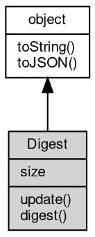

# 对象 Digest
信息摘要对象

## 继承关系


## 成员属性
        
### size
**Integer, 查询当前信息摘要算法的摘要字节数**

```JavaScript
readonly Integer Digest.size;
```

## 成员函数
        
### update
**更新二进制摘要信息**

```JavaScript
Digest Digest.update(Buffer data);
```

调用参数:
* data: [Buffer](Buffer.md), 二进制数据块

返回结果:
* Digest, 返回信息摘要对象本身

--------------------------
### digest
**计算并返回摘要**

```JavaScript
Value Digest.digest(String codec = "buffer");
```

调用参数:
* codec: String, 指定编码格式，允许值为："buffer", "[hex](../../module/ifs/hex.md)", "[base64](../../module/ifs/base64.md)", "utf8", 或者系统支持的字符集

返回结果:
* Value, 返回指定编码的摘要表示

--------------------------
### toString
**返回对象的字符串表示，一般返回 "[Native Object]"，对象可以根据自己的特性重新实现**

```JavaScript
String Digest.toString();
```

返回结果:
* String, 返回对象的字符串表示

--------------------------
### toJSON
**返回对象的 JSON 格式表示，一般返回对象定义的可读属性集合**

```JavaScript
Value Digest.toJSON(String key = "");
```

调用参数:
* key: String, 未使用

返回结果:
* Value, 返回包含可 JSON 序列化的值

