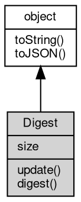

# Object Digest
Streaming message-digest (hash) [object](object.md), also used for HMAC

A Digest computes a fixed-length fingerprint of a byte stream. [crypto.createHash](../../module/ifs/crypto.md#createHash)
returns an unkeyed digest of a chosen algorithm (for example 'sha256'), while
[crypto.createHmac](../../module/ifs/crypto.md#createHmac) returns the same class computing a keyed digest; for short data
the one-shot [crypto.hash](../../module/ifs/crypto.md#hash) function is usually simpler.

Concepts:
- **Streaming vs one-shot**: feed the [object](object.md) with any number of update() calls and
  finish with digest(). update() returns the [object](object.md), so calls can be chained;
  digest() is a terminal operation that returns the fingerprint.
- **One-shot rule**: after digest() the [object](object.md) is finalized. Any further update(),
  digest() or size access throws "digest has been called" (Node.js throws
  ERR_CRYPTO_HASH_FINALIZED). Create a new [object](object.md) to compute another value.
- **Encodings**: update() decodes string data with its codec argument; digest()
  encodes the result with the requested codec. Next to the [Buffer](Buffer.md) encodings ('[hex](../../module/ifs/hex.md)',
  '[base64](../../module/ifs/base64.md)', 'utf8', ...) fibjs accepts '[base32](../../module/ifs/base32.md)', '[base58](../../module/ifs/base58.md)' and the iconv character
  sets; Node.js returns a [Buffer](Buffer.md) for an [encoding](../../module/ifs/encoding.md) it does not know.
- **Algorithms and size**: names come from [crypto.getHashes](../../module/ifs/crypto.md#getHashes) and are matched
  case-insensitively ('sha256', 'SHA-256' and 'sha-256' all work). `size` reports
  the output length in bytes, including the default length of XOF algorithms such
  as shake128. HMAC binds the message to a secret key; compare tags with
  [crypto.timingSafeEqual](../../module/ifs/crypto.md#timingSafeEqual) instead of ==.

Obtained from:
- `crypto.createHash(algorithm)` — unkeyed digest;
- `crypto.createHmac(algorithm, key)` — keyed digest (HMAC);
- `crypto.hash(algorithm, data[, options])` — one-shot digest for short data (there
  is no one-shot HMAC helper; use createHmac).

Example 1 — streaming SHA-512 with chunked updates:

```JavaScript
const crypto = require('crypto');

// update() returns the object, so calls can be chained.
const digest = crypto.createHash('sha512').update('hello').update('world');
console.log(digest.digest('hex'));
// 1594244d52f2d8c12b142bb61f47bc2eaf503d6d9ca8480cae9fcf112f66e496
// 7dc5e8fa98285e36db8af1b8ffa8b84cb15e0fbcf836c3deb803c13f37659a60
console.log(crypto.createHash('sha256').size); // 32
```

Example 2 — digest() is terminal:

```JavaScript
const crypto = require('crypto');

const digest = crypto.createHash('sha256').update('abc');
console.log(digest.digest('hex').slice(0, 8)); // ba7816bf

try {
    digest.update('def');
} catch (e) {
    console.log(e.message); // digest has been called
}
```

Example 3 — HMAC and alternate encodings:

```JavaScript
const crypto = require('crypto');

// An HMAC mixes in a secret key, so only key holders can recompute the tag.
const tag = crypto.createHmac('sha256', 'key')
    .update('The quick brown fox jumps over the lazy dog')
    .digest('hex');
console.log(tag);
// f7bc83f430538424b13298e6aa6fb143ef4d59a14946175997479dbc2d1a3cd8

// A secret KeyObject gives the same tag as the raw bytes.
const same = crypto.createHmac('sha256', crypto.createSecretKey('key'))
    .update('The quick brown fox jumps over the lazy dog')
    .digest('hex') === tag;
console.log(same); // true

// fibjs also accepts base32 and base58 output encodings.
console.log(crypto.createHash('sha256').update('abc').digest('base32'));
// xj4bnp4pahh6uqkbidpf3lrceoyagyndsylxvhfucd7wd4qacwwq
```

## Inheritance

```dot
digraph {
    node [fontname="Helvetica,sans-Serif", fontsize=10, shape="record", style="filled", fillcolor="white"];

    object [tooltip="object", URL="object.md", label="{object|toString()\ltoJSON()\l}"];
    Digest [tooltip="Digest", fillcolor="lightgray", id="me", label="{Digest|size\l|update()\ldigest()\l}"];

    object -> Digest [dir=back];
}
```

## Properties
        
### size
**Integer, Queries the digest size in bytes of the current message digest algorithm**

```JavaScript
readonly Integer Digest.size;
```

Returns:
* returns the digest size in bytes

For example 32 for sha256, 64 for sha512 and 16 for the default shake128 output.
Accessing it after digest() throws "digest has been called". Read-only.

## Methods
        
### update
**Updates the digest information with the given data**

```JavaScript
Digest Digest.update(Buffer | String data,
    String codec = "utf8");
```

Parameters:
* data: [Buffer](Buffer.md) | String, the data block
* codec: String, the [encoding](../../module/ifs/encoding.md) format; allowed values are: "buffer", "[hex](../../module/ifs/hex.md)", "[base32](../../module/ifs/base32.md)", "[base58](../../module/ifs/base58.md)", "[base64](../../module/ifs/base64.md)", "utf8", or a character set supported by the iconv [module](../../module/ifs/module.md)

Returns:
* Digest, returns the message digest [object](object.md) itself

data may be a [Buffer](Buffer.md) or a string decoded with codec (default "utf8"); a [Buffer](Buffer.md)
ignores codec. Returns the Digest itself, so update().update().digest() chains.
It may be called any number of times before digest(); an unknown codec throws
"[encoding](../../module/ifs/encoding.md): Unknown charset" and calling it after digest() throws "digest has
been called". The HMAC form returned by [crypto.createHmac](../../module/ifs/crypto.md#createHmac) behaves identically.

--------------------------
### digest
**Computes and returns the digest**

```JavaScript
Value Digest.digest(String codec = "buffer");
```

Parameters:
* codec: String, the [encoding](../../module/ifs/encoding.md) format; allowed values are: "buffer", "[hex](../../module/ifs/hex.md)", "[base32](../../module/ifs/base32.md)", "[base58](../../module/ifs/base58.md)", "[base64](../../module/ifs/base64.md)", "utf8", or a character set supported by the iconv [module](../../module/ifs/module.md)

Returns:
* Value, returns the digest representation in the specified [encoding](../../module/ifs/encoding.md)

The result is a [Buffer](Buffer.md) by default or a string in codec; next to the [Buffer](Buffer.md)
encodings, '[base32](../../module/ifs/base32.md)', '[base58](../../module/ifs/base58.md)' and the iconv character sets are accepted. It may
be called only once: a second digest(), a later update() or a size access throws
"digest has been called", so create a fresh [object](object.md) to hash more data. For HMAC
digests the result is the authentication tag, which should be compared with
[crypto.timingSafeEqual](../../module/ifs/crypto.md#timingSafeEqual). Node.js follows the same one-shot rule.

Example: the same digest in three encodings:

```JavaScript
const crypto = require('crypto');

console.log(crypto.createHash('sha256').update('abc').digest('hex'));
// ba7816bf8f01cfea414140de5dae2223b00361a396177a9cb410ff61f20015ad
console.log(crypto.createHash('sha256').update('abc').digest('base64'));
// ungWv48Bz+pBQUDeXa4iI7ADYaOWF3qctBD/YfIAFa0=
console.log(crypto.createHash('sha256').update('abc').digest('base32'));
// xj4bnp4pahh6uqkbidpf3lrceoyagyndsylxvhfucd7wd4qacwwq
```

--------------------------
### toString
**Returns the string form of the [object](object.md)**

```JavaScript
String Digest.toString();
```

Returns:
* String, returns the string form of the [object](object.md)

The base implementation reports an error: a native [object](object.md) has no implicit
text form, and only the classes whose value can be written as a string
override the member. [Buffer](Buffer.md) returns its content decoded with the given
[encoding](../../module/ifs/encoding.md), [HttpCookie](HttpCookie.md) returns "name=value", and so on; an override commonly
accepts optional arguments ([Buffer.toString](Buffer.md#toString) takes [encoding](../../module/ifs/encoding.md), start and
end) that are not part of this declaration.

Calling the member on a class that does not override it throws
"<Class>: the [object](object.md) can not be converted to string.", which is the
behavior to rely on when probing whether a value has a string form. See
toJSON for the serialization hook.

--------------------------
### toJSON
**Returns the JSON representation of the [object](object.md)**

```JavaScript
Value Digest.toJSON(String key = "");
```

Parameters:
* key: String, the property name of the value being serialized

Returns:
* Value, returns the JSON-serializable value

JSON.stringify(value) calls value.toJSON(key) when the member exists and
serializes the returned value in its place; the key argument carries the
property name of the value inside its parent [object](object.md) (an empty string at
the top level) and may be used to build a keyed form. The base
implementation returns a plain [object](object.md) holding the readable properties of
the instance, so a native [object](object.md) serializes without per-class code; a
class with a portable shape such as [Buffer](Buffer.md) overrides it, and a JavaScript
class may override it in the same way.

The member is normally reached through JSON.stringify rather than called
directly; calling it returns the same value JSON.stringify would
serialize.

