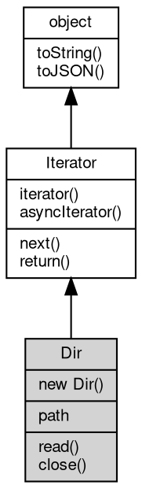

# Object Dir
[Iterator](Iterator.md) over the entries of one directory, read one entry at a time

A Dir hands out [DirEntry](DirEntry.md) objects instead of plain names and can stop early, so it is the
right tool when a listing is large, must be classified as it is read, or must be interleaved
with other work. [fs.readdir](../../module/ifs/fs.md#readdir) returns all names at once; [fs.opendir](../../module/ifs/fs.md#opendir)([path](../../module/ifs/path.md)) or [fs.Dir](../../module/ifs/fs.md#Dir)([path](../../module/ifs/path.md))
create a Dir and both read the directory lazily.

Concepts:

- **Lazy scan**: creating a Dir does not touch the file system. The first read or iteration
  scans the whole directory into memory and then serves entries; the scan is not repeated,
  and errors such as ENOENT or ENOTDIR surface at that first call, not at construction.
- **Cursors**: read() advances one cursor of the Dir; the iteration protocol (`for...of` and
  `for await...of`) uses its own cursor per loop, so each loop starts again from the first
  entry and does not disturb read(). A loop that runs to the end can be started again; the
  entries are kept until close().
- **End of iteration**: read() returns null when there are no more entries and after
  close(); the iterator protocol reports `done`. call close() when the Dir is no longer
  needed to drop the cached entries early (it does not release a system handle).
- **close is idempotent**: unlike Node.js, where read() and close() on a closed Dir throw
  ERR_DIR_CLOSED, fibjs makes close() a no-op the second time and lets read() return null
  (plans/compat-differences.md 2.16).

Obtained from:
- `fs.opendir([path](../../module/ifs/path.md))` — the factory used in Node.js-compatible code;
- `new [fs.Dir](../../module/ifs/fs.md#Dir)([path](../../module/ifs/path.md))` — fibjs extension; the class is exposed as `[fs.Dir](../../module/ifs/fs.md#Dir)` (there is no
  [global](../../module/ifs/global.md) `Dir`) and is not constructible in Node.js user code.

Example 1 — read the entries one by one and stop at the end:

```JavaScript
const fs = require('fs');
const os = require('os');
const path = require('path');

const dir = fs.mkdtempSync(path.join(os.tmpdir(), 'fibjs-dir-'));
fs.writeFile(path.join(dir, 'a.txt'), 'a');
fs.mkdir(path.join(dir, 'sub'));

const iterator = fs.opendir(dir);
let entry;
while ((entry = iterator.read()) !== null)
    console.log(entry.name, entry.isDirectory() ? 'dir' : 'file');
iterator.close();

fs.rmSync(dir, {
    recursive: true,
    force: true
});
```

Example 2 — the same directory through the two iteration forms:

```JavaScript
const fs = require('fs');
const os = require('os');
const path = require('path');

const dir = fs.mkdtempSync(path.join(os.tmpdir(), 'fibjs-dir-'));
fs.writeFile(path.join(dir, 'a.txt'), 'a');

for (const entry of new fs.Dir(dir))
    console.log('sync', entry.name);

(async () => {
    for await (const entry of new fs.Dir(dir))
    console.log('async', entry.name);
    fs.rmSync(dir, {
        recursive: true,
        force: true
    });
})();
```

## Inheritance


## Constructors
        
### Dir
**Creates a directory iterator for a [path](../../module/ifs/path.md)**

```JavaScript
new Dir(String path);
```

Parameters:
* path: String, the directory to iterate

The directory is not read yet: the first read() or iteration scans it, and a missing
[path](../../module/ifs/path.md) or a [path](../../module/ifs/path.md) that is not a directory (ENOENT, ENOTDIR) is reported then. In fibjs the
class is exposed as `fs.Dir`; the same [object](object.md) is also returned by [fs.opendir](../../module/ifs/fs.md#opendir).

## Operators
        
### @iterator
**Queries the iterator of the elements of the current [object](object.md)**

```JavaScript
Iterator Dir.@iterator();
```

Returns:
* [Iterator](Iterator.md), an iterator over the elements of the [object](object.md)

This is the hook the JS engine calls when for...of, spread or destructuring starts to
traverse the [object](object.md) (`[Symbol.iterator]` in JavaScript; the IDL member is spelled
`@iterator`). A container returns a new iterator positioned at the first element on every
call, so each loop starts from the beginning and concurrent loops do not share a cursor.
On an iterator [object](object.md) itself the member returns that same [object](object.md), which makes an iterator
iterable as well.

Example — a container restarts, an iterator returns itself:

```JavaScript
const fs = require('fs');
const os = require('os');
const path = require('path');

const dir = fs.mkdtempSync(path.join(os.tmpdir(), 'fibjs-it-'));
fs.writeFileSync(path.join(dir, 'a.txt'), 'a');
fs.writeFileSync(path.join(dir, 'b.txt'), 'b');

const iterator = fs.opendir(dir);
const first = iterator[Symbol.iterator]();
const second = iterator[Symbol.iterator]();
console.log(first === second); // false, every loop gets its own iterator
console.log(first.next().value.name); // a.txt
console.log(first[Symbol.iterator]() === first); // true

const pairs = new URLSearchParams('a=1').entries();
console.log(pairs[Symbol.iterator]() === pairs); // true

fs.rmSync(dir, {
    recursive: true,
    force: true
});
```

--------------------------
### @asyncIterator
**Queries the asynchronous iterator of the elements of the current [object](object.md)**

```JavaScript
Iterator Dir.@asyncIterator();
```

Returns:
* [Iterator](Iterator.md), the asynchronous iterator of the elements of the current [object](object.md)

This is the hook the JS engine calls when for await...of traverses the [object](object.md)
(`[Symbol.asyncIterator]` in JavaScript; the IDL member is spelled `@asyncIterator`). A
fibjs iterator returns itself, so for await...of can consume the same [object](object.md) that
for...of consumes even though next() yields plain `{ value, done }` results: the engine
awaits each result and each value. A container returns a new iterator positioned at the
first element. for await...of also accepts objects that only have `@iterator` (arrays,
Map, Set, generators, the HTTP collections); fibjs awaits the returned values in that
case too, so the symbol member matters mainly to implementations and to code that wants
to control awaiting explicitly.

Example — the same sources through for await...of:

```JavaScript
const fs = require('fs');
const os = require('os');
const path = require('path');

const dir = fs.mkdtempSync(path.join(os.tmpdir(), 'fibjs-ait-'));
fs.writeFileSync(path.join(dir, 'a.txt'), 'a');

const iterator = fs.opendir(dir)[Symbol.iterator]();
console.log(iterator[Symbol.asyncIterator]() === iterator); // true

(async () => {
    for await (const entry of new fs.Dir(dir))
    console.log(entry.name); // a.txt

    for await (const pair of new URLSearchParams('x=1&y=2'))
    console.log(pair.join('=')); // x=1, then y=2

    fs.rmSync(dir, {
        recursive: true,
        force: true
    });
})();
```

## Properties
        
### path
**String, The directory [path](../../module/ifs/path.md) this iterator was created for**

```JavaScript
readonly String Dir.path;
```

The value as it was passed to [fs.opendir](../../module/ifs/fs.md#opendir) or the constructor, neither resolved to an
absolute [path](../../module/ifs/path.md) nor normalized: opening '.' reports '.'.

## Methods
        
### read
**Reads the next directory entry**

```JavaScript
DirEntry Dir.read() async;
```

Returns:
* [DirEntry](DirEntry.md), the next entry, or null after the last entry and after close()

Returns null once all entries have been served and also after close(). The scan loads
the whole directory on the first call; a missing [path](../../module/ifs/path.md) or a non-directory [path](../../module/ifs/path.md) is
reported here as ENOENT/ENOTDIR. read() uses a cursor independent of the iteration
protocol, so a `for...of` loop always starts from the first entry.

Example — read one entry and observe the end of the iteration:

```JavaScript
const fs = require('fs');
const os = require('os');
const path = require('path');

const dir = fs.mkdtempSync(path.join(os.tmpdir(), 'fibjs-dir-'));
fs.writeFile(path.join(dir, 'only.txt'), 'x');

const iterator = fs.opendir(dir);
console.log(iterator.read().name); // only.txt
console.log(iterator.read()); // null, the iteration has ended
iterator.close();

fs.rmSync(dir, {
    recursive: true,
    force: true
});
```

--------------------------
### close
**Closes the iterator and discards the cached entries**

```JavaScript
Dir.close() async;
```

Safe to call before any read and safe to call repeatedly; after close() read() returns
null instead of throwing (Node.js throws ERR_DIR_CLOSED, see
plans/compat-differences.md 2.16). The directory itself is not modified.

Example — close twice and read after close:

```JavaScript
const fs = require('fs');
const os = require('os');
const path = require('path');

const dir = fs.mkdtempSync(path.join(os.tmpdir(), 'fibjs-dir-'));
const iterator = fs.opendir(dir);
iterator.close();
iterator.close(); // idempotent
console.log(iterator.read()); // null after close

fs.rmSync(dir, {
    recursive: true,
    force: true
});
```

--------------------------
### next
**Iterates to the next element**

```JavaScript
(Variant value, Boolean done) Dir.next() async;
```

Returns:
* (Variant value, Boolean done), the next iteration result, { value, done } or a promise resolving to it

Returns an iteration result: `{ value, done }` while elements remain, and `{ done: true }`
without a value once the source is exhausted and on every later call. The member is
asynchronous, so it also accepts a trailing `(err, result)` callback and returns a
Promise resolving to the result when the value is not available immediately; an iterator
obtained from an asynchronous API such as a db.promises cursor takes that [path](../../module/ifs/path.md), while a
plain fiber call receives the [object](object.md) directly. Errors of the underlying source surface
here: a Dir reports ENOENT/ENOTDIR from the first next() because the directory is scanned
lazily, and next() on a closed Dir throws Object closed [20027]. On a Dir, next() shares
the position of read() on the Dir [object](object.md); the cursor of a loop iterator is independent.

Example — read a directory one entry at a time:

```JavaScript
const fs = require('fs');
const os = require('os');
const path = require('path');

const dir = fs.mkdtempSync(path.join(os.tmpdir(), 'fibjs-next-'));
fs.writeFileSync(path.join(dir, 'a.txt'), 'a');
fs.writeFileSync(path.join(dir, 'b.txt'), 'b');

const it = fs.opendir(dir)[Symbol.iterator]();
let result;
while (!(result = it.next()).done)
    console.log(result.value.name); // a.txt, then b.txt
console.log(result.done, result.value); // true undefined

fs.opendir(dir).next((err, entry) => {
    console.log(err, entry.name); // null a.txt
});

fs.rmSync(dir, {
    recursive: true,
    force: true
});
```

--------------------------
### return
**Terminates iteration and releases all resources held by the iterator**

```JavaScript
(Boolean done) Dir.return(Value value = undefined);
```

Parameters:
* value: Value, ignored; present for compatibility with the return(value) protocol call

Returns:
* (Boolean done), { done: true }

The call is idempotent and safe to repeat. The engine calls it when for...of
or for await...of ends early (break, return, an exception, or a loop body that
never finishes), and code may call it directly to abandon a cursor. The value
argument belongs to the protocol and is ignored; the result is always
`{ done: true }`, even when a value was passed, where a compliant generator
would return `{ value, done: true }` (plans/compat-differences.md 4.23). After
the call next() keeps reporting `{ done: true }`. Releasing a database cursor is
required before other calls on the same connection can run; otherwise they fail
with a message such as Error 20028 "A statement cursor is active on this
connection". The container behind the iterator is not closed, so a Dir's own
read()/next() position is unaffected.

Example — stop an iterator at the first element and keep the Dir usable:

```JavaScript
const fs = require('fs');
const os = require('os');
const path = require('path');

const dir = fs.mkdtempSync(path.join(os.tmpdir(), 'fibjs-return-'));
fs.writeFileSync(path.join(dir, 'a.txt'), 'a');
fs.writeFileSync(path.join(dir, 'b.txt'), 'b');

const iterator = fs.opendir(dir);
const it = iterator[Symbol.iterator]();
console.log(it.next().value.name); // a.txt
console.log(it.return().done); // true
console.log(it.next().done); // true
console.log(it.return().done); // true, calling again is safe
console.log(iterator.read().name); // a.txt, the Dir position is untouched

iterator.close();
fs.rmSync(dir, {
    recursive: true,
    force: true
});
```

--------------------------
### toString
**Returns the string form of the [object](object.md)**

```JavaScript
String Dir.toString();
```

Returns:
* String, returns the string form of the [object](object.md)

The base implementation reports an error: a native [object](object.md) has no implicit
text form, and only the classes whose value can be written as a string
override the member. [Buffer](Buffer.md) returns its content decoded with the given
[encoding](../../module/ifs/encoding.md), [HttpCookie](HttpCookie.md) returns "name=value", and so on; an override commonly
accepts optional arguments ([Buffer.toString](Buffer.md#toString) takes [encoding](../../module/ifs/encoding.md), start and
end) that are not part of this declaration.

Calling the member on a class that does not override it throws
"<Class>: the [object](object.md) can not be converted to string.", which is the
behavior to rely on when probing whether a value has a string form. See
toJSON for the serialization hook.

--------------------------
### toJSON
**Returns the JSON representation of the [object](object.md)**

```JavaScript
Value Dir.toJSON(String key = "");
```

Parameters:
* key: String, the property name of the value being serialized

Returns:
* Value, returns the JSON-serializable value

JSON.stringify(value) calls value.toJSON(key) when the member exists and
serializes the returned value in its place; the key argument carries the
property name of the value inside its parent [object](object.md) (an empty string at
the top level) and may be used to build a keyed form. The base
implementation returns a plain [object](object.md) holding the readable properties of
the instance, so a native [object](object.md) serializes without per-class code; a
class with a portable shape such as [Buffer](Buffer.md) overrides it, and a JavaScript
class may override it in the same way.

The member is normally reached through JSON.stringify rather than called
directly; calling it returns the same value JSON.stringify would
serialize.

