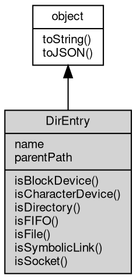

# 对象 DirEntry
表示目录项的信息

DirEntry 对象通过 [fs.glob](../../module/ifs/fs.md#glob), [fs.readdir](../../module/ifs/fs.md#readdir) 查询，不可独立创建

## 继承关系


## 成员属性
        
### name
**String, 文件名称**

```JavaScript
readonly String DirEntry.name;
```

--------------------------
### parentPath
**String, 文件的父路径**

```JavaScript
readonly String DirEntry.parentPath;
```

## 成员函数
        
### isBlockDevice
**查询 [Stat](Stat.md) 是否描述了一个 block device**

```JavaScript
Boolean DirEntry.isBlockDevice();
```

返回结果:
* Boolean, 为 true 表示描述了一个 block device

--------------------------
### isCharacterDevice
**查询 [Stat](Stat.md) 是否描述了一个 character device**

```JavaScript
Boolean DirEntry.isCharacterDevice();
```

返回结果:
* Boolean, 为 true 表示描述了一个 character device

--------------------------
### isDirectory
**查询文件是否是目录**

```JavaScript
Boolean DirEntry.isDirectory();
```

返回结果:
* Boolean, 为 true 则是目录

--------------------------
### isFIFO
**查询 [Stat](Stat.md) 是否描述了一个 FIFO 管道**

```JavaScript
Boolean DirEntry.isFIFO();
```

返回结果:
* Boolean, 为 true 表示描述了一个 FIFO 管道

--------------------------
### isFile
**查询文件是否是文件**

```JavaScript
Boolean DirEntry.isFile();
```

返回结果:
* Boolean, 为 true 则是文件

--------------------------
### isSymbolicLink
**查询文件是否是符号链接**

```JavaScript
Boolean DirEntry.isSymbolicLink();
```

返回结果:
* Boolean, 为 true 则是符号链接

--------------------------
### isSocket
**查询文件是否是 [Socket](Socket.md)**

```JavaScript
Boolean DirEntry.isSocket();
```

返回结果:
* Boolean, 为 true 则是 [Socket](Socket.md)

--------------------------
### toString
**返回对象的字符串表示，一般返回 "[Native Object]"，对象可以根据自己的特性重新实现**

```JavaScript
String DirEntry.toString();
```

返回结果:
* String, 返回对象的字符串表示

--------------------------
### toJSON
**返回对象的 JSON 格式表示，一般返回对象定义的可读属性集合**

```JavaScript
Value DirEntry.toJSON(String key = "");
```

调用参数:
* key: String, 未使用

返回结果:
* Value, 返回包含可 JSON 序列化的值

