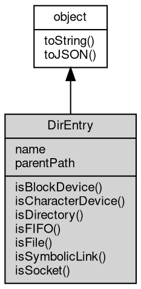

# Object DirEntry
A directory entry: the name and the type of one item inside a directory

A DirEntry answers "what is in this directory" without a stat call per item: the directory
listing already reports the type of each entry, so the isXxx() predicates are free. Use it
when files, directories and links must be told apart while listing; reach for [Stat](Stat.md) when size,
timestamps, permissions or the target of a link are needed, because a DirEntry carries none
of them.

Concepts:

- **Type from the listing**: the isXxx() predicates [test](../../module/ifs/test.md) the entry type reported by the
  directory scan (S_IF* bits), not the result of an extra stat call. A file system that
  reports the type as unknown makes every predicate false; on Windows only the file,
  directory and symbolic link [types](../../module/ifs/types.md) are populated.
- **Paths**: name is the base name of the entry; parentPath is the directory that was
  scanned, spelled the way the scan was requested. [fs.readdir](../../module/ifs/fs.md#readdir) and [Dir](Dir.md) keep the requested
  [path](../../module/ifs/path.md) (a relative [path](../../module/ifs/path.md) stays relative), while [fs.glob](../../module/ifs/fs.md#glob) with `withFileTypes` always reports
  the absolute directory of each match.
- **Links are not followed**: isSymbolicLink() is true for the link itself and false for a
  link to a file or directory, exactly like [fs.lstat](../../module/ifs/fs.md#lstat); use [fs.stat](../../module/ifs/fs.md#stat) to describe the target.
- **Not constructible**: the class is exposed as `fs.Dirent`; `new fs.Dirent()` throws. It
  is a plain value [object](object.md), not a handle, so there is nothing to close.

Obtained from:
- `fs.readdir([path](../../module/ifs/path.md), { withFileTypes: true })` — the elements of the returned array;
- `fs.glob(pattern, { withFileTypes: true })` — the elements of the returned array;
- `[Dir](Dir.md)#read()` and iteration over a [Dir](Dir.md) obtained from `fs.opendir` or `new [fs.Dir](../../module/ifs/fs.md#Dir)([path](../../module/ifs/path.md))`.

Example 1 — classify the entries of a directory without stat calls:

```JavaScript
const fs = require('fs');
const os = require('os');
const path = require('path');

const dir = fs.mkdtempSync(path.join(os.tmpdir(), 'fibjs-dirent-'));
fs.writeFile(path.join(dir, 'notes.txt'), 'note');
fs.mkdir(path.join(dir, 'images'));
fs.symlink(path.join(dir, 'notes.txt'), path.join(dir, 'shortcut'));

fs.readdir(dir, {
    withFileTypes: true
}).forEach((entry) => {
    let kind = 'file';
    if (entry.isDirectory()) kind = 'dir';
    else if (entry.isSymbolicLink()) kind = 'link';
    console.log(entry.name, kind, entry.parentPath);
});

fs.rmSync(dir, {
    recursive: true,
    force: true
});
```

Example 2 — walk a tree with glob and never stat a match:

```JavaScript
const fs = require('fs');
const os = require('os');
const path = require('path');

const dir = fs.mkdtempSync(path.join(os.tmpdir(), 'fibjs-dirent-'));
fs.mkdir(path.join(dir, 'src'));
fs.writeFile(path.join(dir, 'src', 'app.js'), 'app');
fs.writeFile(path.join(dir, 'README.md'), 'readme');

fs.glob('**', {
    cwd: dir,
    withFileTypes: true
}).forEach((entry) => {
    console.log(entry.name, entry.isDirectory() ? 'dir' : 'file');
});

fs.rmSync(dir, {
    recursive: true,
    force: true
});
```

Same [object](object.md) type as Node.js [fs.Dirent](../../module/ifs/fs.md#Dirent); Node also has the deprecated `path` property, fibjs
provides parentPath only.

## Inheritance

```dot
digraph {
    node [fontname="Helvetica,sans-Serif", fontsize=10, shape="record", style="filled", fillcolor="white"];

    object [tooltip="object", URL="object.md", label="{object|toString()\ltoJSON()\l}"];
    DirEntry [tooltip="DirEntry", fillcolor="lightgray", id="me", label="{DirEntry|name\lparentPath\l|isBlockDevice()\lisCharacterDevice()\lisDirectory()\lisFIFO()\lisFile()\lisSymbolicLink()\lisSocket()\l}"];

    object -> DirEntry [dir=back];
}
```

## Properties
        
### name
**String, Base name of the entry**

```JavaScript
readonly String DirEntry.name;
```

The last [path](../../module/ifs/path.md) component, without the directory part: 'report.txt' for an entry of
'/data/report.txt'. It is a name inside the directory, not a [path](../../module/ifs/path.md); combine it with
parentPath to build the full [path](../../module/ifs/path.md). Same property as Node.js Dirent#name.

--------------------------
### parentPath
**String, Directory that contains the entry**

```JavaScript
readonly String DirEntry.parentPath;
```

The directory [path](../../module/ifs/path.md) that was scanned, spelled as it was requested: [fs.readdir](../../module/ifs/fs.md#readdir)('.')
reports '.', a relative [Dir](Dir.md) reports its relative [path](../../module/ifs/path.md), and [fs.glob](../../module/ifs/fs.md#glob) with
`withFileTypes` reports the absolute directory of each match (even for a relative
pattern). Node.js Dirent also exposes this property; the older Node `path` alias is not
provided.

## Methods
        
### isBlockDevice
**Queries whether the entry is a block device**

```JavaScript
Boolean DirEntry.isBlockDevice();
```

Returns:
* Boolean, true if it describes a block device

Tests the S_IFBLK type from the directory listing. Always false on Windows, where the
listing does not report this type; no stat call is made.

--------------------------
### isCharacterDevice
**Queries whether the entry is a character device**

```JavaScript
Boolean DirEntry.isCharacterDevice();
```

Returns:
* Boolean, true if it describes a character device

Tests the S_IFCHR type from the directory listing; character devices include terminals
and serial ports. Always false on Windows.

--------------------------
### isDirectory
**Queries whether the entry is a directory**

```JavaScript
Boolean DirEntry.isDirectory();
```

Returns:
* Boolean, true if it is a directory

Tests the S_IFDIR type from the directory listing. A symbolic link to a directory is
reported as a link, not as a directory (see isSymbolicLink); use [fs.stat](../../module/ifs/fs.md#stat) when the target
of a link is needed.

--------------------------
### isFIFO
**Queries whether the entry is a FIFO pipe**

```JavaScript
Boolean DirEntry.isFIFO();
```

Returns:
* Boolean, true if it describes a FIFO pipe

Tests the S_IFIFO type from the directory listing. Always false on Windows.

--------------------------
### isFile
**Queries whether the entry is a regular file**

```JavaScript
Boolean DirEntry.isFile();
```

Returns:
* Boolean, true if it is a file

Tests the S_IFREG type from the directory listing; directories, devices and links are
not files. The entry is not followed, so a link to a file reports false.

--------------------------
### isSymbolicLink
**Queries whether the entry is a symbolic link**

```JavaScript
Boolean DirEntry.isSymbolicLink();
```

Returns:
* Boolean, true if it is a symbolic link

Tests the S_IFLNK type from the directory listing; true for the link itself, matching
lstat, and false for its target. On Windows the link type is populated for reparse
points.

Example — find the symbolic links of a directory:

```JavaScript
const fs = require('fs');
const os = require('os');
const path = require('path');

const dir = fs.mkdtempSync(path.join(os.tmpdir(), 'fibjs-link-'));
fs.writeFile(path.join(dir, 'target.txt'), 'x');
fs.symlink(path.join(dir, 'target.txt'), path.join(dir, 'link.txt'));

const link = fs.readdir(dir, {
        withFileTypes: true
    })
    .find((entry) => entry.name === 'link.txt');
console.log(link.isSymbolicLink(), link.isFile()); // true false

fs.rmSync(dir, {
    recursive: true,
    force: true
});
```

--------------------------
### isSocket
**Queries whether the entry is a UNIX domain socket**

```JavaScript
Boolean DirEntry.isSocket();
```

Returns:
* Boolean, true if it is a [Socket](Socket.md)

Tests the S_IFSOCK type from the directory listing. Always false on Windows.

--------------------------
### toString
**Returns the string form of the [object](object.md)**

```JavaScript
String DirEntry.toString();
```

Returns:
* String, returns the string form of the [object](object.md)

The base implementation reports an error: a native [object](object.md) has no implicit
text form, and only the classes whose value can be written as a string
override the member. [Buffer](Buffer.md) returns its content decoded with the given
[encoding](../../module/ifs/encoding.md), [HttpCookie](HttpCookie.md) returns "name=value", and so on; an override commonly
accepts optional arguments ([Buffer.toString](Buffer.md#toString) takes [encoding](../../module/ifs/encoding.md), start and
end) that are not part of this declaration.

Calling the member on a class that does not override it throws
"<Class>: the [object](object.md) can not be converted to string.", which is the
behavior to rely on when probing whether a value has a string form. See
toJSON for the serialization hook.

--------------------------
### toJSON
**Returns the JSON representation of the [object](object.md)**

```JavaScript
Value DirEntry.toJSON(String key = "");
```

Parameters:
* key: String, the property name of the value being serialized

Returns:
* Value, returns the JSON-serializable value

JSON.stringify(value) calls value.toJSON(key) when the member exists and
serializes the returned value in its place; the key argument carries the
property name of the value inside its parent [object](object.md) (an empty string at
the top level) and may be used to build a keyed form. The base
implementation returns a plain [object](object.md) holding the readable properties of
the instance, so a native [object](object.md) serializes without per-class code; a
class with a portable shape such as [Buffer](Buffer.md) overrides it, and a JavaScript
class may override it in the same way.

The member is normally reached through JSON.stringify rather than called
directly; calling it returns the same value JSON.stringify would
serialize.

