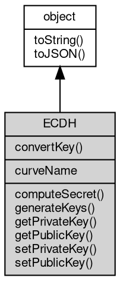

# 对象 ECDH
ECDH 对象

## 继承关系


## 静态函数
        
### convertKey
**将公钥转换为指定的格式**

```JavaScript
static Value ECDH.convertKey(Value key,
    String curve,
    String inputEncoding = "hex",
    String outputEncoding = "hex",
    String format = "uncompressed");
```

调用参数:
* key: Value, 待转换的公钥
* curve: String, 指定预定义的椭圆曲线
* inputEncoding: String, 指定 key 的编码格式，可以为：'buffer', '[hex](../../module/ifs/hex.md)', '[base64](../../module/ifs/base64.md)', '[base58](../../module/ifs/base58.md)'，默认为 '[hex](../../module/ifs/hex.md)'
* outputEncoding: String, 指定返回结果的编码格式，可以为：'buffer', '[hex](../../module/ifs/hex.md)', '[base64](../../module/ifs/base64.md)', '[base58](../../module/ifs/base58.md)'，默认为 '[hex](../../module/ifs/hex.md)'
* format: String, 指定公钥的格式，可以为：'compressed', 'uncompressed', 'hybrid'，默认为 'uncompressed'

返回结果:
* Value, 返回转换后的公钥

## 成员属性
        
### curveName
**String, 获取椭圆曲线的名称**

```JavaScript
readonly String ECDH.curveName;
```

返回结果:
* 返回椭圆曲线的名称

## 成员函数
        
### computeSecret
**根据其它公钥，计算共享密钥**

```JavaScript
Value ECDH.computeSecret(Value otherPublicKey,
    String inputEncoding = "hex",
    String outputEncoding = "buffer");
```

调用参数:
* otherPublicKey: Value, 对方的公钥
* inputEncoding: String, 指定 otherPublicKey 的编码格式，可以为：'buffer', '[hex](../../module/ifs/hex.md)', '[base64](../../module/ifs/base64.md)', '[base58](../../module/ifs/base58.md)'，默认为 '[hex](../../module/ifs/hex.md)'
* outputEncoding: String, 指定返回结果的编码格式，可以为：'buffer', '[hex](../../module/ifs/hex.md)', '[base64](../../module/ifs/base64.md)', '[base58](../../module/ifs/base58.md)'，默认为 'buffer'

返回结果:
* Value, 返回计算得出的共享密钥

--------------------------
### generateKeys
**生成密钥对**

```JavaScript
Value ECDH.generateKeys(String outputEncoding = "buffer",
    String format = "uncompressed");
```

调用参数:
* outputEncoding: String, 指定返回结果的编码格式，可以为：'buffer', '[hex](../../module/ifs/hex.md)', '[base64](../../module/ifs/base64.md)', '[base58](../../module/ifs/base58.md)'，默认为 'buffer'
* format: String, 指定公钥的格式，可以为：'compressed', 'uncompressed', 'hybrid'，默认为 'uncompressed'

返回结果:
* Value, 返回生成的公钥

--------------------------
### getPrivateKey
**获取私钥**

```JavaScript
Value ECDH.getPrivateKey(String encoding = "buffer");
```

调用参数:
* encoding: String, 指定私钥的编码格式，可以为：'buffer', '[hex](../../module/ifs/hex.md)', '[base64](../../module/ifs/base64.md)', '[base58](../../module/ifs/base58.md)'，默认为 'buffer'

返回结果:
* Value, 返回私钥

--------------------------
### getPublicKey
**获取公钥**

```JavaScript
Value ECDH.getPublicKey(String encoding = "buffer",
    String format = "uncompressed");
```

调用参数:
* encoding: String, 指定公钥的编码格式，可以为：'buffer', '[hex](../../module/ifs/hex.md)', '[base64](../../module/ifs/base64.md)', '[base58](../../module/ifs/base58.md)'，默认为 'buffer'
* format: String, 指定公钥的格式，可以为：'compressed', 'uncompressed', 'hybrid'，默认为 'uncompressed'

返回结果:
* Value, 返回公钥

--------------------------
### setPrivateKey
**设置私钥**

```JavaScript
ECDH.setPrivateKey(Value privateKey,
    String encoding = "hex");
```

调用参数:
* privateKey: Value, 私钥数据
* encoding: String, 指定 privateKey 的编码格式，可以为：'buffer', '[hex](../../module/ifs/hex.md)', '[base64](../../module/ifs/base64.md)', '[base58](../../module/ifs/base58.md)'，默认为 '[hex](../../module/ifs/hex.md)'

--------------------------
### setPublicKey
**设置公钥**

```JavaScript
ECDH.setPublicKey(Value publicKey,
    String encoding = "hex");
```

调用参数:
* publicKey: Value, 公钥数据
* encoding: String, 指定 publicKey 的编码格式，可以为：'buffer', '[hex](../../module/ifs/hex.md)', '[base64](../../module/ifs/base64.md)', '[base58](../../module/ifs/base58.md)'，默认为 '[hex](../../module/ifs/hex.md)'

--------------------------
### toString
**返回对象的字符串表示，一般返回 "[Native Object]"，对象可以根据自己的特性重新实现**

```JavaScript
String ECDH.toString();
```

返回结果:
* String, 返回对象的字符串表示

--------------------------
### toJSON
**返回对象的 JSON 格式表示，一般返回对象定义的可读属性集合**

```JavaScript
Value ECDH.toJSON(String key = "");
```

调用参数:
* key: String, 未使用

返回结果:
* Value, 返回包含可 JSON 序列化的值

