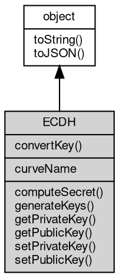

# Object ECDH
Elliptic-curve Diffie-Hellman key-agreement [object](object.md)

An ECDH instance owns one side of a key exchange over a named elliptic curve. Each
party generates a key pair, sends its public key to the other and derives the same
shared secret from its own private key and the peer's public key; the secret itself
is never transmitted. Use [crypto.diffieHellman](../../module/ifs/crypto.md#diffieHellman) for one-shot agreement between
[KeyObject](KeyObject.md) keys, and [crypto.hkdf](../../module/ifs/crypto.md#hkdf) or [crypto.scrypt](../../module/ifs/crypto.md#scrypt) to turn the secret into cipher
keys.

Concepts:
- **The exchange**: `crypto.createECDH(curve)` -> `generateKeys()` -> send the
  returned public key -> `computeSecret(peerPublicKey)`. Both parties must use the
  same curve. A party that already owns a private key can import it with
  setPrivateKey, which recomputes the matching public key.
- **Curves and key sizes**: the accepted names come from [crypto.getCurves](../../module/ifs/crypto.md#getCurves), for
  example 'prime256v1' (alias 'secp256r1'), 'secp384r1', 'secp521r1', 'secp256k1'
  and 'SM2'. Public keys are EC points: 65 bytes uncompressed (0x04 prefix), 33
  bytes compressed (0x02/0x03) or 65 bytes hybrid (0x06/0x07). Private keys are
  fixed-length big-endian integers padded to the curve order (32 bytes for
  prime256v1, 48 for secp384r1, 66 for secp521r1).
- **Encodings**: key arguments may be Buffers or strings in '[hex](../../module/ifs/hex.md)', '[base64](../../module/ifs/base64.md)' or
  '[base58](../../module/ifs/base58.md)', and results may be returned in the same encodings ('buffer' means a
  [Buffer](Buffer.md)). String keys default to '[hex](../../module/ifs/hex.md)' unless the call documents otherwise.
- **One key pair per [object](object.md)**: setPublicKey stores a public key without its private
  key. Once it is called on an instance that already has a private key, the [object](object.md)
  describes a broken pair and computeSecret reports "Invalid key pair"; generate or
  import the private key and give computeSecret only the peer's public key.

Obtained from:
- `crypto.createECDH(curve)` — the only constructor; instances cannot be created
  with `new`.
- The static convertKey helper lives on the ECDH class [object](object.md). The [crypto](../../module/ifs/crypto.md) [module](../../module/ifs/module.md)
  does not publish that [object](object.md) (`crypto.ECDH` is undefined), so reach it through an
  instance: `crypto.createECDH('secp256k1').constructor.convertKey(...)`; Node.js
  exposes it as `crypto.ECDH.convertKey`.

Example 1 — two parties agree on the same secret:

```JavaScript
const crypto = require('crypto');

// Both sides must use the same curve.
const alice = crypto.createECDH('prime256v1');
const bob = crypto.createECDH('prime256v1');

const alicePublic = alice.generateKeys(); // 65-byte uncompressed point
const bobPublic = bob.generateKeys();

// Exchange public keys over the wire, then derive the shared secret locally.
const shared1 = alice.computeSecret(bobPublic);
const shared2 = bob.computeSecret(alicePublic);
console.log(shared1.equals(shared2), shared1.length); // true 32
```

Example 2 — key formats and encodings:

```JavaScript
const crypto = require('crypto');

const ecdh = crypto.createECDH('prime256v1');
console.log(ecdh.curveName); // prime256v1

const publicKey = ecdh.generateKeys();
console.log(publicKey.length); // 65
console.log(ecdh.generateKeys('buffer', 'compressed').length); // 33
console.log(ecdh.generateKeys('hex').length); // 130
console.log(ecdh.getPrivateKey().length); // 32
console.log(ecdh.getPrivateKey('base58').length); // 44
```

Example 3 — importing an existing private key:

```JavaScript
const crypto = require('crypto');

// An RFC 6979 P-256 test vector: setting the private key derives its public key.
const ecdh = crypto.createECDH('prime256v1');
const privateKey = 'c9afa9d845ba75166b5c215767b1d6934e50c3db36e89b127b8a622b120f6721';
ecdh.setPrivateKey(privateKey, 'hex');
console.log(ecdh.getPublicKey('hex'));
// 0460fed4ba255a9d31c961eb74c6356d68c049b8923b61fa6ce669622e60f29fb679
// 03fe1008b8bc99a41ae9e95628bc64f2f1b20c2d7e9f5177a3c294d4462299
```

## Inheritance

```dot
digraph {
    node [fontname="Helvetica,sans-Serif", fontsize=10, shape="record", style="filled", fillcolor="white"];

    object [tooltip="object", URL="object.md", label="{object|toString()\ltoJSON()\l}"];
    ECDH [tooltip="ECDH", fillcolor="lightgray", id="me", label="{ECDH|convertKey()\l|curveName\l|computeSecret()\lgenerateKeys()\lgetPrivateKey()\lgetPublicKey()\lsetPrivateKey()\lsetPublicKey()\l}"];

    object -> ECDH [dir=back];
}
```

## Static Methods
        
### convertKey
**Converts an EC public key between point formats (static)**

```JavaScript
static Value ECDH.convertKey(Buffer | String key,
    String curve,
    String inputEncoding = "hex",
    String outputEncoding = "hex",
    String format = "uncompressed");
```

Parameters:
* key: [Buffer](Buffer.md) | String, the public key to convert
* curve: String, the predefined elliptic curve to use
* inputEncoding: String, the [encoding](../../module/ifs/encoding.md) of key: 'buffer', '[hex](../../module/ifs/hex.md)', '[base64](../../module/ifs/base64.md)', '[base58](../../module/ifs/base58.md)'; default '[hex](../../module/ifs/hex.md)'
* outputEncoding: String, the [encoding](../../module/ifs/encoding.md) of the result: 'buffer', '[hex](../../module/ifs/hex.md)', '[base64](../../module/ifs/base64.md)', '[base58](../../module/ifs/base58.md)'; default '[hex](../../module/ifs/hex.md)'
* format: String, the format of the public key: 'compressed', 'uncompressed', 'hybrid'; default 'uncompressed'

Returns:
* Value, returns the converted public key

Reads key as a point of curve using inputEncoding and writes it back in the
requested point format encoded with outputEncoding; both encodings accept
'buffer', '[hex](../../module/ifs/hex.md)', '[base64](../../module/ifs/base64.md)' and '[base58](../../module/ifs/base58.md)'. format is 'uncompressed' (default),
'compressed' or 'hybrid'. The key must be a valid point on the curve, otherwise
an Error is thrown. Node.js exposes this helper as `crypto.ECDH.convertKey`;
fibjs leaves the class [object](object.md) unpublished, so call it through an instance
constructor, as in the example. See the class documentation for the point
formats.

Example: uncompressing a compressed secp256k1 point:

```JavaScript
const crypto = require('crypto');

const ECDH = crypto.createECDH('secp256k1').constructor;
const compressed =
    '03672a31bfc59d3f04548ec9b7daeeba2f61814e8ccc40448045007f5479f693a3';
const uncompressed =
    '04672a31bfc59d3f04548ec9b7daeeba2f61814e8ccc40448045007f5479f693a3' +
    '2e02c7f93d13dc2732b760ca377a5897b9dd41a1c1b29dc0442fdce6d0a04d1d';

const converted = ECDH.convertKey(compressed, 'secp256k1', 'hex', 'hex', 'uncompressed');
console.log(converted === uncompressed); // true
console.log(ECDH.convertKey(compressed, 'secp256k1', 'hex', 'buffer').length); // 65
```

## Properties
        
### curveName
**String, The curve name passed to [crypto.createECDH](../../module/ifs/crypto.md#createECDH)**

```JavaScript
readonly String ECDH.curveName;
```

Returns:
* returns the name of the elliptic curve

The name is returned exactly as given ('secp256r1' is not rewritten to
'prime256v1'), whether or not keys have been generated. Read-only.

## Methods
        
### computeSecret
**Derives the shared secret from the peer's public key**

```JavaScript
Value ECDH.computeSecret(Buffer | String otherPublicKey,
    String inputEncoding = "hex",
    String outputEncoding = "buffer");
```

Parameters:
* otherPublicKey: [Buffer](Buffer.md) | String, the other party's public key
* inputEncoding: String, the [encoding](../../module/ifs/encoding.md) of otherPublicKey: 'buffer', '[hex](../../module/ifs/hex.md)', '[base64](../../module/ifs/base64.md)', '[base58](../../module/ifs/base58.md)'; default '[hex](../../module/ifs/hex.md)'
* outputEncoding: String, the [encoding](../../module/ifs/encoding.md) of the result: 'buffer', '[hex](../../module/ifs/hex.md)', '[base64](../../module/ifs/base64.md)', '[base58](../../module/ifs/base58.md)'; default 'buffer'

Returns:
* Value, returns the computed shared secret

Requires a private key on this instance (generateKeys or setPrivateKey). The
peer key may be compressed, uncompressed or hybrid; a [Buffer](Buffer.md) is used as is and a
string is decoded with inputEncoding (default '[hex](../../module/ifs/hex.md)'). The result is a [Buffer](Buffer.md) by
default or a string in outputEncoding, and its length is the field size of the
curve (32 bytes for prime256v1). Calling it without a private key throws
"Private key not set", after setPublicKey on the same instance it throws
"Invalid key pair", and an off-curve peer key throws "Public key is not valid
for specified curve". Treat the peer key as untrusted input and handle the
error. Node.js requires a [Buffer](Buffer.md) when inputEncoding is omitted.

Example: both sides derive the same secret:

```JavaScript
const crypto = require('crypto');

const alice = crypto.createECDH('prime256v1');
const bob = crypto.createECDH('prime256v1');
const alicePublic = alice.generateKeys();
const bobPublic = bob.generateKeys();

const aliceSecret = alice.computeSecret(bobPublic);
const bobSecret = bob.computeSecret(alice.getPublicKey('hex'), 'hex');
console.log(aliceSecret.equals(bobSecret), aliceSecret.length); // true 32
console.log(alice.computeSecret(bobPublic, 'buffer', 'hex').length); // 64
```

--------------------------
### generateKeys
**Generates a new key pair and returns the public key**

```JavaScript
Value ECDH.generateKeys(String outputEncoding = "buffer",
    String format = "uncompressed");
```

Parameters:
* outputEncoding: String, the [encoding](../../module/ifs/encoding.md) of the result: 'buffer', '[hex](../../module/ifs/hex.md)', '[base64](../../module/ifs/base64.md)', '[base58](../../module/ifs/base58.md)'; default 'buffer'
* format: String, the format of the public key: 'compressed', 'uncompressed', 'hybrid'; default 'uncompressed'

Returns:
* Value, returns the generated public key

Replaces any key material already held by the instance, then returns the public
key to send to the peer; the private key stays inside and is read with
getPrivateKey. format selects the point [encoding](../../module/ifs/encoding.md) ('uncompressed' default,
'compressed' or 'hybrid') and outputEncoding the string form; without an
[encoding](../../module/ifs/encoding.md) a [Buffer](Buffer.md) is returned. An unknown [encoding](../../module/ifs/encoding.md) throws "Unknown charset" and
an unknown format throws "Invalid ECDH format". All three point formats are
accepted. Calling it again generates a fresh pair and invalidates the previous
keys.

--------------------------
### getPrivateKey
**Returns the private key of this instance**

```JavaScript
Value ECDH.getPrivateKey(String encoding = "buffer");
```

Parameters:
* encoding: String, the [encoding](../../module/ifs/encoding.md) of the private key: 'buffer', '[hex](../../module/ifs/hex.md)', '[base64](../../module/ifs/base64.md)', '[base58](../../module/ifs/base58.md)'; default 'buffer'

Returns:
* Value, returns the private key

Valid after generateKeys() or setPrivateKey(). The result is a [Buffer](Buffer.md) by default
or a string with the given [encoding](../../module/ifs/encoding.md), holding a fixed-length big-endian integer
padded with leading zeros to the curve order size (32 bytes for prime256v1).
Before a key exists it throws "Failed to get ECDH private key". The value is
secret: export it only to trusted storage or a [KeyObject](KeyObject.md).

--------------------------
### getPublicKey
**Returns the public key of this instance**

```JavaScript
Value ECDH.getPublicKey(String encoding = "buffer",
    String format = "uncompressed");
```

Parameters:
* encoding: String, the [encoding](../../module/ifs/encoding.md) of the public key: 'buffer', '[hex](../../module/ifs/hex.md)', '[base64](../../module/ifs/base64.md)', '[base58](../../module/ifs/base58.md)'; default 'buffer'
* format: String, the format of the public key: 'compressed', 'uncompressed', 'hybrid'; default 'uncompressed'

Returns:
* Value, returns the public key

Valid after generateKeys(), setPrivateKey() (which derives the matching public
key) or setPublicKey(). format selects the point [encoding](../../module/ifs/encoding.md): 65 bytes
uncompressed, 33 bytes compressed or 65 bytes hybrid. Before a key exists it
throws "Failed to get ECDH public key". All three formats are accepted.

--------------------------
### setPrivateKey
**Imports a private key and derives its public key**

```JavaScript
ECDH.setPrivateKey(Buffer | String privateKey,
    String encoding = "hex");
```

Parameters:
* privateKey: [Buffer](Buffer.md) | String, the private key data
* encoding: String, the [encoding](../../module/ifs/encoding.md) of privateKey: 'buffer', '[hex](../../module/ifs/hex.md)', '[base64](../../module/ifs/base64.md)', '[base58](../../module/ifs/base58.md)'; default '[hex](../../module/ifs/hex.md)'

privateKey is a [Buffer](Buffer.md) or a string decoded with [encoding](../../module/ifs/encoding.md) (default '[hex](../../module/ifs/hex.md)'). The
value must satisfy 0 < key < curve order, otherwise "Private key is not valid
for specified curve" is thrown, and it must belong to the curve of this
instance. The matching public key is computed and stored, and any public key
previously imported with setPublicKey is cleared, so computeSecret works after
this call. Node.js derives the public key the same way.

--------------------------
### setPublicKey
**Imports a public key without its private key**

```JavaScript
ECDH.setPublicKey(Buffer | String publicKey,
    String encoding = "hex");
```

Parameters:
* publicKey: [Buffer](Buffer.md) | String, the public key data
* encoding: String, the [encoding](../../module/ifs/encoding.md) of publicKey: 'buffer', '[hex](../../module/ifs/hex.md)', '[base64](../../module/ifs/base64.md)', '[base58](../../module/ifs/base58.md)'; default '[hex](../../module/ifs/hex.md)'

publicKey is a [Buffer](Buffer.md) or a string decoded with [encoding](../../module/ifs/encoding.md) (default '[hex](../../module/ifs/hex.md)'), in any
of the three point formats, and must be a valid point on the curve of this
instance ("Failed to convert [Buffer](Buffer.md) to EC_POINT" or "Public key is not valid
for specified curve" otherwise). This is for inspecting or converting a point;
after calling it, computeSecret on the same instance reports "Invalid key pair"
because the [object](object.md) then holds a private key and an unrelated public key.
Deprecated in Node.js for the same reason.

--------------------------
### toString
**Returns the string form of the [object](object.md)**

```JavaScript
String ECDH.toString();
```

Returns:
* String, returns the string form of the [object](object.md)

The base implementation reports an error: a native [object](object.md) has no implicit
text form, and only the classes whose value can be written as a string
override the member. [Buffer](Buffer.md) returns its content decoded with the given
[encoding](../../module/ifs/encoding.md), [HttpCookie](HttpCookie.md) returns "name=value", and so on; an override commonly
accepts optional arguments ([Buffer.toString](Buffer.md#toString) takes [encoding](../../module/ifs/encoding.md), start and
end) that are not part of this declaration.

Calling the member on a class that does not override it throws
"<Class>: the [object](object.md) can not be converted to string.", which is the
behavior to rely on when probing whether a value has a string form. See
toJSON for the serialization hook.

--------------------------
### toJSON
**Returns the JSON representation of the [object](object.md)**

```JavaScript
Value ECDH.toJSON(String key = "");
```

Parameters:
* key: String, the property name of the value being serialized

Returns:
* Value, returns the JSON-serializable value

JSON.stringify(value) calls value.toJSON(key) when the member exists and
serializes the returned value in its place; the key argument carries the
property name of the value inside its parent [object](object.md) (an empty string at
the top level) and may be used to build a keyed form. The base
implementation returns a plain [object](object.md) holding the readable properties of
the instance, so a native [object](object.md) serializes without per-class code; a
class with a portable shape such as [Buffer](Buffer.md) overrides it, and a JavaScript
class may override it in the same way.

The member is normally reached through JSON.stringify rather than called
directly; calling it returns the same value JSON.stringify would
serialize.

