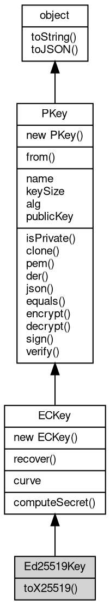

# 对象 Ed25519Key
椭圆曲线加密算法对象

## 继承关系


## 静态函数
        
### recover
**从可恢复签名中恢复公钥，仅支持 secp256k1**

```JavaScript
static ECKey Ed25519Key.recover(Buffer data,
    Buffer sig) async;
```

调用参数:
* data: [Buffer](Buffer.md), 签名的原始数据
* sig: [Buffer](Buffer.md), 可恢复签名

返回结果:
* [ECKey](ECKey.md), 返回包含公钥的对象

--------------------------
### from
**加载一个 DER 格式的密钥**

```JavaScript
static PKey Ed25519Key.from(Buffer DerKey,
    String password = "");
```

调用参数:
* DerKey: [Buffer](Buffer.md), DER 格式的密钥
* password: String, 解密密码

返回结果:
* [PKey](PKey.md), 返回包含密钥的对象

--------------------------
**加载一个 PEM 格式的密钥**

```JavaScript
static PKey Ed25519Key.from(String pemKey,
    String password = "");
```

调用参数:
* pemKey: String, PEM 格式的密钥
* password: String, 解密密码

返回结果:
* [PKey](PKey.md), 返回包含密钥的对象

--------------------------
**加载一个 JSON 格式的密钥**

```JavaScript
static PKey Ed25519Key.from(Object jsonKey);
```

调用参数:
* jsonKey: Object, JSON 格式的密钥

返回结果:
* [PKey](PKey.md), 返回包含密钥的对象

jsonKey 的格式支持以下四种，RSA 私钥：

```JavaScript
{
    "kty": "RSA",
    "n": "0m5lvKpWqy9JS7tV2HIPqHCYHLquSuxIC3F8strIQLJKO3rZmTT96KTnhsOfBO7Y1bI7mnT0PB3_vcHd9ekWMEoZJQw7MuB8KeM_Wn54-elJr5DNLk5bMppSGxX7ZnumiXGG51_X3Yp-_EbGtDG80GxXXix7Mucyo7K25uE0uW8=",
    "e": "AQAB",
    "d": "agN2O9NxMHL1MTMi75WfL9Pxvl-KWXKqZSF6mjzAsF9iKI8euyHIXYFepzU8kual1RsjDhCnzvWqFvZplW8lXqrHf_P-rS_9Y4gBUw6pjnI_DnFIRwWHRvrUHHSCfWOdTCIKdOTkgLZuGFuhEY3RMIW0WSYejjLtftwy0RVxAzk=",
    "p": "6a4G1qmfwWmn1biigN7IVFlkbLf9oVe6g7rOmHxI-hn1GRxKDSVuAUrmR1IhuAnca9M0y7SD-7TUs6wjOxWxaw==",
    "q": "5ofkxFKdPBD0CQHMb9q13AMHUVe0rJ-hSjqqIBrmqApUOneyAcMV76M0QyIQnI2p3POa4Qu_7XChDwRVl7LlDQ==",
    "dp": "2mXGiGwCHl8j-FBWuID-1C6z-BRB3MBEVoeKPOOzxOPruatB3mWEGXsqG7A8SWgV9URxTI2K6P3J6Z7RUpBkvw==",
    "dq": "oagn5vfb5NQqnOpS9xkSsD67cfIj821ZSFlNFYhnuOzNVda7z_qCtnHm4zDPH0lEFXoKYMfBhfqWJpaugttjPQ==",
    "qi": "dqEQgxNmOVFrF4s776hTqeC6oEDila8EvpVb2F2ZvwAOLjCQ66OiAZK1BiYGHqUy0NeqNmtlsLSuBEZQZvqZwg=="
}
```

RSA 公钥：

```JavaScript
{
    "kty": "RSA",
    "n": "0m5lvKpWqy9JS7tV2HIPqHCYHLquSuxIC3F8strIQLJKO3rZmTT96KTnhsOfBO7Y1bI7mnT0PB3_vcHd9ekWMEoZJQw7MuB8KeM_Wn54-elJr5DNLk5bMppSGxX7ZnumiXGG51_X3Yp-_EbGtDG80GxXXix7Mucyo7K25uE0uW8=",
    "e": "AQAB"
}
```

EC 私钥：

```JavaScript
{
    "kty": "EC",
    "crv": "P-521",
    "x": "ATfNNFuuvlGxrTGoXgyfSAGgRNNDnO3rN3k74urKJdVS14RYhdnSwm91Bm-F1l-T1XKlAY2yRnzG9w1Ukvo8c0wL",
    "y": "ASBHqrruB6kdkEUB3vlW3-UIkk4HtKdUeTwN-7m3j2rgZvYR1ffRAapDvWqKGiBjomqWafxokBkbDI0c95f6f4XU",
    "d": "AfkIbUHXfW41njdpoKuqqKludcoLJS8D_oMEwkj-GVaXFNKccIoF5iKGu2c69kNDjo83R_7wyGlfRczsklkik1ST"
}
```

EC 公钥：

```JavaScript
{
    "kty": "EC",
    "crv": "P-521",
    "x": "ATfNNFuuvlGxrTGoXgyfSAGgRNNDnO3rN3k74urKJdVS14RYhdnSwm91Bm-F1l-T1XKlAY2yRnzG9w1Ukvo8c0wL",
    "y": "ASBHqrruB6kdkEUB3vlW3-UIkk4HtKdUeTwN-7m3j2rgZvYR1ffRAapDvWqKGiBjomqWafxokBkbDI0c95f6f4XU"
}
```

## 成员属性
        
### curve
**String, 返回当前算法的椭圆曲线名称**

```JavaScript
readonly String Ed25519Key.curve;
```

--------------------------
### name
**String, 返回当前算法名称**

```JavaScript
readonly String Ed25519Key.name;
```

--------------------------
### keySize
**Integer, 返回当前算法密码长度，以位为单位**

```JavaScript
readonly Integer Ed25519Key.keySize;
```

--------------------------
### alg
**String, 返回和设置当前对象签名算法**

```JavaScript
String Ed25519Key.alg;
```

--------------------------
### publicKey
**[PKey](PKey.md), 返回当前密钥的公钥**

```JavaScript
readonly PKey Ed25519Key.publicKey;
```

返回结果:
* 当前密钥的公钥

## 成员函数
        
### toX25519
**从当前对象转换 X25519 公私钥对，仅支持 Ed25519**

```JavaScript
ECKey Ed25519Key.toX25519() async;
```

返回结果:
* [ECKey](ECKey.md), 返回对应的 X25519 公钥的对象

--------------------------
### computeSecret
**使用当前算法计算椭圆曲线 Diffie-Hellman (ECDH) 共享密钥**

```JavaScript
Buffer Ed25519Key.computeSecret(ECKey publicKey) async;
```

调用参数:
* publicKey: [ECKey](ECKey.md), 指定对方的公钥

返回结果:
* [Buffer](Buffer.md), 返回计算出的共享密钥

--------------------------
### isPrivate
**查询当前密钥是否为私钥**

```JavaScript
Boolean Ed25519Key.isPrivate();
```

返回结果:
* Boolean, 为 True 表示为私钥

--------------------------
### clone
**复制当前密钥**

```JavaScript
PKey Ed25519Key.clone();
```

返回结果:
* [PKey](PKey.md), 当前密钥的复制对象

--------------------------
### pem
**返回当前 key 的 PEM 格式编码**

```JavaScript
String Ed25519Key.pem();
```

返回结果:
* String, 当前 key 的 PEM 格式编码

--------------------------
### der
**返回当前 key 的 DER 格式编码**

```JavaScript
Buffer Ed25519Key.der();
```

返回结果:
* [Buffer](Buffer.md), 当前 key 的 DER 格式编码

--------------------------
### json
**返回当前 key 的 jwt 格式编码**

```JavaScript
Object Ed25519Key.json(Object opts = {});
```

调用参数:
* opts: Object, 指定导出选项

返回结果:
* Object, 当前 key 的 jwt 格式编码

opts 支持以下参数:

```JavaScript
{
    compress: false， 指定签名以压缩方式输出公钥
}
```

支持压缩的曲线为：secp192r1, secp192k1, secp256r1, secp256k1, brainpoolP256r1,
               secp384r1, brainpoolP384r1, brainpoolP512r1, secp521r1, sm2

--------------------------
### equals
**比较两个公/私钥是否相同**

```JavaScript
Boolean Ed25519Key.equals(PKey key);
```

调用参数:
* key: [PKey](PKey.md), 指定对方的公/私钥

返回结果:
* Boolean, 相同则返回 true

--------------------------
### encrypt
**使用当前算法密码公钥加密数据**

```JavaScript
Buffer Ed25519Key.encrypt(Buffer data) async;
```

调用参数:
* data: [Buffer](Buffer.md), 指定要加密的数据

返回结果:
* [Buffer](Buffer.md), 返回加密后的数据

--------------------------
### decrypt
**使用当前算法密码私钥解密数据**

```JavaScript
Buffer Ed25519Key.decrypt(Buffer data) async;
```

调用参数:
* data: [Buffer](Buffer.md), 指定要解密的数据

返回结果:
* [Buffer](Buffer.md), 返回解密后的数据

--------------------------
### sign
**使用当前算法密码私钥签名数据**

```JavaScript
Buffer Ed25519Key.sign(Buffer data,
    Object opts = {}) async;
```

调用参数:
* data: [Buffer](Buffer.md), 指定要签名的数据
* opts: Object, 指定签名选项

返回结果:
* [Buffer](Buffer.md), 返回签名后的数据

opts 支持以下参数:

```JavaScript
{
    alg: 0， 指定签名的 hash 算法， 仅在 RSA 时有效， 缺省为 0. 支持算法: 0 = NONE,
    1 = MD5,
    2 = SHA1,
    3 = SHA224,
    4 = SHA256,
    5 = SHA384,
    6 = SHA512,
    7 = RIPEMD160
    to: pk,
    指定验证方公钥， 仅在 ecsdsa 或 sm2 时有效
    format: "der",
    指定签名格式， 可选为 der 和 raw， 缺省为 der
    recoverable: false 指定返回可恢复签名， 仅在 secp256k1 有效
}
```

--------------------------
### verify
**使用当前算法密码公钥验证数据**

```JavaScript
Boolean Ed25519Key.verify(Buffer data,
    Buffer sign,
    Object opts = {}) async;
```

调用参数:
* data: [Buffer](Buffer.md), 指定要验证的数据
* sign: [Buffer](Buffer.md), 指定要验证的签名
* opts: Object, 指定验证选项

返回结果:
* Boolean, 返回验证后的结果

opts 支持以下参数:

```JavaScript
{
    alg: 0， 指定签名的 hash 算法， 仅在 RSA 时有效， 缺省为 0. 支持算法: 0 = NONE,
    1 = MD5,
    2 = SHA1,
    3 = SHA224,
    4 = SHA256,
    5 = SHA384,
    6 = SHA512,
    7 = RIPEMD160
    to: pk,
    指定验证方公钥， 仅在 ecsdsa 或 sm2 时有效
    format: "der",
    指定签名格式， 可选为 der 和 raw， 缺省为 der
}
```

--------------------------
### toString
**返回对象的字符串表示，一般返回 "[Native Object]"，对象可以根据自己的特性重新实现**

```JavaScript
String Ed25519Key.toString();
```

返回结果:
* String, 返回对象的字符串表示

--------------------------
### toJSON
**返回对象的 JSON 格式表示，一般返回对象定义的可读属性集合**

```JavaScript
Value Ed25519Key.toJSON(String key = "");
```

调用参数:
* key: String, 未使用

返回结果:
* Value, 返回包含可 JSON 序列化的值

