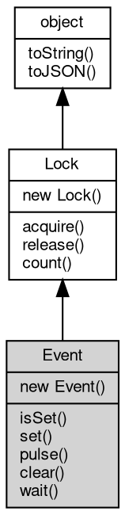

# 对象 Event
Event 模块提供了一个事件对象，用于协同共享数据操作。它允许多个纤程（协程）之间进行同步操作，以实现协作式多任务。事件对象有 wait，pulse 和 clear 三个方法，wait 方法将阻塞当前纤程，直至事件被触发，pulse 方法将唤醒所有等待该事件的纤程，而 clear 方法则将事件标志重置为 false。通过使用 [coroutine.Event](../../module/ifs/coroutine.md#Event) 模块，开发者可以控制纤程之间的执行顺序和数据共享，实现复杂业务逻辑。

举个例子，假设我们需要两个纤程间进行数据共享，然而它们执行的顺序是不确定的，你可以通过一个事件对象，控制纤程的执行顺序，保证一个纤程执行之前，触发另一个纤程的事件。

```JavaScript
const coroutine = require('coroutine');

var evt = new coroutine.Event();

coroutine.start(function() {
    console.log('[1] wait for event');
    evt.wait();
    console.log('[1] receive event');
});

coroutine.start(function() {
    loop: for (var i = 0; i < 10; i++) {
        console.log('[2] do some work');
        if (i === 5) {
            evt.pulse();
        }
        coroutine.sleep(1000);
    }
});
```

在上面的例子中，我们创建了一个事件对象 evt，在纤程1中使用wait方法等待事件触发，而在纤程2中通过pulse方法触发事件，当i等于5的时候，纤程2触发事件，纤程1通过事件监听被唤醒，继续执行。在这个过程中，两个纤程之间没有使用任何的锁或其它同步工具，但是它们在纤程级别上保证了数据的同步。

## 继承关系


## 构造函数
        
### Event
**事件对象构造函数**

```JavaScript
new Event(Boolean value = false);
```

调用参数:
* value: Boolean, 指定是否等待，为 true 时等待，缺省为 false

## 成员函数
        
### isSet
**判断事件对象是否为真**

```JavaScript
Boolean Event.isSet();
```

返回结果:
* Boolean, 如果事件为真，返回 true

--------------------------
### set
**激活事件（将事件状态改为true），并调用pulse()**

```JavaScript
Event.set();
```

--------------------------
### pulse
**激活等待该事件的所有纤程**

```JavaScript
Event.pulse();
```

--------------------------
### clear
**重置事件（将事件状态改为false）**

```JavaScript
Event.clear();
```

--------------------------
### wait
**等待一个事件**

```JavaScript
Event.wait();
```

--------------------------
### acquire
**获取锁的拥有权**

```JavaScript
Boolean Event.acquire(Boolean blocking = true);
```

调用参数:
* blocking: Boolean, 指定是否等待，为 true 时等待，缺省为真

返回结果:
* Boolean, 返回是否成功获取锁，为 true 表示成功获取

acquire 方法用于获取锁的拥有权，当锁处于可获取状态时，此方法立即返回 true。

当锁不可获取，且 blocking 为 true，则当前纤程进入休眠，当其他纤程释放锁后，此方法返回 true。

当锁不可获取，且 blocking 为 false，则方法返回 false。

--------------------------
### release
**释放锁的拥有权**

```JavaScript
Event.release();
```

此方法将释放对锁的拥有权，如果当前纤程未拥有锁，此方法将抛出错误。

--------------------------
### count
**查询当前等待任务数**

```JavaScript
Integer Event.count();
```

返回结果:
* Integer, 返回任务数

--------------------------
### toString
**返回对象的字符串表示，一般返回 "[Native Object]"，对象可以根据自己的特性重新实现**

```JavaScript
String Event.toString();
```

返回结果:
* String, 返回对象的字符串表示

--------------------------
### toJSON
**返回对象的 JSON 格式表示，一般返回对象定义的可读属性集合**

```JavaScript
Value Event.toJSON(String key = "");
```

调用参数:
* key: String, 未使用

返回结果:
* Value, 返回包含可 JSON 序列化的值

